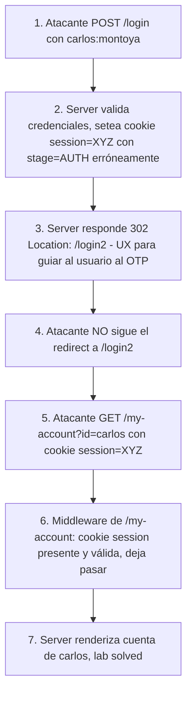

# Writeup: 2FA simple bypass (PortSwigger)

- **Lab**: 2FA simple bypass
- **URL**: https://portswigger.net/web-security/authentication/multi-factor/lab-2fa-simple-bypass
- **Categoría**: Authentication / MFA bypass por estado de auth mal modelado server-side
- **Dificultad**: Apprentice
- **Credenciales propias**: `wiener:peter` (con email accesible)
- **Credenciales objetivo**: `carlos:montoya` (sin acceso al email)

---

## 1. Objetivo

El lab implementa un flujo de login en dos pasos: primero username + password (`/login`), después un código OTP enviado por email (`/login2`). Tu cuenta `wiener:peter` tiene email accesible (cliente de email en la barra del lab); la víctima `carlos:montoya` también tiene 2FA pero su código va a un email que vos no controlás.

El objetivo: acceder a `/my-account?id=carlos`. Como completar el 2FA de carlos honestamente es imposible (no tenés su email), hay que **saltarse el paso 2 entero**.

### El insight central

El flujo del 2FA es ceremonia (UX que guía al usuario por dos pantallas), pero el **estado real de autenticación** vive server-side. Si el server marca la sesión como `authenticated` apenas terminado el paso 1, sin esperar el OTP, el cliente puede **navegar directo a recursos protegidos** ignorando el paso 2 completamente. El redirect a `/login2` es UX, no enforcement.

Esta es la clase "broken auth state": el server no distingue entre "credenciales validadas, esperando 2FA" y "completamente autenticado". Una sola variable booleana `is_logged_in` para los dos estados es la implementación incorrecta canónica.

---

## 2. Reconocimiento

### 2.1 Mapear el flujo legítimo con tu cuenta

Login con `wiener:peter` y observar el flujo paso a paso, con Burp interceptando todo:

**Paso 1**: POST `/login` con `username=wiener&password=peter`.
```http
HTTP/2 302 Found
Location: /login2
Set-Cookie: session=ABC123...; HttpOnly; SameSite=Strict
```

La cookie de sesión se setea **acá**, antes del 2FA. Esa es la primera señal sospechosa.

**Paso 2**: GET `/login2` muestra form para el código OTP. Email Client → leer código → POST `/login2` con `mfa-code=1234`.
```http
HTTP/2 302 Found
Location: /my-account?id=wiener
```

**Test crucial**: con la cookie obtenida en el paso 1 (antes del paso 2), intentar acceder directamente a `/my-account?id=wiener`. Si responde 200 con el panel:
- El server ya marcó la sesión como autenticada en el paso 1.
- El paso 2 no es enforce, sólo redirect.
- Confirmado: bypass posible.

(Si responde 302 a `/login` o `/login2`, el server sí está enforcando el stage intermedio y el bypass no aplica; habría que buscar otra clase de vulnerabilidad.)

### 2.2 ¿Por qué este test importa antes de atacar a carlos?

Validar el bypass con tu propia cuenta primero te ahorra ciclos. Si funciona con `wiener`, funciona con `carlos` (es el mismo código del server). Si no funciona con `wiener`, atacar a `carlos` por la misma vía es desperdicio de intentos.

Esta verificación previa es disciplina general en pentesting: cuando tenés acceso a una cuenta legítima del sistema, úsala como banco de pruebas para entender el modelo del server antes de atacar a la víctima real.

---

## 3. Resolución

### 3.1 Logout de wiener

Limpiar sesión (logout o borrar cookies) para arrancar limpio con la cuenta de carlos.

### 3.2 Login del paso 1 con carlos

POST `/login` con `username=carlos&password=montoya`. Respuesta:
```http
HTTP/2 302 Found
Location: /login2
Set-Cookie: session=XYZ789...; HttpOnly; SameSite=Strict
```

Cookie de sesión seteada. Vos sabés (del recon en wiener) que esta cookie ya autoriza al panel. No hace falta tocar `/login2`.

### 3.3 Navegación directa a `/my-account?id=carlos`

```http
GET /my-account?id=carlos HTTP/2
Host: 0a8e00dd03907d388037b2f600a2003d.web-security-academy.net
Cookie: session=XYZ789...
```

Respuesta: 200 OK con el panel de cuenta de carlos. Lab solved.

### 3.4 Por qué fue trivial en este lab

Tres condiciones se alinearon:
1. **Cookie de sesión seteada en paso 1**: el server emitió un identificador de sesión válido sin esperar el 2FA.
2. **Server marca esa sesión como totalmente autenticada**: cualquier request subsiguiente con esa cookie pasa el middleware de auth.
3. **Endpoint `/my-account` valida sólo presencia de sesión válida, no stage**: no chequea si el OTP fue completado.

Las tres tienen que romperse simultáneamente. La fix es coordenada (no podés arreglar sólo una), pero arreglar cualquiera de las tres rompe el ataque.

---

## 4. Por qué funciona

### 4.1 Auth state vs auth ceremony

En sistemas multi-paso, hay dos cosas distintas:

- **Auth ceremony (cliente-side)**: la secuencia visible de pantallas, redirects, mensajes que guían al usuario. Tiene propósito UX, no de seguridad.
- **Auth state (server-side)**: la variable o conjunto de variables que el server consulta para decidir si una sesión puede acceder a un recurso.

Cuando ambos coinciden, todo funciona. Cuando el server reduce dos estados ("paso 1 completo, esperando OTP" vs "todos los pasos completos") a una sola variable booleana (`is_logged_in`), o cuando el chequeo del paso 2 vive sólo en JavaScript del cliente, hay bypass.

Implementación correcta del state machine:

```python
class SessionStage(Enum):
    UNAUTHENTICATED = 0
    PENDING_OTP = 1   # paso 1 OK, esperando OTP
    AUTHENTICATED = 2 # paso 1 + paso 2 OK

@app.route('/login', methods=['POST'])
def login():
    user = verify_password(request.form['username'], request.form['password'])
    if not user:
        return generic_error()
    session['stage'] = SessionStage.PENDING_OTP
    session['user_id'] = user.id
    send_otp(user.email)
    return redirect('/login2')

@app.route('/login2', methods=['POST'])
def login2():
    if session.get('stage') != SessionStage.PENDING_OTP:
        return generic_error()  # no llegó del paso 1, fuera
    if not verify_otp(session['user_id'], request.form['mfa-code']):
        return generic_error()
    session.regenerate_id()  # anti session-fixation
    session['stage'] = SessionStage.AUTHENTICATED
    return redirect('/my-account')

@require_stage(SessionStage.AUTHENTICATED)
@app.route('/my-account')
def my_account():
    return render_account(session['user_id'])
```

Cuatro puntos críticos:
1. Tras paso 1 sólo se setea `PENDING_OTP`, no `AUTHENTICATED`.
2. `/login2` valida que la sesión venga en `PENDING_OTP` (rechaza intentos directos sin paso 1).
3. `/my-account` exige `AUTHENTICATED`, no sólo presencia de sesión.
4. Tras OTP correcto, rotación de session ID (defensa contra session fixation: si el atacante logró setearle al usuario una cookie conocida en paso 1, esa cookie deja de ser válida tras paso 2).

### 4.2 Frontend-only enforcement como anti-pattern

Patrones comunes que dan **falsa sensación de defensa**:

- **Redirect a `/login2`** después del paso 1: es UX, el atacante puede ignorarlo.
- **JavaScript que redirige si `localStorage.otp_verified !== 'true'`**: el atacante manipula localStorage o desactiva JS.
- **Mensaje "Por favor verifique su código antes de acceder"** en la pantalla intermedia: es UX, no se enforce.
- **Hidden input con flag `verified=true`** que el frontend setea tras OTP correcto: es controlable por el cliente.
- **Header personalizado `X-Auth-Stage: pending_otp`** que el cliente debería mandar: el cliente lo omite o lo cambia.

La regla universal: **cualquier defensa que dependa del comportamiento del cliente es teatro**. El cliente está bajo control del atacante. Sólo el server tiene la autoridad para decidir si una sesión está autenticada.

### 4.3 Diferencias con otras clases de bypass de MFA

| Clase | Mecanismo | Ejemplo |
|---|---|---|
| **Auth state mal modelado** (este lab) | El server no distingue pending vs authenticated. Cliente navega directo a recurso protegido. | Este lab |
| **2FA enforce sólo en frontend** | JavaScript / redirect bloquea, server no valida. Cliente lo ignora. | Variantes de este lab |
| **Brute-force de OTP** | Código de 4-6 dígitos sin rate-limit. Atacante prueba 10⁴-10⁶ candidatos. | Lab "2FA broken logic" / "Brute-forcing 2FA codes" |
| **Cambio de usuario entre pasos** | Paso 1 con cuenta A, sesión de A, código OTP enviado a B. Server no liga código a sesión. | Lab "2FA broken logic" |
| **Manipulación de respuesta** | Cliente confía en JSON `{verified: true}`; MITM lo fuerza. | Implementaciones móviles vulnerables |
| **OTP no-expira / reusable** | Código de un flow anterior sigue válido. Atacante captura uno y lo replay. | Implementaciones con TTL infinito |
| **Response differential del OTP** | Server responde distinto cuando OTP es válido vs inválido (length, status, timing). Atacante automatiza enum. | Variante avanzada |

### 4.4 ¿Por qué el 2FA mismo no es la fix de auth?

2FA mitiga el riesgo de "el atacante adivinó/robó el password" añadiendo "el atacante también necesita acceso al segundo factor". Pero si la implementación del 2FA está rota (este lab), el 2FA deja de aportar. La defensa correcta es:

1. **Password fuerte** (rate-limit + complexity + breached-password check).
2. **2FA correctamente implementado** (state machine + rotación + rate-limit del OTP + expiración).
3. **WebAuthn / passkeys** cuando el target lo permite (inmune a phishing y brute-force).
4. **Detección de patrones anómalos**: login desde geo nuevo, dispositivo nuevo, en hora rara → step-up auth (challenge adicional) o alerta al usuario.
5. **MFA hardware** (YubiKey, FIDO2) para cuentas críticas.

2FA por SMS es la implementación más débil (SIM swap, intercepción SS7). 2FA por email moderadamente débil (depende de la seguridad del email, que también puede ser comprometido). TOTP por app autenticadora es razonable. Hardware tokens / WebAuthn son los más fuertes.

---

## 5. Resumen de la cadena



Tres ideas para llevarse:

1. **Auth state mal modelado es un bug de diseño del server**, no del cliente. La fix vive en el state machine de sesión, no en los redirects o JS del frontend.
2. **Frontend nunca puede enforce nada**. Cualquier defensa que dependa de comportamiento del cliente (redirects, JS, localStorage, hidden inputs) es teatro. Server-side validation always.
3. **MFA mal implementado no aporta seguridad**, sólo aporta fricción al usuario legítimo. Una implementación rota de 2FA es peor que no tener 2FA: da falsa sensación de protección.

---

## 6. Contramedidas

En orden de robustez:

1. **State machine explícito en la sesión**: campo `stage` con enum (`UNAUTHENTICATED`, `PENDING_OTP`, `AUTHENTICATED`). El paso 1 setea `PENDING_OTP`; sólo el paso 2 exitoso lo promueve a `AUTHENTICATED`. Endpoints sensibles exigen `AUTHENTICATED`.
2. **`/login2` valida que la sesión venga de paso 1**: rechazar requests al endpoint del OTP si la sesión no está en `PENDING_OTP` (intento directo sin paso 1, o sesión ya autenticada que reintenta 2FA).
3. **Rotación de session ID tras paso 2 exitoso**. Defensa contra session fixation. La cookie del paso 1 queda inválida tras el paso 2.
4. **Rate limit del OTP**: 5 intentos por sesión, lockout temporal después. Sin esto, el espacio de búsqueda del código (10⁴ a 10⁶) se brute-forcea trivialmente (lo cubre el lab "Brute-forcing 2FA codes").
5. **OTP ligado a sesión y con expiración corta**: el código emitido en `(session=X, user=Y)` sólo valida si se submite con la misma sesión y user. TTL de 60-300s; tras consumirse, invalidar.
6. **Logging de stages incompletos**: una sesión que llega a paso 1 y nunca completa paso 2, o que intenta acceder a recursos protegidos en stage `PENDING_OTP`, es señal de ataque.
7. **WebAuthn/passkeys** para flujos críticos. Inmune a phishing, brute-force, replay. Reemplaza 2FA por código en muchos casos.
8. **Notificación al usuario** de logins exitosos desde dispositivos/geos nuevos. Detección post-explotación útil cuando las defensas previas fallan.

---

## 7. Referencias

- PortSwigger Web Security Academy. (s.f.). *Lab: 2FA simple bypass*. https://portswigger.net/web-security/authentication/multi-factor/lab-2fa-simple-bypass
- PortSwigger Web Security Academy. (s.f.). *Multi-factor authentication*. https://portswigger.net/web-security/authentication/multi-factor
- OWASP Foundation. (s.f.). *Authentication Cheat Sheet*. https://cheatsheetseries.owasp.org/cheatsheets/Authentication_Cheat_Sheet.html
- OWASP Foundation. (s.f.). *Multifactor Authentication Cheat Sheet*. https://cheatsheetseries.owasp.org/cheatsheets/Multifactor_Authentication_Cheat_Sheet.html
- OWASP Foundation. (s.f.). *Session Management Cheat Sheet*. https://cheatsheetseries.owasp.org/cheatsheets/Session_Management_Cheat_Sheet.html
- MITRE Corporation. (2024). *ATT&CK Technique T1556.006: Modify Authentication Process - Multi-Factor Authentication*. https://attack.mitre.org/techniques/T1556/006/
- MITRE Corporation. (2024). *CWE-287: Improper Authentication*. https://cwe.mitre.org/data/definitions/287.html
- NIST. (2017). *SP 800-63B: Digital Identity Guidelines - Authentication and Lifecycle Management*. https://pages.nist.gov/800-63-3/sp800-63b.html
- Stuttard, D., & Pinto, M. (2011). *The Web Application Hacker's Handbook* (2nd ed.). Wiley. Cap. 6 (Attacking Authentication), §6.5 (Multi-Stage Login Mechanisms).
- Writeup hermano: [`learning/portswigger/username-enumeration-via-different-responses/writeup.md`](../username-enumeration-via-different-responses/writeup.md) — primer lab de la serie auth (side-channel en respuesta).
- Inventario interno: [`inventario/04-explotacion/web/explotacion-mfa-bypass.md`](../../../inventario/04-explotacion/web/explotacion-mfa-bypass.md)
