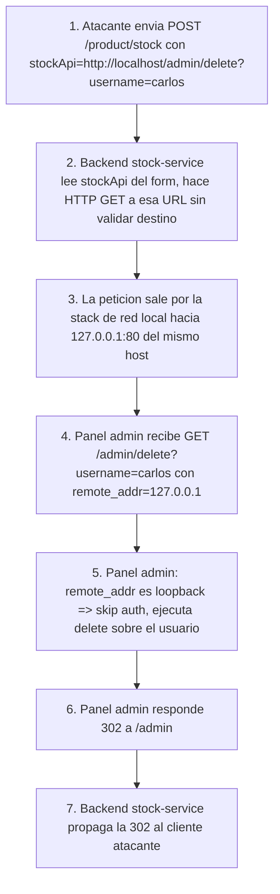

# Writeup: Basic SSRF against the local server (PortSwigger)

- **Lab**: Basic SSRF against the local server
- **URL**: https://portswigger.net/web-security/ssrf/lab-basic-ssrf-against-localhost
- **Categoría**: SSRF clásico (input que espera URL, abusado para alcanzar loopback)
- **Dificultad**: Apprentice
- **Credenciales**: no requiere login

---

## 1. Objetivo

Una tienda tiene función "Check stock" que dispara una petición server-side a un microservicio interno. El parámetro `stockApi` viaja en el body como una URL completa controlada por el cliente. Si se cambia esa URL por `http://localhost/admin`, el server hace la petición a su propio loopback, donde vive un panel de administración que normalmente sólo es alcanzable desde la máquina misma. Desde ahí hay que borrar al usuario `carlos`.

### El insight central

El servidor confía en su propio loopback como zona de adentro: el panel `/admin` no exige autenticación cuando lo invoca alguien que llega desde `127.0.0.1`. La asunción es razonable en un mundo sin SSRF: "si el request viene del loopback, lo originó un proceso local, y los procesos locales ya están dentro". SSRF rompe esa premisa porque hace que el atacante externo *use al server como proxy* hacia su propio loopback. La fuente de la petición (`127.0.0.1`) miente sobre el actor real (atacante remoto).

Es el mismo patrón que SSRF a IMDS de cloud, sólo que en lugar de robar credenciales IAM se accede a un panel admin no autenticado. La vulnerabilidad subyacente no es del panel: es del componente que acepta una URL arbitraria como input y la sigue sin validación.

---

## 2. Reconocimiento

1. Browse a cualquier producto (`/product?productId=1`).
2. Click en "Check stock". Capturar la petición en Burp Proxy.

Lo que se captura:

```http
POST /product/stock HTTP/2
Host: 0af3007203fc990a83f301ff00b80014.web-security-academy.net
Content-Type: application/x-www-form-urlencoded
Content-Length: 107

stockApi=http%3A%2F%2Fstock.weliveshecurity.net%3A8080%2Fproduct%2Fstock%2Fcheck%3FproductId%3D1%26storeId%3D1
```

Decodificado, `stockApi` apunta a `http://stock.weliveshecurity.net:8080/product/stock/check?productId=1&storeId=1`. Eso es la URL completa que el server seguirá; está bajo control total del cliente. Síntoma típico de SSRF: la aplicación *expone* la URL del backend en el request del front-end, en vez de mantenerla server-side.

---

## 3. Resolución

### 3.1 Acceder al panel admin via loopback

Mandar la petición a Repeater y reemplazar el body por:

```
stockApi=http://localhost/admin
```

Respuesta: HTML del panel admin con tabla de usuarios y links `Delete` por cada uno. La URL del link de `carlos` aparece url-encoded dentro del HTML, algo como:

```html
<a href="/admin/delete?username=carlos">Delete</a>
```

(En el response se ve url-encoded porque el HTML viaja dentro del body y el navegador lo renderiza, pero al copiarlo del Raw conviene decodificar manualmente).

### 3.2 Disparar el delete

Cambiar `stockApi` a la URL completa del endpoint de borrado, también url-encodeada para que pase como valor de form param:

```
stockApi=http%3A%2F%2Flocalhost%2Fadmin%2Fdelete%3Fusername%3Dcarlos
```

Equivalente decodificado: `http://localhost/admin/delete?username=carlos`.

Respuesta del server al `POST /product/stock`:

```http
HTTP/2 302 Found
Location: /admin
Set-Cookie: session=...
```

La 302 a `/admin` confirma que el panel admin (alcanzado vía loopback) procesó el delete y redirige al listado. Lab marca como Solved.

### 3.3 ¿Por qué encodear `localhost/admin/delete?username=carlos` cuando es valor de form?

`stockApi` se transmite como `application/x-www-form-urlencoded`. Caracteres como `:`, `/`, `?`, `=` tienen significado en ese formato (separadores). Si los mandás raw, el parser server-side puede leer mal el valor y, por ejemplo, dejar `stockApi=http` y el resto como otro param suelto. Encodear el valor garantiza que llegue íntegro al backend que después construye la URL real para la petición saliente.

---

## 4. Por qué funciona

### 4.1 La aplicación delega la URL al cliente

El defecto raíz es que la URL del microservicio de stock es input del usuario, no configuración server-side. Cualquier endpoint que acepta una URL del cliente y la sigue es candidato a SSRF: importadores de imágenes desde URL, webhooks "test connection", previewers de links, parsers de feeds RSS, fetchers de PDF a partir de HTML, conversores de URL a captura. El patrón se repite por toda la web.

### 4.2 El backend de stock no valida el destino

Una defensa mínima sería:
- **Allowlist** de hosts permitidos para `stockApi` (el dominio interno del microservicio y nada más).
- **Bloquear loopback y rangos privados**: `127.0.0.0/8`, `::1`, `10.0.0.0/8`, `172.16.0.0/12`, `192.168.0.0/16`, `169.254.0.0/16` (link-local, donde vive AWS IMDS).
- **Bloquear esquemas exóticos**: sólo permitir `http://` y `https://` (cortar `file://`, `gopher://`, `dict://`, `ftp://`).

El lab no implementa nada de eso, por lo que cualquier URL es seguida tal cual.

### 4.3 El panel admin asume que loopback = autenticado

Patrón antipatrón frecuente en producción real:

```python
# Pseudo-código del backend
@app.route('/admin/<path:p>')
def admin(p):
    if request.remote_addr == '127.0.0.1':
        return render_admin(p)  # sin auth
    return require_login()
```

La premisa es que solo procesos locales (sysadmins via SSH tunnel, scripts de mantenimiento) hablan a `127.0.0.1`. SSRF la rompe porque desde la perspectiva del panel admin, la conexión *llegó* del loopback, sin importar quién la originó.

La fix correcta no es bloquear loopback en el panel: es exigir autenticación siempre, incluso en loopback. "Defense in depth" real: cada componente verifica identidad, no asume que la red ya filtró.

### 4.4 Diferencia con SSRF a metadata cloud (lab IMDS)

| Aspecto | Este lab (loopback) | SSRF→IMDS (lab XXE→SSRF) |
|---|---|---|
| Vector de input | Form param que *espera* URL | Entidad XML SYSTEM (parser delegando) |
| Target | `127.0.0.1` (loopback de la app) | `169.254.169.254` (link-local cloud) |
| Recurso | Panel admin no autenticado | JSON de credenciales IAM |
| Severidad | Compromiso total del panel admin de la app | Escalada a la cuenta cloud (IAM, S3, EC2, ...) |
| Mitigación específica | Auth en panel admin, allowlist de URLs | IMDSv2 + egress filtering a 169.254 |

La categoría es la misma (SSRF) pero el *punto de entrada* (form param vs parser XML) y el *blast radius* (app local vs cuenta cloud entera) cambian.

---

## 5. Resumen de la cadena



Tres ideas para llevarse:

1. **Cualquier endpoint que acepte URL del cliente y la siga es SSRF latente**. La feature legítima (microservicio configurable por URL, webhook de prueba, fetcher de imagen) se vuelve arma cuando no hay validación del destino. La pregunta de auditoría es: "¿este server-side request lo construyó el server o lo construyó el cliente?".
2. **Loopback no es zona de confianza en presencia de SSRF**. La heurística "remote_addr == 127.0.0.1 implica caller confiable" es válida sólo si ningún otro componente de la app puede ser inducido a hablar al loopback con input externo. SSRF invalida esa premisa por construcción.
3. **El target más jugoso de SSRF varía con el entorno**: en cloud es `169.254.169.254` (IMDS), en datacenter clásico es loopback (paneles internos de la app, Redis sin auth, paneles de admin de Rails/Django expuestos en `127.0.0.1:3000`), en Kubernetes es la API del cluster o el service account token. Hay que pensar qué hay alcanzable desde el origen del request.

---

## 6. Contramedidas

Defensas en orden de robustez:

1. **No aceptar URLs del cliente para llamadas server-side**. Si el frontend dice "consultá el stock del producto X", el backend ya sabe a qué microservicio hablar, no necesita que el cliente le diga la URL. Mover la URL a configuración server-side elimina la clase entera de SSRF.
2. **Allowlist estricta de hosts y esquemas** si por diseño hace falta URL del cliente (importadores, webhooks). Validar el host *después* de resolver DNS para evitar bypasses tipo `localtest.me` (resuelve a 127.0.0.1) y rebinding (DNS resuelve a IP pública la primera vez y a 127.0.0.1 la segunda).
3. **Bloquear destino a rangos sensibles a nivel de network**: loopback (`127.0.0.0/8`, `::1`), privados RFC 1918, link-local (`169.254.0.0/16`, `fe80::/10`), reservados. Idealmente desde un proxy egreso o iptables del proceso, no sólo desde código de aplicación.
4. **Autenticación obligatoria en *todos* los componentes internos**, incluyendo el panel admin. La defensa "remote_addr == 127.0.0.1" es frágil; servicios internos sin auth siguen siendo el target post-SSRF. Aplica también a Redis, Elasticsearch, Memcached, Consul, Kubernetes API, paneles de Rails/Django en dev.
5. **Bloquear esquemas no esperados**: si la feature es "fetch HTTP", rechazar `file://`, `gopher://`, `dict://`, `ftp://`, `jar://`. Cada esquema extra agranda el blast radius.
6. **Logging de URLs accedidas server-side con detección de anomalías**. Un endpoint que normalmente accede al microservicio X y de repente accede a `localhost/admin` es alerta clara.

---

## 7. Referencias

- PortSwigger Web Security Academy. (s.f.). *Lab: Basic SSRF against the local server*. https://portswigger.net/web-security/ssrf/lab-basic-ssrf-against-localhost
- PortSwigger Web Security Academy. (s.f.). *Server-side request forgery (SSRF)*. https://portswigger.net/web-security/ssrf
- OWASP Foundation. (s.f.). *Server Side Request Forgery Prevention Cheat Sheet*. https://cheatsheetseries.owasp.org/cheatsheets/Server_Side_Request_Forgery_Prevention_Cheat_Sheet.html
- MITRE Corporation. (2024). *CWE-918: Server-Side Request Forgery (SSRF)*. https://cwe.mitre.org/data/definitions/918.html
- MITRE Corporation. (2024). *ATT&CK Technique T1190: Exploit Public-Facing Application*. https://attack.mitre.org/techniques/T1190/
- Writeup hermano (XXE→SSRF a cloud metadata): [`learning/portswigger/exploiting-xxe-to-perform-ssrf/writeup.md`](../exploiting-xxe-to-perform-ssrf/writeup.md)
- Inventario interno: [`inventario/03-analisis-vulnerabilidades/web/analisis-ssrf.md`](../../../inventario/03-analisis-vulnerabilidades/web/analisis-ssrf.md)
