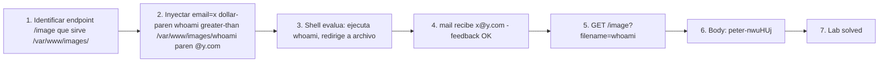

# Writeup: Blind OS command injection with output redirection (PortSwigger)

- **Lab**: Blind OS command injection with output redirection
- **URL**: https://portswigger.net/web-security/os-command-injection/lab-blind-output-redirection
- **Categoría**: OS Command Injection / Blind / Output via writeable path
- **Dificultad**: Practitioner

---

## 1. Objetivo

Recuperar el output de un comando cuya respuesta no se refleja, redirigiendo stdout a un archivo en un directorio escribible y servible por la app. La descripción del lab indica que `/var/www/images/` cumple ambas condiciones: el web server lo expone vía `/image?filename=...` y el proceso del backend tiene permiso de escritura.

Payload final:

```http
POST /feedback/submit HTTP/2
Content-Type: application/x-www-form-urlencoded

csrf=...&name=Name+1&email=x$(whoami>/var/www/images/whoami)@y.com&subject=Subject&message=Message
```

Recuperación:

```http
GET /image?filename=whoami HTTP/2
```

Response (Content-Type: image/jpeg pero contenido es texto):

```
peter-nwuHUj
```

### Insight central

**Cuando la respuesta no refleja output pero hay un endpoint que sirve archivos, el filesystem es el canal**. La inyección redirige stdout a un archivo bajo el directorio servido. El endpoint de imágenes se convierte en oráculo de lectura — cualquier archivo que el web server pueda leer en ese directorio es recuperable. La novedad sobre time-based: además de **detectar** la inyección, recuperás **datos arbitrarios**.

---

## 2. Recon y resolución

### 2.1 Mapear el endpoint que sirve archivos

Visitando un producto, la imagen se carga vía:

```
GET /image?filename=<nombre>
```

El parámetro toma un filename relativo. La descripción del lab confirma que el directorio raíz es `/var/www/images/`. La app prepende ese path al filename del query string.

### 2.2 Inyectar el comando con redirección

Mismo formulario `/feedback/submit`. Como en el lab anterior hay validación de regex de email, mantener formato con command substitution:

```
email=x$(whoami>/var/www/images/whoami)@y.com
```

Cómo se evalúa:

1. Backend valida el regex de email — pasa, tiene `@` y `.`.
2. Construye el comando shell con concatenación: `mail ... x$(whoami>/var/www/images/whoami)@y.com ...`.
3. Shell evalúa `$(whoami>/var/www/images/whoami)`:
   - Ejecuta `whoami`.
   - Redirige stdout a `/var/www/images/whoami` (crea el archivo).
   - Stdout del subshell es vacío (todo fue al archivo).
4. Comando final visto por `mail`: `mail ... x@y.com ...` — válido.

Response: `200 {}`. Sin reflejo, pero el archivo quedó escrito.

### 2.3 Recuperar el archivo

Primer intento, pasando path completo en el filename:

```
GET /image?filename=/var/www/images/whoami
→ 400 "No such file"
```

El endpoint prepende `/var/www/images/` al filename. El path completo se concatena dos veces: `/var/www/images//var/www/images/whoami`, que no existe.

Solución, pasar solo el nombre relativo:

```
GET /image?filename=whoami
→ 200 OK, Content-Type: image/jpeg, Content-Length: 13
peter-nwuHUj
```

El Content-Type `image/jpeg` es engañoso — la app lo setea estáticamente sin inspeccionar contenido. El body es texto plano. El browser lo trataría como imagen rota; en Burp se ve el texto directo.

---

## 3. Por qué funciona

### 3.1 Anatomía de la composición

El bug usa tres capas que la app provee como servicios legítimos, encadenándolas:

| Capa | Función legítima | Uso ofensivo |
|------|------------------|--------------|
| Inyección en email | Procesar feedback | Ejecutar comando arbitrario |
| Filesystem `/var/www/images/` escribible por web user | Permitir uploads de imágenes / generación de thumbnails | Drop de archivo con output del comando |
| Endpoint `/image?filename=` | Servir imágenes de productos | Lectura arbitraria de archivos en ese directorio |

Cada una por separado puede ser una decisión razonable. Combinadas, forman un canal completo de RCE con lectura de output. El error de diseño no está en una sola capa — está en no analizar la composición.

### 3.2 ¿Por qué redirección y no time-based?

Time-based (lab anterior) confirma la inyección pero no exfiltra datos. Cada bit de información requiere un test binario:

```
$(if [ $(whoami | head -c 1) = "p" ]; then sleep 10; fi)  → tarda 10s si la primera letra es p
```

Para extraer el username completo (12 chars), 12 × ~26 tests × 10s = ~50 minutos.

Output redirection extrae el dato completo en una sola request. Pasos: 1 inject + 1 GET = 2 requests. Diferencia de 1500x.

### 3.3 ¿Por qué `>` y no `>>`?

`>` trunca el archivo si existe, `>>` appendea. Truncar es lo correcto para no acumular ejecuciones previas. Si testeás varios comandos secuencialmente:

```
$(whoami > /var/www/images/out)
$(id > /var/www/images/out)
```

Con `>` cada test sobrescribe — `out` siempre tiene el output más reciente. Con `>>` quedan acumulados — el GET devuelve un blob mezclado.

### 3.4 ¿Por qué un nombre arbitrario funciona?

El endpoint sirve archivos del directorio sin enumeración previa de "imágenes válidas". No hay whitelist; cualquier filename que exista en `/var/www/images/` es servido. Esto es razonable para una app de imágenes (los productos se agregan con cualquier nombre de archivo), pero combinado con un escritor arbitrario se vuelve canal de leak.

### 3.5 Generalización: lectura de archivos arbitrarios

Una vez confirmado el endpoint sirve cualquier archivo del directorio, la inyección puede leer archivos fuera del directorio copiándolos primero:

```
$(cat /etc/passwd > /var/www/images/passwd)
GET /image?filename=passwd
```

Permite `/etc/passwd`, claves SSH si el web user tiene permiso, configs del backend, etc. La restricción es solo el permiso del usuario del web server (típicamente `www-data`).

Para directorios sin permiso de lectura, el output es vacío:

```
$(cat /root/.bashrc > /var/www/images/out)  → out queda vacío, pero el archivo se crea
GET /image?filename=out → 200 con body vacío
```

### 3.6 ¿Por qué este lab es Practitioner y no Apprentice?

Cuatro saltos sobre command injection trivial:

1. **Sin reflejo**: requiere canal lateral.
2. **Validación previa al shell**: requiere mantener formato del input (command substitution).
3. **Conocimiento de filesystem servido**: hay que identificar un directorio escribible+servible. La descripción del lab lo regala, en escenarios reales requiere recon (probar paths comunes: `/var/www/`, `/srv/`, dirs de logs accesibles vía `/logs/`, etc.).
4. **Composición de canales**: combinar inject + write + read. Cada paso solo no resuelve.

### 3.7 Defensa correcta

Mismas defensas estructurales del lab anterior, más:

```python
# Endpoint /image fix - whitelist de filenames + path canonicalization
import os, re

ALLOWED_DIR = '/var/www/images/'
FILENAME_RE = re.compile(r'^[a-zA-Z0-9_-]+\.(jpg|jpeg|png|gif|webp)$')

def serve_image(filename):
    if not FILENAME_RE.match(filename):
        return 400, "Invalid filename"

    full_path = os.path.realpath(os.path.join(ALLOWED_DIR, filename))
    if not full_path.startswith(ALLOWED_DIR):
        return 400, "Path traversal detected"

    if not os.path.isfile(full_path):
        return 404, "Not found"

    with open(full_path, 'rb') as f:
        return 200, f.read()
```

Tres capas:

1. **Whitelist de extensiones**: solo extensiones de imagen conocidas. Un archivo llamado `whoami` (sin extensión) es rechazado en el regex.
2. **Path canonicalization** (`realpath`): resuelve `..` y symlinks antes de comparar contra el directorio permitido. Bloquea `filename=../../../etc/passwd`.
3. **Verificación post-canonicalize**: el path final debe empezar con `ALLOWED_DIR`. Si el atacante usó symlinks o trucos, el realpath revela el path real y la comparación falla.

Pero el control más importante sigue siendo no permitir command injection en primer lugar. Si la inyección no es posible, la escritura no ocurre, y el endpoint de imágenes (incluso permisivo) no tiene archivos maliciosos que servir.

---

## 4. Resumen



Tres ideas:

1. **Composición de servicios legítimos = canal de exfiltración**. Inyección + filesystem escribible por web user + endpoint que sirve archivos del filesystem. Cada uno tiene justificación de diseño; juntos forman lectura arbitraria. El error no está en una capa — está en no analizar la composición.
2. **Redirección de stdout vs time-based: diferencia de 1500x en eficiencia**. Time-based confirma binariamente cada bit, output redirection extrae el dato completo en una request. Cuando hay un canal de archivos disponible, siempre superior a inferencia bit-a-bit.
3. **Path canonicalization es la defensa contra el reuso del endpoint de archivos**: realpath + verificar que empieza con el directorio permitido bloquea path traversal y symlinks. Whitelist de extensiones es complemento — rechaza nombres como `whoami` sin extensión que el atacante quiere usar.

---

## 5. Contramedidas

1. **Eliminar la inyección en primer lugar**: pasar argumentos como array a subprocess (`shell=False`), usar APIs nativas (smtplib en lugar de mail), validar inputs con whitelist de caracteres. Cierra el bug raíz.
2. **Endpoint de archivos con whitelist de extensiones y filenames**: `^[a-zA-Z0-9_-]+\.(jpg|jpeg|png|gif|webp)$`. Rechaza nombres sin extensión, con `..`, con caracteres especiales. Reduce el universo de archivos servibles.
3. **Path canonicalization en endpoints que toman filename**: `os.path.realpath()` resuelve `..` y symlinks; verificar que el path final está bajo el directorio permitido. Bloquea path traversal incluso si la regex se evade.
4. **Permisos restrictivos en directorios escribibles**: el proceso del web server no debería poder escribir donde el endpoint sirve. Separar dirs: uno de upload (escribible, no servido directo), otro de assets servidos (read-only para el web user). Los uploads se mueven al dir servido solo después de validación, idealmente con renombre a UUID.
5. **Servir archivos vía endpoint con allow-list de IDs**: en lugar de aceptar filename arbitrario, mappear ID a filename server-side: `/image?id=42` → mira en DB, sirve el archivo asociado. El cliente nunca controla el path.
6. **Mínimo privilegio del proceso**: AppArmor/SELinux que restrinjan los paths donde el web server puede leer y escribir. Bloquea exfiltración fuera de los directorios autorizados.
7. **Logging de escrituras a directorios servidos**: cada `open(file, 'w')` o equivalente en directorios servidos debería loguear. Detección post-mortem de archivos anómalos via diff de directorios.
8. **Network egress filtering**: bloquear DNS/HTTP outbound del web server elimina canales OOB alternativos. Forza al atacante a usar canales locales (redirect a archivo) que sí son detectables vía logs/file integrity monitoring.
9. **File integrity monitoring (FIM)**: tools como AIDE, Tripwire, osquery alertan sobre archivos nuevos en directorios bajo `/var/www/`. Detecta el drop del archivo malicioso aunque no se haya prevenido.
10. **WAF como defensa-en-profundidad**: reglas para detectar patrones `> /var/www/`, `>> /var/`, `cat /etc/`, `tee /var/` en parámetros HTTP. Defensa adicional, no primaria — encoding y ofuscación las evaden.

---

## 6. Referencias

- PortSwigger Web Security Academy. (s.f.). *Lab: Blind OS command injection with output redirection*. https://portswigger.net/web-security/os-command-injection/lab-blind-output-redirection
- PortSwigger Web Security Academy. (s.f.). *OS command injection*. https://portswigger.net/web-security/os-command-injection
- OWASP Foundation. (s.f.). *Command Injection*. https://owasp.org/www-community/attacks/Command_Injection
- OWASP Foundation. (s.f.). *OS Command Injection Defense Cheat Sheet*. https://cheatsheetseries.owasp.org/cheatsheets/OS_Command_Injection_Defense_Cheat_Sheet.html
- MITRE Corporation. (2024). *CWE-78: Improper Neutralization of Special Elements used in an OS Command ('OS Command Injection')*. https://cwe.mitre.org/data/definitions/78.html
- MITRE Corporation. (2024). *CWE-552: Files or Directories Accessible to External Parties*. https://cwe.mitre.org/data/definitions/552.html
- MITRE Corporation. (2024). *ATT&CK Technique T1059: Command and Scripting Interpreter*. https://attack.mitre.org/techniques/T1059/
- MITRE Corporation. (2024). *ATT&CK Technique T1005: Data from Local System*. https://attack.mitre.org/techniques/T1005/
- swisskyrepo. (s.f.). *PayloadsAllTheThings — Command Injection*. https://github.com/swisskyrepo/PayloadsAllTheThings/tree/master/Command%20Injection
- GNU. (s.f.). *Bash Reference Manual — Redirections*. https://www.gnu.org/software/bash/manual/html_node/Redirections.html
- Stuttard, D., & Pinto, M. (2011). *The Web Application Hacker's Handbook* (2nd ed.). Wiley. Cap. 9 (Attacking Back-End Components — Injecting OS Commands).
- Inventario interno: [`inventario/03-analisis-vulnerabilidades/web/analisis-command-injection.md`](../../../inventario/03-analisis-vulnerabilidades/web/analisis-command-injection.md)
