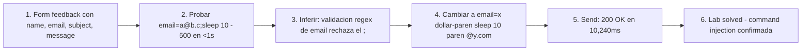

# Writeup: Blind OS command injection with time delays (PortSwigger)

- **Lab**: Blind OS command injection with time delays
- **URL**: https://portswigger.net/web-security/os-command-injection/lab-blind-time-delays
- **Categoría**: OS Command Injection / Blind / Time-based detection
- **Dificultad**: Practitioner

---

## 1. Objetivo

Confirmar que existe command injection en el formulario de feedback cuando la respuesta NO refleja el output del comando. La detección se hace observando que un `sleep` controlado retrasa la respuesta HTTP el tiempo esperado.

Payload final:

```http
POST /feedback/submit HTTP/2
Content-Type: application/x-www-form-urlencoded

csrf=...&name=Name+1&email=x$(sleep+10)@y.com&subject=Subject&message=Message
```

Response: `200 OK` en **10,240 ms** (vs ~100ms sin payload). El delay confirma ejecución de comando.

### Insight central

**Cuando la respuesta no refleja output, el canal de detección es el tiempo**. La inyección sigue siendo command injection clásica — solo cambia el método para confirmarla. La novedad es que el payload tiene que (a) ejecutar un comando observable y (b) **mantener válido el formato esperado del input** para no ser rechazado por validación previa al shell. Aquí el truco fue command substitution `$(sleep 10)` embebida dentro del email: el shell ejecuta el sleep, lo reemplaza por su stdout (vacío), y el email resultante (`x@y.com`) sigue pasando validación.

---

## 2. Recon y resolución

### 2.1 Mapear el formulario de feedback

El menú "Submit feedback" lleva a `/feedback`. El form pide name, email, subject, message. Submit captura:

```http
POST /feedback/submit HTTP/2
Content-Type: application/x-www-form-urlencoded

csrf=HGib22hejJ35VgJaFQefMw6o6hTfPRZY&name=Name+1&email=a%40b.c&subject=Subject&message=Message
```

Response: `200 {}`. Sin reflejo del input. Hipótesis: el backend invoca un binario (`mail`, `sendmail`, custom script) con los campos, retornando solo un status.

### 2.2 Primer intento: separador clásico

```
email=a@b.c;sleep 10
```

Response: `500 "Could not save"` en **<1 segundo**. Dos lecturas posibles:

- A) La validación de formato de email rechaza el string antes de llegar al shell.
- B) El shell ejecutó pero `mail` devolvió error y el sleep no llegó a correr.

El tiempo `<1s` distingue: si fuera B, el sleep habría retrasado igual. Es A — hay validación previa que exige `<algo>@<algo>`.

### 2.3 Segundo intento: command substitution

Para pasar la validación de email manteniendo la inyección, embeber el comando dentro del string de email:

```
email=x$(sleep 10)@y.com
```

URL-encoded en el body: `email=x%24%28sleep+10%29%40y.com` (Burp lo encodea automático al editar).

**Cómo se procesa**:

1. Backend recibe `x$(sleep 10)@y.com`.
2. Validación de email: el regex acepta porque tiene la estructura `<algo>@<algo>` (los caracteres `$()` suelen pasar regex laxos de email).
3. Backend construye comando: `mail ... x$(sleep 10)@y.com ...` (sin quotes alrededor del email, porque si las hubiera el `$()` también se evaluaría — bash hace expansión dentro de double quotes).
4. Shell parsea, evalúa `$(sleep 10)`: ejecuta `sleep 10`, captura stdout (vacío).
5. Comando final: `mail ... x@y.com ...` — pasa.

Response: `200 {}` en **10,240 ms**. La inyección funciona.

### 2.4 Por qué 200 OK ahora y 500 antes

El email reconstruido (`x@y.com`) es válido sintácticamente, así que `mail` lo acepta y la app reporta éxito. Comparado con `;sleep 10` (que dejaba `;sleep 10` como parte del email y rompía formato), aquí el `$(...)` se consume durante la evaluación del shell y no llega al binario final.

---

## 3. Por qué funciona

### 3.1 Anatomía del bug

Backend probable:

```python
# Antipatron - validacion de formato sin escapar antes del shell
import re, subprocess

def submit_feedback(name, email, subject, message):
    if not re.match(r'^[^@]+@[^@]+\..+$', email):
        return 500, "Invalid email"
    cmd = f'mail -s "{subject}" {email} <<< "{message}"'
    subprocess.run(cmd, shell=True)
    return 200, "{}"
```

Dos errores compuestos:

1. **Validación de formato sin sanitización de metacaracteres**: el regex acepta `x$(sleep 10)@y.com` porque tiene la estructura email. La validación verifica forma, no contenido peligroso.
2. **Concatenación al shell con `shell=True`**: el string completo se entrega a `/bin/sh -c`, que evalúa `$(...)` antes de pasar argumentos a `mail`.

La combinación es la trampa: el atacante construye un payload que **simultáneamente** pasa la validación de formato Y contiene un comando ejecutable.

### 3.2 ¿Por qué `$(sleep 10)` funciona donde `;sleep 10` falla?

| Payload | Email final visto por validación | Email final visto por `mail` |
|---------|----------------------------------|------------------------------|
| `a@b.c;sleep 10` | `a@b.c;sleep 10` | (nunca llega — validación rechaza por estructura) |
| `x$(sleep 10)@y.com` | `x$(sleep 10)@y.com` (acepta — tiene `@` y `.`) | `x@y.com` (post-evaluación de shell) |

El truco es la **dualidad de representación**: el string que ve la regex de validación es distinto al string que ejecuta el shell. La validación opera sobre la representación literal antes de la expansión; el shell opera sobre la representación expandida.

Lo mismo aplica con backticks:

```
email=x`sleep 10`@y.com
```

Sintaxis equivalente a `$(...)` pero más vieja. Algunos contextos solo aceptan una de las dos por filtros específicos.

### 3.3 ¿Por qué blind requiere otro canal de detección?

En el lab anterior (simple case) el output del comando se reflejaba en la response. Acá no. Si el atacante manda `;whoami` y la response es siempre `200 {}`, no hay forma de saber si el comando ejecutó o no — la respuesta es idéntica al caso "input rechazado silenciosamente".

Necesitás un **side channel**, una propiedad observable de la respuesta que cambie según ejecutó o no el comando:

| Canal | Técnica | Pros | Contras |
|-------|---------|------|---------|
| Tiempo | `sleep N` | Simple, funciona en cualquier shell, no requiere infra externa | Ruidoso (network jitter), lento (cada test = N segundos) |
| Out-of-band (OAST) | `nslookup x.collaborator.net` | Rápido (resolución DNS asíncrona), permite exfiltrar datos | Requiere Burp Collaborator o servidor controlado, target debe poder hacer DNS out |
| Redirección a archivo servible | `whoami > /var/www/html/x.txt` | Permite leer output completo | Requiere conocer un dir escribible+servible |
| Errores diferenciales | `cmd 2>&1` con condición | A veces el error code se filtra en logs | Frágil, depende de la app |

Time delays es el baseline. Los otros métodos los explora PortSwigger en labs separados (`-blind-out-of-band`, `-blind-out-of-band-data-exfiltration`, `-blind-output-redirection-to-file`).

### 3.4 Tiempo real vs sleep esperado

El payload pidió `sleep 10`, la respuesta tardó **10.24 segundos**. Los 240ms de overhead son:

- Latencia de red (cliente → server → cliente): ~50-150ms.
- Tiempo del binario `mail` ejecutándose: ~50ms.
- Procesamiento del backend (parsing del request, validación, response): ~50ms.

Margen aceptable. Si la respuesta hubiera tardado 1.2s, el sleep no se ejecutó (o algo lo abortó). Si hubiera tardado 20s, otro proceso del backend agregó delay (no debería suceder, indicaría algo raro).

Para confirmación robusta, repetir con dos valores:

```
email=x$(sleep 5)@y.com    → response ~5s
email=x$(sleep 15)@y.com   → response ~15s
```

Si ambos correlacionan, la inyección está confirmada y el sleep es controlable. Si el primer test da 10s y el segundo da 10s, no es injection — algún delay fijo del backend.

### 3.5 ¿Por qué este lab es Practitioner?

Tres saltos sobre el simple case:

1. **Detección sin reflejo**: hay que diseñar el payload para que produzca un efecto observable, no solo ejecutarlo.
2. **Validación previa al shell**: el separador trivial `;` no funciona porque hay regex de email. Hay que mantener el formato del input.
3. **Command substitution como técnica**: requiere conocer `$(...)` y `` ` ` `` y entender cuándo aplican (vs separadores que no respetan el formato).

### 3.6 Defensa correcta

```python
# Fix - SMTP API directa, sin shell
import smtplib, email.message, re

def submit_feedback(name, email_addr, subject, message):
    if not re.match(r'^[a-zA-Z0-9._%+-]+@[a-zA-Z0-9.-]+\.[a-zA-Z]{2,}$', email_addr):
        return 500, "Invalid email"

    msg = email.message.EmailMessage()
    msg['From'] = 'feedback@app.local'
    msg['To'] = email_addr
    msg['Subject'] = subject
    msg.set_content(message)

    with smtplib.SMTP('smtp.local', 587) as s:
        s.send_message(msg)
    return 200, "{}"
```

Cambios:

1. **Sin shell**: la API de `smtplib` habla SMTP directo con el server. No hay binario externo, no hay parser de shell.
2. **Validación más estricta**: el regex original (`[^@]+@[^@]+\..+`) acepta `$()` y otros metacaracteres porque solo verifica estructura `@`/`.`. La whitelist explícita rechaza cualquier carácter fuera del set.

Si por requisitos de stack hay que usar `mail` o equivalente, pasar argumentos como array sin shell:

```python
subprocess.run(['mail', '-s', subject, email_addr], input=message, shell=False)
```

El email va como `argv[3]` literal — los `$()` y backticks ya no se evalúan.

---

## 4. Resumen



Tres ideas:

1. **Detección blind = canal lateral**. Sin reflejo del output, hay que diseñar el payload para producir un efecto observable: tiempo (`sleep`), DNS out-of-band (`nslookup` a Collaborator), o escritura a archivo servible. Time-based es el baseline más simple.
2. **Validación de formato no es defensa contra injection**. La regex de email aceptó `x$(sleep 10)@y.com` porque tiene la estructura `<algo>@<algo>`. La validación verifica forma; el shell ejecuta contenido. Son dos planos distintos. La defensa correcta es estructural: pasar argumentos por API sin shell.
3. **Dualidad de representación**: el payload `$(sleep 10)` se ve distinto antes y después de la expansión del shell. La validación opera sobre la forma literal; el shell opera sobre la forma expandida. El atacante explota el gap entre ambas vistas.

---

## 5. Contramedidas

1. **No usar shell para construir comandos**: API que reciba `argv[]` literal (`subprocess.run([...], shell=False)`, `ProcessBuilder`, `execFile`, `exec.Command`). Cierra la categoría completa, no solo este caso.
2. **APIs nativas para el dominio cuando aplique**: para envío de mail, usar SMTP directo (`smtplib`, `nodemailer`, `JavaMail`). Para HTTP requests, usar la lib HTTP del lenguaje. Para DB, usar el driver oficial. Eliminar el binario externo elimina el shell.
3. **Validación con whitelist explícita de caracteres permitidos**: para emails, regex como `^[a-zA-Z0-9._%+-]+@[a-zA-Z0-9.-]+\.[a-zA-Z]{2,}$` rechaza `$()`, backticks, `;`, etc. La regex laxa (`[^@]+@[^@]+\..+`) acepta metacaracteres y es la trampa típica.
4. **Si por restricción debes usar shell, usar quoting de la lib del lenguaje**: `shlex.quote()` en Python convierte el input a una representación que el shell trata como literal. Nunca implementar escape ad-hoc — los corner cases son notoriamente difíciles.
5. **Mínimo privilegio**: el proceso del web server no debería poder spawnear shells arbitrarios. AppArmor/SELinux restringen los binarios ejecutables. Contenedor con sólo los binarios necesarios.
6. **Network egress filtering**: si la app no necesita resolver DNS arbitrario, bloquear las queries DNS del web server. Frena exfiltración OOB y reverse shells aunque la inyección funcione.
7. **Rate limiting + monitoreo de tiempo de respuesta**: requests anómalamente lentos en endpoints normalmente rápidos son señal de exploit time-based en curso. Alertar cuando un endpoint que normalmente tarda <500ms tarda >5s.
8. **Logging de comandos ejecutados**: cada `subprocess.run` debería loguear (user, IP, comando final como string, exit code, tiempo). Detección post-mortem de payloads anómalos en logs/SIEM.
9. **Code review automatizado**: linters de seguridad (Semgrep, CodeQL) detectan `shell=True`, `Runtime.exec(String)`, concatenación de strings al shell. Bloquear en CI.
10. **WAF como capa adicional**: reglas para detectar patrones `$(...)`, `` `...` ``, `;sleep`, `||sleep` en parámetros HTTP. Defensa-en-profundidad, no primaria — WAFs se evaden con encoding y obfuscación, pero suman.

---

## 6. Referencias

- PortSwigger Web Security Academy. (s.f.). *Lab: Blind OS command injection with time delays*. https://portswigger.net/web-security/os-command-injection/lab-blind-time-delays
- PortSwigger Web Security Academy. (s.f.). *OS command injection*. https://portswigger.net/web-security/os-command-injection
- OWASP Foundation. (s.f.). *Command Injection*. https://owasp.org/www-community/attacks/Command_Injection
- OWASP Foundation. (s.f.). *OS Command Injection Defense Cheat Sheet*. https://cheatsheetseries.owasp.org/cheatsheets/OS_Command_Injection_Defense_Cheat_Sheet.html
- MITRE Corporation. (2024). *CWE-78: Improper Neutralization of Special Elements used in an OS Command ('OS Command Injection')*. https://cwe.mitre.org/data/definitions/78.html
- MITRE Corporation. (2024). *CWE-77: Improper Neutralization of Special Elements used in a Command ('Command Injection')*. https://cwe.mitre.org/data/definitions/77.html
- MITRE Corporation. (2024). *ATT&CK Technique T1059: Command and Scripting Interpreter*. https://attack.mitre.org/techniques/T1059/
- swisskyrepo. (s.f.). *PayloadsAllTheThings — Command Injection*. https://github.com/swisskyrepo/PayloadsAllTheThings/tree/master/Command%20Injection
- GNU. (s.f.). *Bash Reference Manual — Command Substitution*. https://www.gnu.org/software/bash/manual/html_node/Command-Substitution.html
- Stuttard, D., & Pinto, M. (2011). *The Web Application Hacker's Handbook* (2nd ed.). Wiley. Cap. 9 (Attacking Back-End Components — Injecting OS Commands, sección "Detecting OS Command Injection").
- Inventario interno: [`inventario/03-analisis-vulnerabilidades/web/analisis-command-injection.md`](../../../inventario/03-analisis-vulnerabilidades/web/analisis-command-injection.md)
