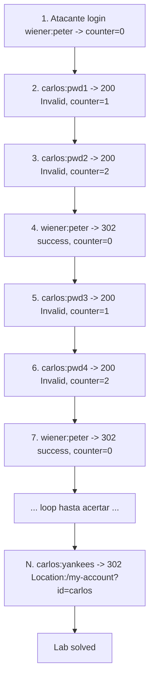

# Writeup: Broken brute-force protection, IP block (PortSwigger)

- **Lab**: Broken brute-force protection, IP block
- **URL**: https://portswigger.net/web-security/authentication/password-based/lab-broken-bruteforce-protection-ip-block
- **Categoría**: Authentication / Bypass de rate-limit por falla lógica (success resetea contador)
- **Dificultad**: Practitioner
- **Credenciales**: `carlos:yankees` (descubiertas vía ataque)

---

## 1. Objetivo

El lab implementa rate-limit por IP: tras 3 intentos fallidos consecutivos desde la misma IP, esa IP queda bloqueada un tiempo. La defensa parece sólida pero tiene una falla lógica explícita en el hint del lab: **"you can reset the counter for the number of failed login attempts by logging in to your own account before this limit is reached"**. Cualquier login exitoso desde esa IP pone el contador en 0, sea quien sea el usuario.

El atacante tiene credenciales propias (`wiener:peter`) y necesita brute-forcear la contraseña de la víctima (`carlos`). La idea: intercalar logins exitosos `wiener:peter` entre intentos `carlos:<candidato>` para que el contador nunca llegue al threshold.

### El insight central

Esta vulnerabilidad NO es un defecto de implementación (el contador funciona, el bloqueo funciona). Es un **defecto lógico de diseño**: la regla de reset es demasiado permisiva. Reset-on-any-success crea una asimetría perversa — el atacante con cualquier cuenta válida puede brute-forcear cuentas ajenas indefinidamente desde la misma IP.

Reglas correctas alternativas:
- Reset sólo si el login exitoso es del **mismo usuario** que estaba acumulando fallos.
- No resetear nunca por evento; decay temporal del contador (ej. -1 cada 5 minutos).
- Counter por (IP, username) en lugar de por IP global.

---

## 2. Reconocimiento

Login form estándar: POST `/login`, body `username=...&password=...`, sin CSRF token. Respuestas observadas a mano:

| Caso | Status | Body marker |
|---|---|---|
| Credenciales válidas (302) | 302 | `Location: /my-account?id=<user>` |
| Credenciales inválidas | 200 | `Invalid username or password` |
| IP bloqueada | 200 | `You have made too many incorrect login attempts. Please try again in 1 minute(s).` |

Tres intentos seguidos con `carlos:wrongpassword` confirman el threshold: al cuarto, el server responde con el marker de bloqueo en lugar de "Invalid". Tras login exitoso `wiener:peter`, los siguientes intentos a `carlos` vuelven a recibir "Invalid" — el contador efectivamente se resetea.

---

## 3. Resolución

### 3.1 Diseño del interleave

Decisión de cadencia: `reset-every = 2`. Es decir:
```
intento 1: carlos:pwd[0]
intento 2: carlos:pwd[1]
reset:     wiener:peter        <- counter pasa de 2 a 0
intento 3: carlos:pwd[2]
intento 4: carlos:pwd[3]
reset:     wiener:peter
...
```

Por qué 2 y no 3 (al límite del threshold):
- Si por alguna razón un request del atacante falla (network glitch, timeout reintento), el contador podría ya estar en 3 cuando se inserta el reset, llegando al bloqueo de todos modos.
- Margen de 1 (counter siempre ≤2) absorbe cualquier perturbación de timing o duplicación accidental.
- Costo extra: 50% más requests de reset (50 wieners vs 33). Trivial frente al beneficio.

Decisión de threading: **secuencial, single-threaded**. Esta es la diferencia clave con el lab de timing donde también había rate-limit por IP. Acá el orden importa — los resets tienen que ocurrir *entre* los intentos contiguos, no en paralelo. Concurrencia rompería la garantía del intercalado.

### 3.2 Detección de éxito

Single signal: `(status==302) AND ('/my-account' in Location)`. El redirect del login exitoso lleva implícito el username de la víctima en el query string, lo que confirma que el server validó la credencial contra `carlos` (no contra `wiener`).

Failure modes a vigilar:
- `BLOCKED_MARKER` en body → el interleave perdió coherencia, abortar.
- `INVALID_MARKER` en body → password incorrecto, seguir.
- Cualquier otro status (5xx, 429) → glitch de red, retry transparente vía `urllib3.Retry`.

### 3.3 Ejecución

```
$ python3 bruteforce.py 0a85006a0342220d824b1faf00d9008d.web-security-academy.net passwords.txt
[*] target=carlos  attacker=wiener:peter
[*] passwords=100  reset-every=2
[+] login inicial OK como wiener (contador en 0)
[*] 10/100 intentado, sigue sin acertar
[*] 20/100 intentado, sigue sin acertar
[*] 30/100 intentado, sigue sin acertar
[*] 40/100 intentado, sigue sin acertar
[*] 50/100 intentado, sigue sin acertar
[*] 60/100 intentado, sigue sin acertar
[*] 70/100 intentado, sigue sin acertar
[*] 80/100 intentado, sigue sin acertar
[+] Location: /my-account?id=carlos

[+] credenciales: carlos:yankees
```

`yankees` está en posición 85 del wordlist (counting from 1) → 85 intentos a carlos + ~42 resets a wiener = 127 requests totales. Sin bypass, el ataque hubiera durado el tiempo del lockout × ~28 ciclos (~30 minutos+, asumiendo lockout de 1 minuto), o simplemente sería imposible si el lockout fuera permanente.

### 3.4 Verificación de "lab solved"

Al completar el flujo de login (POST /login → 302 → GET /my-account?id=carlos), el banner del lab incluye `<section class='academyLabBanner is-solved'>`. Confirmado.

---

## 4. Por qué funciona (y por qué la defensa está rota)

### 4.1 Análisis del antipatrón

El defender probablemente razonó así:

> Si la IP intenta credenciales válidas con éxito, es un usuario legítimo. Bloquearlo sería negarle acceso. Mejor resetear el contador en éxito y mantener la fricción sólo para los fallos.

El error es asumir que **un éxito legítimo y un éxito-como-cobertura son indistinguibles**, y por lo tanto tratarlos igual. Pero un atacante con cualquier cuenta válida (y *toda* base de datos comprometida tiene cuentas válidas baratas) convierte ese éxito en un primitive de "desbloqueo" arbitrario.

Pseudocódigo del antipatrón:

```python
# MAL — reset on any success
def login(ip, username, password):
    if rate_limit.is_blocked(ip):
        return error("Too many attempts")
    if check_credentials(username, password):
        rate_limit.reset(ip)            # <-- regalo al atacante
        return success(username)
    rate_limit.increment(ip)
    return error("Invalid credentials")
```

Patrón corregido (counter per-username, no per-IP):

```python
# BIEN — counter por (IP, username) o solo username
def login(ip, username, password):
    if rate_limit.is_blocked_for_user(username):
        return error("Too many attempts")
    if check_credentials(username, password):
        rate_limit.reset_for_user(username)
        return success(username)
    rate_limit.increment_for_user(username)
    return error("Invalid credentials")
```

Acá `wiener:peter` resetea sólo el contador de `wiener`, no el de `carlos`. El counter de `carlos` sigue subiendo monotónicamente con cada intento fallido y bloquea tras N.

Patrón aún más robusto (combinado):

```python
# MEJOR — counter por usuario Y por IP, sin reset on success, decay temporal
def login(ip, username, password):
    if rate_limit.is_blocked_for_user(username) or rate_limit.is_blocked_for_ip(ip):
        return error("Too many attempts")
    if check_credentials(username, password):
        # NO reset; deja que el counter decaiga solo
        return success(username)
    rate_limit.increment_for_user(username)
    rate_limit.increment_for_ip(ip)
    return error("Invalid credentials")
# en background:
#   cada minuto: rate_limit.decay(all_keys, factor=0.5)
```

### 4.2 Por qué es distinto al bypass por X-Forwarded-For

El lab de username enumeration via response timing también tenía rate-limit por IP. Allí el bypass fue distinto: spoofear `X-Forwarded-For` con IP random por request, haciendo que el rate-limiter cuente "1 intento de cada IP" en lugar de "N intentos de la misma IP".

| Lab | Vector defensa | Vector bypass |
|---|---|---|
| Username enum via timing | Rate-limit por IP, IP leída de XFF | Spoof XFF con IP random por request |
| **Broken bruteforce IP block** | Rate-limit por IP, **reset on success** | **Intercalar success del atacante** |
| Otro hipotético | Rate-limit por IP, sin reset on success, IP leída de TCP socket | Distribuir desde N IPs reales (botnet, residential proxies) |

Las tres muestran progresión defensiva: cerrar XFF spoofing implica leer la IP del socket; cerrar reset-on-success implica counter per-user con decay temporal; cerrar la última requiere fingerprinting más allá de IP (browser fingerprint, ASN reputation, behavioral analysis). Cada nivel encarece pero no elimina.

### 4.3 Trade-off del defender

Counter per-username sin reset-on-success tiene un costo legítimo: el atacante puede **bloquear la cuenta de la víctima** simplemente disparando 3+ intentos contra `carlos:anything` desde cualquier IP. Es un DoS denial of-service trivial. Por eso la cadena defensiva canónica es:

1. Counter per-(username) con threshold N.
2. Counter per-IP con threshold M >> N (para frenar password spraying multi-cuenta desde una sola IP).
3. **Captcha** tras X fallos en lugar de lock duro (no DoSeable).
4. **2FA** obligatorio: aunque el atacante adivine la contraseña, no entra.
5. Detección anómala: bursts de fallos correlacionados con username específico, distribuciones temporales sospechosas.

Reset-on-success no aparece en ninguna lista correcta. Es un atajo que rompe la propiedad principal del rate-limit.

### 4.4 Variantes con Burp

PortSwigger menciona "Advanced users may want to solve this lab by using a macro or the Turbo Intruder extension". Equivalencias del enfoque del script:

- **Burp Macro + Intruder**: definir una macro que haga login `wiener:peter` y un session handling rule "before each request: invoke macro every 2 requests". Intruder Sniper sobre `password=` con el wordlist. La macro mantiene el contador bajo control.
- **Turbo Intruder**: script Python embebido con control fino del orden. Se puede expresar el mismo intercalado declarativamente con `engine.queue()` ordenando `[carlos×2, wiener×1, carlos×2, ...]`.

Ambas variantes son más cómodas en una caja con Burp instalado; el script standalone es más portable y replicable.

---

## 5. Resumen de la cadena



Tres ideas para llevarse:

1. **El reset-on-success es un antipattern silencioso**. La defensa parece estricta vista en aislamiento ("3 fallos → bloqueo"), pero la regla de reset la hace efectivamente inerte ante cualquier atacante con una cuenta. Auditar siempre las **reglas de exención** del rate-limit, no sólo el threshold.
2. **Counter per-username + per-IP combinados** cierra el agujero, pero introduce el nuevo vector de DoS (atacante bloquea cuenta ajena). La salida correcta es captcha tras N en lugar de lock duro, más 2FA para cuentas críticas.
3. **El orden importa**. A diferencia del lab de timing donde concurrencia ayudaba a paralelizar enumeración, acá la concurrencia rompe la garantía del intercalado. El ataque es secuencial por construcción.

---

## 6. Contramedidas

En orden de robustez (acumulativas):

1. **Counter per-username**, no per-IP. El contador de `carlos` debe ser independiente de quién lo intentó.
2. **No resetear en éxito**. Usar decay temporal (ej. -1 cada 60 segundos) o ventana deslizante (últimos N fallos en últimos M minutos).
3. **Counter dual per-IP + per-username**. El primero frena password spraying desde una IP; el segundo frena brute-force concentrado.
4. **Captcha tras N fallos** en lugar de lock duro. Bloquea automatización sin permitir DoS sobre la cuenta.
5. **Login throttling con backoff exponencial**: cada intento toma 1×base, 2×base, 4×base segundos. Brute-force se vuelve económicamente inviable.
6. **2FA / MFA**: aunque el password sea adivinado, el atacante no entra. Defensa final.
7. **Logging y alertas**: distribución anómala de intentos (bursts contra una cuenta específica, intercalado sospechoso de logins exitosos seguidos de fallos), correlación cross-cuenta desde la misma IP.
8. **WebAuthn / passkeys** para cuentas de alto riesgo: elimina el password como factor.

---

## 7. Referencias

- PortSwigger Web Security Academy. (s.f.). *Lab: Broken brute-force protection, IP block*. https://portswigger.net/web-security/authentication/password-based/lab-broken-bruteforce-protection-ip-block
- PortSwigger Web Security Academy. (s.f.). *Vulnerabilities in password-based login*. https://portswigger.net/web-security/authentication/password-based
- OWASP Foundation. (s.f.). *Authentication Cheat Sheet*. https://cheatsheetseries.owasp.org/cheatsheets/Authentication_Cheat_Sheet.html
- OWASP Foundation. (s.f.). *Credential Stuffing Prevention Cheat Sheet*. https://cheatsheetseries.owasp.org/cheatsheets/Credential_Stuffing_Prevention_Cheat_Sheet.html
- MITRE Corporation. (2024). *CWE-307: Improper Restriction of Excessive Authentication Attempts*. https://cwe.mitre.org/data/definitions/307.html
- MITRE Corporation. (2024). *CWE-837: Improper Enforcement of a Single, Unique Action*. https://cwe.mitre.org/data/definitions/837.html
- MITRE Corporation. (2024). *ATT&CK Technique T1110.001: Brute Force: Password Guessing*. https://attack.mitre.org/techniques/T1110/001/
- NIST. (2017). *SP 800-63B: Digital Identity Guidelines — Authentication and Lifecycle Management*. https://pages.nist.gov/800-63-3/sp800-63b.html
- Stuttard, D., & Pinto, M. (2011). *The Web Application Hacker's Handbook* (2nd ed.). Wiley. Cap. 6 (Attacking Authentication).
- Writeups hermanos en la serie auth:
  - [`learning/portswigger/username-enumeration-via-different-responses/writeup.md`](../username-enumeration-via-different-responses/writeup.md) — username enum por length differential.
  - [`learning/portswigger/username-enumeration-via-subtly-different-responses/writeup.md`](../username-enumeration-via-subtly-different-responses/writeup.md) — username enum byte-level.
  - [`learning/portswigger/username-enumeration-via-response-timing/writeup.md`](../username-enumeration-via-response-timing/writeup.md) — timing + bypass rate-limit por XFF spoofing.
  - [`learning/portswigger/2fa-simple-bypass/writeup.md`](../2fa-simple-bypass/writeup.md) — bypass de 2FA por step skipping.
  - [`learning/portswigger/password-reset-broken-logic/writeup.md`](../password-reset-broken-logic/writeup.md) — falla lógica en password reset.
- Inventario interno: [`inventario/04-explotacion/credenciales/explotacion-brute-force-advanced.md`](../../../inventario/04-explotacion/credenciales/explotacion-brute-force-advanced.md)
- Script: [`bruteforce.py`](bruteforce.py) — ataque secuencial con interleave configurable.
