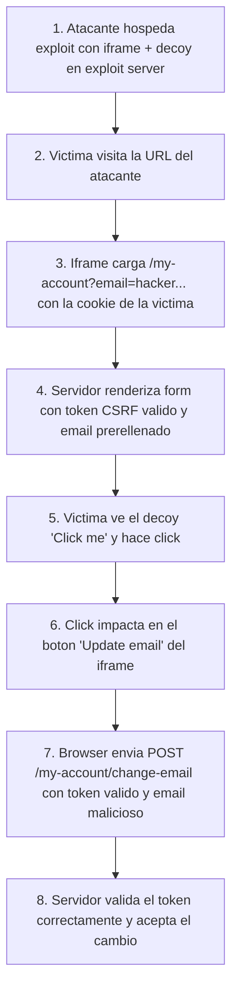

# Writeup: Basic clickjacking with CSRF token protection (PortSwigger)

- **Lab**: Basic clickjacking with CSRF token protection
- **URL**: https://portswigger.net/web-security/clickjacking/lab-basic-csrf-protected
- **Categoría**: Clickjacking -> Bypass de protección CSRF vía UI redressing
- **Dificultad**: Apprentice
- **Credenciales**: `wiener:peter`

---

## 1. Objetivo

Cambiar el email de la víctima a `hacker@attacker-website.com` engañándola con clickjacking sobre el formulario de `/my-account`, que está **protegido con un token anti-CSRF**. La defensa supuesta es que sin el token nadie puede falsificar la request; el lab demuestra que esa premisa es incompleta.

### Lo importante antes de tocar nada

- **Defensa presente**: token anti-CSRF en el form (`csrf=<valor>`).
- **Defensa AUSENTE**: ninguna cabecera anti-framing (`X-Frame-Options`, `Content-Security-Policy: frame-ancestors`).
- **Por qué eso lo rompe**: el atacante no necesita falsificar la request, solo necesita que la víctima la envíe sin saberlo. El token ya viene válido, porque lo emite el servidor para la sesión de la víctima dentro del iframe.
- **Diferencia con un CSRF puro**: en un CSRF clásico, el atacante construye la request desde su propio servidor; el token bloquea eso. En clickjacking, la request la fabrica el navegador de la víctima sobre la página real, así que el token siempre está bien formado.

---

## 2. Diferencia con el lab "prefilled-form-input"

Este lab y el de **prefilled-form-input** son operacionalmente casi idénticos: mismo endpoint `/my-account`, mismo `?email=...` que prerellena el input, mismo payload de iframe + decoy. Lo que cambia es **el énfasis didáctico**:

| Aspecto | Basic CSRF-protected (este) | Prefilled form input |
|---|---|---|
| Foco didáctico | "El token CSRF no defiende contra clickjacking" | "Si el form acepta query param, ya no necesitas que la víctima escriba" |
| Pieza destacada | El token y por qué no ayuda | El prefill por URL |
| Calibración pixels | `top: 555px`, `opacity: 0.5` (afina al layout actual del lab) | `top: 400px`, `opacity: 0.0001` |

La lección a memorizar es la del título: **un token anti-CSRF correctamente implementado no aporta cero seguridad contra clickjacking**. La defensa adecuada vive en cabeceras HTTP, no en el cuerpo del form.

---

## 3. Reconocimiento

### 3.1 Confirmar el formulario y su token

Tras login, `/my-account` muestra el formulario de cambio de email con un input oculto para el token:

```html
<form class="login-form" name="change-email-form" action="/my-account/change-email" method="POST">
    <label>Email</label>
    <input required type="email" name="email" value="wiener@normal-user.net">
    <input required type="hidden" name="csrf" value="TOKEN_AQUI">
    <button class="button" type="submit">Update email</button>
</form>
```

### 3.2 Confirmar el prefill por URL

`/my-account?email=test@test.com` renderiza `value="test@test.com"` en el input. Esto evita tener que escribir nada: el atacante ya controla el valor que se enviará.

### 3.3 Confirmar que la página es framable

Inspeccionando las cabeceras de respuesta de `/my-account` no aparecen `X-Frame-Options` ni `Content-Security-Policy: frame-ancestors`. Sin esas cabeceras, cualquier origen puede meter la página en un `<iframe>`.

---

## 4. Diseño del ataque

### Componentes

1. **Iframe** apuntando a `/my-account?email=hacker@attacker-website.com`. Carga con la sesión de la víctima, así que el HTML servido contiene su token CSRF legítimo.
2. **Decoy** (`<div>Click me</div>`) posicionado encima del botón "Update email" del iframe.
3. **Stacking** controlado: iframe con `z-index: 2` por encima del decoy con `z-index: 1`. La víctima ve el decoy, pero el click impacta en el botón del iframe.

### Payload validado

```html
<style>
  iframe {
    position: relative;
    width: 500px;
    height: 700px;
    opacity: 0.5;
    z-index: 2;
  }
  div {
    position: absolute;
    top: 555px;
    left: 80px;
    z-index: 1;
  }
</style>
<div>Click me</div>
<iframe src="https://LAB.web-security-academy.net/my-account?email=hacker@attacker-website.com"></iframe>
```

### Notas sobre los valores

- `width: 500px; height: 700px`: deja el botón "Update email" en una coordenada predecible dentro del iframe.
- `top: 555px; left: 80px`: el botón en este lab cae más abajo que en el de prefilled-form-input (que pedía `top: 400px`). La calibración se afina con la `opacity` intermedia, no a ciegas.
- `opacity: 0.5`: durante calibración permite ver el iframe debajo del decoy y confirmar el alineamiento. Una vez resuelto, podría bajarse a `0.0001` para un ataque "real" donde el iframe sea invisible al ojo humano. PortSwigger acepta `0.5` igualmente porque el bot ejecuta el click programado sin importar transparencia.
- `z-index`: el iframe **encima** del decoy garantiza que el evento de click llegue al botón, no al `<div>`.

---

## 5. Por qué funciona

### 5.1 El token anti-CSRF se respeta, no se rompe

A diferencia de un bypass por XSS (donde el atacante leería el token del DOM y construiría la request), aquí el token **nunca se intercepta**. El servidor lo emite dentro del iframe para la sesión de la víctima. Cuando el form se envía, el token viaja con su valor legítimo. El servidor pasa la validación porque, técnicamente, **fue la víctima quien envió el form**.

El modelo de amenaza del token CSRF asume que el atacante no puede hacer que la víctima envíe el form. Clickjacking rompe esa asunción engañándola visualmente con un click superpuesto.

### 5.2 El prefill por URL elimina la única pieza que faltaba

Sin `?email=...`, el atacante necesitaría que la víctima además escribiera el email. Con el prefill, el campo viene cargado con el valor del atacante; la víctima solo aporta **un click**. La cadena se reduce a un único acto de la víctima, lo que dispara la tasa de éxito del ataque.

### 5.3 El navegador adjunta la cookie de sesión sin importar el origen del frame padre

El iframe carga `/my-account` desde el origen del lab, así que el navegador adjunta la cookie de sesión de la víctima automáticamente. El exploit server (origen externo) no puede leer el DOM del iframe porque la Same-Origin Policy lo impide, pero **sí puede superponer elementos por encima**. Eso basta para el ataque: no se necesita lectura, solo redirección del click.

---

## 6. Resolución

1. Login con `wiener:peter`. Verificar en `/my-account` que existe "Update email" y que `/my-account?email=test@test.com` prerellena el input.
2. En el exploit server, pegar el HTML reemplazando `LAB` por el subdominio real.
3. **Store** y **View exploit** para verificar alineación. Con `opacity: 0.5` se ve el iframe debajo y se puede ajustar `top`/`left` si el botón no queda justo bajo el decoy. **No** hacer click manual.
4. **Deliver exploit to victim**. El bot abre la URL, hace el click programado, el iframe envía el POST con token legítimo y email malicioso.
5. El lab marca como Solved.

Si tras "Deliver" el lab no se resuelve:

- El email del payload ya estaba en uso. Cambiarlo por otro único.
- Los pixeles del decoy no caen sobre el botón en el viewport del bot. Ajustar `top` en pasos de 20-50px.
- El iframe no carga la sesión: confirmar URL del iframe y que `?email=...` se renderiza en el HTML servido.

---

## 7. Resumen de la cadena



Tres ideas para llevarse:

1. **Token CSRF y clickjacking defienden cosas distintas**. El token defiende el origen de la request; clickjacking secuestra el origen del **click**. Si la víctima envía el form ella misma desde la página real, el token siempre es válido.
2. **El atacante no necesita controlar JavaScript en el origen víctima**. Solo necesita superponer DOM externo encima de un iframe. La SOP impide leer el iframe pero no impide cubrirlo, y el cubrimiento basta.
3. **Calibración con `opacity` intermedia es la forma profesional**. Trabajar con `opacity: 0` desde el inicio es ciego; `0.5` permite ver y ajustar; `0.0001` es para la entrega final si quieres invisibilidad real.

---

## 8. Contramedidas

Defensas en orden de robustez:

1. **`Content-Security-Policy: frame-ancestors 'none'`** (o `'self'` si se necesita iframear desde el propio origen). El control moderno: el navegador rechaza cargar la página dentro de un iframe cross-origin antes de renderizar.
2. **`X-Frame-Options: DENY`** (o `SAMEORIGIN`). Cabecera legacy, sigue funcionando. Mantenerla por compatibilidad junto a `frame-ancestors`.
3. **No aceptar valores sensibles vía query string**. El prefill via `?email=` es el habilitador clave. Para acciones que cambian estado, ignorar parámetros GET y exigir el valor por POST.
4. **Reautenticación para cambios críticos**. Pedir contraseña antes de cambiar email/contraseña/transferir fondos limita el impacto incluso si la página es framable.
5. **Frame buster JavaScript**. Patrón legacy (`if (top !== self) top.location = self.location`). Evitable con `sandbox` en el iframe; no sustituye a las cabeceras HTTP.
6. **Tokens anti-CSRF bien implementados**. Imprescindibles contra CSRF puro. La lección de este lab es que **no son suficientes** sin defensa contra framing: son ortogonales, no sustitutos.

---

## 9. Referencias

- PortSwigger Web Security Academy. (s.f.). *Lab: Basic clickjacking with CSRF token protection*. https://portswigger.net/web-security/clickjacking/lab-basic-csrf-protected
- PortSwigger Web Security Academy. (s.f.). *Clickjacking (UI redressing)*. https://portswigger.net/web-security/clickjacking
- OWASP Foundation. (s.f.). *Clickjacking Defense Cheat Sheet*. https://cheatsheetseries.owasp.org/cheatsheets/Clickjacking_Defense_Cheat_Sheet.html
- MDN Web Docs. (s.f.). *CSP: frame-ancestors*. https://developer.mozilla.org/en-US/docs/Web/HTTP/Headers/Content-Security-Policy/frame-ancestors
- MDN Web Docs. (s.f.). *X-Frame-Options*. https://developer.mozilla.org/en-US/docs/Web/HTTP/Headers/X-Frame-Options
- Writeup hermano: [`learning/portswigger/clickjacking-prefilled-form-input/writeup.md`](../clickjacking-prefilled-form-input/writeup.md)
- Inventario interno: [`inventario/03-analisis-vulnerabilidades/web/analisis-seguridad-cabeceras.md`](../../../inventario/03-analisis-vulnerabilidades/web/analisis-seguridad-cabeceras.md)
- Inventario interno: [`inventario/03-analisis-vulnerabilidades/web/analisis-csrf.md`](../../../inventario/03-analisis-vulnerabilidades/web/analisis-csrf.md)
