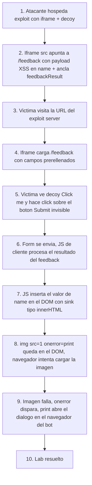

# Writeup: Exploiting clickjacking to trigger DOM-based XSS (PortSwigger)

- **Lab**: Exploiting clickjacking vulnerability to trigger DOM-based XSS
- **URL**: https://portswigger.net/web-security/clickjacking/lab-exploiting-to-trigger-dom-based-xss
- **Categoría**: Clickjacking -> Chaining con DOM-based XSS
- **Dificultad**: Practitioner
- **Credenciales**: `wiener:peter` (no estrictamente necesarias para resolver)

---

## 1. Objetivo

El lab combina dos vulnerabilidades para conseguir ejecución de JavaScript en el navegador de la víctima. La condición de éxito es que se dispare `print()` en el contexto del bot.

- **DOM-based XSS** en `/feedback`: el campo `name` del formulario se renderiza dentro del DOM del resultado sin sanitizar. Un payload tipo `` introducido en `name` y luego enviado dispara la ejecución.
- **Clickjacking**: el formulario requiere submit voluntario. Sin clickjacking, el atacante necesita convencer a la víctima de pulsar Submit por su cuenta. Con clickjacking, el submit se enmascara como un click sobre un decoy benigno.

La cadena resultante: víctima visita el exploit server -> ve un decoy -> hace click -> el iframe envía el form prerrellenado -> el `name` malicioso se renderiza -> XSS dispara `print()`.

### Lo importante antes de tocar nada

- **DOM XSS**: el sink está en el JavaScript de cliente que toma `name` de la URL/form y lo inyecta en el DOM. No es XSS reflejado server-side.
- **Prefill via query string**: `/feedback?name=...&email=...&subject=...&message=...` rellena los campos del form. Mismo vector que el lab de prefilled-form-input.
- **Fragment `#feedbackResult`**: el navegador hace scroll al elemento con ese id al cargar el iframe, dejando el botón Submit en una posición predecible.
- **No `sandbox`**: a diferencia del lab de frame-buster, aquí el JS del iframe **debe** ejecutarse para que la XSS dispare. Añadir `sandbox` rompe el ataque.
- **Click manual seguro**: al contrario del basic clickjacking lab, aquí el click sobre el decoy solo dispara `print()` (un diálogo). No es destructivo. Aprovecharlo para verificar alineación.

---

## 2. Reconocimiento

### 2.1 Confirmar el sink XSS

Visitar `/feedback?name=&email=test@test.com&subject=test&message=test#feedbackResult` y enviar el formulario debe abrir el diálogo de impresión. Esto confirma:

1. El campo `name` se prerrellena desde el query string.
2. El JS de cliente inyecta el valor de `name` en el DOM al renderizar el resultado del feedback.
3. La inyección no escapa HTML, por lo que `` se interpreta como elemento real con handler activo.

### 2.2 Confirmar que el form requiere submit

El payload XSS no se dispara con solo cargar `/feedback?name=...`. Hace falta enviar el formulario para que el flujo de cliente llegue al sink. Esto justifica el clickjacking: convertir un submit voluntario en un click engañado.

### 2.3 Por qué no se puede resolver solo con XSS o solo con clickjacking

- **Solo XSS**: requeriría que la víctima visite la URL maliciosa y además haga submit. Tasa de éxito real baja.
- **Solo clickjacking**: el botón Submit en sí no hace nada dañino sin un payload XSS prerrellenado. No habría ejecución de código.
- **Ambos encadenados**: una sola visita y un solo click bastan.

---

## 3. Diseño del ataque

### Componentes

1. **Iframe** apuntando a `/feedback?...#feedbackResult` con el payload XSS dentro del query param `name`.
2. **Decoy** posicionado encima del botón Submit del formulario.
3. **Iframe casi invisible** (`opacity: 0.0001`) y por encima del decoy en el stacking (`z-index: 2`).

### Payload

```html
<style>
  iframe {
    position: relative;
    width: 500px;
    height: 700px;
    opacity: 0.0001;
    z-index: 2;
  }
  div {
    position: absolute;
    top: 610px;
    left: 80px;
    z-index: 1;
  }
</style>
<div>Click me</div>
<iframe src="https://LAB.web-security-academy.net/feedback?name=&email=hacker@attacker-website.com&subject=test&message=test#feedbackResult"></iframe>
```

### Notas sobre los valores

- `top: 610px`: bastante más bajo que en labs anteriores. El form de feedback tiene cuatro campos antes del Submit, así que el botón está al final.
- `#feedbackResult` en la URL: scroll al ancla, fija la posición del botón en el viewport del bot.
- **URL del `src` en una sola línea**: si tu editor parte la línea con word-wrap o le metes salto manual, el espacio en blanco se queda dentro de la URL y el iframe falla silenciosamente al cargar. Es un fallo difícil de diagnosticar porque no hay error visible.
- Los caracteres `<` `>` `&` dentro del `src` pueden ir en crudo o HTML-entity-encoded (`&lt;`, `&gt;`, `&amp;`); el navegador decodifica entities antes de resolver la URL, así que ambas formas funcionan. `&amp;` es la forma técnicamente correcta dentro de un atributo HTML.

### Por qué `sandbox` rompería este ataque

Tentación: aplicar `sandbox="allow-forms"` por costumbre del lab anterior. **No hacerlo**. `sandbox` sin `allow-scripts` bloquea el JS del iframe. La DOM XSS depende de que el handler `onerror` del `` se ejecute. Sin scripts, `` solo carga la imagen (que falla), y el `onerror` nunca corre. El `print()` no se dispara y el lab no se resuelve.

Cada lab requiere su propia configuración de `sandbox`:

| Lab | sandbox? | Razón |
|---|---|---|
| Prefilled form input | No | Submit nativo basta. |
| Frame buster script | `allow-forms` | Bloquear el frame buster. |
| DOM XSS chaining (este) | No | Necesitamos JS del iframe para que la XSS corra. |

---

## 4. Por qué funciona

### 4.1 La XSS es client-side, no server-side

El servidor no refleja `name` en la respuesta HTML. El renderizado problemático lo hace el JavaScript de cliente al procesar el resultado del feedback: lee `name` del input (que vino prerrellenado por el query string) y lo inserta en el DOM con un sink tipo `innerHTML` o equivalente. Por eso es DOM XSS y no reflected XSS clásico.

### 4.2 El form submit es lo que detona la cadena

`` necesita estar en el DOM para que el handler corra. En el flujo de la app, el valor de `name` solo entra al DOM cuando se procesa el resultado del feedback, lo cual ocurre tras el submit. Hasta el submit, el payload está solo en el `value` del input (donde `<` `>` no se interpretan como tags).

El click engañado del clickjacking es exactamente el evento que falta para llegar al sink.

### 4.3 La cookie de sesión NO es el habilitador

A diferencia de los labs anteriores de clickjacking (donde la cookie autenticaba la acción), aquí la víctima ni siquiera necesita estar logueada. La XSS dispara en el navegador de la víctima con privilegios JS arbitrarios sobre el origen del lab. Eso es lo que cuenta como impacto, no la cookie.

### 4.4 El fallo silencioso del iframe con URL malformada

Si la URL del `src` contiene whitespace (salto de línea, espacios extras), el navegador no muestra error visible: simplemente no carga el iframe o lo carga con una URL truncada. Esto es una fuente común de tiempo perdido. Diagnóstico rápido: abrir DevTools -> Network y ver si la request del iframe sale y a qué URL exacta. Si la request no aparece o la URL se ve cortada, es un problema de formateo de la `src`.

---

## 5. Resolución

1. (Opcional) Login con `wiener:peter` para tener sesión consistente, aunque el lab no lo requiere.
2. Visitar `/feedback` y confirmar que el form tiene los cuatro campos `name`, `email`, `subject`, `message` y el botón Submit.
3. **Verificar la XSS manualmente**: navegar a `/feedback?name=&email=test@test.com&subject=test&message=test#feedbackResult`, hacer submit, debe abrirse el diálogo de impresión.
4. En el exploit server, pegar el HTML reemplazando `LAB.web-security-academy.net` por el host real. **Asegurarse de que la URL del `src` queda en una sola línea**.
5. Subir `opacity: 0.1` para verificar visualmente que "Click me" queda sobre el botón Submit. En este lab el click manual es seguro: si el diálogo de print se abre al clicar, alineación correcta.
6. Volver a `opacity: 0.0001`.
7. Pulsar **Deliver exploit to victim**.
8. El bot abre la URL, el iframe carga `/feedback?...`, el bot hace click sobre el decoy, el form se envía, el JS del iframe inyecta `` en el DOM, `print()` dispara, lab resuelto.


Si tras "Deliver" el lab no se resuelve:

- URL del `src` con whitespace/salto de línea: ver sección 4.4.
- `sandbox` añadido por error: bloquearía la XSS. Quitarlo.
- Pixeles del decoy desalineados con el viewport del bot: ajustar `top`/`left` con `opacity: 0.1`.
- Subdominio del lab caducado: copiar el actual desde la barra superior del lab.

---

## 6. Resumen de la cadena



Tres ideas para llevarse:

1. **Clickjacking es un primitivo de chaining, no solo de cambio-de-estado**. La utilidad va más allá de "borrar cuenta" o "cambiar email": cualquier acción que requiera un click voluntario puede sustituirse por un click engañado, incluyendo submits que disparan XSS, OAuth consent, aprobaciones de permisos, instalación de extensiones, etc.
2. **Cada lab requiere su propio `sandbox`**. Aplicar `sandbox` por hábito puede romper el ataque si el exploit depende de JS del iframe. Pensar qué capacidad necesita la cadena y solo restringir lo que estorba.
3. **La URL del `src` en una sola línea**. Whitespace dentro de la URL del iframe falla silenciosamente. Si el iframe "no carga sin razón aparente", abrir DevTools -> Network y verificar la URL exacta de la request.

---

## 7. Contramedidas

Defensas en orden de robustez, separando las dos vulnerabilidades:

### Contra la DOM XSS

1. **Sanitizar/escapar la salida en el sink de cliente**. Donde el JS toma `name` y lo inyecta en el DOM, usar `textContent` en lugar de `innerHTML`, o un sanitizador como DOMPurify configurado estrictamente.
2. **Validar input en cliente y servidor**. El `name` no debería contener tags HTML. Rechazar o escapar al recibir.
3. **CSP estricta** sin `'unsafe-inline'` y con allow-list para fuentes de scripts. Mitigaría inyecciones de `<script>`, aunque no necesariamente `` que es payload inline en handler de elemento.

### Contra el clickjacking

4. **`Content-Security-Policy: frame-ancestors 'none'`** o `'self'`. Defensa canónica.
5. **`X-Frame-Options: DENY`**. Cabecera legacy, mantener junto a CSP.
6. **No aceptar valores sensibles vía query string**. El prefill por GET es el habilitador del PoC. Endpoints que cambien estado o disparen flujos críticos no deberían aceptar GET params para campos del form.

### Defensa en profundidad

7. **Reautenticación o confirmación explícita** para acciones que disparen efectos en el navegador o en el servidor.
8. **Eliminar fragments que faciliten alineación**. Aunque el ancla `#feedbackResult` es funcionalmente legítima, su predictibilidad ayuda al atacante a anclar pixeles. Si el form puede prescindir del ancla, mejor.

---

## 8. Referencias

- PortSwigger Web Security Academy. (s.f.). *Lab: Exploiting clickjacking vulnerability to trigger DOM-based XSS*. https://portswigger.net/web-security/clickjacking/lab-exploiting-to-trigger-dom-based-xss
- PortSwigger Web Security Academy. (s.f.). *Clickjacking (UI redressing)*. https://portswigger.net/web-security/clickjacking
- PortSwigger Web Security Academy. (s.f.). *DOM-based vulnerabilities*. https://portswigger.net/web-security/dom-based
- OWASP Foundation. (s.f.). *DOM based XSS Prevention Cheat Sheet*. https://cheatsheetseries.owasp.org/cheatsheets/DOM_based_XSS_Prevention_Cheat_Sheet.html
- OWASP Foundation. (s.f.). *Clickjacking Defense Cheat Sheet*. https://cheatsheetseries.owasp.org/cheatsheets/Clickjacking_Defense_Cheat_Sheet.html
- MDN Web Docs. (s.f.). *iframe sandbox attribute*. https://developer.mozilla.org/en-US/docs/Web/HTML/Element/iframe#sandbox
- Inventario interno: [`inventario/03-analisis-vulnerabilidades/web/analisis-xss.md`](../../../inventario/03-analisis-vulnerabilidades/web/analisis-xss.md)
- Inventario interno: [`inventario/03-analisis-vulnerabilidades/web/analisis-seguridad-cabeceras.md`](../../../inventario/03-analisis-vulnerabilidades/web/analisis-seguridad-cabeceras.md)
- Writeups relacionados:
  - [`learning/portswigger/clickjacking-prefilled-form-input/writeup.md`](../clickjacking-prefilled-form-input/writeup.md)
  - [`learning/portswigger/clickjacking-frame-buster-script/writeup.md`](../clickjacking-frame-buster-script/writeup.md)
