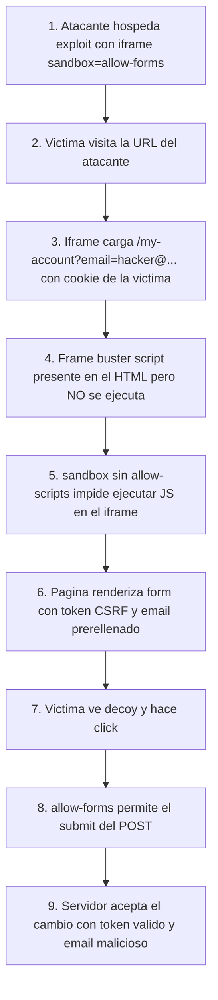

# Writeup: Clickjacking with a frame buster script (PortSwigger)

- **Lab**: Clickjacking with a frame buster script
- **URL**: https://portswigger.net/web-security/clickjacking/lab-frame-buster-script
- **Categoría**: Clickjacking -> Frame buster bypass via iframe sandbox
- **Dificultad**: Practitioner
- **Credenciales**: `wiener:peter`

---

## 1. Objetivo

El lab repite el escenario del prefilled form input (`/my-account` acepta `?email=...` para prerellenar el campo) pero añade una defensa client-side: un **frame buster script** en la página que detecta si está siendo cargada en un iframe e intenta romper el ataque navegando la ventana superior fuera del frame.

Para resolverlo hay que neutralizar el frame buster. La técnica es aplicar el atributo `sandbox="allow-forms"` al iframe, que **bloquea la ejecución de JavaScript** dentro del frame mientras **mantiene activa** la capacidad de enviar formularios. El script no corre, no rompe nada, y el click de la víctima dispara el cambio de email igual que en el lab anterior.

### Lo importante antes de tocar nada

- **Defensa nueva**: frame buster script en `/my-account` (típicamente `if (top !== self) top.location = self.location`).
- **Defensa heredada**: token anti-CSRF en el form (irrelevante por las mismas razones del lab anterior).
- **Vector clave**: atributo `sandbox` con allow-list mínimo (`allow-forms`).
- **Por qué funciona**: `sandbox` por defecto bloquea **todo**; solo se reactiva lo listado explícitamente. Sin `allow-scripts`, el frame buster no se ejecuta. Sin `allow-top-navigation`, aunque corriera no podría cambiar `top.location`. Con `allow-forms`, el submit del cambio de email sigue funcionando.
- **Restricción operacional**: emails únicos. Si pruebas con tu email, usa otro distinto en el payload final.

---

## 2. Reconocimiento

### 2.1 Confirmar el frame buster

En el HTML de `/my-account` aparece un script tipo:

```html
<script>
  if (top != self) {
    top.location = self.location;
  }
</script>
```

Variantes equivalentes que se ven en el wild:

```javascript
// Asignación directa de location
window.top.location.href = window.self.location.href;

// Document.write para reemplazar el contenido cuando hay frame
if (top != self) {
  document.write('<style>body{display:none}</style>');
  top.location = self.location;
}

// Setinterval por si el atacante intenta override
setInterval(function () {
  if (top !== self) top.location = self.location;
}, 100);
```

Todas tienen el mismo punto único de fallo: **necesitan que el JavaScript del iframe se ejecute**. Si bloqueas la ejecución, el frame buster no existe.

### 2.2 Verificar prefill

Igual que en el lab anterior: `/my-account?email=test@test.com` renderiza el input con ese valor. El vector de prerelleno sigue presente.

### 2.3 Por qué un iframe sin `sandbox` falla

Con el exploit del lab anterior tal cual:

```html
<iframe src="https://LAB.../my-account?email=...">
```

Al cargar el iframe, el script frame buster se ejecuta dentro del frame, asigna `top.location = self.location`, y el navegador del bot abandona la página del exploit server para navegar a `/my-account` directamente. El decoy desaparece, el bot no llega a hacer click sobre nada útil, y el lab no se resuelve.

---

## 3. Diseño del ataque

### El atributo `sandbox` y su modelo de allow-list

`sandbox` es un atributo de `<iframe>` introducido en HTML5 con políticas opt-in. Su comportamiento por defecto (sandbox vacío) es **bloquear**:

- Ejecución de scripts.
- Envío de formularios.
- Navegación de la ventana top.
- Plugins.
- Tratamiento same-origin (el contenido se trata como origen único, perdiendo cookies).
- Popups.
- Lock del puntero, fullscreen, presentation.

Para el ataque solo necesitas reactivar **una** capacidad: `allow-forms`. Esto deja el form submit funcional y todo lo demás bloqueado, incluyendo el script defensor.

### Por qué `allow-forms` solo no rompe la sesión de la víctima

Dato sutil: aunque `sandbox` por defecto fuerza tratamiento same-origin único (rompe cookies), el navegador sigue adjuntando la cookie de sesión cuando el iframe envía un POST a su propio origen real, porque la **request HTTP** se manda al origen real de la URL del iframe. Lo que `sandbox` rompe es el acceso del documento del iframe a las cookies vía JavaScript (que aquí ya estaba bloqueado de todos modos por no tener `allow-scripts`). El POST sigue llevando la cookie.

Si tuvieras dudas, las alternativas más permisivas serían `sandbox="allow-forms allow-same-origin"`, pero **no son necesarias** y abren más superficie.

### Payload

```html
<style>
  iframe {
    position: relative;
    width: 500px;
    height: 700px;
    opacity: 0.0001;
    z-index: 2;
  }
  div {
    position: absolute;
    top: 385px;
    left: 80px;
    z-index: 1;
  }
</style>
<div>Click me</div>
<iframe sandbox="allow-forms" src="https://LAB.web-security-academy.net/my-account?email=hacker@attacker-website.com"></iframe>
```

### Notas sobre los valores en este lab

- `top: 385px` es el punto de partida oficial. **No siempre encaja**: en una resolución de este lab tuve que bajarlo a `top: 495px` para que el decoy quedara sobre el botón. Causa probable: layout ligeramente distinto entre instancias del lab o entre variantes del bot. Si los pixels oficiales no resuelven, ajustar con `opacity: 0.1` para ver y volver a `0.0001`.
- `opacity: 0.1` también funciona contra el bot (no inspecciona si la página es "obviamente sospechosa"). Para humanos reales bajar a `0.0001`.
- `sandbox="allow-forms"`: cualquier valor adicional (`allow-scripts`, `allow-top-navigation`) **reactivaría el frame buster** y volvería a romper el ataque. Mantener el allow-list mínimo.

---

## 4. Por qué funciona

### 4.1 El frame buster necesita ejecutar código para defenderse

Frame busters son JavaScript. Sin motor JS habilitado en el iframe, el script es texto inerte en el DOM. `sandbox=""` (o cualquier sandbox sin `allow-scripts`) impide que el navegador interprete los `<script>` del iframe.

### 4.2 El click + form submit no necesita scripts

El submit de un `<form>` por click en su `<button type="submit">` es funcionalidad nativa del HTML, no JavaScript. El navegador lo procesa aunque scripts estén deshabilitados, **siempre que `allow-forms` esté listado**. Por eso este allow-list mínimo es la combinación exacta que neutraliza al defensor sin neutralizar el ataque.

### 4.3 La cookie de sesión sigue viajando

El POST sale del navegador con destino a `https://LAB.../my-account/change-email`. El navegador adjunta la cookie de sesión `wiener` porque el destino es el origen real del iframe, independientemente de cómo `sandbox` trate el documento internamente. La SOP a nivel de cookies HTTP no se ve afectada por `sandbox`.

### 4.4 Por qué frame busters son una defensa débil en general

Hay al menos cuatro maneras conocidas de neutralizarlos:

1. **`sandbox="allow-forms"`** (la del lab).
2. **CSP `script-src`** controlado por el atacante en su propia página, que en algunos navegadores antiguos heredaba al iframe (no funciona en moderno).
3. **`onbeforeunload` handlers** que cancelan la navegación que el frame buster intenta.
4. **Reescritura de `top.location` setter** vía Object.defineProperty cuando el atacante puede correr JS antes que el iframe (efectivo solo en ciertos contextos).

La conclusión práctica: **frame busters NO son una defensa**. Se documentan como anti-patrón. La única defensa real contra clickjacking son las cabeceras `X-Frame-Options` y `frame-ancestors` (server-side, evaluadas por el navegador antes de cargar el iframe).

---

## 5. Resolución

1. Login en el lab con `wiener:peter`. Confirmar en el HTML de `/my-account` que aparece el frame buster script.
2. Verificar que `/my-account?email=test@test.com` prerellena el campo (vector heredado del lab anterior).
3. En el exploit server, pegar el HTML reemplazando `LAB.web-security-academy.net` por el host real del lab.
4. **Sin clicar manualmente**: subir `opacity: 0.1`, ajustar `top` del decoy hasta que quede sobre el botón "Update email", volver a `opacity: 0.0001`.
5. Pulsar **Deliver exploit to victim**.
6. El bot abre la URL, el iframe carga `/my-account?email=hacker@attacker-website.com` con su cookie de sesión, el frame buster no se ejecuta porque `sandbox` bloquea scripts, el bot hace click sobre el decoy, el iframe envía el POST de cambio de email con su token CSRF y el email del atacante.
7. Lab marcado como Solved.


Si tras "Deliver" el lab no se resuelve:

- Pixeles del decoy desalineados con el viewport del bot. Subir `opacity` a `0.1` solo para ver, ajustar `top`/`left`, volver a `0.0001`.
- `sandbox` mal escrito o con `allow-scripts` añadido por error: el frame buster volvería a ejecutarse.
- Email duplicado: cambiar el valor del query param.

---

## 6. Resumen de la cadena



Tres ideas para llevarse:

1. **Frame busters NO son una defensa contra clickjacking**. Son JavaScript, y todo JavaScript del iframe puede neutralizarse desde el padre con `sandbox` o equivalente. La defensa real es server-side: `X-Frame-Options` o CSP `frame-ancestors`.
2. **`sandbox` es un allow-list, no un block-list**. Por defecto bloquea todo; solo se reactiva lo listado. Eso permite ataques quirúrgicos: dejar pasar exactamente la capacidad que el ataque necesita y bloquear todo lo demás.
3. **Las cookies HTTP siguen viajando aunque `sandbox` rompa same-origin a nivel de documento**. Lo que `sandbox` aísla son los APIs de JavaScript dentro del frame, no las requests HTTP que el navegador emite al servidor.

---

## 7. Contramedidas

Defensas en orden de robustez:

1. **`Content-Security-Policy: frame-ancestors 'none'`** (o `'self'` si necesitas iframear desde tu propio origen). Mitigación canónica moderna. Evaluada por el navegador antes de cargar el iframe; `sandbox` del padre no afecta.
2. **`X-Frame-Options: DENY`** o `SAMEORIGIN`. Cabecera legacy, cubre navegadores que no implementan `frame-ancestors`. Mantenerla junto a CSP por compatibilidad.
3. **No aceptar valores sensibles vía query string**. El prefill `?email=...` es el habilitador del PoC. Endpoints que cambian estado deberían exigir POST y ignorar GET params.
4. **Reautenticación para cambios críticos**. Pedir contraseña antes de cambiar email/contraseña/transferir limita el daño aunque el iframe se monte.
5. **Eliminar el frame buster script**. No defiende y da falsa sensación de seguridad. Sustituir por `frame-ancestors`.
6. **Tokens anti-CSRF**. Imprescindibles contra CSRF puro, irrelevantes contra clickjacking.

---

## 8. Referencias

- PortSwigger Web Security Academy. (s.f.). *Lab: Clickjacking with a frame buster script*. https://portswigger.net/web-security/clickjacking/lab-frame-buster-script
- PortSwigger Web Security Academy. (s.f.). *Clickjacking (UI redressing)*. https://portswigger.net/web-security/clickjacking
- OWASP Foundation. (s.f.). *Clickjacking Defense Cheat Sheet*. https://cheatsheetseries.owasp.org/cheatsheets/Clickjacking_Defense_Cheat_Sheet.html
- MDN Web Docs. (s.f.). *iframe sandbox attribute*. https://developer.mozilla.org/en-US/docs/Web/HTML/Element/iframe#sandbox
- MDN Web Docs. (s.f.). *CSP: frame-ancestors*. https://developer.mozilla.org/en-US/docs/Web/HTTP/Headers/Content-Security-Policy/frame-ancestors
- Rydstedt, G., Bursztein, E., Boneh, D., & Jackson, C. (2010). *Busting Frame Busting: a Study of Clickjacking Vulnerabilities at Popular Sites*. Stanford University. https://seclab.stanford.edu/websec/framebusting/framebust.pdf
- Inventario interno: [`inventario/03-analisis-vulnerabilidades/web/analisis-seguridad-cabeceras.md`](../../../inventario/03-analisis-vulnerabilidades/web/analisis-seguridad-cabeceras.md)
- Writeup relacionado: [`learning/portswigger/clickjacking-prefilled-form-input/writeup.md`](../clickjacking-prefilled-form-input/writeup.md)
