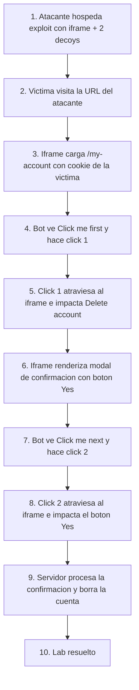

# Writeup: Multistep clickjacking (PortSwigger)

- **Lab**: Multistep clickjacking
- **URL**: https://portswigger.net/web-security/clickjacking/lab-multistep
- **Categoría**: Clickjacking -> Multi-step (doble decoy con diálogo de confirmación)
- **Dificultad**: Practitioner
- **Credenciales**: `wiener:peter`

---

## 1. Objetivo

La página `/my-account` ahora tiene una protección legítima contra clickjacking de un solo click: para borrar la cuenta el usuario debe hacer **dos clicks**, primero "Delete account" y después "Yes" en un diálogo de confirmación que aparece sobre la página.

Para resolverlo hay que encadenar dos decoys posicionados sobre las dos zonas de click esperadas. El bot del simulador realiza dos clicks consecutivos sobre los decoys; el primero impacta el botón Delete y el segundo, el botón Yes del diálogo. La cuenta se borra y el lab se marca resuelto.

### Lo importante antes de tocar nada

- **Defensa nueva**: diálogo de confirmación tras el primer click. Es el patrón antiphishing común ("¿estás seguro?").
- **Solución**: dos decoys. Mismo iframe, la transición Delete -> diálogo Yes ocurre dentro del iframe sin recargar.
- **Sin `sandbox`**: la página no tiene frame buster, no necesitamos bloquear scripts.
- **Acción destructiva**: borrar la cuenta `wiener`. Click manual durante alineación rompe el lab por ~20 min de cooldown. Solo `opacity: 0.1` para inspección, **nunca clicar**.
- **Variabilidad de pixeles**: los valores oficiales son punto de partida; cada instancia del lab puede requerir ajuste. En esta resolución hubo que mover `firstClick` de `top:330` a `top:510`.

---

## 2. Reconocimiento

### 2.1 Confirmar el flujo de dos pasos

Tras login con `wiener:peter`, en `/my-account` aparece el botón "Delete account". Al pulsarlo (cuando lo verifiques con tu propia sesión, asume que se borra tu cuenta) la página muestra un diálogo modal con el botón "Yes" para confirmar.

**Conviene NO verificarlo manualmente** porque rompe el lab. Asumir el flujo según la descripción oficial.

### 2.2 Verificar que el modal vive dentro del iframe

Esta es la pregunta clave: cuando el bot hace el primer click y aparece el diálogo, ¿el diálogo está dentro del iframe (mismo documento) o se abre como una ventana del navegador (alert/confirm nativo)?

- **Si es un modal HTML del propio site** (típico): el iframe sigue mostrando `/my-account` con el modal superpuesto en el DOM. El segundo decoy puede impactar al botón Yes posicionándose donde el modal lo coloca dentro del iframe.
- **Si fuera un `confirm()` nativo del navegador**: clickjacking no funcionaría sobre él; el browser dialog vive fuera del DOM y no se puede iframear ni superponer.

En este lab es un modal HTML, por eso el ataque es viable. Si fuera nativo, la defensa habría sido robusta.

---

## 3. Diseño del ataque

### Componentes

1. **Iframe** apuntando a `/my-account`, cargado con la sesión del bot.
2. **Decoy `firstClick`** posicionado sobre el botón "Delete account".
3. **Decoy `secondClick`** posicionado sobre el botón "Yes" del modal de confirmación.
4. **Mismo iframe** para los dos clicks: no se recarga ni se reposiciona entre ellos. La transición Delete -> diálogo ocurre dentro del DOM del iframe.

### Payload (valores oficiales como punto de partida)

```html
<style>
  iframe {
    position: relative;
    width: 500px;
    height: 700px;
    opacity: 0.0001;
    z-index: 2;
  }
  .firstClick, .secondClick {
    position: absolute;
    top: 330px;
    left: 50px;
    z-index: 1;
  }
  .secondClick {
    top: 285px;
    left: 225px;
  }
</style>
<div class="firstClick">Click me first</div>
<div class="secondClick">Click me next</div>
<iframe src="https://LAB.web-security-academy.net/my-account"></iframe>
```

### Notas sobre los valores

- **`firstClick top:330 left:50`** (oficial): posición del botón "Delete account". En la instancia que resolví requirió subirlo a `top:510 left:50`.
- **`secondClick top:285 left:225`** (oficial): posición del botón "Yes" del modal. Subido a `top:300` en la resolución.
- **Mismo `z-index: 1`** para ambos decoys: el iframe (z-index 2) está encima en ambos casos. El click sobre cualquiera de los decoys atraviesa visualmente al elemento del iframe que coincida en esas coordenadas.
- **`opacity` no afecta al bot**. CSS `opacity` cambia la apariencia visual, no el comportamiento de pointer-events. El iframe sigue interceptando clicks aunque sea casi invisible. En esta resolución usé `opacity: 0.3` y el bot resolvió igual; para humanos reales bajar a `0.0001`.

### Por qué los pixeles oficiales no siempre encajan

Observación práctica de esta serie de labs: los valores publicados en la solución oficial son **punto de partida calibrado para una instancia concreta**, no garantía universal. En distintos spin-ups del mismo lab los layouts pueden variar por:

- Pequeñas diferencias de padding/margin en el HTML servido.
- Banners o avisos del lab que ocupan espacio extra al inicio.
- Variaciones del CSS según la configuración del usuario que arranca el lab.

Estrategia: empezar con oficiales, si no resuelve subir `opacity: 0.1`, alinear visualmente, volver a `0.0001`, entregar.

### Por qué la alineación visual TUYA SÍ se traduce al bot (corrección importante)

En labs anteriores escribí que "el viewport del bot manda y la alineación visual tuya es engañosa". **Es incorrecto en el caso general**:

- El iframe tiene **dimensiones fijas en CSS** (500x700). El layout interno del iframe depende del ancho del iframe, no del viewport del padre.
- Los decoys están posicionados con `position: absolute` desde el origen del documento padre. Su coordenada absoluta (top, left) es la misma para ti y para el bot.
- Por tanto, si el decoy queda visualmente sobre el botón en tu navegador, queda sobre el botón también en el del bot.

La variabilidad real entre lo que ves y lo que ve el bot viene de **diferencias entre instancias del lab**, no de diferencias de viewport. Cuando los pixeles oficiales no encajan en tu instancia, alinear visualmente en tu propia pantalla y bajar opacity es válido y funciona.

(En el lab `basic-csrf-protected` esta confusión combinada con el "click manual para verificar" me costó romper el lab. El click manual es lo que rompe, no la alineación.)

---

## 4. Por qué funciona

### 4.1 La defensa multistep solo es robusta contra clickjacking de un solo decoy

Una página que requiere dos clicks intencionales reduce drásticamente el éxito de un ataque ingenuo de iframe + un decoy. Pero no resiste a un atacante que monte dos decoys en posiciones distintas, porque el simulador de víctima (o un usuario humano persistente) puede hacer dos clicks engañados sin notar la cadena.

Donde la defensa multistep sí ayuda es contra usuarios humanos: el segundo click requiere que la víctima vea el diálogo de confirmación y "afirme" la acción. Los humanos suelen frenar al ver una confirmación inesperada. Pero el modelo de amenaza relevante para clickjacking moderno asume un atacante que controla el contexto visual completamente; el confirm modal renderizado en el iframe puede ser invisible al usuario igual que el botón principal.

### 4.2 Es la misma cadena del prefilled-form-input, escalada

Conceptualmente, multistep clickjacking es prefilled-form-input + un decoy adicional. Mismas razones de funcionamiento:

- El navegador adjunta cookies de sesión al iframe.
- El token CSRF (si lo hubiera) viaja dentro del form rendered en el iframe.
- El modal de confirmación es HTML del mismo origen, posicionable y superponible.

### 4.3 Lo único que cambia es el número de decoys necesarios

n decoys para n pasos. La técnica escala linealmente mientras los pasos sucesivos sigan siendo HTML en el mismo iframe. Se rompe si:

- Algún paso usa un browser-native dialog (`alert/confirm/prompt`).
- Algún paso navega fuera del origen (autorizaciones OAuth a otro dominio).
- Algún paso requiere input de teclado (escribir un OTP, contraseña).

---

## 5. Resolución

1. Login con `wiener:peter`. Confirmar el flujo Delete account -> diálogo Yes mentalmente, **sin clicar Delete**.
2. Pegar el HTML del exploit en el exploit server, reemplazando `LAB.web-security-academy.net`.
3. **Sin click manual** sobre ninguno de los decoys. Si los pixeles oficiales no encajan, subir `opacity: 0.1` o `0.3`, alinear visualmente, volver a `0.0001`.
4. Pulsar **Deliver exploit to victim**.
5. El bot abre la URL, el iframe carga `/my-account`, el bot hace click sobre `firstClick`, el iframe muestra el diálogo Yes, el bot hace click sobre `secondClick`, la cuenta se borra, lab resuelto.


Si tras "Deliver" el lab no se resuelve:

- Pixeles desalineados en alguno de los dos decoys: ajustar con `opacity: 0.1`. Especial atención al `secondClick` porque el modal puede aparecer en posiciones distintas según el ancho del iframe.
- Cuenta `wiener` ya borrada por click manual previo: esperar ~20 min o resetear el lab.
- `sandbox` añadido por costumbre del lab anterior: quitarlo. Sin scripts el modal podría no aparecer.

---

## 6. Resumen de la cadena



Tres ideas para llevarse:

1. **Multistep no es una defensa real contra clickjacking**. Solo añade un decoy más al ataque. La defensa válida sigue siendo `frame-ancestors` o `X-Frame-Options`. Lo que multistep mitiga es clickjacking ingenuo + descuido humano, no un atacante competente.
2. **Browser-native dialogs (`confirm()`) sí son robustos contra clickjacking**. Viven fuera del DOM y no son superponibles. Cuando el coste de cambiar a un native dialog es bajo, es defensa válida en profundidad. La mayoría de apps prefieren modales HTML por estética y eso reabre el vector.
3. **`opacity` no afecta al bot, solo al humano**. Para resolver labs es irrelevante; para ataques contra usuarios reales es lo que oculta el iframe. Pointer-events sí importa pero CSS no afecta el routing del click; lo que importa para el routing es `z-index` y `pointer-events`.

---

## 7. Contramedidas

Defensas en orden de robustez:

1. **`Content-Security-Policy: frame-ancestors 'none'`** o `'self'`. Defensa canónica. Bloquea el iframing antes de que el ataque empiece, multistep o no.
2. **`X-Frame-Options: DENY`**. Cabecera legacy, mantener junto a CSP por compatibilidad.
3. **Browser-native dialogs para confirmaciones críticas**. `confirm()` no se puede iframear ni superponer. Coste UX moderado, defensa fuerte.
4. **Reautenticación o segundo factor para acciones destructivas**. Pedir contraseña o TOTP antes de borrar la cuenta convierte la cadena de dos clicks en cadena de click + input, que clickjacking no puede automatizar.
5. **Diálogos con tiempo mínimo de exposición**. Algunos sites bloquean el botón de confirmación durante los primeros N segundos del modal para evitar clicks rápidos engañados. Es defensa débil pero añade fricción.
6. **No tratar multistep como defensa única**. Si el modelo de amenaza incluye clickjacking, la defensa primaria es la cabecera HTTP, no el flujo de UX.

---

## 8. Referencias

- PortSwigger Web Security Academy. (s.f.). *Lab: Multistep clickjacking*. https://portswigger.net/web-security/clickjacking/lab-multistep
- PortSwigger Web Security Academy. (s.f.). *Clickjacking (UI redressing)*. https://portswigger.net/web-security/clickjacking
- OWASP Foundation. (s.f.). *Clickjacking Defense Cheat Sheet*. https://cheatsheetseries.owasp.org/cheatsheets/Clickjacking_Defense_Cheat_Sheet.html
- MDN Web Docs. (s.f.). *CSP: frame-ancestors*. https://developer.mozilla.org/en-US/docs/Web/HTTP/Headers/Content-Security-Policy/frame-ancestors
- Rydstedt, G., Bursztein, E., Boneh, D., & Jackson, C. (2010). *Busting Frame Busting: a Study of Clickjacking Vulnerabilities at Popular Sites*. Stanford University. https://seclab.stanford.edu/websec/framebusting/framebust.pdf
- Inventario interno: [`inventario/03-analisis-vulnerabilidades/web/analisis-seguridad-cabeceras.md`](../../../inventario/03-analisis-vulnerabilidades/web/analisis-seguridad-cabeceras.md)
- Writeups relacionados:
  - [`learning/portswigger/clickjacking-prefilled-form-input/writeup.md`](../clickjacking-prefilled-form-input/writeup.md)
  - [`learning/portswigger/clickjacking-frame-buster-script/writeup.md`](../clickjacking-frame-buster-script/writeup.md)
  - [`learning/portswigger/clickjacking-dom-xss/writeup.md`](../clickjacking-dom-xss/writeup.md)
