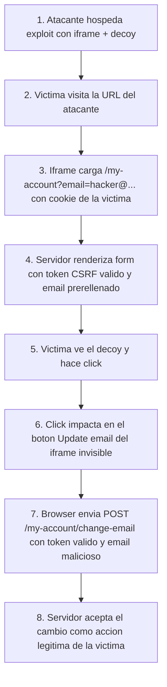

# Writeup: Clickjacking with form input data prefilled from a URL parameter (PortSwigger)

- **Lab**: Clickjacking with form input data prefilled from a URL parameter
- **URL**: https://portswigger.net/web-security/clickjacking/lab-prefilled-form-input
- **Categoría**: Clickjacking -> Form input prefill via URL parameter
- **Dificultad**: Apprentice
- **Credenciales**: `wiener:peter`

---

## 1. Objetivo

El lab tiene un formulario de cambio de email en `/my-account` protegido con un token anti-CSRF. Además, el endpoint acepta un query param `?email=...` que el servidor usa para **prerellenar** el campo `email` del formulario.

Para resolverlo hay que cargar `/my-account?email=hacker@attacker-website.com` en un iframe invisible, superponer un decoy clickable sobre el botón "Update email" y entregar la página al bot víctima. El click engañado dispara el POST con el token legítimo de la víctima y el email controlado por el atacante.

### Lo importante antes de tocar nada

- **Defensa presente**: token anti-CSRF en el form (`csrf=<valor>`).
- **Vector**: `/my-account?email=...` prerellena el input. El atacante controla el `value` del email vía URL.
- **Por qué el CSRF token no ayuda**: el iframe carga la página real con el token real de la víctima. El click engañado envía el form completo, token incluido. El servidor lo acepta porque, desde su perspectiva, fue una acción legítima.
- **Defensa correcta**: cabecera `X-Frame-Options: DENY` o CSP `frame-ancestors 'none'`. No hay token que pueda mitigar este vector.
- **Restricción operacional**: PortSwigger rechaza emails duplicados. Si pruebas el exploit cambiando tu propio email, usa un valor distinto al que pongas en el payload final para la víctima.

---

## 2. Reconocimiento

### 2.1 Confirmar el formulario y su token

Tras login con `wiener:peter`, la página `/my-account` muestra el formulario de cambio de email con un input oculto para el token CSRF:

```html
<form class="login-form" name="change-email-form" action="/my-account/change-email" method="POST">
    <label>Email</label>
    <input required type="email" name="email" value="wiener@normal-user.net">
    <input required type="hidden" name="csrf" value="TOKEN_AQUI">
    <button class="button" type="submit">Update email</button>
</form>
```

### 2.2 Confirmar el prefill por URL

Navegando a `/my-account?email=test@test.com`, el servidor renderiza el form con `value="test@test.com"` en el input de email. Esto confirma que el atacante puede controlar el valor enviado sin necesidad de inyectar JavaScript ni de leer la respuesta.

```html
<input required type="email" name="email" value="test@test.com">
```

### 2.3 Por qué un CSRF clásico no aplica y por qué clickjacking sí

Un PoC de CSRF puro fallaría porque el token de la víctima no es predecible desde fuera del origen. Y un XSS no es viable aquí porque el servidor escapa el valor en el HTML.

Clickjacking no necesita ninguna de las dos cosas:

- No fabrica la request: la **víctima la fabrica** desde su propio navegador.
- No lee el token: el navegador de la víctima lo incluye automáticamente al enviar el form.
- Solo necesita que la víctima haga **un click** en una zona engañada.

---

## 3. Diseño del ataque

### Componentes

1. **Iframe** apuntando a `/my-account?email=hacker@attacker-website.com`. Se carga con la sesión de la víctima, así que muestra su propio token CSRF dentro del HTML.
2. **Decoy** (`<div>Click me</div>`) posicionado en pantalla justo encima del botón "Update email" del iframe.
3. **Iframe casi invisible** (`opacity: 0.0001`) y por encima del decoy en el stacking (`z-index: 2`). El usuario ve el decoy, pero el click cae en el botón del iframe.

### Payload

```html
<style>
  iframe {
    position: relative;
    width: 500px;
    height: 700px;
    opacity: 0.0001;
    z-index: 2;
  }
  div {
    position: absolute;
    top: 400px;
    left: 80px;
    z-index: 1;
  }
</style>
<div>Click me</div>
<iframe src="https://LAB.web-security-academy.net/my-account?email=hacker@attacker-website.com"></iframe>
```

### Notas sobre los valores

- `width: 500px; height: 700px`: dimensiones que dejan el botón "Update email" en una coordenada predecible dentro del iframe.
- `top: 400px; left: 80px` para el decoy: alinean con el botón en el viewport del bot víctima de PortSwigger.
- `opacity: 0.0001`: el iframe es funcionalmente invisible pero recibe los clicks. Con `opacity: 0` algunos navegadores omiten el evento; con `0.0001` se garantiza el hit.
- `z-index`: el iframe debe quedar **encima** del decoy (`z-index: 2` vs `1`) para que el click impacte en el botón, no en el `<div>`.

---

## 4. Por qué funciona

### 4.1 El token anti-CSRF se respeta, no se rompe

A diferencia de un bypass via XSS, aquí el token nunca se intercepta ni se reemplaza. El servidor renderiza el token correcto para la sesión de la víctima dentro del iframe. Cuando la víctima hace submit, el token viaja con su valor legítimo. El servidor pasa la validación porque, técnicamente, **fue la víctima quien envió el form**.

El modelo de amenaza del token CSRF asume que el atacante no puede hacer que la víctima envíe el form. Clickjacking rompe esa asunción engañándola visualmente.

### 4.2 El prefill por URL elimina la única pieza que faltaba

Sin el query param `?email=...`, el atacante necesitaría que la víctima además **escribiera** el email malicioso. Con el prefill, el campo ya viene cargado con el valor del atacante; la víctima solo aporta el click. La cadena se reduce a un único acto de la víctima, lo que dispara la tasa de éxito.

### 4.3 El navegador adjunta la cookie de sesión sin importar el origen del frame padre

El iframe carga `/my-account` desde el mismo origen que el lab, así que el navegador adjunta la cookie de sesión `wiener` automáticamente. La página externa (exploit server) no tiene acceso al DOM del iframe (Same-Origin Policy lo impide), pero **sí puede superponer elementos por encima**. Eso basta.

---

## 5. Resolución

1. Login en el lab con `wiener:peter`. Verificar en `/my-account` que existe el formulario "Update email" y que `/my-account?email=test@test.com` prerellena el input.
2. En el exploit server, pegar el HTML del exploit reemplazando `LAB.web-security-academy.net` por el host real.
3. **No** hacer click manual sobre el decoy en "View exploit". Si necesitas verificar alineación, sube `opacity: 0.1` para ver el iframe debajo, ajusta `top`/`left` si los pixeles oficiales no encajan en tu lab, y vuelve a `0.0001`. Click manual **no** resuelve el lab y consume el email.
4. Pulsar **Deliver exploit to victim**. El bot abre tu URL, hace un click sobre el decoy, el iframe procesa el POST con el token de la víctima y el email controlado por el atacante.
5. El lab marca como Solved.


Si tras "Deliver" el lab no se resuelve:

- El email del payload ya estaba en uso. Cambiarlo por otro único.
- Los pixeles del decoy no caen sobre el botón en el viewport del bot. Subir `opacity` a `0.1` solo para ver, ajustar, y volver a entregar.
- El iframe no carga la sesión: confirmar la URL del iframe y que `?email=...` se renderiza en el HTML servido.

---

## 6. Resumen de la cadena



Tres ideas para llevarse:

1. **CSRF token no protege contra clickjacking**. El token defiende el origen de la request, no el origen del click. Si la víctima envía el form ella misma, el token siempre es válido.
2. **El atacante no necesita controlar JavaScript en el origen víctima**. Solo necesita superponer DOM externo encima de un iframe. La SOP impide leer el iframe pero no impide cubrirlo.
3. **El viewport del bot manda**. Confiar en alineación visual de tu propio navegador es engañoso; los valores oficiales están calibrados para el viewport del headless del bot.

---

## 7. Contramedidas

Defensas en orden de robustez:

1. **`Content-Security-Policy: frame-ancestors 'none'`** (o `'self'` si se necesita iframear desde el propio origen). Es el control moderno y recomendado: el navegador rechaza cargar la página dentro de un iframe cross-origin antes incluso de renderizar.
2. **`X-Frame-Options: DENY`** (o `SAMEORIGIN`). Cabecera legacy, sigue funcionando en navegadores. Mantenerla por compatibilidad junto a `frame-ancestors`.
3. **No aceptar valores sensibles vía query string**. El prefill via `?email=` es el habilitador clave de este lab. Para acciones que cambian estado, ignorar parámetros GET y exigir que el valor venga del POST.
4. **Reautenticación para cambios críticos**. Pedir contraseña antes de cambiar email/contraseña/transferir fondos limita el impacto incluso si la página es framable.
5. **Frame buster JavaScript**. Patrón legacy (`if (top !== self) top.location = self.location`). Evitable con `sandbox` en el iframe; no sustituye a las cabeceras HTTP.
6. **Tokens anti-CSRF bien implementados**. Imprescindibles contra CSRF puro. La lección de este lab es que **no son suficientes** sin defensa contra framing.

---

## 8. Referencias

- PortSwigger Web Security Academy. (s.f.). *Lab: Clickjacking with form input data prefilled from a URL parameter*. https://portswigger.net/web-security/clickjacking/lab-prefilled-form-input
- PortSwigger Web Security Academy. (s.f.). *Clickjacking (UI redressing)*. https://portswigger.net/web-security/clickjacking
- OWASP Foundation. (s.f.). *Clickjacking Defense Cheat Sheet*. https://cheatsheetseries.owasp.org/cheatsheets/Clickjacking_Defense_Cheat_Sheet.html
- MDN Web Docs. (s.f.). *CSP: frame-ancestors*. https://developer.mozilla.org/en-US/docs/Web/HTTP/Headers/Content-Security-Policy/frame-ancestors
- MDN Web Docs. (s.f.). *X-Frame-Options*. https://developer.mozilla.org/en-US/docs/Web/HTTP/Headers/X-Frame-Options
- Inventario interno: [`inventario/03-analisis-vulnerabilidades/web/analisis-seguridad-cabeceras.md`](../../../inventario/03-analisis-vulnerabilidades/web/analisis-seguridad-cabeceras.md)
- Inventario interno: [`inventario/03-analisis-vulnerabilidades/web/analisis-csrf.md`](../../../inventario/03-analisis-vulnerabilidades/web/analisis-csrf.md)
