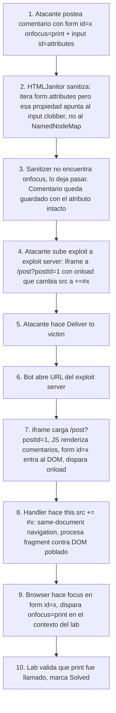

# Writeup: Clobbering DOM attributes to bypass HTML filters (PortSwigger)

- **Lab**: Clobbering DOM attributes to bypass HTML filters
- **URL**: https://portswigger.net/web-security/dom-based/dom-clobbering/lab-dom-clobbering-attributes-to-bypass-html-filters
- **Categoría**: DOM-based vulnerabilities -> DOM clobbering (segundo capítulo: clobbering contra el sanitizer)
- **Dificultad**: Practitioner
- **Credenciales**: no requiere login

---

## 1. Objetivo

Ejecutar `print()` en el navegador de la víctima (bot) postando un comentario en el blog. La aplicación sanitiza HTML user-generated con **HTMLJanitor**, una librería que filtra atributos peligrosos (`onfocus`, `onclick`, etc.) recorriendo `element.attributes`. El lab demuestra que ese recorrido es **clobbereable** desde el propio HTML que se intenta sanitizar: si el form contiene un hijo `<input id=attributes>`, la propiedad `form.attributes` deja de apuntar al `NamedNodeMap` y pasa a apuntar al input. HTMLJanitor itera "atributos" que ya no son atributos, no encuentra `onfocus`, lo deja pasar, y el navegador acaba ejecutándolo cuando el form recibe focus por la URL `#x`.

### Lo importante antes de tocar nada

- **HTMLJanitor != DOMPurify**. Este lab usa otro sanitizer, vulnerable a clobbering del propio DOM API. DOMPurify (lab anterior de la serie) no tiene este bug.
- **El clobbering no apunta a variables del JS de la app, apunta al DOM API que usa el sanitizer**. Atacas la defensa, no la lógica.
- **Necesitas exploit server**. El lab valida que `print()` se ejecute en el navegador del bot tras "Deliver to victim". Postear el comentario y visitar el post tú mismo no resuelve.
- **Race condition**: los comentarios cargan async tras el HTML inicial. Un redirect top-level con `#x` falla porque el fragment se procesa antes de que el form exista en el DOM.

---

## 2. Diferencia con el lab "Exploiting DOM clobbering to enable XSS"

Este es el **segundo capítulo** de DOM clobbering en PortSwigger. La técnica del primero y la del segundo se ven parecidas (ambas inyectan HTML benigno con `id`/`name`) pero atacan capas distintas:

| Aspecto | DOM clobbering #1 (`dom-xss-exploiting-dom-clobbering`) | DOM clobbering #2 (este lab) |
|---|---|---|
| Qué clobbereas | Variables del JS de la app (`window.defaultAvatar`) | Propiedades de la DOM API (`form.attributes`) |
| A quién engañas | Al **código** de la aplicación | Al **sanitizer** que debía protegerte |
| Sanitizer | DOMPurify (correcto, no es su culpa) | HTMLJanitor (vulnerable, esto es un bug del sanitizer) |
| Habilitador | Patrón `window.X || default` en el código víctima | Iteración `for (...of element.attributes)` en el sanitizer |
| Defensa correcta | Declarar `const` sin pasar por `window` | Cambiar de sanitizer (DOMPurify) o usar APIs no clobbereables |

La lección operacional: **DOM clobbering puede atacar tanto la lógica de la app como las defensas que confían en propiedades del DOM**. Si tu sanitizer enumera atributos vía `node.attributes`, considera que ese acceso es manipulable cuando `node` es un `<form>` con hijos nombrados.

---

## 3. Reconocimiento

### 3.1 Confirmar el sanitizer

Postear un comentario simple para ver qué sobrevive:

```html
<a id=test onclick="alert(1)">hi</a>
```

Tras submit, inspeccionar el HTML renderizado del comentario. HTMLJanitor borra `onclick` (atributo deny-listed) pero deja el `<a>` y el `id`. Comportamiento esperado de cualquier sanitizer razonable.

### 3.2 Observar named access en `<form>`

En la consola, en cualquier página:

```js
document.body.innerHTML = '<form><input name=attributes></form>';
const f = document.querySelector('form');
console.log(f.attributes);  // <input name=attributes>, no NamedNodeMap
console.log(f.attributes instanceof NamedNodeMap);  // false
```

`HTMLFormElement` expone sus controles hijos como propiedades nombradas (similar al "named access on the Window object" pero acotado al form). Cuando el nombre colisiona con una propiedad nativa heredada de `Element` (como `attributes`), **el clobber gana** sobre la propiedad nativa: la lookup encuentra la propiedad propia del form (el input nombrado) antes de subir por la cadena de prototipos al getter de `Element.prototype.attributes`.

### 3.3 Mapear esto al sanitizer

HTMLJanitor (simplificado) hace algo equivalente a:

```js
function clean(node) {
  for (const attr of node.attributes) {
    if (!isAllowed(attr.name)) {
      node.removeAttribute(attr.name);
    }
  }
  for (const child of node.children) clean(child);
}
```

Si `node` es un `<form>` y tiene un hijo `<input id=attributes>` o `<input name=attributes>`, la línea `for (const attr of node.attributes)` ya no enumera el `NamedNodeMap`; intenta iterar sobre un `HTMLInputElement`. El `for...of` sobre un elemento individual no produce los atributos del form, así que **`onfocus` nunca se evalúa contra `isAllowed` y nunca se borra**.

---

## 4. Diseño del ataque

### 4.1 Payload del comentario

```html
<form id=x tabindex=1 onfocus=print()><input id=attributes>
```

Diseccionando:

- **`<form id=x ...>`**: el `id=x` permite que `https://LAB.../post?postId=1#x` haga focus automático sobre el form. `tabindex=1` lo vuelve focusable (sin tabindex, `<form>` no es focusable y el fragment no aplica focus).
- **`onfocus=print()`**: el atributo malicioso. El bypass del sanitizer hace que sobreviva.
- **`<input id=attributes>`**: el clobbering. Como hijo del form con `id=attributes` (también funciona con `name=attributes`), `form.attributes` apunta al input en lugar del `NamedNodeMap` real. HTMLJanitor itera basura, no detecta `onfocus`.

Variantes equivalentes:
```html
<form id=x tabindex=1 onfocus=print()><input name=attributes>
```

### 4.2 Por qué `onfocus` y `print()` y no otra combinación

- **`onfocus`**: PortSwigger calibra para que el focus dispare automáticamente vía URL fragment. `onclick` requeriría que la víctima haga click; `onmouseover` requeriría movimiento. `onfocus` con un fragment matching es 100% automático.
- **`print()`**: el lab valida específicamente que se invoque `print`. `alert(1)` no resuelve este lab. (Los labs de DOM XSS de la serie alternan entre `print` y `alert` según calibración interna.)

### 4.3 Por qué el redirect top-level falla y el iframe funciona

Aquí está el detalle más educativo del lab. Hay dos formas obvias de entregar la URL al bot, y solo una funciona.

**Forma incorrecta (intuitiva pero falla)**:
```html
<script>location = "https://LAB.../post?postId=1#x";</script>
```

Cadena en el bot:
1. Bot navega top-level a `/post?postId=1#x`.
2. Llega el HTML inicial. El browser procesa el fragment `#x`: busca `id=x` en el DOM **en ese momento**.
3. **Los comentarios todavía no están**. El blog los carga vía JS async después del initial HTML.
4. Browser no encuentra `id=x`, no aplica focus, descarta el fragment.
5. Segundos después, el JS termina de cargar comentarios. El form `id=x` aparece en el DOM. Pero el fragment ya se descartó; nadie le dice al browser "reaplica el focus al matching del hash".
6. `onfocus` nunca dispara, `print()` nunca se invoca, lab no resuelto.

Tú al hacerlo manual con `#x` puede que lo veas funcionar porque tu caché caliente cambia el orden de carga, o porque hiciste F5 con el `#x` ya pegado y el browser reaplica focus al refresh tardío. El bot navega cold, pierde la carrera consistentemente.

**Forma correcta (iframe con re-navegación al fragment)**:
```html
<iframe src="https://LAB.../post?postId=1" onload="if(!window.x){window.x=1;this.src+='#x'}"></iframe>
```

Cadena en el bot:
1. Bot abre la URL del exploit server.
2. El exploit server sirve esta página. Se carga un iframe apuntando a `/post?postId=1` **sin fragment**.
3. El iframe carga normalmente: HTML inicial → JS async → comentarios renderizados → form `id=x` en el DOM. Cuando el documento del iframe termina de cargar (evento `load`), el `onload` del elemento iframe en el padre dispara.
4. El handler ejecuta `this.src += '#x'`. Como la URL nueva difiere de la actual **solo en el fragment**, esto es **same-document navigation**: no se vuelve a hacer fetch, el browser solo procesa el fragment **contra el DOM ya poblado**.
5. `id=x` ahora sí existe. Browser aplica focus al `<form>`. `onfocus=print()` dispara.
6. `window.x = 1` se setea para que el segundo `onload` (provocado por el cambio de src) no haga otro `+= '#x'` y entre en loop.

El iframe también **preserva el contexto del exploit server**: el JS del padre orquesta la navegación interna del frame en dos fases. Un redirect top-level deja al exploit server fuera de la ecuación tras el primer salto.

### 4.4 Por qué SOP no impide el truco

El iframe es cross-origin (exploit server vs lab). La Same-Origin Policy impide:
- Leer el DOM del iframe.
- Leer cookies del iframe.
- Leer el contenido de `iframe.contentDocument`.

Pero NO impide:
- Setear `iframe.src` desde el padre (eso es navegación, no acceso).
- Escuchar el evento `load` del **elemento** iframe en el padre (ese evento es del padre, no del documento dentro del iframe).

Esas dos primitivas (cambiar src + saber cuándo cargó) son suficientes para orquestar el ataque sin necesidad de leer nada del lab.

---

## 5. Por qué funciona

### 5.1 Named access en formularios sobreescribe propiedades de prototipo

Cuando JS evalúa `form.attributes`:

1. Lookup en propiedades **propias** de `form`. Por named access, los hijos con `id`/`name` están registrados como propiedades propias del form. Si hay `<input id=attributes>`, encuentra el input.
2. (Nunca llega al getter `Element.prototype.attributes` porque ya resolvió en el paso 1.)

Esto es por diseño del estándar HTML: los `HTMLFormElement` exponen sus controles como named properties para que código legacy como `form.username.value` funcione. La consecuencia: cualquier nombre que coincida con un miembro nativo del form/element queda **shadowed** y vulnerable.

Otros nombres clobbereables similares en `<form>`:
- `attributes` (este lab).
- `lookupNamespaceURI`, `cloneNode`, `appendChild` — métodos heredados, también shadow-eable, pero el sanitizer no los llama típicamente.
- `elements`, `length` — propiedades del propio form, también shadow-eable; rara vez critical.

### 5.2 HTMLJanitor confía en `node.attributes` sin verificar tipo

HTMLJanitor itera con `for...of` o equivalentes asumiendo que el resultado es un `NamedNodeMap` iterable. No verifica `node.attributes instanceof NamedNodeMap`. Si verificara, descartaría el clobber: `<input>` no es `NamedNodeMap`. La fix correcta del sanitizer es leer atributos vía una API no clobbereable, por ejemplo `Array.from(Element.prototype.attributes.call(node))` o usar `node.getAttributeNames()`.

DOMPurify, por comparación, opera sobre nodos parseados con sus propias estructuras de datos internas y no expone `node.attributes` al consumer; eso lo inmuniza contra este vector específico.

### 5.3 Same-document navigation por cambio de fragment

La especificación HTML define que cuando el browser navega de URL A a URL B y solo difieren en el fragment (`location.hash`), no hay nuevo fetch ni re-creación del document; solo:
1. Update del URL en la barra (o `location.href`).
2. Trigger del evento `hashchange`.
3. Scroll/focus al elemento con `id` matching el hash.

En iframes, eso aplica igual. Por eso `iframe.src += '#x'` no recarga el iframe: el browser detecta el match de URL salvo fragment y hace la navegación liviana. El `onload` se dispara igualmente cuando el browser resuelve la navegación, lo cual permite usar el flag `window.x` para evitar loop.

---

## 6. Resolución

1. Visitar `/post?postId=1`. En el form de comentarios, en el campo "Comment", pegar:
   ```html
   <a><form id=x tabindex=1 onfocus=print()><input id=attributes>
   ```
   Submit. Verificar en DevTools que el HTML del comentario renderizado mantiene `onfocus="print()"` (eso confirma que HTMLJanitor lo dejó pasar gracias al clobbering).
2. En el exploit server, body:
   ```html
   <iframe src="https://LAB.web-security-academy.net/post?postId=1" onload="if(!window.x){window.x=1;this.src+='#x'}"></iframe>
   ```
   Reemplazar `LAB` por el subdominio real.
3. Store. Click "View exploit" para verificar manualmente: tu propio navegador debería abrir el diálogo de impresión del lab dentro del iframe. (Si no abre, revisar paso 1.)
4. Click **Deliver exploit to victim**.
5. Lab marcado como Solved.

Si tras "Deliver" no resuelve:

- **HTMLJanitor borró `onfocus`**: el clobbering no aplicó. Verificar que el comentario tiene `<input id=attributes>` como hijo del `<form>`. Si HTMLJanitor reordena o quita estructura, ajustar el orden del payload o usar `name=attributes` en lugar de `id`.
- **Exploit funciona en tu browser pero no en el bot**: revisar que la URL del iframe es la correcta y que el comentario está en `postId=1` (el lab usa el primer post). Si posteaste en otro postId, ajustar la URL del iframe.
- **Exploit redirect top-level en lugar de iframe**: pierdes con la race condition. Volver al iframe.

---

## 7. Resumen de la cadena



Tres ideas para llevarse:

1. **DOM clobbering puede atacar el sanitizer, no solo la app**. Si tu sanitizer enumera vía `node.attributes` o cualquier propiedad clobbereable de elementos HTML, es bypasseable con un hijo nombrado adecuadamente. La fix correcta es no confiar en propiedades de prototipo cuando el `this` es manipulable; usar APIs estáticas (`Element.prototype.getAttribute.call(node, 'foo')`) o sanitizers que operen sobre representaciones internas (DOMPurify).
2. **Race conditions con fragment focus son habituales en SPAs y blogs con contenido async**. Cualquier exploit de XSS que dependa de auto-focus por hash falla si el target se carga después del initial HTML. La solución genérica es la del iframe: cargar primero, navegar al fragment después.
3. **El exploit server no es ceremonia, es una primitiva ejecutable**. El bot solo navega a la URL que le entregas; tienes que orquestar la cadena completa desde ese único punto de entrada. Pensar el ataque como "qué pasa cuando el bot abre cold mi URL" elimina toda la confusión sobre por qué algo que funciona local falla con el bot.

---

## 8. Contramedidas

Defensas en orden de robustez:

1. **Usar DOMPurify en lugar de HTMLJanitor**. Es la fix de raíz. DOMPurify opera sobre representaciones internas que no exponen `node.attributes` al loop de sanitización; el clobbering no lo afecta. Mantener HTMLJanitor con parches es perseguir variantes (después de `attributes` viene cualquier otra propiedad shadow-eable).
2. **Si por alguna razón mantienes HTMLJanitor, usar APIs no clobbereables para enumerar atributos**:
   ```js
   const attrs = Array.prototype.map.call(
       Element.prototype.getAttributeNames.call(node),
       name => ({ name, value: Element.prototype.getAttribute.call(node, name) })
   );
   ```
   Verboso pero invulnerable a named access shadowing. La clave es **nunca acceder a propiedades del nodo vía dot notation** durante la sanitización; siempre vía `Object.getPrototypeOf(...).name.call(node, ...)`.
3. **CSP con `script-src` estricto que prohíba inline event handlers**. Una CSP `script-src 'self'` sin `'unsafe-inline'` rompe `onfocus=print()` porque el navegador no ejecuta event handlers inline. No detiene el clobbering en sí (HTML estático sigue colándose), pero sí detiene el último paso de ejecución.
4. **Trusted Types** en sinks de HTML. Obliga a que el HTML pase por una policy validadora. Aunque el sanitizer falle, una policy bien escrita rechaza output sospechoso.
5. **Aislar contenido user-generated en iframes sandboxed**. `<iframe sandbox srcdoc="...">` con `allow-scripts` no, deja el comentario en un origen distinto donde un `print()` no afecta al lab principal. Defensa más arquitectural pero efectiva contra clases enteras de bypass.
6. **Validar `instanceof NamedNodeMap`** antes de iterar. Mitigación tactical: una línea defensiva al inicio del loop. No fix de raíz, pero corta este vector específico.

---

## 9. Referencias

- PortSwigger Web Security Academy. (s.f.). *Lab: Clobbering DOM attributes to bypass HTML filters*. https://portswigger.net/web-security/dom-based/dom-clobbering/lab-dom-clobbering-attributes-to-bypass-html-filters
- PortSwigger Web Security Academy. (s.f.). *DOM clobbering*. https://portswigger.net/web-security/dom-based/dom-clobbering
- Heyes, G. (2020). *DOM Clobbering strikes back*. PortSwigger Research. https://portswigger.net/research/dom-clobbering-strikes-back
- HTML Living Standard. (s.f.). *The form element / Named access*. https://html.spec.whatwg.org/multipage/forms.html#the-form-element
- HTML Living Standard. (s.f.). *Navigating to a fragment*. https://html.spec.whatwg.org/multipage/browsing-the-web.html#scroll-to-fragid
- DOMPurify. (s.f.). *Why DOMPurify*. https://github.com/cure53/DOMPurify
- HTMLJanitor. (s.f.). *Source*. https://github.com/guardian/html-janitor
- W3C. (s.f.). *Trusted Types*. https://www.w3.org/TR/trusted-types/
- Writeup hermano: [`learning/portswigger/dom-xss-exploiting-dom-clobbering/writeup.md`](../dom-xss-exploiting-dom-clobbering/writeup.md)
- Inventario interno: [`inventario/03-analisis-vulnerabilidades/web/analisis-xss.md`](../../../inventario/03-analisis-vulnerabilidades/web/analisis-xss.md)
- Inventario interno: [`inventario/04-explotacion/web/explotacion-xss.md`](../../../inventario/04-explotacion/web/explotacion-xss.md)
