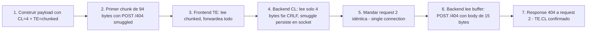

# Writeup: HTTP request smuggling, confirming a TE.CL vulnerability via differential responses (PortSwigger)

- **Lab**: HTTP request smuggling, confirming a TE.CL vulnerability via differential responses
- **URL**: https://portswigger.net/web-security/request-smuggling/finding/lab-confirming-te-cl-via-differential-responses
- **Categoría**: HTTP Request Smuggling / TE.CL desync / Detection
- **Dificultad**: Practitioner

---

## 1. Objetivo

Confirmar que el sitio tiene desincronización TE.CL: front-end usa `Transfer-Encoding: chunked`, back-end usa `Content-Length`. Variante invertida del lab CL.TE: ahora el front-end es el que respeta TE y el back-end el que prioriza CL. La confirmación se hace observando que la segunda request en una secuencia recibe un 404 (response al smuggled `POST /404`) cuando debería ser 200.

Payload final (HTTP/1.1, Update-Content-Length desactivado, Send group in sequence single connection):

```http
POST / HTTP/1.1
Host: 0a900048030e368182c6421600f000fa.web-security-academy.net
Content-Type: application/x-www-form-urlencoded
Content-Length: 4
Transfer-Encoding: chunked

5e
POST /404 HTTP/1.1
Content-Type: application/x-www-form-urlencoded
Content-Length: 15

x=1
0


```

Mandar dos veces seguidas: primera response 200 OK (home), segunda response **404 Not Found** = TE.CL confirmado.

### Insight central

**El chunk size en hexadecimal debe coincidir byte-perfect con el contenido del chunk**. Cualquier modificación al payload (un cambio de path, un header extra, un espacio) requiere recontar bytes y re-encodear en hex. Es la fragilidad estructural de los payloads de smuggling — copy-paste de payloads de internet sin recálculo es la causa más común de "no funciona pero no sé por qué".

---

## 2. Recon y resolución

### 2.1 Setup de Burp (idéntico al lab CL.TE)

1. Capturar un POST cualquiera, mandar al Repeater.
2. Downgrade a HTTP/1.1 (HTTP/2 binariza el body, no permite ambigüedad TE/CL).
3. Settings del Repeater → desmarcar "Update Content-Length".
4. Send group → cambiar al modo **"Send group in sequence (single connection)"**. Crítico: con "parallel" o "separate connections", los bytes smuggled de la primera request no llegan al socket de la segunda.

### 2.2 Primer intento fallido: payload con `GPOST` y chunk size `5c`

Inicialmente probé un payload genérico de TE.CL distinto al oficial:

```
5c
GPOST / HTTP/1.1
Content-Type: application/x-www-form-urlencoded
Content-Length: 15

x=1
0


```

Conteo del chunk con `GPOST / HTTP/1.1` (16 chars en línea de método):

| Línea | Bytes |
|-------|-------|
| `GPOST / HTTP/1.1\r\n` | 18 |
| `Content-Type: application/x-www-form-urlencoded\r\n` | 49 (67) |
| `Content-Length: 15\r\n` | 20 (87) |
| `\r\n` | 2 (89) |
| `x=1` | 3 (92) |

Total: 92 bytes = `5c` hex.

Resultado: primera request 200 normal, segunda con "Connection closed during request sequence". El backend procesó el smuggled `GPOST` (método inválido), cerró el socket, Burp no pudo leer una response coherente para la segunda. **Pero el lab no se marcó solved**.

Diagnóstico: PortSwigger detecta el lab solved específicamente cuando ve un **404 response** correspondiente a un path inexistente. `GPOST /` produce error de método (4xx) pero no 404 a un path. El método inválido confunde el parser pero no satisface la heurística de detección del lab.

### 2.3 Solución correcta: `POST /404` y chunk size `5e`

La solución oficial usa `POST /404`:

| Línea | Bytes |
|-------|-------|
| `POST /404 HTTP/1.1\r\n` | 20 |
| `Content-Type: application/x-www-form-urlencoded\r\n` | 49 (69) |
| `Content-Length: 15\r\n` | 20 (89) |
| `\r\n` | 2 (91) |
| `x=1` | 3 (94) |

Total: 94 bytes = `5e` hex.

Cambios respecto al payload fallido:

- Línea de método: `GPOST /` → `POST /404` (+2 bytes).
- Chunk size: `5c` → `5e` (recalcular hex obligatorio).

Send group en sequence (single connection). Primera response: `200 OK` (home normal). Segunda response: `404 Not Found`. Lab solved.

### 2.4 Por qué `GPOST` y `POST /404` se comportan distinto

**Con `GPOST /`**: el backend lee el smuggled prefix, intenta parsear `GPOST` como método HTTP. Métodos no estándar dependen del parser:

- Algunos backends rechazan inmediatamente con 405 Method Not Allowed.
- Otros aceptan métodos arbitrarios y pasan a routing → 404 si no hay handler.
- Otros cierran la conexión por protocol violation.

El lab de PortSwigger detecta vía status 404 a un path. `GPOST /` puede dar 405/400/connection close — variable según implementación. La detección del lab no matchea esos.

**Con `POST /404`**: método estándar, path inexistente. El backend rutea normalmente y devuelve 404. Resultado predecible y matcheable por la heurística del lab.

Lección: cuando un payload genérico de internet "debería funcionar pero no", chequear que la heurística de detección del lab matchee la response esperada. Cada variante de bug puede pasar el test conceptual pero fallar el test específico que el lab implementa.

---

## 3. Por qué funciona

### 3.1 Anatomía del bug TE.CL

Cliente → Front-end (TE chunked) → Back-end (CL=4), conexión TCP keep-alive.

Bytes que el cliente manda:

```
[headers]\r\n\r\n5e\r\nPOST /404 HTTP/1.1\r\n[chunked-content...]\r\nx=1\r\n0\r\n\r\n
                  ↑ chunk size       ↑ 94 bytes de chunk content    ↑ chunk terminator
```

**Frontend (lee TE=chunked)**:

- Parsea `5e\r\n` → chunk size 94.
- Lee 94 bytes de chunk data: `POST /404 HTTP/1.1\r\nContent-Type: application/x-www-form-urlencoded\r\nContent-Length: 15\r\n\r\nx=1`.
- Lee `\r\n` → separador entre chunks.
- Parsea `0\r\n` → chunk size 0 → fin del body.
- Lee `\r\n` → terminator.
- Considera la request completa, forwardea TODO al backend.

**Backend (lee CL=4)**:

- Lee 4 bytes del body: `5e\r\n` (los caracteres `5`, `e`, `\r`, `\n`).
- Considera la request completa después de 4 bytes.
- Responde a `POST /` con 200 OK.
- Bytes restantes en buffer del socket: `POST /404 HTTP/1.1\r\nContent-Type: application/x-www-form-urlencoded\r\nContent-Length: 15\r\n\r\nx=1\r\n0\r\n\r\n`.

**Cliente manda request 2**: idéntica a la 1. Frontend la parsea bien y forwardea al backend.

**Backend lee desde el buffer pre-existente**:

```
POST /404 HTTP/1.1\r\n
Content-Type: application/x-www-form-urlencoded\r\n
Content-Length: 15\r\n
\r\n
x=1\r\n0\r\n\r\nPOS  ← 15 bytes de body (CL=15), incluye inicio de la request 2
T / HTTP/1.1\r\n...   ← lo que queda de request 2 queda como bytes residuales
```

Backend procesa **POST /404** con esos 15 bytes de body. Responde **404 Not Found**. Esa es la response que el cliente ve para su request 2.

Los bytes residuales (`T / HTTP/1.1...`) quedan en el buffer del socket. El backend, al esperar la siguiente request, lee `T / HTTP/1.1\r\n...` que es malformado → cierra el socket o responde 4xx. Por eso a veces aparece "Connection closed" después de la response 404 — es el cleanup de los bytes huérfanos.

### 3.2 Diferencia operacional CL.TE vs TE.CL

| Aspecto | CL.TE | TE.CL |
|---------|-------|-------|
| Frontend prioriza | Content-Length | Transfer-Encoding |
| Backend prioriza | Transfer-Encoding | Content-Length |
| Bytes "smuggled" | Sobrantes después que backend ve `0\r\n\r\n` | Bytes después de los primeros CL del frontend |
| Construcción del payload | CL grande (bytes a forwardear); body con `0\r\n\r\nGET /malicious...` | CL chico (4); chunked normal con malicious request como contenido del primer chunk |
| Fragilidad | Conteo del CL grande | Conteo del chunk size en hex |
| Detección típica | 404 en segunda response (smuggled `GET /404`) | 404 en segunda response (smuggled `POST /404`) |

Conceptualmente son inversas. La "magia" en CL.TE es que el chunked terminator (`0\r\n\r\n`) hace que el backend pare antes que el frontend. La "magia" en TE.CL es que el CL chico hace que el backend pare antes que el frontend procese el chunk.

### 3.3 ¿Por qué el chunk size en hex es el byte más frágil?

Es el único campo del payload que **debe ser exactamente coherente con el conteo de los demás bytes**. Todos los otros bytes (headers, body content) son texto que el atacante elige libremente. El chunk size es metadata calculada.

Errores comunes:

1. **Modificar el path o headers internos** (ej. cambiar `Content-Length: 15` a `Content-Length: 20`) sin recalcular el chunk size.
2. **Burp normaliza espacios** (un espacio extra después de `:` en un header) → cambia el byte count.
3. **CRLF al final del último chunk content** (después de `x=1`) → si lo incluís en el conteo o no, cambia 2 bytes.
4. **Copy-paste con el editor del Repeater** que a veces convierte CRLF a LF → si el server espera CRLF (todos los HTTP servers serios), el byte count cambia.

Defensa operacional al construir payloads:

- Construir el payload primero, contar el chunk size después.
- Burp Suite tiene una extensión "HTTP Request Smuggler" que calcula automáticamente.
- Para payloads escritos a mano, contar dos veces y verificar con `wc -c` sobre el chunk extraído.

### 3.4 ¿Por qué este lab es Practitioner pese a ser solo "detección"?

Mismas razones que CL.TE:

- Conocimiento HTTP a nivel de bytes (CRLF, chunked encoding, keep-alive).
- Tooling especializado (Burp Repeater, no curl).
- Modelo mental de dos servidores con parsers distintos.
- Detección indirecta vía siguiente request en el socket.

Específico de TE.CL: dificultad adicional del **chunk size en hex**. CL.TE no tiene esta fragilidad porque el "chunk" es solo `0\r\n\r\n` (chunk size cero, no se calcula nada). TE.CL requiere aritmética hex correcta.

### 3.5 Defensa correcta

Mismas defensas que CL.TE (HTTP/2 entre frontend-backend, sin keep-alive, parser estricto, same-software). Una específica de TE.CL:

- **Frontend que normalice o rechace TE+CL conflictivos**: si el frontend ve `Transfer-Encoding: chunked` y `Content-Length` en la misma request, el comportamiento más seguro es responder 400, no normalizar. Apache 2.4+ y Nginx con módulos modernos lo hacen por default. Los frontends antiguos o configs tolerantes son los vulnerables.

- **Backend que rechace requests con `Content-Length` sospechosamente chico**: un POST con CL=4 y body con contenido binario que parece chunked (`5e\r\nPOST...`) es anomalía. Heurísticas conservadoras pueden rechazarlo. No es defensa primaria — la primaria es el parsing consistente.

---

## 4. Resumen



Tres ideas:

1. **El chunk size en hex es el byte más frágil del payload**. Cualquier cambio en el contenido del chunk requiere recalcular. La única fuente común de "el payload no funciona" en TE.CL es chunk size desactualizado tras modificar el contenido. Operacionalmente: contar dos veces, verificar con tool externo, no copy-paste payloads sin recálculo.
2. **CL.TE y TE.CL son inversos pero tienen la misma forma de detección**: ambos producen 404 en la segunda request cuando el smuggled prefix es `[METHOD] /404`. Diferencia: en CL.TE el smuggled va después del chunked terminator; en TE.CL va dentro de un chunk grande con CL chico. Misma señal de salida desde la perspectiva del lab.
3. **Heurísticas de detección de los labs matchean responses específicas, no "cualquier comportamiento raro"**. `GPOST` (método inválido) confunde el backend pero produce 405/connection close, no 404. PortSwigger detecta el lab vía 404, así que un payload conceptualmente correcto pero con response distinta no satisface el lab. Lección: chequear el "indicador de éxito" del lab antes de inventar variantes del payload.

---

## 5. Contramedidas

1. **HTTP/2 entre frontend y backend**: bodies framed binariamente, sin ambigüedad TE/CL. Cierra TE.CL, CL.TE y TE.TE simultáneamente. Defensa estructural por construcción.
2. **Rechazar requests con TE y CL simultáneos en el frontend**: respondiendo 400 Bad Request. RFC 9112 lo permite explícitamente. Apache 2.4+ y Nginx con configs modernas lo hacen por default.
3. **Sin keep-alive entre frontend y backend**: cada request abre conexión nueva. Bytes smuggled no encuentran socket compartido. Costo: latencia + file descriptors.
4. **Backend con parser HTTP estricto**: rechazar `Transfer-Encoding` con valores no estándar, headers duplicados, encodings obfuscados. Implementaciones modernas (Node 18+, Go net/http reciente, Tomcat 10+) lo hacen.
5. **Same-software end-to-end**: si frontend y backend son la misma versión de Nginx/Apache, los parsers son idénticos. Sin gap por construcción. Restringe arquitectura pero elimina TE.CL.
6. **Frontend que rechace `Content-Length` anormalmente chico cuando hay TE=chunked**: heurística conservadora. Una request con `CL: 4` y `TE: chunked` declarando un chunk grande es muy probable que sea exploit. No es defensa primaria, pero suma capa.
7. **WAF con reglas TE.CL específicas**: detectar payloads donde el primer chunk size declarado excede `Content-Length`. Detectar `Content-Length` chico (<10) combinado con `Transfer-Encoding: chunked`. Defensa-en-profundidad.
8. **Tests de regresión con `smuggler.py` o Burp Smuggler en CI**: ejecutar suite de payloads conocidos contra staging pre-deploy. Detecta regresiones cuando el equipo de infra cambia configs de proxy.
9. **Logging y alerting de responses anómalas**: una request POST que recibe 404 a paths inesperados en alta frecuencia es señal de smuggling exitoso en producción. Status code mismatch con paths esperados es el indicador.
10. **Connection: close en respuestas si el frontend detecta length mismatch**: si el frontend ve discrepancia entre lo que cree haber forwardeado y lo que el backend response indica, forzar cierre de conexión. Limita el daño aunque la primera smuggle pase.

---

## 6. Referencias

- PortSwigger Web Security Academy. (s.f.). *Lab: HTTP request smuggling, confirming a TE.CL vulnerability via differential responses*. https://portswigger.net/web-security/request-smuggling/finding/lab-confirming-te-cl-via-differential-responses
- PortSwigger Web Security Academy. (s.f.). *HTTP request smuggling*. https://portswigger.net/web-security/request-smuggling
- PortSwigger Research. (2019). *HTTP Desync Attacks: Request Smuggling Reborn* (James Kettle). https://portswigger.net/research/http-desync-attacks-request-smuggling-reborn
- IETF. (2022). *RFC 9112: HTTP/1.1*. https://datatracker.ietf.org/doc/html/rfc9112 (sección 6.3 Message Body Length)
- IETF. (2014). *RFC 7230: HTTP/1.1 Message Syntax and Routing*. https://datatracker.ietf.org/doc/html/rfc7230 (obsoleta pero aún citada en documentación)
- OWASP Foundation. (s.f.). *HTTP Request Smuggling*. https://owasp.org/www-community/attacks/HTTP_Request_Smuggling
- MITRE Corporation. (2024). *CWE-444: Inconsistent Interpretation of HTTP Requests ('HTTP Request/Response Smuggling')*. https://cwe.mitre.org/data/definitions/444.html
- MITRE Corporation. (2024). *ATT&CK Technique T1190: Exploit Public-Facing Application*. https://attack.mitre.org/techniques/T1190/
- swisskyrepo. (s.f.). *PayloadsAllTheThings — Request Smuggling*. https://github.com/swisskyrepo/PayloadsAllTheThings/tree/master/Request%20Smuggling
- defparam. (s.f.). *smuggler — HTTP Request Smuggling detection tool* [Software]. GitHub. https://github.com/defparam/smuggler
- Stuttard, D., & Pinto, M. (2011). *The Web Application Hacker's Handbook* (2nd ed.). Wiley. Cap. 17 (Attacking Application Architecture).
- Inventario interno: [`inventario/03-analisis-vulnerabilidades/web/analisis-request-smuggling.md`](../../../inventario/03-analisis-vulnerabilidades/web/analisis-request-smuggling.md)
