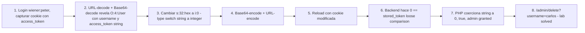

# Writeup: Modifying serialized data types (PortSwigger)

- **Lab**: Modifying serialized data types
- **URL**: https://portswigger.net/web-security/deserialization/exploiting/lab-deserialization-modifying-serialized-data-types
- **Categoría**: Insecure Deserialization / PHP type juggling / Auth bypass via type confusion
- **Dificultad**: Practitioner

---

## 1. Objetivo

La aplicación valida sesiones comparando el `access_token` de la cookie contra un token almacenado en el back-end usando `==` (loose comparison de PHP). Hay que explotar la peculiaridad de type juggling de PHP < 8 donde `0 == "<string-no-numerico>"` evalúa a `true`. Cambiando el access_token de la cookie de string a integer `0`, el back-end nos autentica con privilegios admin sin conocer el token real.

Credenciales: `wiener:peter`. Objetivo: eliminar a `carlos` desde `/admin`.

Cookie original (URL-encoded base64) decodificada:

```
O:4:"User":2:{s:8:"username";s:6:"wiener";s:12:"access_token";s:32:"ojinwrn3917pj2iimrdxdtzbz5mqrwbh4";}
```

Cookie modificada (cambiar solo el access_token):

```
O:4:"User":2:{s:8:"username";s:6:"wiener";s:12:"access_token";i:0;}
```

Reusar como cookie → `/admin` accesible → `/admin/delete?username=carlos`. Lab solved.

### Insight central

**No fue necesario cambiar el username a `administrator` — solo cambiar el access_token de string a integer `0` bastó**. La auth del back-end aparentemente compara access_token contra un valor admin (o contra el token del usuario logueado, depende), y el `==` loose de PHP coerciona el integer `0` para "igualar" cualquier string que no empiece con dígito numérico. La parte sutil es identificar que el bug está en el TIPO, no en el VALOR del token.

---

## 2. Recon y resolución

### 2.1 Login y captura de cookie

POST `/login` con `username=wiener&password=peter`. Response:

```http
Set-Cookie: session=Tzo0OiJVc2VyIjoyOntzOjg6InVzZXJuYW1lIjtzOjY6IndpZW5lciI7czoxMjoiYWNjZXNzX3Rva2VuIjtzOjMyOiJvamlud3JuMzkxN3BqMmlpbXJkeGR0emJ6NW1xcndiaDQiO30%3d
```

### 2.2 Decodificación con Burp Decoder

1. URL-decode → `Tzo0OiJVc2VyIjoyOntzOjg6InVzZXJuYW1lIjtzOjY6IndpZW5lciI7czoxMjoiYWNjZXNzX3Rva2VuIjtzOjMyOiJvamlud3JuMzkxN3BqMmlpbXJkeGR0emJ6NW1xcndiaDQiO30=`
2. Base64-decode → 

```
O:4:"User":2:{s:8:"username";s:6:"wiener";s:12:"access_token";s:32:"ojinwrn3917pj2iimrdxdtzbz5mqrwbh4";}
```

Estructura:
- `username`: string `wiener`
- `access_token`: string de 32 chars (hex random generado para esta sesión).

El access_token es el mecanismo de auth de la cookie. Distinto al lab anterior (que validaba un boolean `admin`), acá el back-end compara este token contra un valor stored.

### 2.3 Modificación: type switch de string a integer

Plaintext modificado:

```
O:4:"User":2:{s:8:"username";s:6:"wiener";s:12:"access_token";i:0;}
```

Cambio único: `s:32:"ojinwrn3917pj2iimrdxdtzbz5mqrwbh4";` → `i:0;`

Notas:
- `i:0` declara integer cero. Sintaxis `i:<value>;` (no length, los integers no llevan length field).
- `username` se mantiene como `wiener` — NO hay que cambiarlo. La auth admin se otorga vía el token, no vía el username.
- Length total de la representación NO importa para PHP unserialize (solo length de strings internos).

### 2.4 Re-encodificación

1. Base64-encode → `Tzo0OiJVc2VyIjoyOntzOjg6InVzZXJuYW1lIjtzOjY6IndpZW5lciI7czoxMjoiYWNjZXNzX3Rva2VuIjtpOjA7fQ==`
2. URL-encode los `=` finales → `Tzo0OiJVc2VyIjoyOntzOjg6InVzZXJuYW1lIjtzOjY6IndpZW5lciI7czoxMjoiYWNjZXNzX3Rva2VuIjtpOjA7fQ%3d%3d`

Reusar como cookie de session.

### 2.5 Acceso al admin panel

Reload `/my-account` con la cookie modificada. La sesión ahora valida como admin (porque `0 == access_token_stored` evalúa true). Ir a `/admin` → ver lista de users (wiener, carlos). Click en delete `carlos` → `User deleted successfully!`. Lab solved.

### 2.6 Por qué la solución oficial sugiere cambiar también el username

PortSwigger sugiere cambiar `username` a `administrator` además del access_token. En esta resolución NO fue necesario — solo cambiar el access_token funcionó. La razón: la lógica de auth del back-end aparentemente solo compara `access_token == stored_admin_token` sin verificar username. Otra implementación podría requerir que ambos coincidan (`username == "administrator" AND access_token == stored`), en cuyo caso sí sería necesario cambiar el username (con su length recalc `s:6:` → `s:13:`).

La estrategia general: probar primero el cambio mínimo (solo type switch), si no funciona escalar al cambio combinado. Cada modificación adicional aumenta la fragilidad del payload (más chances de off-by-one en lengths).

---

## 3. Por qué funciona

### 3.1 PHP loose comparison (`==`) y type juggling

PHP tiene dos operadores de comparación:
- `==` (loose): coerciona tipos antes de comparar.
- `===` (strict): compara valor Y tipo, sin coerción.

El operador `==` es propenso a comportamientos sorprendentes cuando los operandos tienen tipos distintos. La regla relevante para este lab (PHP 5/7):

> Cuando comparás un integer con un string usando `==`, PHP convierte el string a integer. Strings que no empiezan con dígito numérico convierten a `0`.

Tabla de coerciones:

| Comparación | PHP < 8 | PHP 8+ |
|---|---|---|
| `0 == ""` | true | false |
| `0 == "0"` | true | true |
| `0 == "abc"` | true | false |
| `0 == "1abc"` | false | false |
| `0 == "0abc"` | true | false |

PHP 8+ cambió este comportamiento (gracias al RFC "Saner string to number comparisons"). Strings no numéricos ya NO se coercionan a 0; son comparados como strings. Por eso este lab solo funciona en apps PHP < 8.

### 3.2 Aplicación al exploit

El back-end probablemente hace algo como:

```php
$session = unserialize(base64_decode($cookie));
$adminToken = "ojinwrn3917pj2iimrdxdtzbz5mqrwbh4"; // ejemplo
if ($session->access_token == $adminToken) {
    grant_admin_access();
}
```

Con cookie modificada:
- `$session->access_token` = `0` (integer).
- `$adminToken` = `"ojinwrn..."` (string que no empieza con dígito).
- Comparación: `0 == "ojinwrn..."`.
- PHP coerciona el string a integer: `intval("ojinwrn...")` = `0` (porque no hay dígitos al inicio).
- `0 == 0` → `true`.
- Admin access granted. Sin conocer el token real.

Si el token aleatorio empezara con un dígito (ej. `"3kj9wrnabc..."`), `intval` daría `3`, y `0 == 3` → false. El exploit fallaría. PortSwigger genera tokens alphanumeric pero la primera letra es siempre alfa (no dígito), garantizando el bypass.

### 3.3 Asimetría con string lengths revisitada

El lab anterior (modifying serialized objects) destacaba que cambiar booleans no requiere length recalc. Este lab destaca otra asimetría:

| Tipo PHP | Sintaxis serialized | Length field |
|---|---|---|
| string | `s:N:"value";` | sí |
| int | `i:value;` | NO |
| bool | `b:0` o `b:1` | NO |
| null | `N;` | NO |
| array | `a:N:{...}` | sí (count, no bytes) |
| object | `O:N:"class":M:{...}` | sí (class name + prop count) |

**Cambiar string → int elimina el length field.** El total de chars del cookie cambia (porque `s:32:"<hex>";` tiene 38 chars, `i:0;` tiene 4 chars — 34 chars menos). Pero como PHP unserialize NO valida el length total del cookie (solo de cada string), la modificación es válida.

### 3.4 Diferencia conceptual vs lab anterior

| Aspecto | Lab anterior (modifying objects) | Este lab (modifying data types) |
|---|---|---|
| Mecanismo del bypass | Cambiar valor de boolean (`b:0` → `b:1`) | Cambiar TIPO de string a integer |
| PHP feature explotada | `unserialize()` reconstruye objeto fielmente | `==` loose comparison + type coercion |
| Atributo objetivo | `admin: bool` | `access_token: string` |
| Length recalc necesario | No (boolean no tiene length) | No (int reemplaza string sin length compatible) |
| Sólo afecta PHP version | Todas | PHP < 8 (PHP 8+ fix) |
| Aplicable a otras apps | Sí (cualquier app con state autorizativo en cookie no firmada) | Sí, donde se hace `==` loose con tokens controlados |

El insight de ambos: **la cookie no está firmada → cliente controla todo el state**. Las defensas son las mismas (HMAC, JWT firmado, session ID opaco). La diferencia es el flag de explotación: boolean simple vs type juggling.

### 3.5 Por qué PHP 8 cerró este vector

PHP 8 introdujo "saner string to number comparison" (RFC). El cambio:

- ANTES: `int <op> string` → coerciona string a int.
- DESPUÉS: si el string es numeric, se compara como número; sino, el INT se convierte a string y se compara como string.

Resultado para nuestro caso:
- PHP < 8: `0 == "abc"` → coerciona "abc" a 0 → true.
- PHP 8+: `0 == "abc"` → "abc" no es numeric, convierte 0 a "0", compara "0" == "abc" → false.

Apps PHP modernas (8.0+) son inmunes a este vector específico. Apps legacy (5.x, 7.x) siguen vulnerables hasta migración.

### 3.6 Otros casos famosos de type juggling explotable

Este patrón aparece en muchos exploits:

- **Hash collision con `0e`**: `password_verify("123", "0e123")` y similar. Hashes empezando con `0e` se interpretan como notación científica `0 * 10^N = 0`. Dos hashes distintos `"0e123..."` y `"0e456..."` con `==` → ambos son `0`, true.
- **Magic hashes**: passwords cuyo hash empieza con `0e` (PHP MD5 example: `password "240610708"` da hash `0e462097431906509019562988736854`). Login bypass clásico.
- **JSON parsing edge cases**: `json_decode($input)` puede devolver tipos inesperados (null, false) que `==` con strings esperados → bypass.
- **CTFs de auth bypass**: type juggling es uno de los primeros vectores que se prueba en challenges PHP.

Este lab es la introducción canonica al patrón. Una vez visto, se reconoce en muchos otros contextos.

---

## 4. Resumen



Tres ideas:

1. **PHP `==` loose comparison + type juggling es un anti-pattern de auth históricamente devastador**. La regla `0 == "<string-no-numerico>"` → true en PHP < 8 permite bypass de cualquier comparación de tokens. Casos famosos: magic hashes (`0e123...`), JSON parse confusion. La defensa es `===` strict siempre, especialmente para validación de credenciales.
2. **Cambiar el TIPO en la cookie deserializada (no solo el valor) es el insight de este lab**. El atacante no necesita conocer el token real — solo necesita poder substituir un valor de tipo distinto que cumpla la condición de coerción. Esto extiende la primitiva de "modificación de cookie sin firma" a casos donde no podemos leakear/adivinar el valor secreto.
3. **PHP 8 cerró este vector específico** con "saner string to number comparison" (RFC 2020). Apps PHP 8+ no son explotables vía este mecanismo; apps PHP 5/7 legacy siguen vulnerables. La migración mayor de PHP es importante por razones de seguridad además de mantenibilidad. Cuando hagas pentesting, identificar versión PHP del target es crítico.

---

## 5. Contramedidas

1. **Usar `===` (strict) en comparaciones de tokens, hashes, credenciales**: nunca `==` cuando se compara material sensible. `hash_equals()` para comparaciones constant-time evitando timing attacks.
2. **Migrar a PHP 8+**: cierra el vector de string-to-int coercion en `==`. Beneficio de seguridad gratuito.
3. **Firmar cookies con HMAC**: el atacante no puede modificar la cookie sin invalidar la firma. Defensa primaria estructural.
4. **JWT con firma asimétrica** (RSA/ECDSA): standard moderno; firma valida integridad sin necesidad de proteger la cookie misma.
5. **Session ID opaco + state server-side**: el cliente solo tiene un UUID. Token, admin flag, etc. viven en server-side store (Redis, DB) indexados por UUID. Tampering imposible.
6. **`unserialize()` con `allowed_classes`**: PHP 7+ permite limitar qué clases se instancian. Evita POP chain RCE pero NO type juggling de atributos.
7. **Validar el TIPO esperado de cada atributo después de unserialize**: `if (!is_string($user->access_token)) { reject(); }`. Defensa específica contra type switch attacks.
8. **Constant-time comparison para tokens**: `hash_equals($expected, $provided)` es timing-safe (evita side-channel attacks) y compara como strings sin coerción.
9. **Logging de mismatches de tipo en deserialize**: si el back-end ve un access_token que NO es string (es int, array, etc.), es señal de tampering. Alertar.
10. **Schema validation post-deserialize**: librerías como Symfony Validator pueden validar que los objetos deserializados cumplan un schema esperado (tipos, lengths, formats). Defensa-en-profundidad.

---

## 6. Referencias

- PortSwigger Web Security Academy. (s.f.). *Lab: Modifying serialized data types*. https://portswigger.net/web-security/deserialization/exploiting/lab-deserialization-modifying-serialized-data-types
- PortSwigger Web Security Academy. (s.f.). *Insecure deserialization*. https://portswigger.net/web-security/deserialization
- PHP RFC. (2020). *Saner string to number comparisons*. https://wiki.php.net/rfc/string_to_number_comparison
- PHP Manual. (s.f.). *Type Comparison Tables*. https://www.php.net/manual/en/types.comparisons.php
- PHP Manual. (s.f.). *PHP Serialize Function*. https://www.php.net/manual/en/function.serialize.php
- OWASP Foundation. (s.f.). *PHP Type Juggling*. https://owasp.org/www-pdf-archive/PHPMagicTricks-TypeJuggling.pdf
- OWASP Foundation. (2021). *OWASP Top 10 A08: Software and Data Integrity Failures*. https://owasp.org/Top10/A08_2021-Software_and_Data_Integrity_Failures/
- MITRE Corporation. (2024). *CWE-502: Deserialization of Untrusted Data*. https://cwe.mitre.org/data/definitions/502.html
- MITRE Corporation. (2024). *CWE-697: Incorrect Comparison*. https://cwe.mitre.org/data/definitions/697.html
- MITRE Corporation. (2024). *ATT&CK Technique T1190: Exploit Public-Facing Application*. https://attack.mitre.org/techniques/T1190/
- swisskyrepo. (s.f.). *PayloadsAllTheThings — PHP Type Juggling*. https://github.com/swisskyrepo/PayloadsAllTheThings/tree/master/Insecure%20Deserialization
- Stuttard, D., & Pinto, M. (2011). *The Web Application Hacker's Handbook* (2nd ed.). Wiley. Cap. 11 (Attacking Application Logic).
- Inventario interno: [`inventario/03-analisis-vulnerabilidades/web/analisis-deserialization.md`](../../../inventario/03-analisis-vulnerabilidades/web/analisis-deserialization.md), [`inventario/04-explotacion/web/explotacion-deserialization.md`](../../../inventario/04-explotacion/web/explotacion-deserialization.md)
- Writeup previo del cluster: [`learning/portswigger/deserialization-modifying-serialized-objects/writeup.md`](../deserialization-modifying-serialized-objects/writeup.md)
