# Writeup: Using application functionality to exploit insecure deserialization (PortSwigger)

- **Lab**: Using application functionality to exploit insecure deserialization
- **URL**: https://portswigger.net/web-security/deserialization/exploiting/lab-deserialization-using-application-functionality-to-exploit-insecure-deserialization
- **Categoría**: Insecure Deserialization / Arbitrary file delete via attribute tampering
- **Dificultad**: Practitioner

---

## 1. Objetivo

La aplicación guarda en la cookie de sesión serializada un atributo `avatar_link` con la ruta del archivo de avatar del usuario. Al ejecutar la funcionalidad **Delete account** (`POST /my-account/delete`), el back-end llama algo como `unlink($this->avatar_link)` antes de borrar al usuario. Como la cookie no está firmada, el atacante reescribe `avatar_link` apuntando al archivo de otra cuenta y la app borra ese archivo arbitrariamente.

Credenciales: `wiener:peter`. Objetivo: borrar `/home/carlos/morale.txt`.

Cookie original decodificada:

```
O:4:"User":3:{s:8:"username";s:6:"wiener";s:12:"access_token";s:32:"lgvmat3mqwg3k2i617ujiztwu331t8fi";s:11:"avatar_link";s:19:"users/wiener/avatar";}
```

Cookie modificada (cambiar solo `avatar_link`):

```
O:4:"User":3:{s:8:"username";s:6:"wiener";s:12:"access_token";s:32:"lgvmat3mqwg3k2i617ujiztwu331t8fi";s:11:"avatar_link";s:23:"/home/carlos/morale.txt";}
```

Length recalc: `s:19:` → `s:23:` (porque `/home/carlos/morale.txt` son 23 chars). Re-encodear (Base64 + URL-encode), reusar como cookie, mandar `POST /my-account/delete`. El `unlink()` apunta a Carlos antes de borrar la cuenta de wiener. Lab solved.

### Insight central

**A diferencia de los dos labs anteriores del cluster (boolean flip y type juggling), acá el bug no es de auth bypass — es un sink de file operation con path controlado por el atacante**. La primitiva de "cookie deserializada sin firma" se traduce en file delete arbitrario porque la app procesa el atributo deserializado sin validar que el path esté dentro del directorio del usuario. Es la primera vez en el cluster que la deserialización abre una primitiva no-trivial (no es flip de auth, es write/delete sobre el filesystem).

---

## 2. Recon y resolución

### 2.1 Login y identificación de la funcionalidad vulnerable

Login con `wiener:peter`. Navegar a **My Account**. La página tiene varios formularios; el relevante:

```html
<form id="delete-account-form" action="/my-account/delete" method="POST">
    <button class="button" type="submit">Delete account</button>
</form>
```

**Pausa táctica**: NO clickear todavía. Si lo enviamos antes de tener la cookie tampered, perdemos la cuenta sin haber explotado nada (solo nos queda `gregg:rosebud` de respaldo).

### 2.2 Captura y decodificación de la cookie

Capturar el valor de `Cookie: session=...` en cualquier request autenticado (ej. `GET /my-account`). Aplicar:

1. URL-decode (los `%3d` finales del padding base64).
2. Base64-decode.

Resultado:

```
O:4:"User":3:{s:8:"username";s:6:"wiener";s:12:"access_token";s:32:"lgvmat3mqwg3k2i617ujiztwu331t8fi";s:11:"avatar_link";s:19:"users/wiener/avatar";}
```

Estructura (3 atributos):

| Atributo | Tipo | Valor |
|---|---|---|
| `username` | string(6) | `wiener` |
| `access_token` | string(32) | hex random per-session |
| `avatar_link` | string(19) | `users/wiener/avatar` |

Comparado con los dos labs anteriores: el objeto User ahora tiene un tercer campo (`avatar_link`) que es lo que abre el sink.

### 2.3 Modificación: substitución del path

Plaintext modificado:

```
O:4:"User":3:{s:8:"username";s:6:"wiener";s:12:"access_token";s:32:"lgvmat3mqwg3k2i617ujiztwu331t8fi";s:11:"avatar_link";s:23:"/home/carlos/morale.txt";}
```

Cambios:
- `s:19:"users/wiener/avatar"` → `s:23:"/home/carlos/morale.txt"`.
- Length recalc obligatorio: `/home/carlos/morale.txt` son 23 chars (`/` + `home` + `/` + `carlos` + `/` + `morale.txt` = 1+4+1+6+1+10 = 23). Si el length no matchea, `unserialize()` falla con `unserialize() failed` y rompe el flujo.
- `username` y `access_token` se mantienen idénticos — la auth no necesita tamperearse, solo el path del avatar.

### 2.4 Re-encodificación

En Burp Decoder, sobre el plaintext modificado:

1. **Encode as Base64** → blob base64.
2. **Encode as URL** sobre el resultado → URL-encoded base64.

**Pitfalls observados durante el lab** (un primer intento devolvió `PHP Fatal error: unserialize() failed`):
- Burp Decoder agrega `\n` al hacer Base64 encode. Hay que limpiarlo o se traduce a `%0a` y rompe el parser.
- El `=` del padding base64 debe quedar como `%3d`. La opción default "Encode as URL" de Burp no encodea `=`; revisar manual y reemplazar si es necesario.
- Orden correcto: Base64 PRIMERO, URL DESPUÉS. Invertirlo corrompe el blob.

En este caso el primer fallo fue un typo durante la sustitución; el segundo intento con el length correcto y sin newline funcionó.

### 2.5 Disparar el sink

Reemplazar la cookie `session=` con el blob nuevo. Mandar:

```http
POST /my-account/delete HTTP/2
Host: <lab-id>.web-security-academy.net
Cookie: session=<blob-tampered>
```

Response observada:

```http
HTTP/2 302 Found
Location: /
Set-Cookie: session=; Secure; HttpOnly; SameSite=None
```

La app:
1. Deserializa la cookie tampered → reconstruye el objeto User con `avatar_link = /home/carlos/morale.txt`.
2. Ejecuta el handler de delete account, que primero hace `unlink($this->avatar_link)` → **borra `/home/carlos/morale.txt`**.
3. Borra la sesión y redirige a `/`.

Refresh del lab → banner verde "Solved".

### 2.6 Por qué pausar antes de clickear era importante

El delete account es destructivo de TU cuenta. Si lo mandás con la cookie original, no pasa nada útil (borra solo a wiener) y perdés el vehículo de auth. Después de eso solo quedás con la cuenta de respaldo `gregg`, que te obligaría a re-explorar el flujo. La regla operacional: identificar el sink → pausar → tener el payload listo → recién entonces ejecutar la acción destructiva una sola vez con el tampering aplicado.

---

## 3. Por qué funciona

### 3.1 El sink: `unlink()` sobre atributo controlado

El back-end probablemente tiene algo como:

```php
class User {
    public $username;
    public $access_token;
    public $avatar_link;
}

// En el handler de POST /my-account/delete:
$user = unserialize(base64_decode($_COOKIE['session']));
unlink($user->avatar_link);  // <- sink
db_delete_user($user->username);
```

Tres asunciones rotas:

1. **Path no validado**: `unlink()` recibe la string tal cual del atributo deserializado. No hay path normalization (`realpath()`, `basename()`), no hay whitelist (`if (!str_starts_with($path, "users/$username/")) reject;`), no hay restricción de directorio (`open_basedir`).
2. **Cookie no firmada**: el cliente puede modificar `avatar_link` arbitrariamente porque la cookie no tiene HMAC ni similar. Cualquier write al state pasa al server intacto.
3. **Permisos del proceso**: el usuario que corre PHP tiene write sobre `/home/carlos/`. En entornos hardened, ese path estaría fuera del scope del web user.

### 3.2 Diferencia con los dos labs anteriores del cluster

| Aspecto | Modifying objects (lab 1) | Modifying data types (lab 2) | **Application functionality (este lab)** |
|---|---|---|---|
| Atributo modificado | `admin: bool` | `access_token: string` | `avatar_link: string` |
| Mecanismo | flip `b:0` → `b:1` | type switch `s:32:"…"` → `i:0` | path substitution con length recalc |
| Resultado | auth bypass (admin flag) | auth bypass (`==` coercion) | file delete arbitrario |
| Conocimiento previo | saber que existe `admin` | saber que `==` es loose | saber que `avatar_link` es usado en `unlink()` |
| Sink | check `if ($user->admin)` | check `==` con stored token | `unlink($path)` |
| Length recalc | NO (booleans no tienen length) | NO (int reemplaza string sin length) | **SÍ** (`s:19:` → `s:23:`) |
| PHP version dependent | No | Sí (< 8) | No |
| Primitiva resultante | privilege escalation in-app | privilege escalation in-app | **filesystem write/delete** |

El cluster va escalando complejidad: lab 1 es flip directo, lab 2 introduce type juggling, lab 3 introduce **sinks indirectos en application logic**. Los próximos labs (POP chains, magic methods) van a explotar `__wakeup`, `__destruct`, etc. — sinks que se activan automáticamente, no por handler explícito.

### 3.3 Por qué `s:19:` → `s:23:` requiere recalc (vs lab 1 / lab 2)

PHP `unserialize()` valida el length declarado de cada string contra los bytes que efectivamente lee. Si declarás `s:19:"..."` pero la string tiene 23 chars, el parser:
- Lee 19 bytes.
- Espera comillas-cierre + `;`.
- Encuentra otros chars (los chars 20-23 de la string original) → fail con `unserialize() failed`.

Por eso el length **es obligatorio** cuando modificás strings. En cambio:
- **Booleans** (`b:0` / `b:1`): sintaxis fija sin length → flipping libre.
- **Integers** (`i:N;`): no llevan length → substituir cualquier int por otro int es libre (mientras los chars subsiguientes sean válidos).
- **Strings → ints**: pasar `s:32:"<hex>";` (38 chars) a `i:0;` (4 chars) cambia el total pero NO requiere recalc del length total del cookie (PHP no lo valida). El único length que cuenta es el del string interno.
- **Strings → strings de longitud distinta**: SÍ requiere recalc (el caso de este lab).

### 3.4 Por qué la app no falló en deserializar

`unserialize()` solo valida la sintaxis y lengths internas. No valida:
- Si el objeto cumple un schema esperado.
- Si `avatar_link` está dentro de un directorio permitido.
- Si el `access_token` matchea el de la sesión real (eso lo haría un handler posterior, no `unserialize`).

La cookie tampered es un objeto User PHP perfectamente válido. El back-end la reconstruye sin errores y procede al handler de delete, donde se dispara el sink.

### 3.5 Variantes del exploit (extender la primitiva)

`unlink()` con path controlado es ya devastador, pero esta misma clase de bug abre otras primitivas según qué función use el sink:

| Sink en el back-end | Primitiva del atacante |
|---|---|
| `unlink($path)` | File delete arbitrario (este lab) |
| `file_get_contents($path)` | LFI / arbitrary file read |
| `include $path` o `require $path` | RCE si el atacante puede plantear PHP en algún path escribible (logs, uploads) |
| `readfile($path)` | File read con response al cliente |
| `move_uploaded_file($_, $path)` | File write arbitrario |
| `rename($path, $other)` | File rename / hijack |
| `fopen($path, "w")` + write | File overwrite arbitrario |

El insight: **identificar el sink** es la mitad del trabajo. El otro 50% es la primitiva de cookie no firmada, que ya tenemos por construcción.

### 3.6 Por qué el lab usa "Delete account" como vehículo

Es elegante didácticamente: la acción que dispara el sink es destructiva (te borra la cuenta). El atacante paga el costo de perder su sesión a cambio de borrar el archivo objetivo. En el mundo real este patrón existe en:

- Funciones "logout que limpia avatar" (las menos comunes).
- Funciones "update profile" que primero borran el avatar viejo.
- Cron jobs de limpieza que iteran sobre cookies almacenadas.
- Funciones administrativas que procesan sesiones de otros usuarios.

El más interesante de los anteriores es **update profile**: ahí el sink se dispara en cada cambio de avatar, no requiere acción destructiva. Si el lab fuera con update profile, podríamos borrar archivos arbitrarios indefinidamente sin perder la sesión.

---

## 4. Resumen

```mermaid
flowchart LR
    A[1. Login wiener:peter, capturar cookie]
    B[2. Decodificar URL+Base64 a O:4:User con avatar_link]
    C[3. Identificar /my-account/delete como vehículo del unlink]
    D[4. Modificar avatar_link a /home/carlos/morale.txt]
    E[5. Recalcular s:19: a s:23:]
    F[6. Re-encodear Base64 + URL]
    G[7. POST /my-account/delete con cookie tampered]
    H[8. Backend hace unlink avatar_link, borra morale.txt]
    I[9. Lab solved]

    A --> B --> C --> D --> E --> F --> G --> H --> I
```



Tres ideas:

1. **El cluster de deserialización escala desde flip de boolean (lab 1) a type juggling (lab 2) a sinks de filesystem (lab 3)**. Cada lab agrega una capa: el primero asume conocimiento del schema, el segundo agrega una feature de PHP (`==` loose), el tercero agrega lógica de aplicación (qué función procesa qué atributo). La progresión enseña que la deserialización insegura no es una vuln puntual — es una primitiva genérica que se compone con cualquier sink que la app exponga.
2. **La cookie no firmada convierte cada atributo deserializado en un parámetro controlado por el atacante**. Cualquier sink que toque un atributo (`unlink`, `include`, `eval`, llamadas DB, etc.) hereda esa controlabilidad. La defensa estructural es firmar la cookie con HMAC; las defensas tácticas (validar path, whitelistear classes en `unserialize`) son defensas en profundidad pero no remedian la primitiva.
3. **Pausar antes de ejecutar acciones destructivas es operacional, no teórico**. Si hubiera mandado el delete antes de tener la cookie tampered, perdíamos la sesión y el lab requería recomenzar con `gregg`. En contextos reales (pentesting con scope limitado) esta disciplina previene situations donde una acción destructiva quemada antes de tiempo cierra el vector.

---

## 5. Contramedidas

1. **Firmar la cookie con HMAC**: el atacante no puede modificar `avatar_link` (ni nada) sin invalidar la firma. Defensa primaria estructural — corta la primitiva en la raíz.
2. **No serializar state autorizativo en el cliente**: usar Session ID opaco (UUID) y guardar el User real (con `avatar_link`, `access_token`, etc.) server-side en Redis/DB indexado por UUID. Cliente solo ve un identificador sin semántica.
3. **Validar path después de deserializar**: `if (!str_starts_with($user->avatar_link, "users/{$user->username}/")) reject;`. Defensa específica contra path injection en este atributo.
4. **`realpath()` + comparación de prefijo**: `realpath($user->avatar_link)` resuelve `..` y symlinks, después comparar contra el prefijo permitido. Maneja casos edge donde `users/wiener/../../home/carlos/morale.txt` haría bypass de un `str_starts_with` ingenuo.
5. **`open_basedir` o chroot**: PHP `open_basedir = /var/www/uploads` restringe TODAS las file operations al directorio. `unlink()` fuera de él falla automáticamente. Defensa transversal a todos los sinks de filesystem.
6. **Schema validation post-deserialize**: validar que el objeto User tenga las propiedades esperadas con tipos esperados antes de procesarlo. Symfony Validator, JSON Schema, o checks manuales.
7. **`unserialize()` con `allowed_classes`**: PHP 7+ permite `unserialize($data, ['allowed_classes' => ['User']])`. Limita instanciación a clases conocidas (defensa contra POP chains) — NO defiende contra tampering de atributos de la clase permitida.
8. **Logging de operations sospechosas**: si el back-end ve un `unlink` sobre un path fuera de `users/<current_user>/`, alertar. Detección post-explotación.
9. **Permisos del proceso PHP restrictivos**: el web user no debería tener write en `/home/carlos/`. En el lab está mal configurado; en producción `/home/<user>/` es del user real, no de www-data. Defensa-en-profundidad de SO.
10. **Migrar a JSON con schema strict**: serialización en formato no-tipado (JSON) con validación de schema en el server elimina el riesgo de POP chains y simplifica las defenses contra tampering.

---

## 6. Referencias

- PortSwigger Web Security Academy. (s.f.). *Lab: Using application functionality to exploit insecure deserialization*. https://portswigger.net/web-security/deserialization/exploiting/lab-deserialization-using-application-functionality-to-exploit-insecure-deserialization
- PortSwigger Web Security Academy. (s.f.). *Insecure deserialization*. https://portswigger.net/web-security/deserialization
- PortSwigger Web Security Academy. (s.f.). *Exploiting insecure deserialization vulnerabilities*. https://portswigger.net/web-security/deserialization/exploiting
- PHP Manual. (s.f.). *unserialize()*. https://www.php.net/manual/en/function.unserialize.php
- PHP Manual. (s.f.). *unlink()*. https://www.php.net/manual/en/function.unlink.php
- PHP Manual. (s.f.). *open_basedir*. https://www.php.net/manual/en/ini.core.php#ini.open-basedir
- OWASP Foundation. (2021). *OWASP Top 10 A08: Software and Data Integrity Failures*. https://owasp.org/Top10/A08_2021-Software_and_Data_Integrity_Failures/
- OWASP Foundation. (s.f.). *Deserialization Cheat Sheet*. https://cheatsheetseries.owasp.org/cheatsheets/Deserialization_Cheat_Sheet.html
- MITRE Corporation. (2024). *CWE-502: Deserialization of Untrusted Data*. https://cwe.mitre.org/data/definitions/502.html
- MITRE Corporation. (2024). *CWE-73: External Control of File Name or Path*. https://cwe.mitre.org/data/definitions/73.html
- MITRE Corporation. (2024). *ATT&CK Technique T1190: Exploit Public-Facing Application*. https://attack.mitre.org/techniques/T1190/
- swisskyrepo. (s.f.). *PayloadsAllTheThings — Insecure Deserialization*. https://github.com/swisskyrepo/PayloadsAllTheThings/tree/master/Insecure%20Deserialization
- Stuttard, D., & Pinto, M. (2011). *The Web Application Hacker's Handbook* (2nd ed.). Wiley. Cap. 11 (Attacking Application Logic).
- Inventario interno: [`inventario/03-analisis-vulnerabilidades/web/analisis-deserialization.md`](../../../inventario/03-analisis-vulnerabilidades/web/analisis-deserialization.md), [`inventario/04-explotacion/web/explotacion-deserialization.md`](../../../inventario/04-explotacion/web/explotacion-deserialization.md)
- Writeups previos del cluster: [`learning/portswigger/deserialization-modifying-serialized-objects/writeup.md`](../deserialization-modifying-serialized-objects/writeup.md), [`learning/portswigger/deserialization-modifying-serialized-data-types/writeup.md`](../deserialization-modifying-serialized-data-types/writeup.md)
