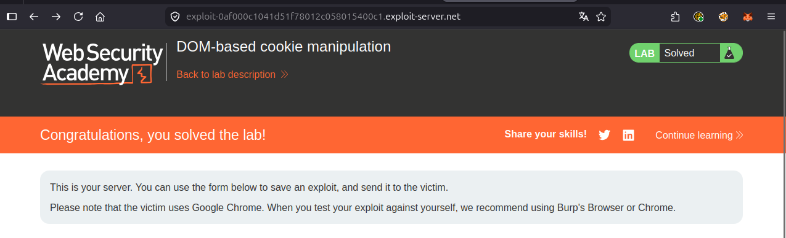
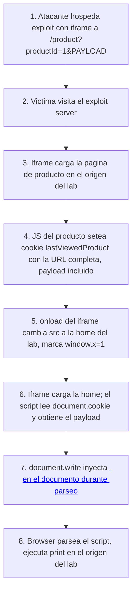

# Writeup: DOM-based cookie manipulation (PortSwigger)

- **Lab**: DOM-based cookie manipulation
- **URL**: https://portswigger.net/web-security/dom-based/cookie-manipulation/lab-dom-cookie-manipulation
- **Categoría**: DOM-based vulnerabilities -> Cookie manipulation
- **Dificultad**: Practitioner
- **Credenciales**: no requiere login

---

## 1. Objetivo

Vuelta a XSS, pero con una source nueva: **`document.cookie`**. La home del lab lee una cookie llamada `lastViewedProduct` (que el sitio mismo escribe cuando visitas un producto) y la mete sin escape en el HTML mediante `document.write`. Como la cookie se setea desde el cliente (vía JS en la página de producto), el atacante controla su valor sin tocar HTTP responses del servidor.

Para resolverlo hay que (a) lograr que la víctima setee la cookie con un payload XSS y (b) lograr que después visite la home, donde el payload se inyecta en el DOM. Las dos cosas se hacen con un único iframe que cambia su `src` en `onload`.

### Lo importante antes de tocar nada

- **Source = cookie controlada por cliente**: nunca sale del navegador. Server-side WAFs y logs no ven el payload.
- **Sink = `document.write`** (no `innerHTML`). Esto es crítico: `document.write` ejecutado durante el parseo inicial **sí** evalúa tags `<script>` insertados, mientras que `innerHTML` no. Por eso el payload puede ser un `<script>` directo, no un ``.
- **Dos páginas, un exploit**: el payload necesita correr en dos páginas distintas (producto para setear la cookie, home para disparar el sink). Una visita lineal no basta; el exploit usa un iframe que se recarga apuntando a la segunda página.
- **`print()` no `alert()`**: requisito del bot de PortSwigger.

---

## 2. Reconocimiento

### 2.1 Cómo se setea la cookie

Visitar un producto cualquiera (`/product?productId=1`). En las DevTools, pestaña Application → Cookies, aparece:

```
lastViewedProduct = https://lab/product?productId=1
```

Inspeccionando el JS de la página de producto, hay algo equivalente a:

```js
document.cookie = 'lastViewedProduct=' + window.location + '; SameSite=Lax';
```

Tres puntos:

1. **El valor de la cookie es la URL completa actual** (`window.location` coercionado a string).
2. **No se sanitiza ni se URL-encodea**. Lo que esté en la URL acaba literalmente en la cookie (limitado por los caracteres válidos de cookie).
3. **El atacante controla `window.location`**: añadiendo `?productId=1&PAYLOAD` a la URL, `PAYLOAD` termina en la cookie.

### 2.2 Cómo se usa la cookie en la home

En la home (`/`), al final del HTML hay algo como:

```html
<script>
    var lastViewedProduct = document.cookie.split('lastViewedProduct=')[1];
    if (lastViewedProduct) {
        document.write("<a href='" + lastViewedProduct + "'>Last viewed product</a>");
    }
</script>
```

Cuatro puntos:

1. **Lee `document.cookie`** sin parsear formalmente: `split('lastViewedProduct=')[1]` agarra todo lo que viene después del nombre de la cookie hasta el final.
2. **Concatena directo en HTML**: el valor entra entre comillas simples como `href`. Sin escape.
3. **`document.write` durante parseo**: el `<script>` está al final del body inicial (no diferido), así que `document.write` se ejecuta mientras el parser construye el documento. Cualquier tag `<script>` que escriba **se parsea y ejecuta** como si estuviera en el HTML original.
4. **El sink esperado**: `<a href='VALOR_COOKIE'>`. El valor controlado entra dentro de un atributo HTML con quoting de simples.

### 2.3 Por qué `<script>` funciona aquí pero no en `innerHTML`

Esta es la pieza no-obvia. La especificación HTML5 dice:

- **`document.write` durante parseo**: el texto se inserta en el stream de tokens del parser. Si contiene `<script>`, el parser lo trata exactamente igual que un `<script>` que estuviera escrito literalmente. Se carga, se ejecuta.
- **`innerHTML` después de parseo**: el navegador construye un fragmento DOM a partir del string. El estándar dice explícitamente que los `<script>` insertados así **no se ejecutan**. Es una mitigación de seguridad para evitar XSS triviales en sinks `innerHTML`.

Consecuencia para el payload: aquí podemos usar `<script>print()</script>` directo. En el lab anterior con `innerHTML`, había que usar `` porque `<script>` no habría ejecutado.

Esta diferencia es por la que `document.write` está considerado uno de los sinks más peligrosos: convierte cualquier inyección de string en HTML totalmente activo.

---

## 3. Diseño del ataque

### Componentes

1. **Iframe que carga la página de producto con el payload en la URL**. Esto hace que el JS del producto setee la cookie `lastViewedProduct` con el payload incluido. Cookie `SameSite=Lax`, así que cargar el iframe desde otro origen sí setea la cookie en el contexto del lab.
2. **Mismo iframe, recargado a la home** (vía cambio de `src` en `onload`). Al cargar la home, el script lee la cookie maliciosa, hace `document.write`, y el payload ejecuta.
3. **Flag `window.x`** para evitar loop infinito: `onload` corre cada vez que el iframe termina de cargar. Sin el flag, cada carga de la home volvería a setear el src y el ciclo no acabaría.

### Payload

```html
<iframe src="https://LAB-ID.web-security-academy.net/product?productId=1&'><script>print()</script>"
        onload="if(!window.x){this.src='https://LAB-ID.web-security-academy.net';window.x=1;}"></iframe>
```

### Diseccionando el payload de la URL

`?productId=1&'><script>print()</script>` es lo que va a terminar en la cookie. Pieza por pieza:

- **`productId=1&`**: param legítimo seguido de `&` para empezar otro param. El servidor sirve el producto 1 normalmente. El JS no parsea params, sólo concatena toda la URL.
- **`'>`**: cierra el atributo `href='` y el tag `<a` que va a generarse en la home. Resultado en HTML: `<a href='https://lab/product?productId=1&'>` (atributo cerrado, tag cerrado), seguido de…
- **`<script>print()</script>`**: tag script que el parser, alimentado por `document.write`, evalúa y ejecuta.

El HTML que se inyecta en la home queda:

```html
<a href='https://lab/product?productId=1&'><script>print()</script>'>Last viewed product</a>
```

El parser ve un `<a>` cerrado, un `<script>` que ejecuta, y luego basura (`'>Last viewed product</a>`) que se renderiza como texto literal o se ignora. La ejecución ya pasó.

### Diseccionando el `onload`

```js
if (!window.x) {
    this.src = 'https://LAB-ID.web-security-academy.net';
    window.x = 1;
}
```

- **Primera carga del iframe** (URL del producto): `window.x` es `undefined`, falsy. Ejecuta el bloque: cambia `this.src` a la home y marca `window.x = 1`. Cambiar `src` dispara una nueva navegación del iframe.
- **Segunda carga del iframe** (home): `window.x` ya es `1`, truthy. No entra al if. El iframe se queda en la home, donde el script lee la cookie y dispara `print()`.
- **Por qué `window.x` y no `iframe.x`**: `window` aquí es la ventana del **exploit server** (la página padre del iframe). Es persistente entre cargas del iframe. Si pusiéramos el flag dentro del iframe (ej. `this.x`), se reiniciaría con cada navegación.

---

## 4. Por qué funciona

### 4.1 La fuente de XSS no es siempre la URL

Hasta ahora en la serie, todas las XSS DOM-based partían de `location.search`, `location.hash` o `event.data` (postMessage). Aquí la fuente es `document.cookie`. El atacante no necesita controlar la URL que carga la víctima ni tener un canal de mensaje activo: controla un **valor persistente en el navegador** que cualquier página del mismo origen leerá.

Catálogo amplio de sources DOM XSS:

- **URL**: `location.href`, `location.search`, `location.hash`, `location.pathname`.
- **Almacenamiento**: `document.cookie`, `localStorage.getItem(...)`, `sessionStorage.getItem(...)`.
- **Comunicación**: `event.data` (postMessage), `window.name`.
- **Headers**: `document.referrer`.
- **Inputs DOM**: `document.URL`, `document.documentURI`, `document.baseURI`.

Cada una se explota distinto. La cookie en particular es interesante porque es **escribible cross-site bajo SameSite=Lax** (mientras la cookie no la marque como `HttpOnly`), y persiste hasta que expira.

### 4.2 `SameSite=Lax` permite escribir cookies en navegación top-level

`SameSite=Lax` (default actual de Chrome/Firefox) restringe el envío de cookies en requests **cross-site** que no sean navegaciones top-level. Pero **navegar** a una URL del lab (ej. cargando un iframe) sí dispara una carga top-level de esa página, que puede setear cookies vía JS. La protección de SameSite es contra exfiltración (impedir que la cookie viaje con requests de terceros), no contra escritura.

`SameSite=Strict` no cambiaría el ataque aquí porque la cookie se setea desde el JS de la propia página del lab cargada en el iframe, no desde una request cross-site del atacante. Sería igual de vulnerable.

La defensa correcta no es manipular `SameSite` sino **no leer cookies como datos confiables si pueden ser influenciadas por la URL**.

### 4.3 `document.write` rompe la última línea de defensa que `innerHTML` tiene

En sinks `innerHTML`, `<script>` no ejecuta. Esa es la única razón por la que `` se volvió el payload canónico para innerHTML XSS. Con `document.write`, esa restricción desaparece: el payload puede ser cualquier HTML válido incluido `<script>`, lo que da mucha más flexibilidad (no dependes de que el HTML resultante dispare un evento).

Peor: `document.write` después de que el documento haya cargado (`document.readyState !== 'loading'`) reemplaza el documento entero. Eso a veces causa el bug accidental "le hago `document.write` a una página ya cargada y desaparece todo", pero también es vector: un `document.write` post-load puede borrar evidencia previa si el atacante quiere.

Regla mental para code review: `document.write` con cualquier dato no estático es bug latente. Banear `document.write` por completo en código nuevo es buena política de equipo.

---

## 5. Resolución

1. Visitar un producto (`/product?productId=1`). En DevTools → Application → Cookies, confirmar que se setea `lastViewedProduct` con el valor de la URL.
2. Visitar la home (`/`). Inspeccionar el HTML al final: encontrar el `<script>` que hace `document.write` con el valor de la cookie.
3. (Opcional) Confirmar la cadena manualmente: visitar
   ```
   /product?productId=1&'><script>print()</script>
   ```
   Ver en DevTools que `lastViewedProduct` ahora contiene el payload. Luego visitar `/` y el diálogo de impresión debe abrirse.
4. Ir al **Go to exploit server**. En el body del exploit, pegar:
   ```html
   <iframe src="https://LAB-ID.web-security-academy.net/product?productId=1&'><script>print()</script>"
           onload="if(!window.x){this.src='https://LAB-ID.web-security-academy.net';window.x=1;}"></iframe>
   ```
   Reemplazar `LAB-ID.web-security-academy.net` por el host real.
5. Pulsar **Store** y luego **Deliver exploit to victim**.
6. El bot abre el exploit, el iframe carga el producto (cookie envenenada), `onload` cambia el src a la home, la home lee la cookie, `document.write` inyecta el `<script>print()</script>`, `print()` ejecuta. Lab Solved.



Si tras "Deliver" el lab no se resuelve:

- El payload no está URL-encodeado donde toca. PortSwigger es laxo, pero si el iframe no carga, probar con `&apos;` o codificación de los caracteres especiales en el query.
- Falta el flag `window.x` y el iframe entra en loop. Verificar la condición.
- `print()` mal escrito o con `alert()`. Sólo `print` se detecta.

---

## 6. Resumen de la cadena



Tres ideas para llevarse:

1. **Las cookies son input no confiable cuando se pueblan client-side**. Aunque se vean "internas" del sitio, si su valor viene de algo que el atacante influye (URL, referrer, localStorage, otra cookie cross-subdomain), tratarlas como entrada externa para fines de validación.
2. **`document.write` es un sink categóricamente peor que `innerHTML`**. Ejecuta `<script>` durante parseo. Si encuentras `document.write` con dato dinámico en code review, asume bug hasta probarlo limpio. Reescribir a `createElement` + `textContent` siempre es una mejora.
3. **Exploits que requieren dos páginas se construyen con un iframe que cambia `src`**. Patrón reutilizable para cualquier ataque que necesita poison + lectura, write + read, o multi-step CSRF. La técnica del flag en `window` para evitar loops es el truco operacional.

---

## 7. Contramedidas

Defensas en orden de robustez:

1. **No usar `document.write` con datos dinámicos**. Sustituir por construcción explícita del DOM:
   ```js
   const a = document.createElement('a');
   a.href = lastViewedProduct;          // setter valida esquema en algunos sinks; ver punto 3
   a.textContent = 'Last viewed product';
   container.appendChild(a);
   ```
2. **No leer URL completa para guardar en cookie**. Si el dato es "última URL visitada", guardar sólo el `productId` y reconstruir la URL al renderizar:
   ```js
   document.cookie = 'lastViewedProductId=' + productId + '; SameSite=Lax';
   // …luego, en home:
   const url = '/product?productId=' + encodeURIComponent(getCookie('lastViewedProductId'));
   ```
3. **Validar/sanitizar el dato antes del sink, no antes del storage**. Aunque la cookie esté limpia hoy, mañana el atacante puede setearla por otro vector. La defensa robusta es validar **al salir del storage**, justo antes de inyectar al DOM:
   ```js
   const raw = getCookie('lastViewedProduct');
   try {
       const u = new URL(raw, location.origin);
       if (u.origin !== location.origin) throw 0;
       a.href = u.href;
   } catch { return; }
   ```
4. **Encodear contextualmente al inyectar**. Si insistes en concatenar HTML (no recomendado), aplicar el encoding del contexto (`HTMLEncoder.attribute()` para atributos, `HTMLEncoder.text()` para texto). Una sola función `escapeHtml` que sólo escapa `<>&"'` puede ser insuficiente según contexto.
5. **CSP con `script-src` estricto**. Una CSP que prohíba inline scripts (`script-src 'self'` sin `'unsafe-inline'`) corta la ejecución del `<script>` inyectado. Defensa en profundidad imprescindible para apps con sinks complicados.
6. **Trusted Types**. Aplicado al sink `document.write` (vía `require-trusted-types-for 'script'` y `trusted-types`), obliga a que cualquier string pase por una policy explícita que valida y devuelve un `TrustedHTML`. Asignaciones directas lanzan excepción.

---

## 8. Referencias

- PortSwigger Web Security Academy. (s.f.). *Lab: DOM-based cookie manipulation*. https://portswigger.net/web-security/dom-based/cookie-manipulation/lab-dom-cookie-manipulation
- PortSwigger Web Security Academy. (s.f.). *DOM-based cookie manipulation*. https://portswigger.net/web-security/dom-based/cookie-manipulation
- MDN Web Docs. (s.f.). *Document.write()*. https://developer.mozilla.org/en-US/docs/Web/API/Document/write
- MDN Web Docs. (s.f.). *Document.cookie*. https://developer.mozilla.org/en-US/docs/Web/API/Document/cookie
- MDN Web Docs. (s.f.). *SameSite cookies*. https://developer.mozilla.org/en-US/docs/Web/HTTP/Headers/Set-Cookie/SameSite
- OWASP Foundation. (s.f.). *DOM based XSS Prevention Cheat Sheet*. https://cheatsheetseries.owasp.org/cheatsheets/DOM_based_XSS_Prevention_Cheat_Sheet.html
- W3C. (s.f.). *Trusted Types*. https://www.w3.org/TR/trusted-types/
- Inventario interno: [`inventario/03-analisis-vulnerabilidades/web/analisis-xss.md`](../../../inventario/03-analisis-vulnerabilidades/web/analisis-xss.md)
- Inventario interno: [`inventario/04-explotacion/web/explotacion-xss.md`](../../../inventario/04-explotacion/web/explotacion-xss.md)
