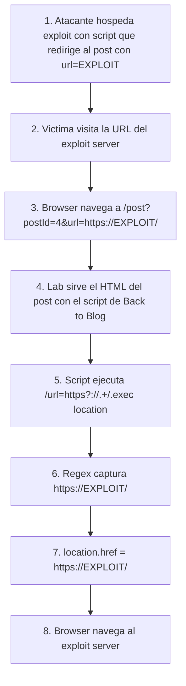

# Writeup: DOM-based open redirection (PortSwigger)

- **Lab**: DOM-based open redirection
- **URL**: https://portswigger.net/web-security/dom-based/open-redirection/lab-dom-open-redirection
- **Categoría**: DOM-based vulnerabilities -> Open redirection
- **Dificultad**: Apprentice
- **Credenciales**: no requiere login

---

## 1. Objetivo

Cambio de familia respecto a los labs anteriores. No es XSS: es **open redirect del lado cliente**. La página de un post de blog tiene un link "Back to Blog" cuyo destino se calcula por JavaScript leyendo un parámetro `url` del query string. Si el parámetro está presente, el JS lo asigna a `location.href`. No valida nada.

Para resolverlo hay que entregar a la víctima una URL al post con `?url=https://EXPLOIT.exploit-server.net/`. Cuando la víctima haga click en "Back to Blog", su navegador la redirige al exploit server.

### Lo importante antes de tocar nada

- **No es XSS**: aquí no se ejecuta JS arbitrario. Sólo se controla el destino de una redirección. Eso lo vuelve menos crítico técnicamente, pero **muy útil en cadenas de phishing**: un link que parece legítimo (origin del lab.web-security-academy.net) acaba en el dominio del atacante.
- **El sink es un click esperado**, no una navegación automática. La víctima tiene que hacer click en el botón. El bot del lab lo hace por sí mismo cuando carga la página.
- **Source = `location`**: el JS lee el query string actual (`location.search` o `location.href`) con un regex que extrae `url=...`.
- **Sink = `location.href`**: igual que en el lab "DOM XSS using web messages and javascript URL", `location.href` es asignación de navegación. Aquí el atacante no necesita `javascript:` porque el objetivo es redirigir, no ejecutar.
- **Para qué sirve esto en bug bounty real**: open redirects se usan como pivote en chains: bypass de validaciones de redirect_uri en OAuth, robo de tokens via fragment, phishing convincente con dominio "real".

---

## 2. Reconocimiento

### 2.1 Localizar el sink

Abrir un post cualquiera del blog (ej. `/post?postId=4`). El código vulnerable **no** está en un `<script>` separado: vive **inline en el atributo `onclick`** del link "Back to Blog", al final del HTML del post:

```html
<div class="is-linkback">
    <a href="#" onclick="returnUrl = /url=(https?:\/\/.+)/.exec(location); location.href = returnUrl ? returnUrl[1] : &quot;/&quot;">Back to Blog</a>
</div>
```

Decodificando entidades HTML (`&quot;` → `"`), el JS es:

```js
returnUrl = /url=(https?:\/\/.+)/.exec(location);
location.href = returnUrl ? returnUrl[1] : "/";
```

Implicación práctica para code review: cuando audites DOM XSS u open redirect, no busques sólo `<script>`. Los atributos de evento (`onclick`, `onmouseover`, `onload`) y `href="javascript:..."` son JS embebido. Un grep completo necesita capturar `<script>` **y** atributos `on\w+=`.

Tres observaciones:

1. **`location` como source**: cuando se accede `location` en contexto string (como argumento de `.exec`), JS lo coerciona a la URL completa actual (`location.toString()` ≡ `location.href`). El regex busca dentro de toda la URL.
2. **Regex `^url=(https?:\/\/.+)`**: parece restrictiva (exige esquema `http(s)`). En realidad sí limita esquema, pero **no limita el host de destino**. Cualquier dominio externo vale.
3. **`returnUrl[1]`**: el grupo capturado, que el regex deja en posición 1 del array de match.

### 2.2 Confirmar el comportamiento

Visitar `/post?postId=4&url=https://example.com/`. Hacer click en "Back to Blog" → el navegador navega a `https://example.com/`. Sink confirmado.

Importante: si haces click en "Back to Blog" **sin** el parámetro, el regex devuelve `null` y el código ejecuta `location.href = "/"` (página principal del blog). Por eso el lab requiere meter el `url=` para que el camino del exploit se active.

### 2.3 Por qué es DOM-based y no server-side

El servidor sirve el mismo HTML del post sin importar el `?url=...`. El parámetro es **leído y procesado completamente por el JS del cliente**. El servidor nunca ve el destino del redirect. Eso significa:

- WAFs server-side no ven el payload (no hay POST/header con la URL maliciosa).
- Logs del servidor no registran el redirect (sólo ven el GET al post).
- Mitigaciones server-side (sanitización de redirect targets en una whitelist en el backend) no aplican.

La vulnerabilidad vive enteramente en el JS. Sólo defensas client-side la cubren.

---

## 3. Diseño del ataque

### Componentes

1. **URL preparada al post**: incluye el parámetro `url` con el destino del atacante. Esa es la "carnada" de phishing.
2. **Exploit server hospeda el detonador**: en este lab, basta con que el exploit server incluya un `<script>location='URL_AL_POST'</script>` o un meta-refresh para que el bot, al visitar el exploit server, sea redirigido al post con el payload, vea el script "Back to Blog" ejecutarse y termine en el exploit server. PortSwigger valida el éxito cuando el bot llega al exploit server desde el lab.

### Payload

URL maliciosa:

```
https://LAB-ID.web-security-academy.net/post?postId=4&url=https://EXPLOIT-ID.exploit-server.net/
```

Contenido del exploit server (uno de estos basta):

```html
<script>
  location = "https://LAB-ID.web-security-academy.net/post?postId=4&url=https://EXPLOIT-ID.exploit-server.net/";
</script>
```

O con meta-refresh:

```html
<meta http-equiv="refresh" content="0;url=https://LAB-ID.web-security-academy.net/post?postId=4&url=https://EXPLOIT-ID.exploit-server.net/">
```

### Notas sobre los valores

- **`postId=4`**: cualquier post válido vale. El `onclick` aparece en todos los posts (es parte del template, no del contenido). Mientras la URL renderice un post real, el handler se monta.
- **`url=https://EXPLOIT-ID.exploit-server.net/`**: tiene que cumplir el regex `https?://`. URLs sin esquema, con esquemas raros (`ftp:`, `data:`) o sólo paths no harían match en el regex y se quedarían en el `else` que va a `/`.
- **El bot hace click solo**: PortSwigger simula que la víctima hace click en cada link visible al cargar la página, así que no hay que truquear el click.

---

## 4. Por qué funciona

### 4.1 La regex valida formato, no destino

El developer probablemente pensó: "voy a aceptar sólo URLs que parezcan URLs HTTP, así nadie meterá `javascript:` o cosas raras". El regex `https?://` cumple eso. No cumple **lo otro**: validar que el host sea propio.

La diferencia entre validar **forma** (es una URL bien formada) y validar **propiedad** (apunta a un origen confiable) es exactamente la misma confusión que el lab anterior con `JSON.parse + switch`. Aquí en versión menor: forma correcta no implica destino seguro.

La validación correcta requiere parsear la URL y comparar host:

```js
const target = new URL(returnUrl[1], location.origin);
if (target.origin !== location.origin) {
    location.href = "/";  // fuera de origen, abortar
} else {
    location.href = target.href;
}
```

### 4.2 `location` se coerciona a string

`/url=.../.exec(location)` funciona porque `location` (objeto `Location`) tiene un `toString()` que devuelve la URL completa. `RegExp.exec` invoca coerción automática cuando recibe algo no-string. El regex termina aplicado sobre `https://lab.../post?postId=4&url=https://attacker.com/` y captura el `https://attacker.com/`.

Esto es importante para detectar bugs similares en otros sitios: cualquier código que use `location` como string sin extraer explícitamente `location.search` o `location.hash` está leyendo todo el contexto de la URL, incluido el host del lab. Un atacante puede meter su payload en cualquier parte: query, fragment, incluso dentro del path si el regex es laxo.

### 4.3 Open redirect ≠ XSS, pero alimenta XSS y otras chains

Por sí solo, redirigir a `https://attacker.com/` es phishing. El usuario ve por un momento el dominio del lab en la barra (suficientes víctimas no leen la barra después del primer click) y termina en una página que el atacante controla, donde puede pedir credenciales con la apariencia que quiera.

Combinado, abre puertas peores:

- **Bypass de validación de `redirect_uri` en OAuth**: si un proveedor OAuth acepta cualquier URL del dominio víctima como callback, el atacante registra `https://lab.example/post?postId=4&url=https://attacker.com/` como `redirect_uri`. El proveedor verifica "el host es lab.example, OK" y emite el token; el JS del post lo redirige al atacante con el `code` en el fragment.
- **Token theft via fragment**: si la app usa fragments para pasar tokens (común en SPAs), el redirect arrastra el fragment al destino externo (con caveats por navegador).
- **Phishing target switching dinámico**: el atacante puede cambiar el destino en cualquier momento sin republicar el link inicial.

Por eso open redirects que en aislamiento parecen "low severity" suben a "high" cuando se conectan con auth flows.

---

## 5. Resolución

1. Abrir un post del blog (ej. `https://LAB-ID.web-security-academy.net/post?postId=4`). Inspeccionar el script asociado al link "Back to Blog" y confirmar el regex `/url=(https?:\/\/.+)/.exec(location)` con sink en `location.href`.
2. (Opcional) Confirmar el redirect manualmente: visitar
   ```
   https://LAB-ID.web-security-academy.net/post?postId=4&url=https://example.com/
   ```
   y hacer click en "Back to Blog". El navegador debe ir a example.com.
3. Ir al **Go to exploit server**. En el body del exploit, pegar:
   ```html
   <script>
     location = "https://LAB-ID.web-security-academy.net/post?postId=4&url=https://EXPLOIT-ID.exploit-server.net/";
   </script>
   ```
   Reemplazar `LAB-ID` y `EXPLOIT-ID` con los hosts reales (sale en la barra superior del lab).
4. Pulsar **Store** y luego **Deliver exploit to victim**.
5. El bot abre el exploit server, el `<script>` lo redirige al post con el `url=...`, el script "Back to Blog" del post lo redirige al exploit server. El lab marca como Solved.


Si tras "Deliver" el lab no se resuelve:

- El `url=` no cumple `https?://`. Asegurarse de que empieza por `https://`.
- `LAB-ID` o `EXPLOIT-ID` mal escritos. Copiarlos de la barra superior.
- Visitaste el post manualmente y diste atrás antes de que el script corra. El bot lo hace en orden: redirige → carga post → script asigna `location.href` → llega al exploit server.

---

## 6. Resumen de la cadena



Tres ideas para llevarse:

1. **Validar formato de URL no es validar destino**. Filtros tipo `https?://` o regex de "URL válida" sólo bloquean payloads obviamente malformados; cualquier dominio externo bien formateado pasa. Para destino, parsear con `new URL()` y comparar `origin` contra allowlist.
2. **Open redirect client-side es invisible al servidor**. Defensas server-side (allowlists en el backend, WAF) no ven el payload porque vive en JS. Defenderlo requiere arreglar el JS o desplegar `Trusted Types` para sinks de URL.
3. **"Open redirect" suena bajo, pero amplifica auth flows**. Por sí solo es phishing; combinado con OAuth/SAML callbacks o token-en-fragment, escala a robo de tokens. Cuando reportes uno, busca chains con auth en el mismo dominio antes de etiquetarlo Low.

---

## 7. Contramedidas

Defensas en orden de robustez:

1. **No leer destino de redirect del cliente**. Si la app necesita un "volver a página anterior", usar `document.referrer` (con validación) o un identificador interno (`?back=blog-home`) que se mapea client-side a una URL fija. El usuario nunca debería poder elegir el destino libremente.
2. **Allowlist de host con `new URL()`**:
   ```js
   const candidate = new URL(returnUrl[1], location.origin);
   const allowed = ['lab.web-security-academy.net', 'partner.example.com'];
   if (!allowed.includes(candidate.hostname)) {
       location.href = "/";
   } else {
       location.href = candidate.href;
   }
   ```
   Compara `hostname` parseado, no substring de la URL.
3. **Same-origin sólo cuando aplique**:
   ```js
   const candidate = new URL(returnUrl[1], location.origin);
   if (candidate.origin !== location.origin) {
       location.href = "/";
   } else {
       location.href = candidate.href;
   }
   ```
   Más restrictivo que allowlist; vale cuando la app no necesita navegación cross-domain.
4. **Mostrar interstitial para destinos externos**. Si el flujo realmente requiere dejar el dominio (ej. pasarela de pago), mostrar página intermedia "Estás saliendo del sitio. ¿Continuar?" con la URL destino visible. Reduce phishing porque la víctima ve el dominio antes de irse.
5. **CSP `navigate-to` (donde soportado)**. Directiva que limita los destinos permitidos para navegación. Soporte irregular entre navegadores; útil como defensa en profundidad, no sustituye validación.
6. **Trusted Types para sinks de URL**. Si la app declara `require-trusted-types-for 'script'` y configura una policy que valida URLs antes de devolver `TrustedScriptURL`, asignaciones inseguras lanzan excepción. Funciona en Chromium-based browsers.

---

## 8. Referencias

- PortSwigger Web Security Academy. (s.f.). *Lab: DOM-based open redirection*. https://portswigger.net/web-security/dom-based/open-redirection/lab-dom-open-redirection
- PortSwigger Web Security Academy. (s.f.). *DOM-based open redirection*. https://portswigger.net/web-security/dom-based/open-redirection
- OWASP Foundation. (s.f.). *Unvalidated Redirects and Forwards Cheat Sheet*. https://cheatsheetseries.owasp.org/cheatsheets/Unvalidated_Redirects_and_Forwards_Cheat_Sheet.html
- MDN Web Docs. (s.f.). *Location*. https://developer.mozilla.org/en-US/docs/Web/API/Location
- MDN Web Docs. (s.f.). *URL() constructor*. https://developer.mozilla.org/en-US/docs/Web/API/URL/URL
- MITRE Corporation. (2024). *CWE-601: URL Redirection to Untrusted Site ('Open Redirect')*. https://cwe.mitre.org/data/definitions/601.html
- Inventario interno: [`inventario/03-analisis-vulnerabilidades/web/analisis-open-redirect.md`](../../../inventario/03-analisis-vulnerabilidades/web/analisis-open-redirect.md)
