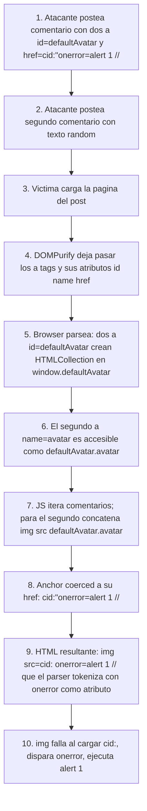

# Writeup: DOM XSS via DOM clobbering (PortSwigger)

- **Lab**: Exploiting DOM clobbering to enable XSS
- **URL**: https://portswigger.net/web-security/dom-based/dom-clobbering/lab-dom-xss-exploiting-dom-clobbering
- **Categoría**: DOM-based vulnerabilities -> DOM clobbering
- **Dificultad**: Practitioner
- **Credenciales**: no requiere login

---

## 1. Objetivo

Lab de una clase que casi nadie ve venir: **DOM clobbering**. En lugar de inyectar JavaScript, el atacante inyecta **HTML estático** (sólo `<a>` tags). Esos `<a>` con `id` y `name` específicos crean propiedades en `window` y `document` que **sobrescriben** referencias del propio JS de la app, redirigiendo el flujo a un payload XSS.

El comentario del blog acepta HTML "seguro" sanitizado por DOMPurify (deja pasar `<a id name href>`). El JS de la página tiene `let defaultAvatar = window.defaultAvatar || {avatar: '/path/default.svg'}`. El atacante crea dos `<a id=defaultAvatar>` que **clobberean** `window.defaultAvatar`, y uno de ellos con `name=avatar` y un `href` malicioso clobberea `defaultAvatar.avatar`. Cuando el JS usa `defaultAvatar.avatar` en una concatenación HTML, el href del atacante entra al sink y dispara `alert(1)`.

### Lo importante antes de tocar nada

- **Sin `<script>`, sin atributos de evento, sin `javascript:` URLs en el comentario**: DOMPurify los limpia. El payload son sólo `<a>` con atributos benignos.
- **DOM clobbering = abusar la API legacy del DOM** que crea automáticamente propiedades nombradas en `window` y `document` a partir de `id` y `name` de elementos HTML. Esa API es legacy de los 90s, sigue activa por compatibilidad.
- **`||` con un global no inicializado es el habilitador**: `let x = window.x || default` parece defensa razonable; en realidad invita al atacante a controlar `window.x` desde HTML.
- **Necesitas dos comentarios**: el primero es el payload de clobbering; el segundo es cualquier texto random que fuerce al JS a recorrer comentarios y usar `defaultAvatar.avatar` para el avatar de ese segundo comentario.
- **`alert()` no `print()`**: este lab valida `alert`. Distinto del resto de la serie de DOM XSS.

---

## 2. Reconocimiento

### 2.1 Localizar el JS vulnerable

En cualquier página de post, el HTML carga `loadCommentsWithDomClobbering.js`. Inspeccionando, hay algo equivalente a:

```js
let defaultAvatar = window.defaultAvatar || {avatar: '/resources/images/avatarDefault.svg'};

// más adelante, al renderizar cada comentario:
let html = '';
container.insertAdjacentHTML('beforeend', html);
```

Tres puntos críticos:

1. **`window.defaultAvatar || {avatar: ...}`**: si `window.defaultAvatar` existe y es truthy, se usa. Si no, fallback al objeto literal con un path SVG. El developer probablemente puso esto para permitir override desde otro script. La realidad: cualquier `id=defaultAvatar` en HTML lo crea.
2. **`defaultAvatar.avatar`**: accede al subcampo `.avatar`. En el fallback es un string. En el clobbering será una referencia DOM.
3. **Concatenación a HTML + sink**: el valor termina dentro de `` mediante un sink HTML (`insertAdjacentHTML`, `innerHTML`, o `document.write`). Lo que esté en `defaultAvatar.avatar` se interpola sin escape.

### 2.2 Confirmar qué deja pasar DOMPurify

El form de comentarios tiene un campo "Comment" que acepta HTML. Probar con un payload simple:

```html
<a id=test>hello</a>
```

Submit, recargar, ver el HTML del comentario en DevTools. DOMPurify suele permitir `<a>` con `id`, `name`, `href`, `title`. Lo que no aparezca en el HTML renderizado es lo que filtró.

`<script>`, ``, `onclick`, `javascript:` URLs son todos eliminados. Estamos en un sandbox HTML estricto. La pregunta es: con esos materiales, ¿se puede escribir el HTML que necesito para atacar?

### 2.3 Refrescar mecánica de DOM clobbering

Tres reglas básicas del DOM legacy que el atacante explota:

1. **`<X id="foo">` crea `window.foo` apuntando al elemento**. `window.foo === document.getElementById('foo')`. Comportamiento estándar HTML5 (sec. "named access on the Window object"), heredado de Netscape Navigator 2.
2. **Múltiples elementos con el mismo `id` crean un `HTMLCollection`**. `window.foo` se vuelve una colección iterable de los elementos.
3. **Dentro de un `HTMLCollection`, los `name` de los hijos son propiedades nombradas**. Si un hijo tiene `name="bar"`, entonces `window.foo.bar` apunta a ese hijo. Esto convierte un par de `<a>` con `id` y `name` en un objeto navegable de dos niveles.

Combinando: dos `<a id=defaultAvatar>` en el DOM crean `window.defaultAvatar` como `HTMLCollection`. Si uno de ellos tiene `name=avatar`, entonces `window.defaultAvatar.avatar` apunta a ese segundo anchor.

---

## 3. Diseño del ataque

### Componentes

1. **Comentario 1**: dos `<a>` con `id=defaultAvatar`, el segundo con `name=avatar` y un `href` que cuando se interpole en `` rompa el atributo y meta `onerror=alert(1)`.
2. **Comentario 2**: cualquier texto random (`test`). Su único propósito es darle al JS de comentarios algo que renderizar usando `defaultAvatar.avatar` (su propio avatar lo computa con el fallback porque el comment no trae avatar propio).
3. **Recarga de la página**: el JS corre al cargar, `window.defaultAvatar` ya existe (clobbered), el `||` lo deja pasar, el avatar del segundo comentario sale del payload.

### Payload del comentario 1

```html
<a id=defaultAvatar><a id=defaultAvatar name=avatar href="cid:&quot;onerror=alert(1)//">
```

### Diseccionando

**Los dos `<a id=defaultAvatar>`**: crean `window.defaultAvatar` como `HTMLCollection` con dos elementos. La condición `window.defaultAvatar || {...}` es truthy → usa la collection.

**El segundo con `name=avatar`**: dentro de `HTMLCollection`, ese nombre se vuelve propiedad accesible. `defaultAvatar.avatar` apunta a ese segundo anchor.

**`href="cid:&quot;onerror=alert(1)//"`**:
- `&quot;` es la entidad HTML para `"`. El parser HTML la decodifica al construir el atributo, así que el valor del `href` (en bytes) es: `cid:"onerror=alert(1)//`.
- `cid:` es un esquema URI legítimo (RFC 2392, usado para referenciar partes MIME en emails). Acepta cualquier cosa después como opaque part. **Crucial**: el parser de URL de los navegadores no escapa la `"` interna ni rechaza el URI, así que el `href` del anchor queda con esa cadena cruda.

**Cuando el JS lo coerce a string**: el getter `.href` (o el `toString` de un anchor) devuelve la URL. Para `cid:"onerror=alert(1)//`, devuelve esa misma cadena.

### Por qué el JS lo coerce a string

El código probablemente hace algo como:

```js
let html = '';
```

`defaultAvatar.avatar` es un `HTMLAnchorElement`. La concatenación con string lo coerce a su `href` (los anchors tienen un `toString` que devuelve `href`). Resultado:

```js
html === ''
```

### Cómo se parsea el HTML resultante

Cuando ese string se inserta vía `insertAdjacentHTML` o `innerHTML`, el parser ve:

```html

```

Tokeniza:
- `` con `src="cid:"` (la primera `"` del payload cierra el atributo `src`).
- `onerror=alert(1)//` como segundo atributo (sin comillas: `onerror` con valor `alert(1)//`).
- `">` lo que sobra es ruido que el parser descarta.

El navegador intenta cargar `cid:` como imagen, falla (cid: no resuelve a recurso fetcheable normal), dispara `onerror`, ejecuta `alert(1)` en el origen del lab.

### Por qué el segundo comentario "random"

El JS del lab itera sobre los comentarios y para cada uno renderiza un bloque que incluye el avatar. Si el comentario tiene `avatar` propio, lo usa; si no, usa `defaultAvatar.avatar`.

- **Comentario 1** (el payload): no genera renderizado de avatar via `defaultAvatar.avatar` porque su contenido HTML es el payload mismo. El `` con avatar tampoco se construye para él porque su contenido sobreescribe el bloque, o porque el JS renderiza primero el bloque y luego el HTML del comentario, pero el primer `` ya está renderizado **antes** de que el clobbering exista en el DOM.
- **Comentario 2** (texto plano): cuando el JS llega a él, los `<a>` del comentario 1 ya están en el DOM. `window.defaultAvatar` ya está clobbered. El render del avatar del comentario 2 usa `defaultAvatar.avatar` clobbered → `` → ejecución.

Es una ventana de timing: el clobbering tiene que existir **antes** de que el JS interpole `defaultAvatar.avatar`. Como el JS del lab itera comentarios secuencialmente, basta con que el comentario malicioso esté antes de cualquier comentario "víctima" cuyo avatar va a renderizarse via fallback. Postear el payload primero y luego cualquier texto satisface esa condición.

---

## 4. Por qué funciona

### 4.1 La API de "named access on Window" es global y sin opt-out

El estándar HTML5 (sección 7.3.3) obliga a los navegadores a exponer en `window` propiedades para cada elemento con `id` o `name` específico (`<a name>`, ``, `<form name>`, etc.). No hay forma de desactivarlo. No hay flag, no hay header, no hay CSP que lo impida.

Esto existe por compatibilidad: en los 90s, mucho código accedía a forms con `document.formName` y a images con `document.imageName`. Romper eso rompería medio internet legacy. El precio: cualquier HTML inyectado controla nombres globales.

Lista parcial de "shadowing global" disponibles para el atacante:

- `<X id="foo">` → `window.foo`.
- `<a name="foo">` → `window.foo` (también).
- `<form name="foo">` → `document.foo` y `window.foo`.
- `` → `document.foo` y `window.foo`.
- `<iframe name="foo">` → `window.foo` apunta a la `Window` del iframe (esto es muy potente: te da una referencia ejecutable cross-context).

Múltiples elementos con el mismo nombre se agrupan en `HTMLCollection` accesible por índice numérico **o** por `name`. Eso da estructura jerárquica al atacante.

### 4.2 `||` con global no inicializado es trampa común

El patrón:

```js
let foo = window.foo || defaultFoo;
```

Se ve como "permite override por configuración global", pero es realmente "acepta cualquier cosa que aparezca como `window.foo`, incluyendo elementos DOM creados por HTML inyectado de cualquier procedencia".

Variantes equivalentemente vulnerables:

```js
let cfg = window.config?.api || '/default';
let helper = window.helpers && window.helpers.format;
this.options = Object.assign({}, window.options, opts);
```

Todas asumen que `window.X` o no existe (falsy → fallback) o es lo que el developer espera (objeto definido por otro script). Ninguna considera la tercera opción: `window.X` es un elemento DOM creado por HTML del usuario.

### 4.3 DOMPurify no detecta esto, y no debería

DOMPurify hace lo que promete: filtrar HTML que pueda ejecutar JS. `<a id=foo>` no ejecuta nada. No debería bloquearlo (rompería casos legítimos: links con id para navegación interna, etc.).

El bug no está en el sanitizer; está en el código que asume que `window.X` es seguro. La defensa correcta es del lado consumidor (no leer globals influenciables), no del lado sanitizer (banear `id`/`name`).

Algunos sanitizers ofrecen modos estrictos que prohíben `id`/`name` en HTML user-generated. Esa es una opción defensiva, pero rompe mucho contenido legítimo. La defensa más limpia es escribir JS que no sea clobbereable.

### 4.4 `cid:` esquema permite payload con `"` literal

`http:` y `https:` URLs tienen rules de codificación de caracteres especiales que se aplican al asignar a `.href` (el setter URL-encodea). `cid:` es opaque: lo que metes, queda. Por eso vale para llevar `"` y `=` literales que se interpretarán como tokens HTML al re-parsearse.

Otros esquemas opacos sirven igual: `data:`, `mailto:`, `tel:`, `urn:`. La elección de `cid:` es arbitraria; lo importante es que el navegador no normalice el href.

---

## 5. Resolución

1. Visitar cualquier post (ej. `/post?postId=1`). En DevTools → Network, encontrar `loadCommentsWithDomClobbering.js`. Abrirlo y confirmar el patrón `window.defaultAvatar || {...}` y el sink que concatena `defaultAvatar.avatar` en HTML.
2. En el form de comentarios, en el campo "Comment", pegar:
   ```html
   <a id=defaultAvatar><a id=defaultAvatar name=avatar href="cid:&quot;onerror=alert(1)//">
   ```
   Rellenar Name y Email con cualquier valor. Submit.
3. Volver al post. Postear un segundo comentario con cualquier texto, ej. `test`. Rellenar Name/Email distintos del primero. Submit.
4. Recargar la página del post. El JS itera comentarios, llega al segundo, computa avatar via `defaultAvatar.avatar` clobbered, inyecta ``, dispara `alert(1)`. El lab marca como Solved.


Si tras recargar el alert no salta:

- DOMPurify quitó algo del payload. Inspeccionar el HTML renderizado del comentario 1 y verificar que ambos `<a>`, los `id`, el `name`, y el `href` con `&quot;` están intactos.
- Sólo posteaste un comentario. Necesitas el segundo para que el JS use el fallback.
- El orden de comentarios importa: el payload tiene que estar **antes** del segundo. Si la app ordena comentarios por fecha descendente, postear primero el payload y después el random.
- Mal escrito `&quot;` (faltó el `;`, o pusiste `"` literal que DOMPurify normaliza distinto). Mantener exactamente `&quot;` con `;`.

---

## 6. Resumen de la cadena



Tres ideas para llevarse:

1. **DOM clobbering convierte HTML estático en control de variables JS**. No necesitas `<script>` ni eventos; necesitas `id` y `name`. Cualquier sanitizer que permita `<a id name>` (o `<form>`, ``, `<iframe name>`) permite clobbering. Si hay JS que lee `window.algo` o `document.algo`, el atacante puede manipular `algo`.
2. **`window.X || default` no es defensa, es invitación**. Cualquier patrón "léelo de global, fallback a constante" es candidato a clobbering si el atacante puede inyectar HTML controlado en alguna parte de la página. La forma segura es definir las variables como `const` en el módulo, sin pasar por `window`.
3. **Sanitizer estricto y código defensivo son capas independientes**. DOMPurify no debería filtrar `id`/`name` por defecto; rompería casos legítimos. La defensa cambia de capa: a nivel de JS, declarar variables `const`, no leer globals; a nivel de CSP, prohibir inline scripts (que igual no lo cubre, porque aquí el `onerror` se inyecta vía DOM, no es inline original); a nivel de Trusted Types, validar el HTML antes del sink.

---

## 7. Contramedidas

Defensas en orden de robustez:

1. **No leer variables del global (`window`/`document`)**. Declarar `const defaultAvatar = {avatar: '/resources/images/avatarDefault.svg'};` en el módulo. Sin pasar por `window.defaultAvatar`, no hay clobbering posible. Ésta es la fix de raíz.
2. **Verificar tipo antes de usar**. Si por arquitectura tienes que aceptar override:
   ```js
   const defaultAvatar = (typeof window.defaultAvatar === 'object' &&
                          window.defaultAvatar !== null &&
                          !(window.defaultAvatar instanceof Element) &&
                          !(window.defaultAvatar instanceof HTMLCollection))
       ? window.defaultAvatar
       : {avatar: '/resources/images/avatarDefault.svg'};
   ```
   Verboso pero rechaza HTMLCollection y elementos. Mejor aún: verificar shape específico (`typeof x.avatar === 'string'`).
3. **DOMPurify en modo estricto**: `DOMPurify.sanitize(html, {SANITIZE_DOM: true, FORBID_ATTR: ['id', 'name']})`. SANITIZE_DOM en versiones recientes intenta detectar variables globales conocidas; FORBID_ATTR explícito de `id`/`name` rompe contenido legítimo pero elimina el vector clobbering.
4. **No usar sinks de HTML para datos dinámicos**. `insertAdjacentHTML('beforeend', '')` se reescribe como `createElement('img'); img.src = url; container.appendChild(img)`. El setter `.src` URL-encodea y rechaza esquemas peligrosos en algunos sinks; siempre evita parseo HTML del valor.
5. **CSP `script-src` estricto**. No detiene el clobbering en sí (es HTML estático), pero detiene el `onerror=alert(1)` que es lo que termina ejecutando JS. Una CSP `script-src 'self'` sin `'unsafe-inline'` rompe la cadena en el último paso.
6. **Trusted Types** en `insertAdjacentHTML`/`innerHTML`. Obliga a que el HTML pase por una policy validadora. Bloquea cualquier asignación de string crudo a sinks HTML.

---

## 8. Referencias

- PortSwigger Web Security Academy. (s.f.). *Lab: Exploiting DOM clobbering to enable XSS*. https://portswigger.net/web-security/dom-based/dom-clobbering/lab-dom-xss-exploiting-dom-clobbering
- PortSwigger Web Security Academy. (s.f.). *DOM clobbering*. https://portswigger.net/web-security/dom-based/dom-clobbering
- HTML Living Standard. (s.f.). *Named access on the Window object* (§7.3.3). https://html.spec.whatwg.org/multipage/window-object.html#named-access-on-the-window-object
- MDN Web Docs. (s.f.). *HTMLCollection*. https://developer.mozilla.org/en-US/docs/Web/API/HTMLCollection
- DOMPurify. (s.f.). *Configuration*. https://github.com/cure53/DOMPurify#configuration
- Heyes, G. (2020). *DOM Clobbering strikes back*. PortSwigger Research. https://portswigger.net/research/dom-clobbering-strikes-back
- W3C. (s.f.). *Trusted Types*. https://www.w3.org/TR/trusted-types/
- IETF. (1998). *RFC 2392: Content-ID and Message-ID Uniform Resource Locators*. https://www.rfc-editor.org/rfc/rfc2392
- Inventario interno: [`inventario/03-analisis-vulnerabilidades/web/analisis-xss.md`](../../../inventario/03-analisis-vulnerabilidades/web/analisis-xss.md)
- Inventario interno: [`inventario/04-explotacion/web/explotacion-xss.md`](../../../inventario/04-explotacion/web/explotacion-xss.md)
