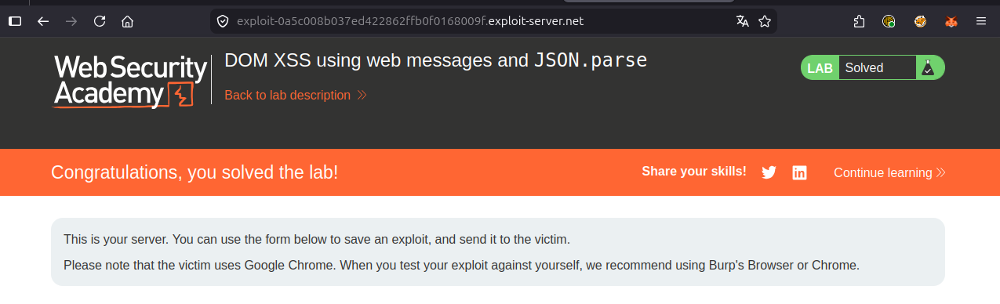

# Writeup: DOM XSS using web messages and JSON.parse (PortSwigger)

- **Lab**: DOM XSS using web messages and JSON.parse
- **URL**: https://portswigger.net/web-security/dom-based/controlling-the-web-message-source/lab-dom-xss-using-web-messages-and-json-parse
- **Categoría**: DOM-based vulnerabilities -> Controlling the web message source
- **Dificultad**: Practitioner
- **Credenciales**: no requiere login

---

## 1. Objetivo

Tercera variante de la serie de "controlling the web message source". Esta vez el listener parece bien diseñado: parsea el mensaje como JSON, espera un protocolo tipado (`{type: ..., ...}`), y usa un `switch` sobre el campo `type`. Aun así sigue siendo explotable porque (a) no valida `event.origin` y (b) el handler de uno de los tipos pasa un campo del mensaje directo a `iframe.src`, que ejecuta esquemas como `javascript:`.

El payload entrega un JSON válido con `type: "load-channel"` y `url: "javascript:print()"`. El listener parsea, hace match en el switch, y asigna el `javascript:` URI al `src` de un iframe interno. El navegador ejecuta `print()` en el contexto del lab.

### Lo importante antes de tocar nada

- **Validación de forma**, no de origen: el listener parsea JSON y exige una estructura específica. Eso bloquea strings random, no exploits con la forma correcta.
- **El sink es `iframe.src`**, no `innerHTML` ni `location.href`. Como `location.href`, también acepta esquema `javascript:` y lo ejecuta.
- **`ACMEplayer.element`**: la app guarda la referencia al iframe en una variable global, así que el handler del switch es algo como `ACMEplayer.element.src = data.url`. No hay sanitización.
- **El protocolo tipado da falsa sensación de seguridad**: el developer pensó que requerir JSON con `type` específico era validación suficiente. Es validación de formato, no de seguridad.

---

## 2. Reconocimiento

### 2.1 Identificar listener y handler

En el HTML de la home, algo equivalente a:

```html
<script>
    window.addEventListener('message', function(e) {
        var data = JSON.parse(e.data);
        switch (data.type) {
            case 'page-load':
                // ...
                break;
            case 'load-channel':
                ACMEplayer.element.src = data.url;
                break;
            case 'other-thing':
                // ...
                break;
        }
    });
</script>
```

Cuatro observaciones clave:

1. **Sigue sin validar `e.origin`**. El error raíz de toda la serie. El protocolo más bonito del mundo no compensa la falta del gate de origen.
2. **`JSON.parse(e.data)` requiere un string JSON válido**. Eso descarta payloads tipo `` (no es JSON, lanza excepción, el handler aborta). El payload tiene que tener forma correcta.
3. **`switch(data.type)`**: rutea por valor de campo. Cada `case` es un sub-handler. Hay que descubrir cuál tiene un sink explotable.
4. **`ACMEplayer.element.src = data.url`**: sink directo. `data.url` viaja sin validación al `src` de un iframe que existe en la página.

### 2.2 Por qué los payloads anteriores fallan

El payload del primer lab (``):

```js
JSON.parse('')
// SyntaxError: Unexpected token '<' in JSON at position 0
```

El listener arroja excepción antes de llegar al switch. Sin handler, sin sink. No funciona.

El payload del segundo lab (`javascript:print()//http:`):

```js
JSON.parse('javascript:print()//http:')
// SyntaxError: Unexpected token 'j' in JSON at position 0
```

Mismo problema. Hay que entregar JSON, no string suelto.

### 2.3 Mapear el switch para encontrar el sink

En un escenario real, hay que leer cada `case` del switch para identificar cuál pasa datos del mensaje a un sink peligroso. Aquí los sospechosos típicos:

- `case 'load-channel'`: asigna `data.url` a `iframe.src` → **sink**.
- `case 'page-load'`: probablemente sólo toggleea state interno → no sink.
- Otros cases: hay que revisarlos uno por uno.

Una vez identificado `load-channel`, sabemos qué `type` enviar y qué campo controlar (`url`).

---

## 3. Diseño del ataque

### Componentes

1. **Iframe** apuntando al lab. Misma técnica de entrega que los dos labs anteriores.
2. **Mensaje JSON con la forma correcta**: `{"type":"load-channel","url":"javascript:print()"}`. Pasa el `JSON.parse`, hace match en el case correcto, llega al sink.
3. **`javascript:` URI como valor de `url`**: cuando se asigna a `iframe.src`, el navegador interpreta el esquema y ejecuta el código.

### Payload

```html
<iframe src="https://LAB-ID.web-security-academy.net/"
        onload='this.contentWindow.postMessage("{\"type\":\"load-channel\",\"url\":\"javascript:print()\"}","*")'></iframe>
```

### Notas sobre el escapado

El payload requiere tres niveles de quoting:

1. **Atributo HTML `onload='...'`**: usamos comillas simples para el atributo, así las dobles internas no necesitan escape HTML.
2. **String JS dentro del onload**: el primer argumento de `postMessage` es un string. Como el atributo va en simples, usamos dobles para el string JS sin conflicto.
3. **JSON dentro del string JS**: JSON exige claves y valores entre dobles comillas. Como el string JS ya está en dobles, las dobles del JSON se escapan con `\"`.

Combinación final:

```
onload='this.contentWindow.postMessage("{\"type\":\"load-channel\",\"url\":\"javascript:print()\"}","*")'
```

Errores frecuentes:

- Olvidar el escape `\"` en el JSON: el browser parsea mal el atributo.
- Cruzar simples y dobles a la inversa (atributo en dobles, string en simples): el JSON necesita dobles, hay que reescribir.
- Pegar saltos de línea entre el HTML del iframe y el `onload` (algunos editores los meten): el atributo se rompe silenciosamente.

---

## 4. Por qué funciona

### 4.1 Validación de forma ≠ validación de seguridad

El developer estructuró el listener "como Dios manda" desde un punto de vista de protocolo:

- Mensaje serializado como JSON (interoperable, parseable).
- Discriminador explícito (`type`) con switch (extensible).
- Cada handler aislado en su `case` (separación de responsabilidades).

Todo eso es buen diseño de **API**, pero ninguno protege contra inyección. La validación de forma sólo asegura que el mensaje "tiene la estructura esperada"; no dice nada sobre si los **valores** son seguros para los sinks que los reciben.

El atacante no rompe el protocolo: lo **respeta**. Manda exactamente lo que el listener espera, sólo que con `url` apuntando a `javascript:` en vez de a una URL real de canal.

### 4.2 `iframe.src` ejecuta `javascript:` igual que `location.href`

Muchos sinks de URL ejecutan `javascript:`:

- `location.href = ...`
- `iframe.src = ...`
- `window.open(url)`
- `<a href>` clickeado
- `<form action>` enviado

El comportamiento es estándar: el navegador detecta el esquema `javascript:`, evalúa el resto como código en el contexto del documento que **inicia** la navegación (en el caso de `iframe.src`, el contexto es el iframe nuevo, pero el origen es el del documento padre que asigna el src).

Lo que hace este sink especialmente sigiloso: a diferencia de `location.href` (que cambia la URL visible), `iframe.src` modifica un iframe que probablemente está oculto o es pequeño en la UI. La víctima ni nota la navegación. La ejecución sucede sin pista visual.

### 4.3 El switch ayuda al atacante a entender el contrato

Paradójicamente, código bien estructurado **facilita** la explotación una vez que el atacante encuentra el listener. Si todo fuera spaghetti con condicionales anidados, habría que aplicar reverse engineering. Con switch explícito y nombres de tipo descriptivos (`load-channel`, `page-load`), el atacante lee el código una vez y sabe exactamente qué payload construir.

Este es un patrón general: **legibilidad ayuda tanto a defensores como a atacantes**. La defensa no está en ofuscar, sino en validar lo correcto en el lugar correcto.

---

## 5. Resolución

1. Abrir el lab. Inspeccionar el HTML de la home y localizar el listener `addEventListener('message', ...)`. Identificar el `JSON.parse`, el `switch(data.type)`, y el case `load-channel` con `ACMEplayer.element.src = data.url`.
2. (Opcional) Confirmar el sink localmente desde la consola:
   ```js
   window.postMessage('{"type":"load-channel","url":"javascript:print()"}', '*')
   ```
   Debe abrir el diálogo de impresión.
3. Ir al **Go to exploit server**. En el body del exploit, pegar:
   ```html
   <iframe src="https://LAB-ID.web-security-academy.net/"
           onload='this.contentWindow.postMessage("{\"type\":\"load-channel\",\"url\":\"javascript:print()\"}","*")'></iframe>
   ```
   Reemplazar `LAB-ID.web-security-academy.net` por el host real del lab.
4. Pulsar **Store** y luego **Deliver exploit to victim**.
5. El bot abre la página del exploit, el iframe carga el lab, el `onload` dispara `postMessage` con el JSON, el listener parsea, hace match en `load-channel`, asigna `javascript:print()` al iframe interno, el navegador ejecuta `print()`. El lab queda Solved.



Si tras "Deliver" el lab no se resuelve:

- JSON mal escapado. Verificar que las dobles internas estén `\"` y no `"` literales. Probar primero en consola con el string crudo.
- Olvido de la barra final o paréntesis del `print()`. El JS dentro de `javascript:` tiene que ser sintácticamente válido.
- `type` mal escrito (`"loadchannel"` en lugar de `"load-channel"`). El switch no hace match, no se llega al sink.
- Atributo `onload` partido en varias líneas por el editor. Mantenerlo en una sola.

---

## 6. Resumen de la cadena

```mermaid
flowchart TB
    A[1. Atacante hospeda exploit con iframe + postMessage de JSON]
    B[2. Victima visita la URL del exploit server]
    C[3. Iframe carga la home del lab con cookie de la victima]
    D[4. onload dispara postMessage con string JSON]
    E[5. Listener: JSON.parse parsea correctamente]
    F[6. switch matchea case 'load-channel']
    G[7. ACMEplayer.element.src = 'javascript:print()']
    H[8. Browser interpreta esquema javascript: y ejecuta print en el origen del lab]

    A --> B --> C --> D --> E --> F --> G --> H
```

Tres ideas para llevarse:

1. **Protocolo tipado no es validación de seguridad**. Forzar JSON estructurado bloquea payloads malformados, no payloads bien formados con valores peligrosos. La validación tiene que aplicarse a cada **valor** según su uso final, no sólo a la estructura del contenedor.
2. **Cualquier sink de URL es sink de XSS si acepta `javascript:`**. `iframe.src`, `location.href`, `window.open`, `<a href>`, `<form action>` son todos vectores. La defensa es allowlist de esquemas (`http`, `https`, casos específicos como `mailto`), nunca blocklist ni regex sobre el string crudo.
3. **El gate de seguridad cross-origin de postMessage es siempre `event.origin`**. Toda esta serie de labs (sin validación → indexOf roto → JSON tipado) tiene la misma raíz: nunca se mira `e.origin`. Los demás detalles cambian; ese fallo es constante. Si ves un listener de `message` en code review y no comprueba `e.origin`, es bug aunque el resto esté impecable.

---

## 7. Contramedidas

Defensas en orden de robustez:

1. **Validar `event.origin` con allowlist**. Sigue siendo el control imprescindible:
   ```js
   window.addEventListener('message', function(e) {
       if (e.origin !== 'https://trusted.example') return;
       // resto del handler
   });
   ```
2. **Validar valores con allowlist por sink**. Para `data.url` que va a `iframe.src`, parsear y validar esquema:
   ```js
   case 'load-channel':
       try {
           const u = new URL(data.url);
           if (u.protocol !== 'https:') return;
           ACMEplayer.element.src = u.href;
       } catch { return; }
       break;
   ```
   Allowlist explícita de esquema y validación con parser real (`new URL()`), no regex.
3. **Reducir `data` a un identificador interno cuando sea posible**. Si los canales legítimos están en una lista cerrada del lado cliente, mejor:
   ```js
   const CHANNELS = {a: 'https://lab/a', b: 'https://lab/b'};
   case 'load-channel':
       if (!(data.id in CHANNELS)) return;
       ACMEplayer.element.src = CHANNELS[data.id];
       break;
   ```
   El atacante ya no controla la URL final, sólo escoge entre opciones predefinidas.
4. **Validar el shape del JSON**. Ejemplo con `typeof` o JSON Schema:
   ```js
   if (typeof data !== 'object' || typeof data.type !== 'string') return;
   ```
   Reduce el ruido y bloquea variantes inesperadas.
5. **CSP con `script-src` estricto**. Bloquea `javascript:` URIs en algunos navegadores y prohíbe inline JS. No sustituye a la validación, pero limita el blast radius.
6. **`Trusted Types` aplicado a sinks de URL**. Mecanismo emergente: declara que ciertos sinks sólo aceptan objetos `TrustedScriptURL` creados por una policy explícita. Hace que asignaciones inseguras como `iframe.src = userInput` lancen excepción.

---

## 8. Referencias

- PortSwigger Web Security Academy. (s.f.). *Lab: DOM XSS using web messages and JSON.parse*. https://portswigger.net/web-security/dom-based/controlling-the-web-message-source/lab-dom-xss-using-web-messages-and-json-parse
- PortSwigger Web Security Academy. (s.f.). *DOM-based vulnerabilities*. https://portswigger.net/web-security/dom-based
- MDN Web Docs. (s.f.). *Window: postMessage() method*. https://developer.mozilla.org/en-US/docs/Web/API/Window/postMessage
- MDN Web Docs. (s.f.). *JSON.parse()*. https://developer.mozilla.org/en-US/docs/Web/JavaScript/Reference/Global_Objects/JSON/parse
- MDN Web Docs. (s.f.). *HTMLIFrameElement: src property*. https://developer.mozilla.org/en-US/docs/Web/API/HTMLIFrameElement/src
- OWASP Foundation. (s.f.). *DOM based XSS Prevention Cheat Sheet*. https://cheatsheetseries.owasp.org/cheatsheets/DOM_based_XSS_Prevention_Cheat_Sheet.html
- W3C. (s.f.). *Trusted Types*. https://www.w3.org/TR/trusted-types/
- Inventario interno: [`inventario/03-analisis-vulnerabilidades/web/analisis-xss.md`](../../../inventario/03-analisis-vulnerabilidades/web/analisis-xss.md)
- Inventario interno: [`inventario/04-explotacion/web/explotacion-xss.md`](../../../inventario/04-explotacion/web/explotacion-xss.md)
- Writeup hermano (sin validación, sink innerHTML): [`learning/portswigger/dom-xss-using-web-messages/writeup.md`](../dom-xss-using-web-messages/writeup.md)
- Writeup hermano (validación con indexOf, sink location.href): [`learning/portswigger/dom-xss-using-web-messages-and-javascript-url/writeup.md`](../dom-xss-using-web-messages-and-javascript-url/writeup.md)
