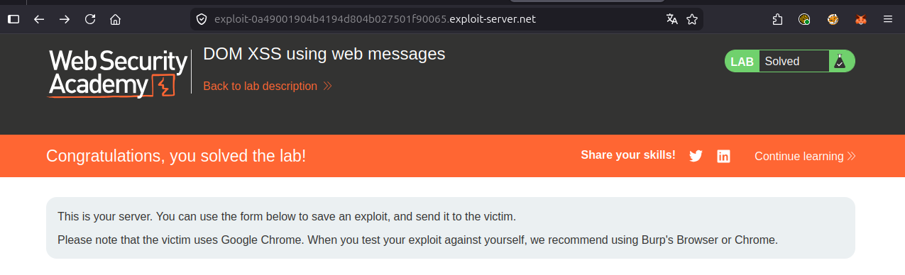
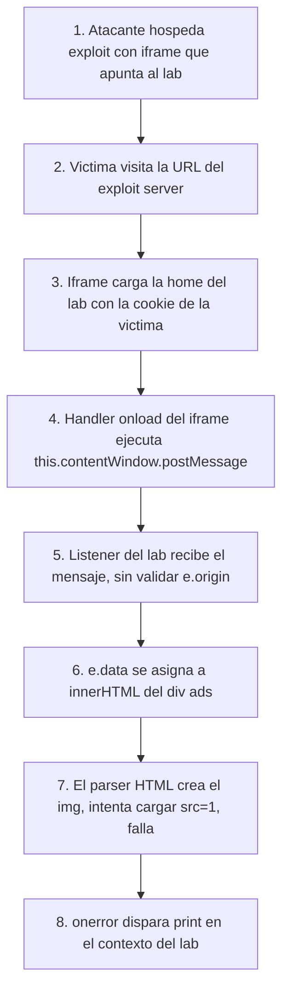

# Writeup: DOM XSS using web messages (PortSwigger)

- **Lab**: DOM XSS using web messages
- **URL**: https://portswigger.net/web-security/dom-based/controlling-the-web-message-source/lab-dom-xss-using-web-messages
- **Categoría**: DOM-based vulnerabilities -> Controlling the web message source
- **Dificultad**: Apprentice
- **Credenciales**: no requiere login

---

## 1. Objetivo

La home del lab registra un `message` listener que toma el `event.data` recibido por `window.postMessage()` y lo escribe directamente en `innerHTML` de un elemento del DOM (la zona de "ads"). No valida `event.origin` ni `event.source`, así que cualquier iframe que apunte al lab puede inyectar HTML arbitrario.

Para resolverlo hay que entregar a la víctima (bot de PortSwigger) una página del exploit server que contiene un iframe apuntando al lab. El iframe, al cargar, hace `postMessage()` con un payload que ejecuta `print()` en el contexto del lab.

### Lo importante antes de tocar nada

- **Sink**: `document.getElementById('ads').innerHTML = e.data` (o equivalente). Es un sink HTML, no JS, así que el payload tiene que parsearse como HTML y disparar el código vía un atributo de evento.
- **Source confiable que falta**: el handler **no comprueba** `event.origin`. Esa es la vulnerabilidad real. Si el código fuera `if (e.origin !== 'https://lab/') return;`, el ataque no funcionaría.
- **Por qué `<script>` no sirve**: HTML5 `innerHTML` no ejecuta tags `<script>` insertadas dinámicamente. Hay que usar un atributo de evento sobre un tag que sí dispare un evento al ser parseado (``, `<svg onload>`, `<iframe onload>`, etc.).
- **Trigger requerido**: el lab se marca como resuelto cuando se llama `print()` en el navegador del bot. No `alert()`. Esto es porque `alert` se silencia en el headless del bot; `print` abre el diálogo de impresión y deja un evento detectable.

---

## 2. Reconocimiento

### 2.1 Identificar el listener

En el HTML de la home, al final del body hay algo equivalente a:

```html
<script>
    window.addEventListener('message', function(e) {
        document.getElementById('ads').innerHTML = e.data;
    });
</script>
```

Tres bandera rojas en cinco líneas:

1. Listener registrado a nivel `window`, así que recibe mensajes de cualquier origen.
2. No filtra `e.origin` ni `e.source`. Cualquier ventana/frame que llame `postMessage` al lab dispara el handler.
3. El payload va directo a `innerHTML`. Sink HTML clásico.

### 2.2 Confirmar el sink en local

Abrir DevTools en la home del lab y disparar manualmente:

```js
window.postMessage('', '*');
```

Como el listener está en la misma ventana, el handler corre, el `innerHTML` recibe el ``, el navegador intenta cargar `src=x`, falla, y se ejecuta `print()`. Si el diálogo de impresión aparece, el sink está confirmado y el payload es válido.

Esto sólo prueba que la vulnerabilidad existe; no resuelve el lab. Para resolverlo, el `print()` tiene que dispararse en el navegador **del bot víctima**, lo que requiere entregar el exploit por el exploit server.

---

## 3. Diseño del ataque

### Componentes

1. **Iframe** apuntando a la home del lab. Al cargar, ejecuta `postMessage()` desde el handler `onload` del iframe, dirigido a `this.contentWindow` (la ventana del lab).
2. **Payload HTML** dentro del mensaje: ``. El tag `` con `src` inválido garantiza que el evento `onerror` dispare en cuanto el navegador intente cargar la "imagen".
3. **`targetOrigin = '*'`**: aceptar cualquier origen, porque no nos importa proteger el mensaje (ya somos el atacante). Si el listener filtrara `e.origin`, esto no bastaría.

### Payload

```html
<iframe src="https://LAB-ID.web-security-academy.net/"
        onload="this.contentWindow.postMessage('','*')"></iframe>
```

### Notas sobre los valores

- **`onload` del iframe vs `setTimeout`**: el handler `onload` se dispara después de que el iframe completa la carga, momento en el que su `contentWindow` ya tiene registrado el listener. Disparar antes (vía script en la página padre que corre antes del load) puede llegar antes de que el listener exista y el mensaje se pierda.
- **`this.contentWindow`**: dentro del handler `onload="..."`, `this` es el `<iframe>`. Su `contentWindow` es la ventana del lab donde vive el listener.
- **``**: cualquier valor que no resuelva a una imagen válida vale (`src=x`, `src=1`, `src=//does-not-exist`). El objetivo es forzar `onerror`.
- **`print()` no `alert()`**: requisito específico del bot de PortSwigger.
- **`'*'` como targetOrigin**: vale aquí porque el listener no valida origin. En un escenario real con validación, habría que poner el origin exacto del lab.

---

## 4. Por qué funciona

### 4.1 La Same-Origin Policy NO bloquea `postMessage`

`postMessage` es justamente el mecanismo diseñado para comunicación cross-origin segura entre ventanas. Cualquier ventana puede llamar `postMessage` sobre cualquier otra ventana a la que tenga referencia (`window.opener`, `iframe.contentWindow`, `window.parent`, etc.). La SOP no interviene; la **validación es responsabilidad del listener**.

El error del desarrollador no es exponer un endpoint público: es no comprobar quién mandó el mensaje. El equivalente en HTTP sería un endpoint que acepta POSTs sin autenticación.

### 4.2 `innerHTML` parsea HTML pero no ejecuta `<script>`

Esto es una mitigación parcial del estándar HTML5: insertar `<script>` vía `innerHTML` no lo ejecuta. Por eso el payload usa `` con `onerror`. La regla práctica para sinks `innerHTML` es: **buscar tags con atributos de evento que disparen al ser parseados/renderizados**, no tags que dependen de ejecución de script directo.

Otros payloads equivalentes que funcionarían:

```html
<svg onload=print()>
<iframe src=javascript:print()>
<details open ontoggle=print()>
<input autofocus onfocus=print()>
```

### 4.3 El `print()` corre en el origen del lab, no en el del exploit server

Esto es lo que vuelve útil el ataque. El handler está en `window` del lab; cuando se ejecuta el `onerror`, está en el contexto JS del lab, con acceso a sus cookies, su DOM y su LocalStorage. Si el payload fuera `fetch('/api/account', {credentials: 'include'})`, robaría datos del lab.

El exploit server del atacante sólo aporta el iframe: el código nocivo corre **dentro del lab**, gracias a que el lab mismo lo inyectó en su propio `innerHTML`.

---

## 5. Resolución

1. Abrir el lab. En la home, ver en el HTML el listener `window.addEventListener('message', ...)` que escribe en `#ads`.
2. (Opcional) Confirmar el sink localmente desde la consola: `window.postMessage('', '*')`. Debe abrir el diálogo de impresión.
3. Ir al **Go to exploit server**. En el body del exploit, pegar:
   ```html
   <iframe src="https://LAB-ID.web-security-academy.net/"
           onload="this.contentWindow.postMessage('','*')"></iframe>
   ```
   Reemplazar `LAB-ID.web-security-academy.net` por el host real del lab.
4. Pulsar **Store** y luego **Deliver exploit to victim**.
5. El bot abre la página del exploit, el iframe carga el lab, el `onload` dispara `postMessage`, el listener escribe el `` en `#ads`, el navegador intenta cargar `src=1`, falla, ejecuta `print()`. El lab queda Solved.



Si tras "Deliver" el lab no se resuelve:

- El placeholder `LAB-ID` no se reemplazó. Verificar que el iframe apunta al host real, no al genérico.
- El payload usa `alert()` en vez de `print()`. PortSwigger sólo detecta `print` para este lab.
- El `onload` está mal escrito (comilla simple/doble cruzada). Mantener exactamente la combinación `onload="...postMessage('...','*')"`.

---

## 6. Resumen de la cadena



Tres ideas para llevarse:

1. **`postMessage` es cross-origin por diseño; el listener es la frontera de seguridad**. La SOP no protege aquí. Cualquier listener de `message` debe validar `event.origin` (y muchas veces también `event.source`) antes de tocar el `event.data`.
2. **`innerHTML` no ejecuta `<script>`, pero ejecuta atributos de evento**. Un sink HTML siempre es explotable con ``, `<svg onload>`, etc. La mitigación real es **no usar `innerHTML` para datos no confiables**; usar `textContent` o sanitizar con DOMPurify.
3. **El payload corre en el origen del listener**. Lo que parece "sólo un alert" puede en realidad ejecutar fetch autenticado, leer DOM, robar tokens del LocalStorage del origen víctima. La gravedad depende del valor de ese origen, no del payload de prueba.

---

## 7. Contramedidas

Defensas en orden de robustez:

1. **Validar `event.origin` en el listener**. Lista blanca explícita:
   ```js
   window.addEventListener('message', function(e) {
       if (e.origin !== 'https://trusted-partner.example') return;
       // procesar e.data
   });
   ```
   Sin esta comprobación, cualquier página con un iframe al lab puede inyectar contenido.
2. **Validar `event.source` cuando aplique**. Para flujos multi-ventana (popups, OAuth), confirmar que el mensaje viene de la ventana esperada, no sólo de un origen permitido.
3. **No usar `innerHTML` para `event.data`**. Si el dato debe mostrarse como texto, usar `textContent`. Si debe ser HTML estructurado, sanitizar con una librería como DOMPurify antes de asignarlo.
4. **Definir un protocolo de mensaje tipado**. Esperar un objeto con campos conocidos (`{type: 'addAd', payload: '...'}`), rechazar cualquier `e.data` que no encaje. Reduce la superficie de inyección.
5. **CSP con `script-src` estricto**. Aunque no impide la inyección HTML del ``, una CSP que prohíba inline event handlers (`script-src 'self'` sin `'unsafe-inline'`) bloquea el `onerror=print()`. Es defensa en profundidad: si el listener falla en validar, la CSP corta la ejecución.
6. **`Content-Security-Policy: frame-ancestors 'none'`** sobre la home reduce los ataques que requieren framear el lab desde un origen externo. No impide ataques desde popups/`window.open`, así que no sustituye a la validación del listener.

---

## 8. Referencias

- PortSwigger Web Security Academy. (s.f.). *Lab: DOM XSS using web messages*. https://portswigger.net/web-security/dom-based/controlling-the-web-message-source/lab-dom-xss-using-web-messages
- PortSwigger Web Security Academy. (s.f.). *DOM-based vulnerabilities*. https://portswigger.net/web-security/dom-based
- MDN Web Docs. (s.f.). *Window: postMessage() method*. https://developer.mozilla.org/en-US/docs/Web/API/Window/postMessage
- MDN Web Docs. (s.f.). *Window: message event*. https://developer.mozilla.org/en-US/docs/Web/API/Window/message_event
- OWASP Foundation. (s.f.). *DOM based XSS Prevention Cheat Sheet*. https://cheatsheetseries.owasp.org/cheatsheets/DOM_based_XSS_Prevention_Cheat_Sheet.html
- Inventario interno: [`inventario/03-analisis-vulnerabilidades/web/analisis-xss.md`](../../../inventario/03-analisis-vulnerabilidades/web/analisis-xss.md)
- Inventario interno: [`inventario/04-explotacion/web/explotacion-xss.md`](../../../inventario/04-explotacion/web/explotacion-xss.md)
