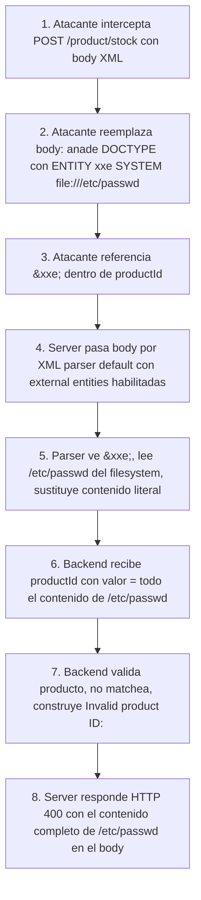

# Writeup: Exploiting XXE using external entities to retrieve files (PortSwigger)

- **Lab**: Exploiting XXE using external entities to retrieve files
- **URL**: https://portswigger.net/web-security/xxe/lab-exploiting-xxe-to-retrieve-files
- **Categoría**: XXE (XML External Entity) -> Lectura de archivos vía entidad externa con reflexión en error
- **Dificultad**: Apprentice
- **Credenciales**: no requiere login

---

## 1. Objetivo

El lab tiene una tienda con un botón "Check stock" que envía una petición POST `/product/stock` con un body XML (`productId` + `storeId`). El servidor parsea el XML y refleja el `productId` en el mensaje de error si es inválido. Se trata de leer `/etc/passwd` declarando una entidad externa que apunte a ese archivo y referenciándola desde `<productId>`. El parser expande la entidad sustituyendo el contenido literal del archivo, el server lo trata como ID inválido, y al construir el mensaje "Invalid product ID: ..." el archivo aparece en la respuesta.

### Lo importante antes de tocar nada

- **Vector**: el parser XML del backend tiene resolución de **entidades externas** activada. Esto es el comportamiento legacy de XML 1.0. Parsers modernos vienen "secure by default" con esta feature deshabilitada; el lab simula un parser hardened-NO.
- **Canal de exfiltración**: reflexión del `productId` en el mensaje de error (`"Invalid product ID: <valor>"`). Sin reflexión esto sería **blind XXE** y haría falta exfil OOB (otro lab de la serie).
- **Schema de URL**: `file:///etc/passwd`. Tres barras: `file://` (protocolo) + host vacío + path absoluto `/etc/passwd`. Equivalente a `file://localhost/etc/passwd`.
- **Trampa de copy-paste**: la `<?xml ?>` declaration tiene que estar en el byte 0 del documento. Cualquier espacio/newline antes la convierte en processing instruction y el parser rechaza con `"The processing instruction target matching '[xX][mM][lL]' is not allowed"`. La forma robusta es **omitirla** (es opcional en XML 1.0).

---

## 2. Reconocimiento

### 2.1 Identificar el sink XML

En cualquier producto, click "View details" y luego "Check stock". Burp captura:

```http
POST /product/stock HTTP/2
Host: LAB.web-security-academy.net
Content-Type: application/xml
Content-Length: ...

<?xml version="1.0" encoding="UTF-8"?>
<stockCheck>
  <productId>1</productId>
  <storeId>1</storeId>
</stockCheck>
```

Tres señales de que es vulnerable a XXE:

1. **Content-Type: application/xml**: confirma que el server pasará el body por un XML parser.
2. **Estructura del XML refleja campos del backend**: `productId` se mapea a un valor que el servidor procesa. Si lo modifico, el server tiene que parsearlo y exponerlo de algún modo.
3. **No hay header anti-XXE visible** (ej. `X-Content-Type-Options` específico, `Content-Security-Policy` no aplica al backend XML). Eso no demuestra vulnerabilidad pero no la descarta.

### 2.2 Probar reflexión sin payload XXE

Antes de construir el payload, confirmar que el `productId` se refleja. Cambiar a `<productId>9999</productId>` y enviar. La respuesta:

```
"Invalid product ID: 9999"
```

Reflejo confirmado. Ese reflejo es el canal por el cual saldrá el contenido del archivo cuando lo inyectemos vía entidad.

---

## 3. Diseño del ataque

### 3.1 Payload final (validado)

```xml
<!DOCTYPE foo [ <!ENTITY xxe SYSTEM "file:///etc/passwd"> ]>
<stockCheck>
  <productId>&xxe;</productId>
  <storeId>1</storeId>
</stockCheck>
```

### 3.2 Diseccionando

- **`<!DOCTYPE foo [ ... ]>`**: declaración del Document Type con DTD interno (las entidades van entre los corchetes). El nombre `foo` es arbitrario; podría ser cualquier identificador. Algunos parsers exigen que coincida con el root element; los que no, aceptan cualquier nombre.
- **`<!ENTITY xxe SYSTEM "file:///etc/passwd">`**: declara una entidad de tipo **external**. El keyword `SYSTEM` indica al parser que el contenido **no es texto inline** sino un recurso externo identificado por la URL. Cuando alguien referencie `&xxe;` en el documento, el parser **dispara una resolución** del recurso (lectura de archivo, fetch HTTP, etc.) y reemplaza la referencia con el contenido obtenido.
- **`&xxe;` dentro de `<productId>`**: la referencia. El parser la expande durante el parse, sustituyendo `&xxe;` por el contenido literal de `/etc/passwd` (algo tipo `root:x:0:0:root:/root:/bin/bash\ndaemon:...`). El valor que ve el código del backend al pedir `productId` es **el archivo entero**.
- **`<storeId>1</storeId>`**: irrelevante para el ataque, pero se mantiene para que el XML siga siendo válido estructuralmente y el server llegue al punto donde refleja el `productId`.

### 3.3 Por qué se omite `<?xml version="1.0" encoding="UTF-8"?>`

El payload "canónico" en docs de PortSwigger incluye la declaración `<?xml ?>` al principio. Es opcional en XML 1.0 (UTF-8 y version 1.0 son defaults asumidos). En la práctica, **omitirla es más robusto** por una razón concreta:

La spec XML obliga a que `<?xml ?>` esté **literalmente en el byte 0** del documento. Cualquier carácter previo (espacio, newline, BOM) hace que el parser ya no la reconozca como XML declaration sino como **processing instruction (PI)**. Pero el spec también prohíbe PIs cuyo target match `[xX][mM][lL]`. Resultado: error fatal:

```
org.xml.sax.SAXParseException; lineNumber: 1; columnNumber: 8;
The processing instruction target matching "[xX][mM][lL]" is not allowed.
```

Pegar el payload en Burp Repeater es una fuente común de este error porque el editor puede dejar un newline inicial o reformatear el body. Omitir la declaración elimina el problema sin afectar el parseo del DOCTYPE ni de las entidades.

### 3.4 Por qué `file:///etc/passwd` y no `http://...`

`file://` instruye al parser a leer del filesystem local del servidor. Es el vector clásico de XXE para LFI. Otros esquemas con uses distintos:

- `http://internal/...`: SSRF a redes internas. Útil si la red interna tiene servicios que no requieren auth o que el parser puede alcanzar pero el atacante no.
- `expect://`, `php://`, `phar://`: en PHP con extensiones específicas, ejecución de código o lectura con filtros. Ninguno aplica acá (Java backend).
- `ftp://`: a veces útil para confirmar resolución sin servicio HTTP.
- `jar://`, `netdoc://`: en parsers Java, otros vectores documentados (algunos permiten listing de directorios).

Para este lab `/etc/passwd` es la prueba canónica: archivo legible por cualquier proceso en Linux, formato de líneas que sobrevive bien a la inserción en XML porque no contiene caracteres especiales XML (`<`, `>`, `&`).

### 3.5 Por qué el archivo no rompe el parser al insertarse

Cuando el parser sustituye `&xxe;` por el contenido de `/etc/passwd`, ese contenido se vuelve parte del documento parseado. Si el archivo contuviera caracteres especiales XML (`<`, `>`, `&`, `"`, `'`), **rompería el parse** porque el sustituto se interpreta como texto del XML. `/etc/passwd` afortunadamente solo tiene caracteres alfanuméricos, `:`, `/`, `_`, `-`, ninguno de los cuales tiene significado especial dentro de un elemento.

Para archivos que sí contienen `<`/`&` (código fuente, configuraciones), hay que pasarlos por un wrapper que los codifique en base64 o similar. PHP lo permite con `php://filter/read=convert.base64-encode/resource=...`. En Java sin esa magic URL hay que leer el archivo y exfiltrar OOB con DTD remoto. Eso lo cubre el lab "Blind XXE with out-of-band interaction".

---

## 4. Por qué funciona

### 4.1 La feature de external entities es un default histórico vulnerable

XML viene de los 90s con la idea de "documentos componibles": un XML podría declarar entidades cuyo contenido vive en archivos o URLs separadas, y el parser las junta automáticamente al procesar. Era razonable cuando XML se usaba para documentos editoriales internos y nadie pensaba en input adversarial.

Cuando XML se popularizó como formato de transporte para APIs públicas (SOAP, RSS, OAI-PMH, etc.), esa feature se volvió un agujero estructural: cualquier documento parseado por un parser default puede pedirle al server que lea archivos arbitrarios o haga requests internas.

Parsers afectados históricamente:
- **Java DocumentBuilderFactory**: vulnerable por default en versiones antiguas. Fix: setear `setFeature("http://apache.org/xml/features/disallow-doctype-decl", true)` o `setFeature("http://xml.org/sax/features/external-general-entities", false)`.
- **libxml2**: vulnerable antes de versiones recientes. Fix: `LIBXML_NOENT` desactivado y `LIBXML_DTDLOAD` desactivado.
- **.NET XmlDocument**: vulnerable antes de .NET 4.5.2 con `XmlResolver` no nulo. Fix: `XmlResolver = null`.
- **Python xml.etree**: relativamente seguro. **lxml** y **xml.sax** sí son vulnerables si se configuran mal. La librería **defusedxml** es el wrapper canónico que neutraliza todas las features.

### 4.2 La reflexión convierte un parse server-side en oráculo de lectura

XXE puro (sin canal de salida) ya es peligroso por SSRF y blind file read. Pero con un canal de reflexión la severidad sube: el atacante recupera el contenido **inmediatamente en la respuesta HTTP**, sin necesidad de Collaborator ni infra externa.

El bug de "reflejar el input en el error" es **inocuo por sí solo** (un usuario ve su propio input en un error, no hay leak), pero combinado con XXE se vuelve un canal de exfiltración. Es el patrón típico: dos defectos individualmente menores que combinados producen lectura arbitraria de archivos.

### 4.3 El parser no escapa el contenido sustituido

Una mitigación parcial sería que el parser, al sustituir la entidad, escape los caracteres especiales del contenido para que no rompan el documento padre. Ningún parser hace eso por defecto: la sustitución es **textual cruda**. Esto explica por qué archivos con `<` o `&` rompen el ataque, y por qué los exploits "robustos" usan wrapper URIs (`php://filter` para base64-encodear) cuando es posible.

---

## 5. Resolución

1. Navegar a la tienda. Elegir cualquier producto, click "View details", click "Check stock".
2. En Burp Proxy, capturar la petición POST `/product/stock`. Mandar a Repeater (Ctrl+R).
3. En Repeater, seleccionar todo el body XML y reemplazarlo por:
   ```xml
   <!DOCTYPE foo [ <!ENTITY xxe SYSTEM "file:///etc/passwd"> ]>
   <stockCheck>
     <productId>&xxe;</productId>
     <storeId>1</storeId>
   </stockCheck>
   ```
   Mantener `Content-Type: application/xml` en el header.
4. Send. La respuesta debe llegar como HTTP 400 con body `"Invalid product ID: root:x:0:0:root:/root:/bin/bash\ndaemon:..."` (el contenido completo de `/etc/passwd`).
5. Lab marca como Solved.

Si tras enviar:

- **`org.xml.sax.SAXParseException; lineNumber: 1; columnNumber: 8; The processing instruction target matching "[xX][mM][lL]" is not allowed"`**: hay un newline o espacio antes del `<?xml`. Solución: omitir la declaración `<?xml ?>` por completo (como en el payload de arriba).
- **`&xxe;` aparece literal en la respuesta**: el parser no expandió la entidad. Verificar que el `<!DOCTYPE>` está bien formado y que `&xxe;` está dentro del elemento, no en un atributo.
- **HTTP 500 sin contenido útil**: el contenido del archivo rompió el XML resultante por algún carácter especial. No debería pasar con `/etc/passwd`. Si pruebas con otro archivo (ej. `/etc/shadow`) y se rompe, asumir que tiene caracteres XML-incompatibles y pasar a OOB.
- **Content-Type cambió a `text/plain` o JSON**: el server no enrutó al parser XML. Restaurar `application/xml`.

---

## 6. Resumen de la cadena



Tres ideas para llevarse:

1. **XXE no necesita complejidad. Una entidad SYSTEM y un campo reflejado bastan**. La sofisticación viene cuando no hay reflexión (blind, OOB, error-based con DTD remoto), pero el caso base es trivial y muy común en código legacy. Cualquier endpoint que acepte XML user-controlled merece un test rápido de XXE antes que cualquier otra cosa.
2. **La reflexión de input en errores es un bug por separado que se vuelve crítico en combo**. Si tu app refleja input en mensajes de error, eso ya merece eliminarse aunque no veas vector inmediato; mañana alguien acopla eso con XXE/SSTI/SQLi/etc. y se vuelve canal de leak.
3. **`<?xml ?>` declaration tiene una invariante de byte 0 que rompe el parse en cuanto hay un space delante**. El error específico (`processing instruction target matching xml is not allowed`) es la firma de ese problema. La forma robusta de escribir payloads XXE es omitir la declaración salvo que el parser exija explícitamente versión o encoding distintos del default.

---

## 7. Contramedidas

Defensas en orden de robustez:

1. **Deshabilitar resolución de entidades externas y DTDs en el parser**. La fix de raíz. En Java:
   ```java
   DocumentBuilderFactory dbf = DocumentBuilderFactory.newInstance();
   dbf.setFeature("http://apache.org/xml/features/disallow-doctype-decl", true);
   dbf.setFeature("http://xml.org/sax/features/external-general-entities", false);
   dbf.setFeature("http://xml.org/sax/features/external-parameter-entities", false);
   dbf.setXIncludeAware(false);
   dbf.setExpandEntityReferences(false);
   ```
   En Python con `xml.etree`/`lxml`: usar **defusedxml**. En .NET: `XmlResolver = null`.
2. **Cambiar formato de transporte a JSON**. Menos historia legacy, sin equivalente directo de external entities. No siempre posible (APIs SOAP, integraciones legacy), pero para endpoints nuevos es la default que más reduce superficie.
3. **Validar contra XSD estricto que no permita DTD interno**. Algunos parsers permiten configurar "schema-only", rechazando `<!DOCTYPE>` declarations independientemente de lo que el código del parser haga después.
4. **WAF con reglas anti-DOCTYPE**. Mitigación reactiva. ModSecurity y similares tienen reglas para detectar `<!DOCTYPE` con `SYSTEM` keyword en bodies XML. Frágil (bypass con encoding, nesting), no sustituye al fix de raíz.
5. **Filesystem permissions estrictos para el proceso del parser**. Defense in depth: si el parser corre como un usuario no privilegiado y `/etc/passwd` está fuera de su jail, la entidad falla al resolver. Útil como capa adicional, no como única defensa.
6. **No reflejar input en errores**. Independiente del fix XXE, eliminar la reflexión rompe el canal de leak para este vector y para futuros vectores que no anticipas.

---

## 8. Referencias

- PortSwigger Web Security Academy. (s.f.). *Lab: Exploiting XXE using external entities to retrieve files*. https://portswigger.net/web-security/xxe/lab-exploiting-xxe-to-retrieve-files
- PortSwigger Web Security Academy. (s.f.). *XML external entity (XXE) injection*. https://portswigger.net/web-security/xxe
- W3C. (2008). *Extensible Markup Language (XML) 1.0 (Fifth Edition)*. https://www.w3.org/TR/xml/
- OWASP Foundation. (s.f.). *XML External Entity Prevention Cheat Sheet*. https://cheatsheetseries.owasp.org/cheatsheets/XML_External_Entity_Prevention_Cheat_Sheet.html
- OWASP Foundation. (s.f.). *XML External Entity (XXE) Processing*. https://owasp.org/www-community/vulnerabilities/XML_External_Entity_(XXE)_Processing
- defusedxml. (s.f.). *defusedxml documentation*. https://pypi.org/project/defusedxml/
- Inventario interno: [`inventario/03-analisis-vulnerabilidades/web/analisis-xxe.md`](../../../inventario/03-analisis-vulnerabilidades/web/analisis-xxe.md)
