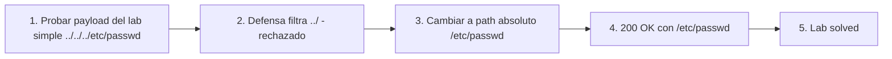

# Writeup: File path traversal, traversal sequences blocked with absolute path bypass (PortSwigger)

- **Lab**: File path traversal, traversal sequences blocked with absolute path bypass
- **URL**: https://portswigger.net/web-security/file-path-traversal/lab-absolute-path-bypass
- **Categoría**: File path traversal / Directory traversal / LFI
- **Dificultad**: Practitioner
- **Credenciales**: no requiere login

---

## 1. Objetivo

Mismo target que el lab simple (`/etc/passwd`), mismo endpoint vulnerable (`/image?filename=`), pero la app **bloquea secuencias `../`**. Bypass: usar un **path absoluto** que no contenga `..`.

Payload final:

```
GET /image?filename=/etc/passwd HTTP/2
```

Response:

```
HTTP/2 200 OK
Content-Type: image/jpeg
Content-Length: 2316

root:x:0:0:root:/root:/bin/bash
daemon:x:1:1:daemon:/usr/sbin:/usr/sbin/nologin
...
```

### Insight central

**Filtrar `../` no es defensa contra path traversal**: la idea de "traversal" en el filtro asume que para salir del directorio base hay que "subir" con `..`. Pero **un path absoluto no necesita subir** — empieza desde la raíz. Si el código hace `os.path.join(BASE, filename)` o equivalente, y `filename` empieza con `/`, el join descarta el prefijo y abre el path absoluto directamente. La defensa correcta sigue siendo la misma del lab anterior: **canonicalizar y validar que el resultado quede dentro del directorio permitido**, no filtrar tokens del input.

---

## 2. Recon y resolución

### 2.1 Identificar la defensa

Endpoint igual al lab simple: navegar a un producto, capturar `GET /image?filename=XX.jpg`. Send to Repeater. Probar el payload del lab simple para confirmar la defensa anunciada por el título del lab:

```
GET /image?filename=../../../etc/passwd HTTP/2
```

Esperado: error/imagen rota (la app filtra `../`). El comportamiento exacto depende de la implementación: 400, 500, 200 con imagen vacía, o respuesta normal con el filename strippeado y el path resolviendo a algo dentro del directorio base que no existe.

### 2.2 Bypass con path absoluto

```
GET /image?filename=/etc/passwd HTTP/2
```

Response 200 con `/etc/passwd`. Lab solved.

El payload no contiene `..`, así que cualquier filter naïve que busca esa secuencia (`if '../' in filename: reject`, `filename.replace('../', '')`) no se dispara. Pero el path resultante igual escapa del directorio base por una razón distinta: la semántica de "joining" de paths absolutos.

---

## 3. Por qué funciona

### 3.1 La pista en la descripción del lab

> *"The application blocks traversal sequences but treats the supplied filename as being relative to a default working directory."*

Eso sugiere una de estas dos implementaciones:

```python
# Opción A: chdir + open relativo
@app.route('/image')
def image():
    filename = request.args['filename']
    if '../' in filename:
        abort(400)
    os.chdir('/var/www/images')
    return send_file(open(filename))  # open() resuelve relativo al cwd
```

```python
# Opción B: os.path.join (o Path.resolve, en Java)
@app.route('/image')
def image():
    filename = request.args['filename']
    if '../' in filename:
        abort(400)
    path = os.path.join('/var/www/images', filename)
    return send_file(path)
```

En ambos casos, el filter de `../` rechaza traversal relativo. **Ambos casos también ignoran el directorio base cuando el filename es absoluto**:

- En la opción A: `open('/etc/passwd')` abre `/etc/passwd` directamente; el cwd `/var/www/images` es irrelevante porque `/etc/passwd` ya empieza desde la raíz.
- En la opción B: `os.path.join('/var/www/images', '/etc/passwd')` devuelve **`/etc/passwd`** (no `/var/www/images/etc/passwd`). Comportamiento documentado de Python: si un componente posterior es absoluto, los anteriores se descartan. Java `Path.resolve()` tiene la misma semántica.

Esa propiedad — "absolute paths win" en operaciones de concatenación de paths — es la que el atacante explota.

### 3.2 Por qué la concatenación textual cruda NO sería vulnerable a este payload

Compará con un código distinto:

```python
# Concatenación textual cruda - vulnerable al lab simple, pero NO a este payload
path = '/var/www/images/' + filename
# filename = '/etc/passwd' produce: '/var/www/images//etc/passwd'
```

Linux/POSIX canonicaliza `//` como `/`, así que `/var/www/images//etc/passwd` resuelve a `/var/www/images/etc/passwd` — **dentro del directorio base**, no a `/etc/passwd`. Este payload fallaría contra concatenación textual cruda.

Que el bypass con path absoluto funcione en este lab confirma que la implementación usa **path-join "inteligente"** (`os.path.join`, `Path.resolve`, `File(parent, child)` de Java cuando child es absoluto) o **chdir+open relativo**. En ambas, el path absoluto en el filename gana sobre el directorio base.

### 3.3 Mental model: "filtros de string" vs "validación de path resuelto"

El antipatrón común es **defender el input crudo con string operations**:

```python
if '../' in filename: abort()       # bypass: path absoluto, encoding
if filename.startswith('..'): abort()  # bypass: ../foo (no empieza con ..)
filename = filename.replace('../', '')  # bypass: ....// (después del replace queda ../)
```

Cada uno de esos filtros tiene un bypass distinto, y los labs siguientes del cluster los muestran. La **única defensa correcta** es la misma desde el lab simple:

```python
full_path = os.path.realpath(os.path.join(BASE, filename))
if not full_path.startswith(os.path.realpath(BASE) + os.sep):
    abort(403)
```

`realpath` resuelve `..`, links simbólicos, paths absolutos y dobles barras a una forma canónica única. Comparar el resultado contra el directorio base es la defensa robusta.

### 3.4 ¿Por qué este lab es Practitioner y no Apprentice?

El payload es trivialmente simple — más simple que `../../../etc/passwd` del lab anterior. Lo que sube la dificultad es **el cambio de mental model**:

- En el lab simple, el atacante prueba el ataque por defecto del traversal.
- En este lab, el atacante ve la defensa (filter de `../`) y tiene que reconocer que el filter **asume que traversal requiere `..`**. Reconocer esa asunción y romperla es lo que requiere experiencia, no el payload final.

Es un patrón que se repite en seguridad: la defensa naïve protege contra el ataque por defecto, no contra atacantes que conocen la asunción detrás del filter.

### 3.5 Variantes y vectores adicionales

Si el filter es más estricto y también rechaza paths que empiezan con `/`:

- **URL encoding**: `%2fetc%2fpasswd` (la `/` codificada). Bypass-ea filters que matchean string literal `/`.
- **Doble encoding**: `%252fetc%252fpasswd` cuando el server decodifica dos veces (un layer en el WAF/proxy, otro en la app).
- **Backslash en Windows**: `\etc\passwd` o `\windows\win.ini` si el target corre Windows y el filter solo busca `/`.
- **UNC paths en Windows**: `\\localhost\c$\windows\win.ini` en stacks Windows mal configurados.
- **`file://` protocol** si el código usa una librería que acepta URI: `file:///etc/passwd`.

Para escenarios donde el path absoluto no apunta al filesystem real sino a recursos internos:
- `/proc/self/environ` para vars de entorno con secretos.
- `/proc/self/cmdline` para los args con los que arrancó el proceso.
- `/proc/self/cwd/<archivo-relativo>` como atajo para acceder a archivos en el cwd del proceso por path absoluto.

---

## 4. Resumen



Tres ideas:

1. **Filtrar `../` asume que traversal requiere `..`**. Un path absoluto no sube directorios — empieza desde la raíz. La asunción del filter no cubre ese caso.
2. **Path-join "inteligente" (`os.path.join`, `Path.resolve`) descarta componentes anteriores cuando uno posterior es absoluto**. Es comportamiento documentado, no bug del lenguaje. El bug está en el código de la app que asume que el join queda dentro del directorio base.
3. **La defensa correcta no cambia entre labs**: canonicalizar el path completo y validar que el resultado quede dentro del directorio permitido. String filters son frágiles porque cada uno asume cómo se ve un payload "malo", y el atacante encuentra payloads que la asunción no cubre.

---

## 5. Contramedidas

1. **Mismas que el lab simple, sin cambios**: `os.path.realpath(os.path.join(BASE, filename))` y verificar `startswith(BASE)`. Esta defensa cubre relativo, absoluto, encoding, dobles barras y links simbólicos en una sola operación.
2. **Whitelist o IDs en lugar de paths libres**: si el cliente sólo necesita N archivos conocidos, exponer un identificador (`?id=58`) y mantener el mapeo `id → path` server-side. Recomendación más fuerte que en el lab simple porque demuestra que cualquier filter de string tiene bypass.
3. **Rechazar paths absolutos explícitamente** como defensa-en-profundidad: `if os.path.isabs(filename): abort(403)`. Sumado a la canonicalización, no en lugar de.
4. **Rechazar bytes peligrosos en el filename** (defensa-en-profundidad): `..`, `/` (si solo se permiten archivos en un directorio, no subdirectorios), `\`, null byte. No reemplaza la canonicalización.
5. **Verificar el tipo de archivo después de leer**: si el endpoint dice servir imágenes, validar magic bytes (JPEG empieza con `FF D8 FF`, PNG con `89 50 4E 47`). Si no matchea, devolver 403 en lugar de pipear bytes arbitrarios. Detecta exfil de archivos no-imagen.
6. **Mínimo privilegio**: el proceso del web server no debería tener permiso de leer fuera del directorio de assets. Chroot, contenedor con read-only mount de `/var/www/images`, AppArmor/SELinux confining.
7. **Tests automatizados**: por cada endpoint que tome filename, suite con `../`, `/etc/passwd`, `%2e%2e%2f`, `%2f`, `\..\`, null byte, paths con encoding. Si alguno devuelve algo distinto al baseline, hay bug.
8. **WAF como defensa adicional, no primaria**: WAF detecta payloads conocidos pero tiene los mismos problemas que filters in-app. Sirve como capa extra, no como única defensa.

---

## 6. Referencias

- PortSwigger Web Security Academy. (s.f.). *Lab: File path traversal, traversal sequences blocked with absolute path bypass*. https://portswigger.net/web-security/file-path-traversal/lab-absolute-path-bypass
- PortSwigger Web Security Academy. (s.f.). *Directory traversal*. https://portswigger.net/web-security/file-path-traversal
- Python Software Foundation. (s.f.). *os.path.join — If a component is an absolute path, all previous components are thrown away*. https://docs.python.org/3/library/os.path.html#os.path.join
- Oracle. (s.f.). *Path.resolve(Path other) — If the other parameter is an absolute path then this method trivially returns other*. https://docs.oracle.com/javase/8/docs/api/java/nio/file/Path.html#resolve-java.nio.file.Path-
- OWASP Foundation. (s.f.). *Path Traversal*. https://owasp.org/www-community/attacks/Path_Traversal
- OWASP Foundation. (s.f.). *File System Security Cheat Sheet*. https://cheatsheetseries.owasp.org/cheatsheets/File_System_Security_Cheat_Sheet.html
- MITRE Corporation. (2024). *CWE-22: Improper Limitation of a Pathname to a Restricted Directory ('Path Traversal')*. https://cwe.mitre.org/data/definitions/22.html
- MITRE Corporation. (2024). *CWE-36: Absolute Path Traversal*. https://cwe.mitre.org/data/definitions/36.html
- MITRE Corporation. (2024). *ATT&CK Technique T1190: Exploit Public-Facing Application*. https://attack.mitre.org/techniques/T1190/
- swisskyrepo. (s.f.). *PayloadsAllTheThings — Directory Traversal*. https://github.com/swisskyrepo/PayloadsAllTheThings/tree/master/Directory%20Traversal
- Stuttard, D., & Pinto, M. (2011). *The Web Application Hacker's Handbook* (2nd ed.). Wiley. Cap. 10 (Attacking Back-End Components — Path Traversal).
- Inventario interno: [`inventario/03-analisis-vulnerabilidades/web/analisis-lfi-rfi.md`](../../../inventario/03-analisis-vulnerabilidades/web/analisis-lfi-rfi.md)
- Lab hermano (baseline sin defensa): [`learning/portswigger/file-path-traversal-simple-case/writeup.md`](../file-path-traversal-simple-case/writeup.md)
