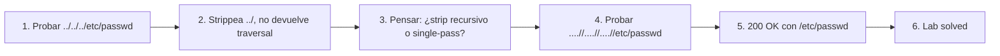

# Writeup: File path traversal, traversal sequences stripped non-recursively (PortSwigger)

- **Lab**: File path traversal, traversal sequences stripped non-recursively
- **URL**: https://portswigger.net/web-security/file-path-traversal/lab-sequences-stripped-non-recursively
- **Categoría**: File path traversal / Directory traversal / LFI
- **Dificultad**: Practitioner
- **Credenciales**: no requiere login

---

## 1. Objetivo

Mismo target (`/etc/passwd`), mismo endpoint (`/image?filename=`). La defensa: la app **strippea** las secuencias `../` con un `replace` no recursivo (una sola pasada). Bypass: incrustar `../` adentro de un patrón tal que después del strip quede `../`.

Payload final:

```
GET /image?filename=....//....//....//etc/passwd HTTP/2
```

Response:

```
HTTP/2 200 OK
Content-Type: image/jpeg
Content-Length: 2316

root:x:0:0:root:/root:/bin/bash
...
```

### Insight central

**Strip non-recursive es el peor de los dos mundos**: si la defensa rechaza (`if '../' in input: abort()`) bloquea este bypass; si la defensa strippea recursivamente (`while '../' in input: input = input.replace('../', '')`) también bloquea. Pero el strip de una sola pasada es vulnerable porque el atacante puede construir un payload que, al sacar el patrón objetivo del medio, **deja el patrón objetivo formado por las puntas**. La estructura del bypass es la firma del antipatrón: cualquier filter que "limpia" tokens en una sola pasada tiene este bypass conceptual.

---

## 2. Recon y resolución

### 2.1 Identificar la defensa

Capturar la request de imagen y mandarla al Repeater. Probar el payload del lab simple:

```
GET /image?filename=../../../etc/passwd HTTP/2
```

Esperado: respuesta vacía o 200 con imagen no encontrada. Indica que `../` se procesa pero el path resultante no lleva a archivo válido — el server strippeó `../` y quedó `etc/passwd` (path relativo dentro del directorio base).

### 2.2 Bypass non-recursive

```
GET /image?filename=....//....//....//etc/passwd HTTP/2
```

Trace mental por cada `....//`:
- Input: `....//`
- El filter encuentra `../` en posiciones 1-3 (los chars del medio: `..` + `/`).
- Lo strippea: queda `..` (los dos chars del principio) + `/` (el char del final) = `../`.
- Resultado neto: cada `....//` se convierte en `../` después del strip.

Tres iteraciones de `....//` después del strip = `../../../`. Concatenado con `etc/passwd` = `../../../etc/passwd`. Path traversal funcional.

Response 200 con `/etc/passwd`. Lab solved.

---

## 3. Por qué funciona

### 3.1 Anatomía del bug

```python
# Antipatrón - replace de una sola pasada
@app.route('/image')
def image():
    filename = request.args['filename']
    filename = filename.replace('../', '')  # un solo replace, no loop
    path = os.path.join('/var/www/images', filename)
    return send_file(path)
```

El replace recorre el string una vez de izquierda a derecha y **no re-evalúa el resultado**. Trace char-por-char sobre `....//`:

```
Input:    .  .  .  .  /  /
Posición: 0  1  2  3  4  5
```

- Pattern buscado: `../` (longitud 3).
- Posición 0-2: `[., ., .]` = `...` → no match, avanzar.
- Posición 1-3: `[., ., .]` = `...` → no match, avanzar.
- Posición 2-4: `[., ., /]` = `../` → **match**. Strippea pos 2-4.
- Caracteres que sobreviven: pos 0 (`.`), pos 1 (`.`), pos 5 (`/`).
- Resultado concatenado: `../`.

El match consume **dos puntos del medio + la barra**, dejando los **dos puntos del principio + la otra barra del final** = `../`. La estructura `....//` está diseñada para que el filter extraiga exactamente el `../` del medio y deje las puntas formando otro.

Y crucialmente: el filter **no vuelve a inspeccionar el resultado**. Si lo hiciera (`while '../' in s: s = s.replace('../', '')`), strippearía el `../` que acaba de quedar y eliminaría el bypass.

### 3.2 Generalización: "strip-once" siempre tiene bypass

El antipatrón se repite con otros tokens y otros contextos:

| Filter naïve | Bypass |
|---|---|
| `replace('../', '')` | `....//` |
| `replace('<script>', '')` | `<scr<script>ipt>` |
| `replace('SELECT', '')` | `SELSELECTECT` |
| `replace('javascript:', '')` | `javasjavascript:cript:` |

La estructura común: **el atacante construye un input donde el patrón objetivo aparece como subsecuencia "rodeada" por el patrón objetivo**. El strip elimina la copia del medio, y las puntas se juntan formando otra copia del patrón. Cualquier filter de "blacklist por substring" tiene esta clase de bypass.

La defensa correcta nunca es "filter que limpia tokens". Es:
1. **Validación que rechaza** (no strippea) cualquier ocurrencia, abortando la request.
2. **Validación post-canonicalización**: aplicar la transformación esperada (en path traversal, `realpath`) y verificar que el resultado quede dentro del scope permitido.

La opción 2 es estructuralmente superior porque no depende de enumerar payloads malos.

### 3.3 Variantes del payload

`....//` es el payload canónico, pero la misma idea funciona con:

- `....\/`  (solo si el server normaliza `\` a `/`).
- `..././` (similar lógica: el strip de `../` deja `.../` y la posición posterior tiene `/`).
- `.././.` no funciona acá — el strip directamente elimina `../` y no queda traversal.
- `..%2f` o `..%2F` con encoding (si la decodificación pasa antes del strip): bypass por encoding, no por estructura.
- `%2e%2e%2f` con encoding completo de los tres chars.

Cuando el strip es non-recursive **Y** la decodificación es una sola pasada, doble encoding (`%252e%252e%252f`) también bypass-ea: la primera decodificación produce `%2e%2e%2f`, que no contiene `../`, así que el filter no matchea; la segunda decodificación (que ocurre internamente en el filesystem o en otra capa) produce `../`.

### 3.4 ¿Por qué el dev escribe este filter?

Razones habituales:

1. **"Sanitización defensiva"**: el dev cree que limpiar el input es más amigable que rechazarlo. La intuición: "si el user mandó `../foo.jpg` por error, le devuelvo `foo.jpg` en lugar de un 400". Buena UX, mala seguridad.
2. **Asumir que un solo replace alcanza**: el dev no piensa en el ataque "doblar el patrón". Para inputs no maliciosos un replace es suficiente.
3. **Confundir `replace` con `replaceAll` recursivo**: en muchos lenguajes `replace`/`replaceAll` aplica todas las ocurrencias en una pasada (no es non-recursive en cuanto a *cantidad* de matches), pero **no re-evalúa el resultado**. La diferencia entre "todos los matches en una pasada" y "loop hasta que no haya matches" es sutil y se pasa por alto.

Comparación de comportamientos:

```python
# Python str.replace - todas las ocurrencias, no recursivo
"....//".replace("../", "")  # -> "../"  (una pasada deja "../" sin re-procesar)

# Loop recursivo (defensa correcta si se insiste en strippear)
s = "....//"
while "../" in s:
    s = s.replace("../", "")
# Resultado: "" (pasa: "....//" -> "../" -> "")
```

### 3.5 Defensa correcta (sin cambios respecto a labs anteriores)

```python
# Fix - canonicalizar y validar prefijo
import os
BASE = os.path.realpath('/var/www/images/')

@app.route('/image')
def image():
    filename = request.args['filename']
    full_path = os.path.realpath(os.path.join(BASE, filename))
    if not full_path.startswith(BASE + os.sep):
        abort(403)
    return send_file(full_path)
```

`realpath` resuelve `..`, links, dobles barras, encoding (no encoding URL — eso ocurre antes en el web framework). El resultado es un path canónico único que comparar contra `BASE`. **Ningún payload de la familia `../`, `....//`, encoding, doble encoding, path absoluto evade esta defensa**, porque `realpath` produce el mismo path final independiente del payload de entrada.

### 3.6 Patrón estructural común con los labs anteriores del cluster

| Lab | Defensa naïve | Bypass | Asunción rota |
|---|---|---|---|
| `simple-case` | ninguna | `../../../etc/passwd` | (no hay defensa) |
| `absolute-path-bypass` | `if '../' in filename: abort()` | `/etc/passwd` | "traversal requiere `..`" |
| **`stripped-non-recursively` (este)** | `replace('../', '')` (una pasada) | `....//....//....//etc/passwd` | "strippear el patrón lo elimina" |

La progresión del cluster: cada lab muestra una defensa naïve más sofisticada, y un bypass que rompe la asunción detrás. La defensa correcta es la misma desde el primer lab (canonicalizar + validar). El cluster enseña por qué los workarounds de string filtering no escalan.

---

## 4. Resumen



Tres ideas:

1. **Strip non-recursive tiene bypass por construcción**: cualquier filter que elimina ocurrencias de un token en una sola pasada es vulnerable a inputs que contengan el token "rodeado" por sí mismo (`....//`). Es el mismo patrón en SQLi (`SELSELECTECT`), XSS (`<scr<script>ipt>`) y prefijos URL.
2. **La defensa correcta nunca es strip**: o se rechaza el input (abort), o se canonicaliza y valida el resultado. Strip que "limpia" tokens es UX-friendly pero security-hostile.
3. **`realpath` resuelve toda la familia de payloads en una operación**: relativos, absolutos, dobles barras, links simbólicos. La superioridad estructural sobre filters de string es que no depende de enumerar payloads malos — opera sobre el path canónico final.

---

## 5. Contramedidas

1. **Mismas que labs anteriores del cluster**: `os.path.realpath(os.path.join(BASE, filename))` + verificar `startswith(BASE + sep)`. Defensa robusta independiente de cómo se ve el payload de entrada.
2. **Si se insiste en strip, hacerlo recursivo**: `while '../' in s: s = s.replace('../', '')`. Aún así no es defensa suficiente — encoding y doble encoding la bypass-ean si la decodificación ocurre después del strip.
3. **Rechazar, no strippear**: `if '../' in filename or filename.startswith('/'): abort(400)`. Es defensa-en-profundidad, no reemplazo de canonicalización.
4. **Whitelist o IDs**: si el endpoint sirve N archivos conocidos, exponer un ID y mantener el mapeo server-side. El input no toca el filesystem.
5. **Validar output, no solo input**: después de leer el archivo, validar magic bytes (es JPEG?). Si no matchea el tipo declarado, devolver 403. Detecta exfil aunque el bypass de path traversal funcione.
6. **Mínimo privilegio del proceso**: el web server no debe poder leer fuera del directorio de assets. Chroot, contenedor con read-only mount, AppArmor/SELinux.
7. **Tests automatizados con todos los payloads del cluster**: `../`, `/etc/passwd`, `....//`, `..%2f`, `%2e%2e%2f`, `%252e%252e%252f`, `..\..\`. Una suite por endpoint que toma filename. Cualquier respuesta distinta al baseline (imagen válida) es bug.
8. **Code review checklist**: cualquier `replace(traversal_token, '')` o `if traversal_token in input: ...` (sin canonicalización posterior) es bug. Marcar para auditoría.

---

## 6. Referencias

- PortSwigger Web Security Academy. (s.f.). *Lab: File path traversal, traversal sequences stripped non-recursively*. https://portswigger.net/web-security/file-path-traversal/lab-sequences-stripped-non-recursively
- PortSwigger Web Security Academy. (s.f.). *Directory traversal*. https://portswigger.net/web-security/file-path-traversal
- OWASP Foundation. (s.f.). *Path Traversal*. https://owasp.org/www-community/attacks/Path_Traversal
- OWASP Foundation. (s.f.). *File System Security Cheat Sheet*. https://cheatsheetseries.owasp.org/cheatsheets/File_System_Security_Cheat_Sheet.html
- MITRE Corporation. (2024). *CWE-22: Improper Limitation of a Pathname to a Restricted Directory ('Path Traversal')*. https://cwe.mitre.org/data/definitions/22.html
- MITRE Corporation. (2024). *CWE-35: Path Traversal: '.../...//'*. https://cwe.mitre.org/data/definitions/35.html
- MITRE Corporation. (2024). *CWE-182: Collapse of Data into Unsafe Value*. https://cwe.mitre.org/data/definitions/182.html
- MITRE Corporation. (2024). *ATT&CK Technique T1190: Exploit Public-Facing Application*. https://attack.mitre.org/techniques/T1190/
- swisskyrepo. (s.f.). *PayloadsAllTheThings — Directory Traversal*. https://github.com/swisskyrepo/PayloadsAllTheThings/tree/master/Directory%20Traversal
- Stuttard, D., & Pinto, M. (2011). *The Web Application Hacker's Handbook* (2nd ed.). Wiley. Cap. 10 (Attacking Back-End Components — Path Traversal).
- Inventario interno: [`inventario/03-analisis-vulnerabilidades/web/analisis-lfi-rfi.md`](../../../inventario/03-analisis-vulnerabilidades/web/analisis-lfi-rfi.md)
- Labs hermanos del cluster:
  - [`learning/portswigger/file-path-traversal-simple-case/writeup.md`](../file-path-traversal-simple-case/writeup.md)
  - [`learning/portswigger/file-path-traversal-absolute-path-bypass/writeup.md`](../file-path-traversal-absolute-path-bypass/writeup.md)
