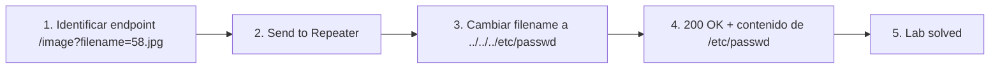

# Writeup: File path traversal, simple case (PortSwigger)

- **Lab**: File path traversal, simple case
- **URL**: https://portswigger.net/web-security/file-path-traversal/lab-simple
- **Categoría**: File path traversal / Directory traversal / LFI
- **Dificultad**: Apprentice
- **Credenciales**: no requiere login

---

## 1. Objetivo

Leer `/etc/passwd` vía el endpoint `/image?filename=` que sirve las imágenes de productos. La app concatena el `filename` a un directorio base y abre el archivo sin normalizar la ruta. Inyectando `../` se sale del directorio base y se llega al filesystem raíz.

Payload final que resuelve el lab:

```
GET /image?filename=../../../etc/passwd HTTP/2
```

Response:

```
HTTP/2 200 OK
Content-Type: image/jpeg
Content-Length: 2316

root:x:0:0:root:/root:/bin/bash
daemon:x:1:1:daemon:/usr/sbin:/usr/sbin/nologin
...
```

### Insight central

**Path traversal es un bug de canonicalización**. El server compone una ruta concatenando `base + input` y abre el resultado, asumiendo que el `input` se queda dentro de `base`. La realidad es que el filesystem interpreta `..` como "directorio padre" durante la resolución del path, así que `base/../../../etc/passwd` se resuelve a `/etc/passwd` antes de que el syscall `open()` decida qué archivo leer. La defensa correcta es canonicalizar primero (resolver `..`, links, encodings) y validar el resultado contra el directorio permitido — no validar el input crudo.

---

## 2. Recon y resolución

### 2.1 Identificar el endpoint vulnerable

Navegar a cualquier producto (`/product?productId=7`). En Burp Proxy → HTTP history, las imágenes están filtradas por defecto. Expandir la barra "Filter" y desmarcar **"Hide CSS, image and general binary content"** (y verificar que "Images" esté marcado en MIME types). Recargar y aparece:

```
GET /image?filename=58.jpg HTTP/2
Host: <lab>.web-security-academy.net
Cookie: session=...
```

Endpoint `/image`, parámetro `filename`, valor que parece un nombre de archivo simple. Candidato directo a path traversal.

### 2.2 Probar `../` básico

Send to Repeater. Cambiar `filename=58.jpg` → `filename=../../../etc/passwd`:

```
GET /image?filename=../../../etc/passwd HTTP/2
Host: <lab>.web-security-academy.net
```

Response 200 con el contenido de `/etc/passwd`. Lab solved.

### 2.3 ¿Por qué 3 niveles de `../`?

El directorio base de imágenes en este lab es algo del estilo `/var/www/images/`. Para llegar a `/` desde ahí hace falta subir 3 niveles. Sobreestimar no rompe nada: `..` desde `/` resuelve a `/` (el padre del root es el root mismo en POSIX), así que `../../../../../../../../etc/passwd` también funcionaría. Por eso un payload "muy traversal" como 8-10 niveles es la heurística común cuando no se sabe la profundidad del cwd.

---

## 3. Por qué funciona

### 3.1 Anatomía del bug

```python
# Antipatrón - concatenación cruda
@app.route('/image')
def image():
    filename = request.args['filename']
    path = '/var/www/images/' + filename
    return send_file(path)
```

Tres pasos del bug:

1. El server confía en que `filename` describe un nombre de archivo dentro de `/var/www/images/`.
2. La concatenación produce un path como `/var/www/images/../../../etc/passwd`.
3. El syscall `open()` (o equivalente) **canonicaliza durante la resolución**: aplica los `..` componente por componente. El path efectivo que se abre es `/etc/passwd`.

El bug no está en `open()` — `open()` hace lo que se le pide. El bug está en que el server asume que la concatenación textual produce un path que sigue dentro del directorio base, y eso no es verdad.

### 3.2 ¿Por qué `/etc/passwd` como target canónico?

- **World-readable**: cualquier proceso (incluido el web server corriendo como `www-data`) puede leerlo. No requiere privilegios.
- **Existe en cualquier sistema POSIX**: target portátil que confirma traversal en Linux/macOS/BSD.
- **Output inconfundible**: la primera línea es `root:x:0:0:root:/root:/bin/bash` — fingerprint inmediato. No hay falso positivo posible.
- **No expone secretos críticos**: en sistemas modernos los hashes de contraseña están en `/etc/shadow` (solo root). `/etc/passwd` ya no contiene credenciales.

Por estas tres propiedades es la prueba estándar de path traversal. En Windows el equivalente es `C:\Windows\win.ini` o `C:\boot.ini` (legacy). `/etc/hosts` también funciona como secundario.

### 3.3 La señal en la response es ruidosa

El server devolvió `Content-Type: image/jpeg` pero el body es texto plano. Esto es típico:

- El handler está cableado a "siempre devuelvo image/jpeg" porque el endpoint se llama `/image`.
- No mira el contenido real del archivo para inferir el MIME.
- El browser intenta renderizar como imagen y muestra una imagen rota; pero en Burp el body se ve crudo.

**Implicación operacional**: si el atacante prueba traversal desde el browser y ve "imagen rota", no debe asumir que falló. Hay que mirar el body en Burp/curl. Mismatch entre Content-Type declarado y bytes reales es señal de que el server hace open+pipe sin lógica.

### 3.4 ¿Cuándo NO funciona el `../` directo?

Este lab no tiene defensa alguna. Las variantes del cluster cubren cada defensa común y cómo bypass-earla:

- **Filter de `../`**: bypass con doble encoding (`%2e%2e%2f`), encoding mixto, o encoding doble (`%252e%252e%252f` cuando el server decodifica dos veces).
- **Filter no recursivo (strip de una pasada)**: bypass con `....//` (al strippear `../` queda `../`).
- **Validación de prefijo (debe empezar con `/var/www/images`)**: bypass con `/var/www/images/../../../etc/passwd`.
- **Validación de sufijo (debe terminar en `.jpg`)**: bypass con null byte (`../../../etc/passwd%00.jpg`) en stacks viejos (PHP < 5.3.4, Java 6) o segmentación de path (`../../../etc/passwd#.jpg`, `../../../etc/passwd?.jpg` en algunos parsers).

Cada uno corresponde a un lab Apprentice/Practitioner separado en la serie. Este (simple case) es el baseline sin defensas.

### 3.5 Implementación correcta

```python
# Fix 1 - canonicalizar y validar prefijo
import os
BASE = '/var/www/images/'

@app.route('/image')
def image():
    filename = request.args['filename']
    full_path = os.path.realpath(os.path.join(BASE, filename))
    if not full_path.startswith(os.path.realpath(BASE) + os.sep):
        abort(403)
    return send_file(full_path)
```

```python
# Fix 2 - mejor: ID en lugar de filename
@app.route('/image')
def image():
    image_id = int(request.args['id'])
    image = Image.query.get_or_404(image_id)
    return send_file(image.path)  # path almacenado server-side
```

Reglas:

1. **Nunca concatenar input a paths sin canonicalizar primero**. `os.path.realpath()` (Python), `Path.toRealPath()` (Java), `realpath()` (C/PHP) resuelven `..`, links simbólicos y normalizan separadores antes de comparar.
2. **Validar después de canonicalizar**, no antes. Validar el input crudo deja la puerta abierta a encoding, double-encoding, null bytes, etc.
3. **Preferir IDs/whitelists a paths libres**. Si el cliente solo necesita acceder a 100 imágenes conocidas, exponer `?id=58` y mantener el mapeo `id → path` server-side. El input nunca toca el filesystem.
4. **Principio de mínimo privilegio**: el proceso del web server no debería poder leer `/etc/passwd` ni nada fuera de su directorio de trabajo. Chroot, contenedores con read-only mounts, AppArmor/SELinux limitan el daño aunque haya bug.

### 3.6 Vectores adicionales (mismo bug, otros payloads)

- **Lectura de código fuente**: `/image?filename=../../../var/www/html/index.php` (depende del stack; PHP suele revelar el código fuente como texto si el handler bypassa el motor PHP).
- **Lectura de archivos de configuración**: `/etc/nginx/nginx.conf`, `/etc/apache2/apache2.conf`, `application.properties`, `web.xml`, `.env`. Estos sí suelen contener secretos.
- **Lectura de keys SSH**: `/root/.ssh/id_rsa`, `/home/<user>/.ssh/id_rsa`. Solo si el web server corre como ese user (raro) o como root (más raro pero pasa).
- **Logs como vector a RCE (log poisoning)**: si la app permite leer `/var/log/apache2/access.log` y la app es PHP, inyectar `<?php system($_GET['c']); ?>` en el `User-Agent` de un request previo, después incluir el log vía traversal y ejecutar comandos vía `?c=id`.
- **`/proc` en Linux**: `/proc/self/environ` (variables de entorno del proceso, a veces con secretos), `/proc/self/cmdline`, `/proc/self/maps`, `/proc/<pid>/fd/<n>`.

---

## 4. Resumen



Tres ideas:

1. **Path traversal es bug de canonicalización**. La validación correcta no es bloquear `..` en el input; es canonicalizar el path completo y verificar que el resultado quede dentro del directorio permitido.
2. **`/etc/passwd` es el target canónico de prueba**: world-readable, signature inconfundible (`root:x:0:0:...`), portátil entre POSIX. No expone secretos críticos por sí solo.
3. **Mismatch Content-Type vs body es señal**: el server pipea bytes sin lógica. Si declara `image/jpeg` pero el body es texto, el endpoint hace `open(path); return body` sin chequeos.

---

## 5. Contramedidas

1. **Canonicalizar antes de validar**: `os.path.realpath()` / `Path.toRealPath()` / `realpath()`. Validar el input crudo no alcanza por encoding/double-encoding/null bytes.
2. **Whitelist o IDs en lugar de paths libres**: si el cliente solo necesita N archivos conocidos, exponer un identificador y mantener el mapeo server-side. El input no toca el filesystem.
3. **Verificar prefijo del path canonicalizado**: `realpath(base + input).startswith(realpath(base) + sep)`. Importante usar `realpath` en ambos lados y agregar el separador para evitar bypass tipo `/var/www/imagesEVIL/`.
4. **Bloquear bytes prohibidos en filenames**: `..`, `/`, `\`, null byte (`\0`), control chars. Es defensa adicional, no reemplazo de canonicalización.
5. **Mínimo privilegio del proceso**: el web server corre como user dedicado sin acceso a `/etc`, `/root`, `/home`. Chroot, contenedores con mounts read-only, AppArmor/SELinux confining.
6. **Distintos Content-Type para distintos endpoints**: si `/image` devuelve siempre `image/jpeg` pero el archivo no es JPEG válido, devolver 500 o 403 en lugar de pipear bytes arbitrarios. Detectar mismatch entre tipo declarado y magic bytes.
7. **Tests automatizados**: por cada endpoint que tome filename/path, tests con `../`, `..%2f`, `..%252f`, `....//`, `%00`, paths absolutos. Si alguno devuelve algo distinto al payload baseline, hay bug.
8. **Audit logging**: registrar cada acceso a archivos con (user, requested_filename, resolved_path). Discrepancias entre los dos campos son evidencia post-mortem de traversal.

---

## 6. Referencias

- PortSwigger Web Security Academy. (s.f.). *Lab: File path traversal, simple case*. https://portswigger.net/web-security/file-path-traversal/lab-simple
- PortSwigger Web Security Academy. (s.f.). *Directory traversal*. https://portswigger.net/web-security/file-path-traversal
- OWASP Foundation. (s.f.). *Path Traversal*. https://owasp.org/www-community/attacks/Path_Traversal
- OWASP Foundation. (s.f.). *File and Directory Traversal Cheat Sheet*. https://cheatsheetseries.owasp.org/cheatsheets/File_System_Security_Cheat_Sheet.html
- MITRE Corporation. (2024). *CWE-22: Improper Limitation of a Pathname to a Restricted Directory ('Path Traversal')*. https://cwe.mitre.org/data/definitions/22.html
- MITRE Corporation. (2024). *CWE-23: Relative Path Traversal*. https://cwe.mitre.org/data/definitions/23.html
- MITRE Corporation. (2024). *CWE-35: Path Traversal: '.../...//'*. https://cwe.mitre.org/data/definitions/35.html
- MITRE Corporation. (2024). *ATT&CK Technique T1190: Exploit Public-Facing Application*. https://attack.mitre.org/techniques/T1190/
- swisskyrepo. (s.f.). *PayloadsAllTheThings — Directory Traversal*. https://github.com/swisskyrepo/PayloadsAllTheThings/tree/master/Directory%20Traversal
- Stuttard, D., & Pinto, M. (2011). *The Web Application Hacker's Handbook* (2nd ed.). Wiley. Cap. 10 (Attacking Back-End Components — Path Traversal).
- Inventario interno: [`inventario/03-analisis-vulnerabilidades/web/analisis-lfi-rfi.md`](../../../inventario/03-analisis-vulnerabilidades/web/analisis-lfi-rfi.md)
- Inventario interno (fuzzing): [`inventario/02-enumeracion/fuzzing/fuzzing-lfi-ssrf.md`](../../../inventario/02-enumeracion/fuzzing/fuzzing-lfi-ssrf.md)
