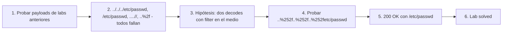

# Writeup: File path traversal, traversal sequences stripped with superfluous URL-decode (PortSwigger)

- **Lab**: File path traversal, traversal sequences stripped with superfluous URL-decode
- **URL**: https://portswigger.net/web-security/file-path-traversal/lab-superfluous-url-decode
- **Categoría**: File path traversal / Directory traversal / LFI / Encoding bypass
- **Dificultad**: Practitioner
- **Credenciales**: no requiere login

---

## 1. Objetivo

Mismo target (`/etc/passwd`), mismo endpoint (`/image?filename=`). La defensa: la app rechaza `../` y también su forma URL-encoded `..%2f`. El bypass aprovecha que la app **decodifica URL-encoding dos veces**: la primera la hace el framework HTTP estándar al parsear la query string; la segunda la hace el código de la app (decode "superfluo"). El filter corre entre las dos pasadas.

Payload final:

```
GET /image?filename=..%252f..%252f..%252fetc/passwd HTTP/2
```

Response:

```
HTTP/2 200 OK
Content-Type: image/jpeg
Content-Length: 2316

root:x:0:0:root:/root:/bin/bash
...
```

### Insight central

**Cualquier defensa que valide entre dos transformaciones idénticas del input es bypass-eable**: el atacante codifica el payload para que la primera transformación pase como inocuo, la validación apruebe, y la segunda transformación lo materialice. En este lab las transformaciones son URL-decode y URL-decode. El antipatrón se generaliza: validar antes de canonicalizar, validar antes del último decode, validar la representación intermedia en lugar de la final. La defensa estructural es **canonicalizar primero, validar después**, una vez que no quedan transformaciones pendientes.

---

## 2. Recon y resolución

### 2.1 Descartar bypasses simples

Capturar `GET /image?filename=XX.jpg`. En Repeater, probar en orden creciente de complejidad:

1. `filename=../../../etc/passwd` — payload del lab simple. Bloqueado (filter de `../`).
2. `filename=/etc/passwd` — bypass del lab absolute path. Bloqueado en este lab (la defensa también rechaza paths absolutos, o el filter strippea/normaliza el `/` inicial).
3. `filename=....//....//....//etc/passwd` — bypass del lab non-recursive. Bloqueado (este filter no es non-recursive strip).
4. `filename=..%2f..%2f..%2fetc/passwd` — single-encode. Bloqueado (la app decodifica una vez antes del filter, así que el filter ve `../` y rechaza).
5. `filename=..%252f..%252f..%252fetc/passwd` — **double-encode**. Funciona.

### 2.2 Bypass con doble encoding

```
GET /image?filename=..%252f..%252f..%252fetc/passwd HTTP/2
```

Trace conceptual:

- **Wire (lo que viaja en HTTP)**: `..%252f..%252f..%252fetc/passwd`.
- **Decode #1 (framework parsea query string)**: `%25` → `%`, así que `%252f` → `%2f`. Resultado intermedio: `..%2f..%2f..%2fetc/passwd`.
- **Filter corre acá**: busca `../` literal. No lo encuentra (sólo hay `..%2f`). Aprueba.
- **Decode #2 (código de la app, llamada redundante a `urldecode()` o equivalente)**: `%2f` → `/`. Resultado final: `../../../etc/passwd`.
- **`open()` con ese path**: `/etc/passwd`. Lab solved.

### 2.3 Verificar que el filter sí veía `..%2f` (paso 4)

El paso (4) del recon es importante para diagnosticar la doble decodificación. Si single-encode (`..%2f`) hubiera funcionado, sería un caso distinto: filter de `../` literal pero con una sola decodificación (el filter corre antes de decodificar, así que ve `..%2f` y no matchea). Que (4) falle y (5) funcione confirma que la app **sí decodifica antes del filter** (por eso ve `../` y rechaza), pero **vuelve a decodificar después** (por eso `%2f` se convierte en `/` antes de `open()`).

---

## 3. Por qué funciona

### 3.1 Anatomía del bug

```python
# Antipatrón - filter entre dos decodes
@app.route('/image')
def image():
    # Decode #1: el framework ya decodificó la query string al poblar request.args.
    # Aquí filename = '..%2f..%2f..%2fetc/passwd' después del decode #1.
    filename = request.args['filename']

    # Filter corre sobre la representación intermedia.
    if '../' in filename or filename.startswith('/'):
        abort(400)

    # Decode #2: el dev "se asegura" decodificando otra vez.
    filename = urllib.parse.unquote(filename)
    # filename = '../../../etc/passwd'

    path = os.path.join('/var/www/images', filename)
    return send_file(path)
```

Tres componentes del bug:

1. **El framework HTTP ya decodifica la query string**. Cuando el dev accede a `request.args['filename']` (Flask), `params.get('filename')` (Java/Spring), o equivalente, recibe el valor **ya URL-decoded una vez**. Esto es comportamiento estándar y correcto.
2. **El filter corre sobre la representación post-decode-1**. En ese punto, el payload con doble encoding aún tiene `%2f` literal (no decodificado). El filter busca `../` y no lo encuentra.
3. **El segundo decode es redundante e introduce el bug**. El dev llama explícitamente a `urldecode()` "por las dudas". Eso convierte `%2f` en `/`, materializando el `../` que el filter no vio.

El bug está en el paso 3: la segunda llamada a decode es **superflua** (el framework ya decodificó). Pero al hacerla, la app procesa una transformación que el filter no anticipó.

### 3.2 Por qué el dev escribe la segunda decodificación

Razones habituales:

1. **Defensa por costumbre**: el dev escribió endpoints en frameworks distintos donde el comportamiento de auto-decode es ambiguo. Llama a `urldecode()` explícitamente "por las dudas". En el framework actual es redundante; en otro hubiera sido necesaria.
2. **Cargo cult de seguridad**: copy-paste de código que decodificaba una vez en un contexto distinto, sin entender la cadena de transformaciones del input en el framework actual.
3. **Lidiar con clientes raros**: algunos clientes envían valores doble-encodeados para evitar problemas de parsing en proxies. El dev decodifica de más para "normalizar". Sin darse cuenta de que ese decode extra es justamente el vector de ataque.
4. **Asumir que decode es idempotente**: `urldecode(urldecode(x))` no es lo mismo que `urldecode(x)` cuando `x` contiene `%25` literal en el wire. La idempotencia es intuitiva pero falsa para encoding.

### 3.3 La asunción rota: "validar el input es validar lo que se ejecuta"

El antipatrón general es **validar antes de la última transformación que afecta semántica**. Path traversal es solo un caso. Otros:

| Defensa naïve | Transformación final | Bypass |
|---|---|---|
| Filter de `../` antes del segundo decode (este lab) | URL-decode | `..%252f` |
| Filter de `<script>` antes de HTML-decode | HTML-decode | `&lt;script&gt;` revertido por la app |
| Filter de SQL keywords antes de Unicode normalization | Unicode NFC | `SELECＴ` (full-width T) |
| Filter de path antes de symlink resolution | Symlink follow | symlink en directorio permitido apunta fuera |
| Filter de hostname antes de IDN-to-ASCII | Punycode | `еxample.com` (con `е` cirílica) |

Patrón común: la defensa valida una representación intermedia que parece segura, pero la app aplica una transformación más antes de usar el valor. La transformación final es la que determina la semántica real, y es la que la defensa debería validar.

### 3.4 Defensa correcta

```python
# Fix - canonicalizar todas las transformaciones, validar al final
import os
from urllib.parse import unquote

BASE = os.path.realpath('/var/www/images/')

@app.route('/image')
def image():
    filename = request.args['filename']
    # Si por alguna razón el dev quiere un decode adicional, hacerlo PRIMERO,
    # antes de cualquier validación. Mejor aún: no hacerlo.
    full_path = os.path.realpath(os.path.join(BASE, filename))
    if not full_path.startswith(BASE + os.sep):
        abort(403)
    return send_file(full_path)
```

Reglas:

1. **Aplicar todas las transformaciones primero**, después validar. Si hay decodificación extra, hacerla antes de validar — no después.
2. **Eliminar transformaciones redundantes**. Si el framework ya decodifica, no decodificar otra vez. La regla "menos transformaciones, más predecible" es defensa-en-profundidad.
3. **Validación post-canonicalización siempre**: `realpath(join(base, input))` y `startswith(base)` cubre encoding (porque el framework ya decodificó), traversal relativo, traversal absoluto, dobles barras y links simbólicos. Una sola operación.

### 3.5 Variantes y combinaciones

Si el filter es más sofisticado (ej. también busca `..%2f` literal), hay variantes adicionales:

- **Encoding mixto**: `..%252f..%2f..%252f` — algunos chars con doble encoding, otros con single. Bypass cuando el filter solo busca uno de los dos.
- **Encoding parcial de chars**: `%2e%2e/`, `..%252e/` (codificar el punto en lugar de la barra). Algunos filters solo buscan `..%2f` y no `%2e%2e/`.
- **Triple encoding**: `..%25252f` cuando hay tres pasadas de decode (raro pero existe en stacks con WAF + framework + app).
- **Encoding alternativo**: en algunos servers, `%c0%af` (UTF-8 overlong encoding de `/`) bypass-ea filters que solo buscan `%2f`. En la práctica casi todos los parsers modernos rechazan overlong encoding.
- **Combinación con `....//`**: `....%2f%2f` puede bypass-ear filters que normalizan `..` pero no `....`.

### 3.6 Patrón estructural común con los labs anteriores del cluster

| Lab | Defensa naïve | Bypass | Asunción rota |
|---|---|---|---|
| `simple-case` | ninguna | `../../../etc/passwd` | (no hay defensa) |
| `absolute-path-bypass` | `if '../' in filename: abort()` | `/etc/passwd` | "traversal requiere `..`" |
| `stripped-non-recursively` | `replace('../', '')` (una pasada) | `....//....//` | "strippear el patrón lo elimina" |
| **`superfluous-url-decode` (este)** | filter entre dos URL-decodes | `..%252f..%252f` | "el input que validé es lo que se ejecuta" |

La progresión: cada defensa naïve corrige el bypass del lab anterior, y se rompe por una asunción nueva. El cluster es un catálogo de asunciones falsas alrededor del input handling. La defensa correcta — canonicalizar, validar el resultado — es la misma desde el lab simple porque no depende de las asunciones específicas, opera sobre el path final.

---

## 4. Resumen



Tres ideas:

1. **Validar entre dos transformaciones idénticas del input es bypass-eable por construcción**: el atacante codifica el payload para que la representación intermedia (la que el filter ve) sea inocua, y la representación final (la que se ejecuta) sea maliciosa.
2. **Decode redundante es un vector de ataque, no una defensa-en-profundidad**: cuando el framework ya decodifica, llamar a `urldecode()` otra vez introduce un punto de divergencia entre lo validado y lo ejecutado. Menos transformaciones = más predecible.
3. **El antipatrón se generaliza más allá de URL encoding**: HTML decode, Unicode normalization, symlink resolution, IDN punycode. Cualquier transformación que el dev aplica después de validar abre la misma clase de bypass. Defensa: canonicalizar primero, validar el resultado final.

---

## 5. Contramedidas

1. **Canonicalizar antes de validar, siempre**: `realpath(join(base, input))` después de cualquier decode pendiente, comparado contra `base + sep`. Independiente de cuántas pasadas de decode haga la app.
2. **Eliminar transformaciones redundantes del código**: si el framework ya decodifica, no llamar a `urldecode()` explícitamente. Si el framework ya normaliza Unicode, no normalizar otra vez. Cada transformación adicional es superficie de ataque.
3. **Documentar las transformaciones que aplica cada layer del stack**: framework, middleware, WAF, app. Listar qué decodifica cada uno y en qué orden. Auditar si hay duplicados.
4. **Whitelist o IDs**: defensa estructuralmente robusta. Si el endpoint sirve N archivos conocidos, exponer un identificador y mapear server-side.
5. **Rechazar `%25` en filenames** como defensa-en-profundidad: si el endpoint nunca debe recibir doble encoding, validar `if '%' in filename: abort()` después del primer decode (cuando el `%25` ya se convirtió en `%`). Esta validación es restrictiva y rompe casos legítimos donde el filename contiene `%`, pero para endpoints de imágenes suele ser aceptable.
6. **Validar magic bytes del archivo leído**: si el endpoint declara servir imágenes, verificar que el contenido empiece con bytes JPEG/PNG/etc. Detecta exfil aunque el bypass funcione a nivel de path.
7. **Mínimo privilegio**: el proceso del web server no debe tener permiso de leer fuera del directorio de assets. Chroot, contenedor con read-only mount, AppArmor/SELinux confining.
8. **Tests automatizados**: por cada endpoint que tome filename, suite con `../`, `/etc/passwd`, `....//`, `..%2f`, `..%252f`, `%252e%252e%252f`, `..%c0%af`. Cualquier respuesta distinta al baseline (imagen válida) es bug.
9. **Code review checklist**: cualquier llamada explícita a `urldecode`, `htmldecode`, `Normalizer.normalize`, `realpath` después de una validación es candidata a bug. La regla: validación es la última operación antes de usar el valor.

---

## 6. Referencias

- PortSwigger Web Security Academy. (s.f.). *Lab: File path traversal, traversal sequences stripped with superfluous URL-decode*. https://portswigger.net/web-security/file-path-traversal/lab-superfluous-url-decode
- PortSwigger Web Security Academy. (s.f.). *Directory traversal*. https://portswigger.net/web-security/file-path-traversal
- OWASP Foundation. (s.f.). *Double Encoding*. https://owasp.org/www-community/Double_Encoding
- OWASP Foundation. (s.f.). *Path Traversal*. https://owasp.org/www-community/attacks/Path_Traversal
- MITRE Corporation. (2024). *CWE-22: Improper Limitation of a Pathname to a Restricted Directory ('Path Traversal')*. https://cwe.mitre.org/data/definitions/22.html
- MITRE Corporation. (2024). *CWE-174: Double Decoding of the Same Data*. https://cwe.mitre.org/data/definitions/174.html
- MITRE Corporation. (2024). *CWE-180: Incorrect Behavior Order: Validate Before Canonicalize*. https://cwe.mitre.org/data/definitions/180.html
- MITRE Corporation. (2024). *ATT&CK Technique T1190: Exploit Public-Facing Application*. https://attack.mitre.org/techniques/T1190/
- swisskyrepo. (s.f.). *PayloadsAllTheThings — Directory Traversal*. https://github.com/swisskyrepo/PayloadsAllTheThings/tree/master/Directory%20Traversal
- Stuttard, D., & Pinto, M. (2011). *The Web Application Hacker's Handbook* (2nd ed.). Wiley. Cap. 10 (Attacking Back-End Components — Path Traversal).
- Inventario interno: [`inventario/03-analisis-vulnerabilidades/web/analisis-lfi-rfi.md`](../../../inventario/03-analisis-vulnerabilidades/web/analisis-lfi-rfi.md)
- Labs hermanos del cluster:
  - [`learning/portswigger/file-path-traversal-simple-case/writeup.md`](../file-path-traversal-simple-case/writeup.md)
  - [`learning/portswigger/file-path-traversal-absolute-path-bypass/writeup.md`](../file-path-traversal-absolute-path-bypass/writeup.md)
  - [`learning/portswigger/file-path-traversal-sequences-stripped-non-recursively/writeup.md`](../file-path-traversal-sequences-stripped-non-recursively/writeup.md)
