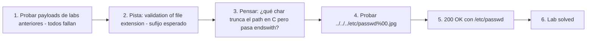

# Writeup: File path traversal, validation of file extension with null byte bypass (PortSwigger)

- **Lab**: File path traversal, validation of file extension with null byte bypass
- **URL**: https://portswigger.net/web-security/file-path-traversal/lab-validate-file-extension-null-byte-bypass
- **Categoría**: File path traversal / Directory traversal / LFI / Null byte injection
- **Dificultad**: Practitioner
- **Credenciales**: no requiere login

---

## 1. Objetivo

Mismo target (`/etc/passwd`), mismo endpoint (`/image?filename=`). La defensa: la app valida que el `filename` **termine en una extensión permitida** (`.jpg`/`.png`/`.gif`). Bypass: insertar un null byte (`%00`) entre el path real y la extensión falsa. Para la validación (string-level), el filename termina en `.jpg`. Para el syscall que abre el archivo (C-level, donde `\0` es terminador de string), el path efectivo es lo que está antes del null byte.

Payload final:

```
GET /image?filename=../../../etc/passwd%00.jpg HTTP/2
```

Response:

```
HTTP/2 200 OK
Content-Type: image/jpeg
Content-Length: 2316

root:x:0:0:root:/root:/bin/bash
...
```

### Insight central

**Null byte injection es un bypass de impedance mismatch entre dos capas con semántica de string distinta**: el lenguaje de la app (Python/Java/PHP) trata el `\0` como un char más, pero el syscall del kernel (escrito en C) lo trata como terminador. La validación opera en el primer modelo, el `open()` opera en el segundo. Los stacks modernos (Python 3, Java 7u40+, PHP 5.3.4+) cierran el bypass rechazando explícitamente null bytes en paths antes de pasarlos al syscall, pero PortSwigger emula la versión vulnerable. **El antipatrón conceptual sigue vigente**: cualquier capa "managed" que pasa strings a una capa "nativa" sin sanitizar bytes especiales tiene la misma clase de bug, no solo con `\0`.

---

## 2. Recon y resolución

### 2.1 Descartar bypasses anteriores

Capturar `GET /image?filename=XX.jpg`. En Repeater, probar payloads de los 5 labs anteriores en orden creciente:

1. `filename=../../../etc/passwd` — fallido (no termina en `.jpg`).
2. `filename=/etc/passwd` — fallido (mismo motivo).
3. `filename=....//....//....//etc/passwd` — fallido.
4. `filename=..%252f..%252f..%252fetc/passwd` — fallido.
5. `filename=/var/www/images/../../../etc/passwd` — fallido.

El comportamiento de fallo es la pista: si la app rechaza con 400 mencionando extensión inválida, o devuelve 200 con imagen genérica, sugiere validación de sufijo.

### 2.2 Bypass con null byte

```
GET /image?filename=../../../etc/passwd%00.jpg HTTP/2
```

Trace:
- **Wire**: `../../../etc/passwd%00.jpg`.
- **URL-decode (framework)**: `../../../etc/passwd\0.jpg` (donde `\0` es el byte 0x00 literal).
- **Validación**: `filename.endswith('.jpg')` → `True`. Pasa.
- **Syscall `open(path)`**: la libc/kernel recibe el buffer pero para de leer al encontrar `\0`. El path efectivo es `../../../etc/passwd`.
- **Filesystem**: canonicaliza `..` durante la resolución. Abre `/etc/passwd`.
- **Response**: 200 con el contenido. Lab solved.

### 2.3 Detalle operacional: Burp y el null byte

En Burp Repeater, el `%00` literal se mantiene como tres chars en la URL (`%`, `0`, `0`). Burp por defecto no decodifica los `%XX` de la request line al enviar — los manda tal cual. Importante verificar en Raw view que el payload se vea como `%00`, no como un char nulo literal o `%2500` (doble encoding accidental). Si Burp tiene "URL-decode key=value pairs in HTTP" activo en alguna parte, puede convertir el `%00` en byte nulo antes de enviar, lo cual rompe el HTTP/2 framing y causa errores 400 raros. Mantener `%00` como ASCII es lo correcto.

---

## 3. Por qué funciona

### 3.1 Anatomía del bug

```python
# Antipatrón - validar sufijo, dejar que C-libs procesen el null byte
@app.route('/image')
def image():
    filename = request.args['filename']
    if not filename.endswith(('.jpg', '.png', '.gif')):
        abort(400)
    return send_file(filename)  # send_file llama a open() en algún punto
```

El bug es la **diferencia de semántica de string entre el lenguaje de la app y la capa nativa**:

1. **Python (y Java, PHP, .NET, Ruby)**: los strings son secuencias de chars/bytes con longitud explícita. `\0` es un char válido como cualquier otro. `'/etc/passwd\0.jpg'` tiene longitud 16, termina en `'jpg'`, y `endswith('.jpg')` retorna `True`.
2. **C / syscall del kernel**: los strings son arrays de bytes terminados por `\0`. Cuando una función como `open()` recibe un `char*`, lee bytes hasta encontrar `\0` y trata todo lo que sigue como ajeno al string. El path efectivo es `'/etc/passwd'`, sin la extensión.

La interfaz entre la app y la libc (vía PyObject → CPython → libc → kernel) **transfiere el contenido del string sin propagar la longitud**. El char `\0` que en Python era "un char más" en C se convierte en "fin del string". Esa pérdida de información es el vector.

### 3.2 Historia de la mitigación

El bug es ampliamente conocido desde mediados de los 2000s. Mitigaciones por stack:

- **PHP < 5.3.4**: vulnerable. `include()`, `require()`, `fopen()`, `file_get_contents()` aceptan paths con `\0`.
- **PHP ≥ 5.3.4** (Dec 2010): rechaza explícitamente null bytes en filenames de las funciones de filesystem. Bug class cerrada en PHP a nivel de stdlib.
- **Java < 7u40**: vulnerable. `File`, `FileInputStream`, etc. pasan el path con `\0` a la libc.
- **Java ≥ 7u40** (Sep 2013): `File` constructor lanza `InvalidPathException` si el path contiene `\0`. CVE-2010-0738 family.
- **Python 3.x**: rechaza null bytes en paths del módulo `os` desde la 3.0 (`ValueError: embedded null byte`). Python 2 era vulnerable.
- **Node.js**: rechaza null bytes en paths del módulo `fs` desde versiones tempranas.
- **Ruby ≥ 1.9**: rechaza null bytes en paths.
- **C/C++ raw**: nunca tuvo mitigación. Los devs son responsables de validar.

PortSwigger emula la versión vulnerable. En la práctica, el bug aparece hoy en:

- **Apps PHP legacy** que no se actualizaron desde 2010.
- **Code paths que pasan el filename a un binary/script externo** vía `subprocess` (el child process puede heredar el bug).
- **APIs que usan librerías nativas C/C++** sin wrappers que validen.
- **Sistemas embebidos** con runtimes recortados o stacks viejos.

### 3.3 Defensa correcta

```python
# Fix - canonicalizar y validar prefijo del path canónico
import os
BASE = os.path.realpath('/var/www/images')

@app.route('/image')
def image():
    filename = request.args['filename']
    # Python 3 ya rechaza null bytes acá implicitamente, pero defensa explicita es mejor.
    if '\0' in filename:
        abort(400)
    full_path = os.path.realpath(os.path.join(BASE, filename))
    if not full_path.startswith(BASE + os.sep):
        abort(403)
    if not full_path.lower().endswith(('.jpg', '.png', '.gif')):
        abort(400)
    return send_file(full_path)
```

Reglas:

1. **Rechazar null bytes explícitamente**: defensa-en-profundidad incluso en stacks que ya lo hacen. Falla rápido si llegan, antes de procesar.
2. **Canonicalizar antes de validar**: `realpath` resuelve `..` y links. Si el path final no queda dentro de `BASE`, abort. Esta es la defensa primaria contra path traversal.
3. **Validar extensión sobre el path canónico**, no sobre el input crudo. El path canónico no contiene null bytes (se trunca durante la canonicalización si hubo) ni segmentos `..`.

### 3.4 Variantes y bypasses análogos

El null byte es el caso clásico, pero la idea general — "insertar un byte que la validación ignora pero el ejecutor interpreta" — tiene variantes:

- **Question mark / hash en URL parsing**: `../../../etc/passwd?.jpg` o `../../../etc/passwd#.jpg` en parsers que tratan el archivo como una URL parcial. El parser corta en `?` o `#`, pero la validación de extensión ve el string completo.
- **Newline injection**: `../../../etc/passwd\n.jpg` cuando la capa nativa parsea por líneas.
- **Tab/space**: poco común pero algunos parsers ad-hoc cortan en whitespace.
- **Carriage return en HTTP smuggling**: análogo conceptual en otra capa.
- **Double-extension**: `../../../etc/passwd.php.jpg` cuando el server elige el handler por la primera extensión vista (parser de Apache con `mod_mime` mal configurado).
- **Long filename truncation**: si el filesystem trunca a 255 chars, puede convertir un `passwd.jpg` largo en `passwd` cuando el char 256 es `.` (depende del FS).

Patrón común: **la validación procesa el string completo, pero el ejecutor interpreta solo un prefijo**. Cada char/byte que actúa como delimitador en la capa ejecutora es un vector potencial.

### 3.5 Combinación con start-of-path validation (lab anterior)

El lab anterior (`validate-start-of-path`) requería prefijo. Este lab no — `../../../etc/passwd%00.jpg` resuelve sin pasar por `/var/www/images`. Si la defensa combinara ambas:

```python
if not filename.startswith('/var/www/images'): abort()
if not filename.endswith('.jpg'): abort()
```

El bypass sería: `/var/www/images/../../../etc/passwd%00.jpg`. Pasa el `startswith`, pasa el `endswith`, el null byte trunca al syscall. Cada defensa naïve compuesta puede ser bypass-eada combinando los bypasses de cada componente. La defensa correcta sigue siendo única: canonicalizar + validar prefijo del path canónico + validar extensión del path canónico.

### 3.6 Patrón estructural común con todos los labs del cluster

| Lab | Defensa naïve | Bypass | Asunción rota |
|---|---|---|---|
| `simple-case` | ninguna | `../../../etc/passwd` | (no hay defensa) |
| `absolute-path-bypass` | `if '../' in filename: abort()` | `/etc/passwd` | "traversal requiere `..`" |
| `stripped-non-recursively` | `replace('../', '')` (una pasada) | `....//....//` | "strippear el patrón lo elimina" |
| `superfluous-url-decode` | filter entre dos URL-decodes | `..%252f..%252f` | "el input que validé es lo que se ejecuta" |
| `validate-start-of-path` | `startswith(BASE)` sobre input crudo | `/var/www/images/../../../etc/passwd` | "validar prefijo de string equivale a validar contención del path" |
| **`validate-file-extension-null-byte-bypass` (este)** | `endswith('.jpg')` sobre input crudo | `../../../etc/passwd%00.jpg` | "el string que valido es el que el OS ejecuta" |

Los 6 bypasses comparten una estructura: **el dev valida una representación del input que difiere de la que el sistema ejecuta**. La diferencia varía: encoding, strip, decode duplicado, canonicalización del filesystem, semántica de string entre lenguajes. La defensa correcta es la misma en los 6 labs — canonicalizar la representación final con `realpath` y validar el resultado contra el directorio + extensión esperados. Los bypasses cambian; la defensa no.

---

## 4. Resumen



Tres ideas:

1. **Null byte explota la diferencia de semántica de string entre Python/Java/PHP y C**: el lenguaje de la app trata `\0` como un char más; la libc/kernel lo trata como terminador. La validación pasa con un string completo, el syscall ejecuta solo un prefijo. Bug class cerrada en stacks modernos pero conceptualmente sigue siendo el caso canónico de "validador y ejecutor con modelos de string distintos".
2. **El antipatrón se generaliza más allá de `\0`**: cualquier byte que actúa como delimitador en la capa ejecutora es vector. URL parsers cortan en `?`/`#`, parsers de líneas cortan en `\n`, file handlers cortan por extensión múltiple. La pregunta es: "¿qué chars el ejecutor interpreta como special que el validador ignora?".
3. **Defensa correcta es la misma para los 6 labs del cluster**: canonicalizar (`realpath`), validar el resultado canonicalizado contra prefijo + extensión + ausencia de chars peligrosos. Los bypasses específicos cambian con la defensa naïve; la defensa correcta se mantiene porque opera sobre la representación final, no sobre asunciones del input.

---

## 5. Contramedidas

1. **Rechazar null bytes y otros chars de control explícitamente**: `if '\0' in filename or any(c < ' ' for c in filename): abort(400)`. Defensa-en-profundidad incluso en stacks que ya validan.
2. **Canonicalizar antes de validar**: `os.path.realpath(os.path.join(BASE, filename))` y verificar prefijo + extensión sobre el path canónico. Cubre traversal, links, encoding y null bytes (que el realpath o el syscall rechazan en stacks modernos).
3. **Whitelist o IDs**: la defensa estructuralmente más fuerte. Si el endpoint sirve N imágenes conocidas, exponer un identificador y mapear server-side. El input no toca el filesystem ni la lógica de validación de extensión.
4. **Validar magic bytes después de leer**: chequear que el archivo empiece con bytes JPEG/PNG/etc. Detecta exfil aunque el bypass de path funcione. La validación de extensión por sí sola es débil (cualquier archivo se puede llamar `.jpg`).
5. **Mantener el stack actualizado**: PHP ≥ 5.3.4, Java ≥ 7u40, Python 3, Ruby ≥ 1.9, Node moderno rechazan null bytes en paths a nivel de stdlib. Stacks viejos (PHP < 5.3.4, apps Java pre-2013) son vulnerables hoy.
6. **Usar APIs de filesystem que acepten path objects con tipo, no strings**: `pathlib.Path` en Python, `java.nio.file.Path` en Java. Algunas validan invariantes en el constructor (rechazan null bytes, paths inválidos). Más difícil de bypass-ear que strings crudos.
7. **Mínimo privilegio**: el proceso del web server no debe poder leer fuera del directorio de assets. Chroot, contenedor con read-only mount, AppArmor/SELinux. Limita el daño aunque la defensa de path falle por completo.
8. **Tests automatizados con la suite del cluster**: por cada endpoint que tome filename, payloads `../`, `/etc/passwd`, `....//`, `..%2f`, `..%252f`, `/var/www/images/../../etc/passwd`, `../../../etc/passwd%00.jpg`, `../../../etc/passwd?.jpg`, `../../../etc/passwd#.jpg`, doble extensión `.php.jpg`. Cualquier respuesta distinta al baseline (imagen válida) es bug.
9. **Code review checklist**: cualquier `endswith` o regex de sufijo sobre input crudo que afecte a una decisión de seguridad es candidato a bug. Especialmente si el input después se pasa a APIs nativas o subprocess.

---

## 6. Referencias

- PortSwigger Web Security Academy. (s.f.). *Lab: File path traversal, validation of file extension with null byte bypass*. https://portswigger.net/web-security/file-path-traversal/lab-validate-file-extension-null-byte-bypass
- PortSwigger Web Security Academy. (s.f.). *Directory traversal*. https://portswigger.net/web-security/file-path-traversal
- OWASP Foundation. (s.f.). *Embedding Null Code*. https://owasp.org/www-community/attacks/Embedding_Null_Code
- OWASP Foundation. (s.f.). *Path Traversal*. https://owasp.org/www-community/attacks/Path_Traversal
- MITRE Corporation. (2024). *CWE-22: Improper Limitation of a Pathname to a Restricted Directory ('Path Traversal')*. https://cwe.mitre.org/data/definitions/22.html
- MITRE Corporation. (2024). *CWE-158: Improper Neutralization of Null Byte or NUL Character*. https://cwe.mitre.org/data/definitions/158.html
- MITRE Corporation. (2024). *CWE-626: Null Byte Interaction Error (Poison Null Byte)*. https://cwe.mitre.org/data/definitions/626.html
- MITRE Corporation. (2024). *ATT&CK Technique T1190: Exploit Public-Facing Application*. https://attack.mitre.org/techniques/T1190/
- NIST. (2010). *CVE-2006-7243: PHP null byte in include/require*. https://nvd.nist.gov/vuln/detail/CVE-2006-7243
- swisskyrepo. (s.f.). *PayloadsAllTheThings — Directory Traversal*. https://github.com/swisskyrepo/PayloadsAllTheThings/tree/master/Directory%20Traversal
- Stuttard, D., & Pinto, M. (2011). *The Web Application Hacker's Handbook* (2nd ed.). Wiley. Cap. 10 (Attacking Back-End Components — Path Traversal).
- Inventario interno: [`inventario/03-analisis-vulnerabilidades/web/analisis-lfi-rfi.md`](../../../inventario/03-analisis-vulnerabilidades/web/analisis-lfi-rfi.md)
- Labs hermanos del cluster:
  - [`learning/portswigger/file-path-traversal-simple-case/writeup.md`](../file-path-traversal-simple-case/writeup.md)
  - [`learning/portswigger/file-path-traversal-absolute-path-bypass/writeup.md`](../file-path-traversal-absolute-path-bypass/writeup.md)
  - [`learning/portswigger/file-path-traversal-sequences-stripped-non-recursively/writeup.md`](../file-path-traversal-sequences-stripped-non-recursively/writeup.md)
  - [`learning/portswigger/file-path-traversal-superfluous-url-decode/writeup.md`](../file-path-traversal-superfluous-url-decode/writeup.md)
  - [`learning/portswigger/file-path-traversal-validate-start-of-path/writeup.md`](../file-path-traversal-validate-start-of-path/writeup.md)
