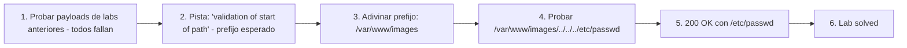

# Writeup: File path traversal, validation of start of path (PortSwigger)

- **Lab**: File path traversal, validation of start of path
- **URL**: https://portswigger.net/web-security/file-path-traversal/lab-validate-start-of-path
- **Categoría**: File path traversal / Directory traversal / LFI
- **Dificultad**: Practitioner
- **Credenciales**: no requiere login

---

## 1. Objetivo

Mismo target (`/etc/passwd`), mismo endpoint (`/image?filename=`). La defensa: la app valida que el `filename` **empiece con** el directorio base esperado (`/var/www/images`). Bypass: incluir el prefijo esperado y agregarle traversal después. La validación pasa porque el string empieza correctamente, pero el filesystem canonicaliza durante `open()` y resuelve el path final fuera del directorio.

Payload final:

```
GET /image?filename=/var/www/images/../../../etc/passwd HTTP/2
```

Response:

```
HTTP/2 200 OK
Content-Type: image/jpeg
Content-Length: 2316

root:x:0:0:root:/root:/bin/bash
...
```

### Insight central

**Validar el prefijo del input crudo no es validar el path canónico**: `filename.startswith('/var/www/images')` mira el string como secuencia de chars; el filesystem mira el path como ruta lógica y resuelve `..` durante la resolución. La defensa opera sobre una representación distinta a la que ejecuta. La defensa correcta es la misma que en todos los labs anteriores del cluster: canonicalizar primero (resolver `..` con `realpath`), validar el resultado canonicalizado contra el prefijo. La diferencia con `startswith` sobre el input crudo es estructural: una valida lo que el sistema va a ejecutar, la otra valida una asunción sintáctica.

---

## 2. Recon y resolución

### 2.1 Descartar bypasses anteriores

Capturar `GET /image?filename=XX.jpg`. En Repeater, probar payloads de los 4 labs anteriores en orden creciente:

1. `filename=../../../etc/passwd` — fallido (la app rechaza paths que no empiezan con `/var/www/images`).
2. `filename=/etc/passwd` — fallido (mismo motivo).
3. `filename=....//....//....//etc/passwd` — fallido (mismo motivo, además este lab no usa strip).
4. `filename=..%252f..%252f..%252fetc/passwd` — fallido (mismo motivo).

El comportamiento de fallo (status code, body) es la pista: si la app rechaza con un mensaje tipo "invalid path" o devuelve 400, sugiere validación de input crudo. Si devuelve 200 con imagen genérica, sugiere que el path se resolvió pero apuntó a algo dentro del directorio.

### 2.2 Identificar el directorio base esperado

La descripción del lab da una pista (*"validation of start of path"*). El prefijo común en stacks Linux/PortSwigger es `/var/www/images`. Otros candidatos:

- `/var/www/html/images`
- `/usr/share/nginx/html/images`
- `/opt/app/images`

El método empírico: empezar con `/var/www/images` (el más común) y si falla, probar variantes. En este lab funcionó al primer intento.

### 2.3 Bypass

```
GET /image?filename=/var/www/images/../../../etc/passwd HTTP/2
```

Trace:
- **Validación**: `'/var/www/images/../../../etc/passwd'.startswith('/var/www/images')` → `True`. Pasa.
- **`open()` con ese path**: el filesystem resuelve `..` durante la traversal. `/var/www/images/../` = `/var/www/`, `/var/www/../` = `/var/`, `/var/../` = `/`, después `etc/passwd` = `/etc/passwd`. Abre `/etc/passwd`.
- **Response**: 200 con el contenido. Lab solved.

---

## 3. Por qué funciona

### 3.1 Anatomía del bug

```python
# Antipatrón - validar prefijo del input crudo
@app.route('/image')
def image():
    filename = request.args['filename']
    if not filename.startswith('/var/www/images'):
        abort(400)
    return send_file(filename)  # filename usado tal cual, sin canonicalizar
```

El bug es la **disociación entre la representación que se valida y la representación que se ejecuta**:

1. **Lo que el `startswith` ve**: el string `/var/www/images/../../../etc/passwd`. Como secuencia de bytes/chars, empieza con `/var/www/images`. La validación pasa.
2. **Lo que el filesystem ve**: una ruta lógica. Cuando `open()` la pasa al syscall, el kernel canonicaliza durante la resolución (`..` → directorio padre). El path efectivo es `/etc/passwd`.

`startswith` no es una operación equivalente a "este path queda dentro del directorio". Es una operación de string. La asunción "si el string empieza bien, el path queda dentro" es la asunción rota.

### 3.2 La asunción de la defensa: "los devs no van a poner `..` después del prefijo"

El razonamiento del dev al escribir `startswith`:

- "Si el filename empieza con `/var/www/images`, está pidiendo un archivo dentro de `/var/www/images`."
- "El cliente legítimo nunca va a mandar `/var/www/images/../foo` — eso no tiene sentido."

Lo segundo es cierto para clientes legítimos. Lo primero es falso: un cliente puede mandar cualquier string que empiece con el prefijo, incluyendo strings que después contienen `..` y escapan. La validación no distingue entre uso legítimo y uso adversario porque opera sobre la sintaxis del string, no sobre la semántica del path.

### 3.3 Defensa correcta

```python
# Fix - canonicalizar y validar prefijo del path canónico
import os
BASE = os.path.realpath('/var/www/images')

@app.route('/image')
def image():
    filename = request.args['filename']
    full_path = os.path.realpath(os.path.join(BASE, filename))
    if not full_path.startswith(BASE + os.sep):
        abort(403)
    return send_file(full_path)
```

Diferencia con el antipatrón:

- **Validación post-canonicalización**: `realpath` resuelve `..`, links simbólicos y dobles barras antes de comparar.
- **`startswith` sobre el path canónico**, no sobre el input crudo. Si el path final es `/etc/passwd`, `startswith('/var/www/images')` es false → abort.
- **El separador `os.sep` al final del prefijo**: previene un bypass adicional donde el atacante apunta a `/var/www/imagesEVIL/file` que también pasa `startswith('/var/www/images')`.

### 3.4 Variantes del payload

El payload canónico es `/var/www/images/../../../etc/passwd`. Variantes que también funcionarían contra esta defensa específica:

- **Más `..` de las necesarias**: `/var/www/images/../../../../../../../../etc/passwd`. `..` desde `/` resuelve a `/`, así que sobreestimar no rompe.
- **Subdirectorios falsos en el prefijo**: `/var/www/images/foo/../../../../etc/passwd`. Funciona igual; cada `..` sube un nivel.
- **Caracteres entre el prefijo y el traversal**: `/var/www/images/./../../../etc/passwd`. El `./` es no-op pero no rompe `startswith`.

Variantes que **no** funcionarían contra esta defensa pero sí contra defensas más débiles:

- `../../../etc/passwd` — no empieza con el prefijo, falla `startswith`.
- `/etc/passwd` — no empieza con el prefijo.

Si la defensa además bloqueara `..` literal después del prefijo, habría que combinar con otros bypass: encoding (`/var/www/images/%2e%2e%2f...`), `....//`, etc. Composición de defensas naïves se rompe componiendo bypasses.

### 3.5 ¿Por qué este lab es Practitioner y no Apprentice?

El payload no es complejo: incluir el prefijo y agregar traversal. La dificultad está en:

1. **Reconocer el patrón de la defensa**: el dev no rechaza `..` ni `/etc/passwd`. Rechaza paths que no empiezan con un prefijo. Eso es un patrón distinto a los labs anteriores y requiere identificarlo desde el comportamiento de la app (qué se rechaza, qué se acepta).
2. **Adivinar el prefijo correcto**: `/var/www/images` es la heurística. Para apps reales fuera de PortSwigger habría que enumerar (errores que filtran el path, headers, código fuente filtrado, etc.). En el lab está cableado al stack Linux estándar.
3. **Confiar en que el filesystem canonicaliza**: el atacante necesita saber que `..` se resuelve durante `open()` aunque la defensa no lo procese. Es conocimiento de cómo el OS resuelve paths, no del código de la app.

### 3.6 Patrón estructural común con los labs anteriores del cluster

| Lab | Defensa naïve | Bypass | Asunción rota |
|---|---|---|---|
| `simple-case` | ninguna | `../../../etc/passwd` | (no hay defensa) |
| `absolute-path-bypass` | `if '../' in filename: abort()` | `/etc/passwd` | "traversal requiere `..`" |
| `stripped-non-recursively` | `replace('../', '')` (una pasada) | `....//....//` | "strippear el patrón lo elimina" |
| `superfluous-url-decode` | filter entre dos URL-decodes | `..%252f..%252f` | "el input que validé es lo que se ejecuta" |
| **`validate-start-of-path` (este)** | `startswith(BASE)` sobre input crudo | `/var/www/images/../../../etc/passwd` | "validar prefijo de string equivale a validar contención del path" |

Todos los bypasses comparten una estructura: el dev valida una representación del input que difiere de la que el sistema ejecuta. En los labs anteriores la diferencia era por encoding o strip; en éste es por canonicalización del filesystem. **La defensa correcta es idéntica desde el lab simple**: canonicalizar la representación final con `realpath` y validar el resultado.

---

## 4. Resumen



Tres ideas:

1. **`startswith` sobre el input crudo no valida el path canónico**: opera sobre la sintaxis del string, no sobre la ruta lógica que el filesystem resuelve. La validación pasa con strings que después contienen `..` y escapan.
2. **El filesystem canonicaliza independientemente de la defensa**: `..` se resuelve durante el syscall `open()`, no requiere ayuda del código de la app. El atacante explota esa resolución que la defensa no procesa.
3. **Defensa correcta = `realpath` antes de `startswith`**: comparar prefijos del path canónico con el separador final (`BASE + os.sep`). Cubre traversal, links simbólicos, dobles barras y previene el bypass adicional `/var/www/imagesEVIL`.

---

## 5. Contramedidas

1. **Canonicalizar antes de validar**: `os.path.realpath(os.path.join(BASE, filename))` resuelve `..`, links y dobles barras a un path único. Validar `startswith(realpath(BASE) + os.sep)` sobre el resultado.
2. **Incluir el separador en el prefijo de comparación**: `BASE + os.sep`, no solo `BASE`. Previene bypass tipo `/var/www/imagesEVIL/file` que también empieza con `/var/www/images`.
3. **Whitelist o IDs**: si el endpoint sirve N archivos conocidos, exponer un identificador (`?id=58`) y mantener el mapeo server-side. El input no toca el filesystem.
4. **Rechazar `..` en el filename como defensa-en-profundidad**: `if '..' in filename or '/' in filename: abort()`. Restrictivo pero defensible para endpoints de imágenes que solo necesitan filenames simples sin subdirectorios.
5. **Validar que el archivo final sea del tipo esperado**: chequear magic bytes después de leer. Si el endpoint declara servir imágenes, rechazar archivos que no empiecen con bytes JPEG/PNG/etc. Defensa-en-profundidad contra exfil aunque el bypass de path traversal funcione.
6. **Mínimo privilegio del proceso**: el web server no debe poder leer fuera del directorio de assets. Chroot, contenedor con read-only mount, AppArmor/SELinux. Limita el daño aunque la defensa de path falle.
7. **Tests automatizados**: por cada endpoint que tome filename, suite con todos los payloads del cluster: `../`, `/etc/passwd`, `....//`, `..%2f`, `..%252f`, `/var/www/images/../../etc/passwd`, `/var/www/imagesFOO/file`. Cualquier respuesta distinta al baseline (imagen válida) es bug.
8. **Code review checklist**: cualquier `startswith`, `endswith` o regex sobre input crudo que afecte a una decisión de seguridad es candidato a bug. Marcar para auditoría: la pregunta clave es "¿este check valida el input o la transformación final del input?".

---

## 6. Referencias

- PortSwigger Web Security Academy. (s.f.). *Lab: File path traversal, validation of start of path*. https://portswigger.net/web-security/file-path-traversal/lab-validate-start-of-path
- PortSwigger Web Security Academy. (s.f.). *Directory traversal*. https://portswigger.net/web-security/file-path-traversal
- OWASP Foundation. (s.f.). *Path Traversal*. https://owasp.org/www-community/attacks/Path_Traversal
- OWASP Foundation. (s.f.). *File System Security Cheat Sheet*. https://cheatsheetseries.owasp.org/cheatsheets/File_System_Security_Cheat_Sheet.html
- MITRE Corporation. (2024). *CWE-22: Improper Limitation of a Pathname to a Restricted Directory ('Path Traversal')*. https://cwe.mitre.org/data/definitions/22.html
- MITRE Corporation. (2024). *CWE-180: Incorrect Behavior Order: Validate Before Canonicalize*. https://cwe.mitre.org/data/definitions/180.html
- MITRE Corporation. (2024). *CWE-41: Improper Resolution of Path Equivalence*. https://cwe.mitre.org/data/definitions/41.html
- MITRE Corporation. (2024). *ATT&CK Technique T1190: Exploit Public-Facing Application*. https://attack.mitre.org/techniques/T1190/
- swisskyrepo. (s.f.). *PayloadsAllTheThings — Directory Traversal*. https://github.com/swisskyrepo/PayloadsAllTheThings/tree/master/Directory%20Traversal
- Stuttard, D., & Pinto, M. (2011). *The Web Application Hacker's Handbook* (2nd ed.). Wiley. Cap. 10 (Attacking Back-End Components — Path Traversal).
- Inventario interno: [`inventario/03-analisis-vulnerabilidades/web/analisis-lfi-rfi.md`](../../../inventario/03-analisis-vulnerabilidades/web/analisis-lfi-rfi.md)
- Labs hermanos del cluster:
  - [`learning/portswigger/file-path-traversal-simple-case/writeup.md`](../file-path-traversal-simple-case/writeup.md)
  - [`learning/portswigger/file-path-traversal-absolute-path-bypass/writeup.md`](../file-path-traversal-absolute-path-bypass/writeup.md)
  - [`learning/portswigger/file-path-traversal-sequences-stripped-non-recursively/writeup.md`](../file-path-traversal-sequences-stripped-non-recursively/writeup.md)
  - [`learning/portswigger/file-path-traversal-superfluous-url-decode/writeup.md`](../file-path-traversal-superfluous-url-decode/writeup.md)
